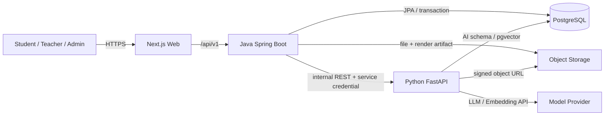

# StudyFlow — High-level architecture

> Nguồn yêu cầu: `Plan_do_an_tot_nghiep_dong_bo_toan_bo_kien_truc_CSDL_API.docx`.
> Tài liệu này mô tả kiến trúc mục tiêu của MVP Student–Teacher–Admin.
> Product requirements và acceptance criteria: `specification.md` và `specs/`.

## 1. Mục tiêu và phạm vi

StudyFlow gom lớp học, môn học, học liệu, tài liệu cá nhân, tiến độ, kế hoạch và ôn tập vào một hệ thống. AI chỉ xuất hiện tại các điểm cần hiểu nội dung:

1. **Personal Document RAG:** Student chọn một hoặc nhiều PDF do chính mình upload và hỏi đáp có citation.
2. **Slide AI Tutor:** Student đang xem PPTX do Teacher public và hỏi trong đúng tài liệu/slide được phép.
3. **Personal Quiz Generator:** từ cùng các Personal Documents đã chọn trong chatbot, Student yêu cầu AI sinh bản nháp Quiz có nguồn; Java validate và lưu để Student duyệt.

MVP không có Chapter/Topic, Quiz do Teacher tạo/giao, Topic Mastery, Exam/Mock Exam hoặc recommendation nâng cao. Quiz trong MVP do chính Student yêu cầu tạo từ chatbot Personal Documents và chỉ được làm sau khi Student chấp nhận bản nháp.

## 2. Mô hình nghiệp vụ

```text
Class
└── ClassSubject (Class + Subject + Teacher + semester/year)
    └── DocumentPublication
        └── Teacher Document
```

- Admin tạo Class, Subject, thêm Student vào Class và phân công Teacher cho ClassSubject.
- Teacher có kho tài liệu riêng, public một file cho một hoặc nhiều ClassSubject được phân công.
- Student chỉ thấy tài liệu đã public cho lớp mình tham gia.
- Một file vật lý chỉ lưu một lần; publication là quan hệ riêng và có thể bị thu hồi.

### Quy tắc theo loại tài liệu

| Ngữ cảnh | Loại file | Student được làm gì | AI |
|---|---|---|---|
| Tài liệu lớp/môn | PPTX/Slide | Xem trên web, lưu Note theo slide; không tải file gốc | Slide AI Tutor |
| Tài liệu lớp/môn | PDF | Chỉ tải xuống | Không Note, không AI Tutor |
| Kho Teacher | PDF/PPTX | Teacher quản lý và public | Chỉ PPTX cần xử lý cho Slide AI Tutor |
| Tài liệu cá nhân | PDF | Owner upload, quản lý, chọn một/nhiều file để hỏi | Personal RAG |

## 3. Sơ đồ hệ thống



Frontend chỉ gọi Java. Java là cổng xác thực, RBAC, ownership và scope. Python không nhận JWT người dùng cuối và không CRUD lớp/môn, publication, Note, progress, plan, Quiz lifecycle hoặc attempt.

PostgreSQL là một cụm dữ liệu trung tâm có extension pgvector. Nên tách schema và database role:

- `app`: bảng nghiệp vụ do Java/Flyway sở hữu.
- `ai`: job, chunk và embedding do Python/Alembic sở hữu.
- Java không đọc/ghi vector trực tiếp.
- Python chỉ đọc metadata tối thiểu qua payload Java hoặc view/contract được cấp; không truy cập tùy ý dữ liệu cá nhân.

## 4. Trách nhiệm từng thành phần

| Thành phần | Sở hữu |
|---|---|
| Next.js | UI Student/Teacher/Admin, Slide Viewer, form, loading/error, gọi Java API |
| Spring Boot | Auth/JWT/RBAC, user, class, subject, assignment, document/publication, Note, progress/statistics, plan/calendar, Quiz review/attempt/scoring, audit và public API |
| FastAPI | Parse/render tài liệu cần AI, chunk, embedding, retrieval, RAG, Slide AI Tutor, sinh bản nháp Quiz và citation |
| PostgreSQL + pgvector | Dữ liệu nghiệp vụ, AI job/chunk/embedding trong schema tách biệt |
| Object Storage | File gốc, slide render/preview và tài nguyên lớn |

## 5. Luồng chính

### 5.1 Teacher public tài liệu

1. Teacher upload PDF/PPTX vào kho; Java kiểm MIME, kích thước và owner rồi lưu Object Storage.
2. Với PPTX, Java tạo job để Python extract text và render slide; tài liệu chuyển `PROCESSING → READY` hoặc `FAILED`.
3. Teacher chọn file và ClassSubject được phân công để public.
4. Java kiểm assignment, tạo `document_publications`.
5. Student thuộc Class thấy tài liệu; PPTX xếp trước PDF. Thu hồi publication làm tài liệu biến mất khỏi phạm vi Student.

### 5.2 Student xem Slide

1. Java kiểm Student thuộc Class và publication còn hiệu lực.
2. Web nhận slide artifact qua Java hoặc URL ký ngắn hạn, không nhận file PPTX gốc.
3. Sự kiện `VIEW_SLIDE` cập nhật Learning Progress.
4. Note lưu theo `student + document + slide_number`.
5. Câu hỏi Slide AI Tutor đi qua Java; Java gửi đúng document/slide scope sang Python. Citation phải trỏ về slide thuộc cùng tài liệu.

### 5.3 Personal Document RAG

1. Student upload PDF; Java kiểm owner và định dạng.
2. Java lưu file và enqueue indexing idempotent.
3. Python extract, chunk, embed và ghi `ai.document_chunks` với owner/scope.
4. Student chọn một hoặc nhiều document `READY`.
5. Java xác minh toàn bộ document thuộc Student rồi gửi `authorizedDocumentIds` sang Python.
6. Python filter đúng danh sách, trả `ANSWERED` hoặc `NO_EVIDENCE` cùng citation.

Từ cùng context đã chọn, Student có thể yêu cầu tạo Quiz. Java gửi scope hợp lệ sang Python, validate câu hỏi/đáp án/source rồi lưu Quiz ở `REVIEW_REQUIRED`; Quiz chưa được dùng để làm bài cho tới khi Student chấp nhận.

Personal RAG không truy xuất tài liệu lớp/môn. Slide AI Tutor không truy xuất Personal Document.

### 5.4 Tiến độ, kế hoạch và ôn tập

- Tiến độ dựa trên slide đã xem và hoạt động đã hoàn thành; PDF Teacher chỉ tải xuống nên không có page progress.
- Thống kê gồm slide đã xem, tài liệu cá nhân, kế hoạch hoàn thành và lịch sử làm Quiz.
- Student tự tạo Study Plan, task, deadline và lịch. Recommendation nâng cao để Future Work.
- Ôn tập gồm quản lý Quiz và làm Quiz. Quiz AI mới sinh ở trạng thái `REVIEW_REQUIRED`; Student xem lại, chấp nhận để chuyển `READY`, rồi mới tạo attempt. Java chấm điểm và lưu answer/result.

## 6. Phân quyền

| Vai trò | Phạm vi |
|---|---|
| Student | Lớp mình tham gia, học liệu đã public, Note/progress/plan/Quiz của chính mình và Personal Document của mình |
| Teacher | ClassSubject được phân công, danh sách Student read-only, kho tài liệu của mình và publication do mình quản lý |
| Admin | User/role, Class, Subject, membership, Teacher assignment, feedback/report, audit và settings |

Admin không mặc định có quyền xem Personal Document, lịch sử chat, kế hoạch hoặc kết quả cá nhân. Admin không thay Teacher để public học liệu nếu chưa có nghiệp vụ ủy quyền.

## 7. Giao tiếp và an toàn

- Public API: `/api/v1`; internal AI API: `/internal/v1`.
- Internal request có service credential, `X-Request-Id`, `X-Schema-Version`, timeout và scope tối thiểu.
- Upload kiểm extension, MIME thực, kích thước và tên file; file không được thực thi.
- Log chỉ chứa ID, action, trạng thái, latency và error code; không log nội dung tài liệu, prompt, token hoặc secret.
- Indexing dùng idempotency key. Xóa Personal Document phải loại khỏi authorized scope trước, sau đó xóa chunk và object bằng tiến trình có retry.

## 8. Triển khai

```text
Vercel / Web host
        ↓ HTTPS
Render/Railway: Spring Boot
        ↓ internal HTTPS
Render/Railway: FastAPI + worker
        ├── PostgreSQL + pgvector
        ├── Object Storage
        └── LLM/Embedding API
```

Mỗi service có health check, CORS đúng origin và secret qua environment variables. CI tối thiểu chạy lint/test/build. Chuẩn bị seed data, tài liệu đã xử lý và response dự phòng được gắn nhãn rõ cho buổi demo.

## 9. Ngoài phạm vi MVP

- Chapter/Topic taxonomy.
- Quiz do Teacher tạo/giao, Topic Mastery và Exam/Mock Exam.
- Recommendation tự động nâng cao.
- Flashcard, spaced repetition, notification/calendar sync.
- OCR/vision nâng cao, group/discussion, gamification, billing và multi-agent.
