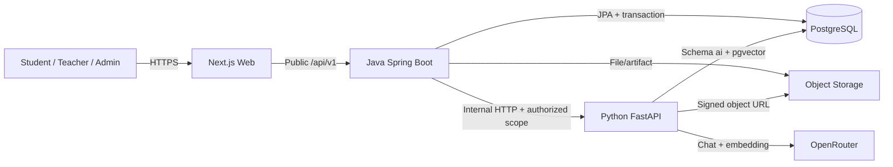

# StudyFlow — High-level Architecture

> Baseline 2.1 theo `Ke_hoach_do_an_tot_nghiep_cap_nhat_Streak_Daily_Goal.md`.
> Product requirements nằm trong `specification.md` và `specs/`.

## 1. Mô hình nghiệp vụ

```text
Subject ─┐
         ├→ Course Offering ← Teacher owner
Semester ┘          │
                    ├→ Course Enrollment ← Student join request
                    └→ Document Publication → Teacher Document
```

- Admin quản lý account/role, Subject và Semester; không tạo hoặc phân công từng lớp.
- Teacher role hợp lệ tự tạo Course Offering trong Semester đang cho phép và nhận join code do hệ thống sinh.
- Student gửi request bằng join code; Teacher owner approve/reject.
- Chỉ enrollment `APPROVED` mở quyền material, Slide, Note, Tutor và progress.
- Course Offering hết kỳ chuyển `ARCHIVED`; không xóa lịch sử enrollment/học liệu.

### Vòng đời chính

```text
Semester: UPCOMING → ACTIVE → CLOSED
Course Offering: ACTIVE → ARCHIVED
                         ↘ LOCKED (Admin giám sát)
Enrollment: PENDING → APPROVED | REJECTED
                       ↘ REMOVED
```

## 2. Kiến trúc hệ thống



Ranh giới bắt buộc:

- Frontend chỉ gọi Java. Java xác thực session, RBAC, Course Offering ownership và enrollment.
- Java/Flyway sở hữu schema `app`; Python/Alembic sở hữu schema `ai`.
- Python không nhận JWT người dùng cuối và không CRUD user, Semester, Course Offering, enrollment, publication, Note, progress, plan hay Quiz attempt.
- Java không đọc/ghi vector trực tiếp; Python không chấm Quiz hoặc quyết định quyền học.

## 3. Trách nhiệm thành phần

| Thành phần | Sở hữu |
|---|---|
| Next.js | UI ba role, join flow, Course Offering, materials, viewer, chatbot/citation, Dashboard/Streak/Daily Goal, Quiz review, plan/calendar |
| Spring Boot | Auth/RBAC, User, Subject, Semester, Course Offering/join code, Enrollment, Document/Publication, Note, Dashboard Progress/Streak/Daily Goal, Plan, Quiz lifecycle/scoring, audit |
| FastAPI | PDF/PPTX extraction, render/chunk/embed, retrieval, Personal RAG, Slide Tutor, grounded citation, Quiz draft |
| PostgreSQL + pgvector | Schema nghiệp vụ `app`; job/index/chunk/vector ở schema `ai` |
| Object Storage | PDF/PPTX gốc, slide render và preview |
| OpenRouter | GPT-5.6 Luna và `text-embedding-3-large`; credential chỉ ở Python runtime |

## 4. Luồng Course Offering

### 4.1 Teacher tạo lớp

1. Teacher lấy danh sách Subject và Semester `ACTIVE` từ Java.
2. Teacher gửi Subject, Semester, code/name tùy chọn.
3. Java kiểm role/semester, tạo Course Offering với `teacherId=currentUser`.
4. Java sinh join code unique, lưu hash hoặc giá trị được bảo vệ phù hợp và audit `COURSE_OFFERING_CREATED`.
5. Admin nhìn thấy lớp qua màn monitoring nhưng không cần approve.

### 4.2 Student tham gia

1. Student nhập join code.
2. Java resolve code, kiểm `joinEnabled` và lớp không `LOCKED/ARCHIVED`.
3. Java tạo/reuse enrollment `PENDING`; không cấp quyền học ở bước này.
4. Teacher owner approve/reject từng request hoặc approve batch.
5. Approval làm lớp xuất hiện trong danh sách đang học và phát event `COURSE_JOIN_APPROVED`.

### 4.3 Kết thúc học kỳ

- Course Offering chuyển `ARCHIVED`, enrollment/history vẫn giữ.
- Join code bị vô hiệu hóa.
- Student từng `APPROVED` có thể xem lại theo archive access policy; Admin có thể `LOCK` để chặn khẩn cấp.

## 5. Luồng tài liệu lớp học phần

1. Teacher upload PDF/PPTX vào library; Java kiểm owner, MIME, kích thước và lưu Object Storage.
2. PPTX được Java enqueue sang Python để extract/render/index; PDF Teacher không AI index.
3. Teacher public document cho một hoặc nhiều Course Offering do mình sở hữu.
4. Java kiểm document owner + offering owner/status và tạo publication.
5. Student `APPROVED` thấy PPTX trước PDF. Revoke làm mất quyền ở request kế tiếp.

| Loại | Student | AI |
|---|---|---|
| PPTX Teacher | Viewer, Note, progress; không download gốc | Slide AI Tutor + slide citation |
| PDF Teacher | Download qua Java | Không viewer/Note/Tutor/index |
| PDF Personal | Quản lý, chọn cho conversation/Quiz | Page RAG + citation |

## 6. Chatbot Personal Document

### 6.1 UX tham khảo

Từ repo [Multi-Agent Document Intelligence Assistant](https://github.com/bch7504/Multi-Agent-Document-Intelligence-Assistant), StudyFlow áp dụng các pattern:

- chọn nhiều document `READY` trước khi gửi;
- hiển thị rõ số nguồn trong scope;
- empty state, prompt gợi ý, history/new conversation;
- loading “đang truy xuất và kiểm chứng nguồn”;
- citation card có document, page và excerpt;
- code-first validation cho citation và bounded retry cho lỗi generation có thể phục hồi.

Không áp dụng trực tiếp:

- frontend gọi FastAPI, model selector cho user, Supervisor/Auto route, Agent Trace, Milvus/BM25 hoặc single-user authorization;
- Quiz trả ngay để làm trong chat.

### 6.2 Luồng StudyFlow

```text
Web chọn Personal PDF
  → Java kiểm owner + READY và tạo conversation scope
  → Web gửi message vào conversation
  → Java load lại scope được phép
  → Python retrieve pgvector với filter owner/document/version/source
  → nếu evidence thiếu: NO_EVIDENCE
  → nếu đủ: generation → citation validation → structured answer
  → Java revalidate document/page rồi lưu conversation/message
  → Web render answer + citation + traceId
```

Document content luôn được xem là dữ liệu không tin cậy; prompt injection trong tài liệu không được thay đổi system instruction hoặc authorized scope.

## 7. Slide AI Tutor

1. Java kiểm enrollment `APPROVED`, publication và PPTX `READY`.
2. Web chỉ nhận slide artifact, không nhận file gốc.
3. Note upsert theo `student + document + slideNumber`.
4. Tutor request đi Java; Java cấp document/current/allowed slide scope tối thiểu.
5. Python chỉ dùng chunk Slide thuộc document/version được cấp; Java đối chiếu citation lần cuối.

Khi Course Offering archive, quyền Tutor dựa trên archive policy và enrollment lịch sử; embedding không tạo lại chỉ vì một document được public sang lớp khác.

## 8. Quiz, Dashboard, Streak, Daily Goal và kế hoạch

- Quiz AI chỉ lấy Personal Documents trong conversation scope.
- Python trả structured draft `MCQ_SINGLE`; Java validate source/answer, lưu `REVIEW_REQUIRED`.
- Student accept để chuyển `READY`; Java tạo attempt và chấm điểm.
- Không có menu Progress/Statistics độc lập: Dashboard hiển thị tổng quan, Course Offering Detail hiển thị viewing progress theo lớp/tài liệu.
- Java tổng hợp progress từ slide view, task và Quiz đã hoàn tất; không suy luận Topic Mastery.
- Study Streak dùng các local date có `VIEW_SLIDE`, `STUDY_TASK_COMPLETED` hoặc `QUIZ_COMPLETED`. Login, Note và hỏi AI không được tính; nhiều event cùng ngày chỉ tính một ngày.
- Daily Goal lưu target Slide/câu Quiz/Study Task của Student; actual luôn được Java tính từ dữ liệu nghiệp vụ trong ngày.
- Hoàn thành 100% Daily Goal không phải điều kiện duy trì Streak. MVP không có XP, Level, Achievement hoặc leaderboard.
- Calendar là projection từ Study Plan items; Student tự quyết định kế hoạch.

## 9. Bảo mật và quan sát

- Internal request: service credential, `X-Request-Id`, `X-Schema-Version`, timeout; job mutation có `Idempotency-Key`.
- Log chỉ có ID/action/status/latency/error code; không log prompt, document text, Note, token, signed URL hay key.
- Audit: login/role/status, Course Offering create/archive/lock, join-code lifecycle, enrollment decision, publication/revoke và settings.
- Personal Document cô lập theo owner; Admin không mặc định đọc chat/plan/Quiz result cá nhân.

## 10. Triển khai và ngoài phạm vi

Triển khai mục tiêu: Web host → Spring Boot → FastAPI/worker, PostgreSQL+pgvector và Object Storage. Mỗi service có health/readiness, HTTPS, CORS đúng origin, migration forward và backup/restore.

Ngoài MVP: import thời khóa biểu/đăng ký tín chỉ, OCR, DOCX, Teacher Quiz, Exam, recommendation, discussion, advanced analytics và multi-agent orchestration.
