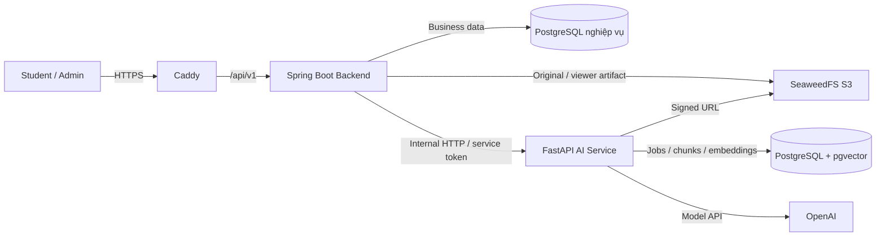

# StudyFlow — High-level architecture

> Tài liệu này mô tả kiến trúc mục tiêu cho toàn bộ luồng trong [demo-flow.md](demo-flow.md). Chi tiết module, job và truy vấn nằm ở [low-level-design.md](low-level-design.md); công nghệ và phiên bản ở [tech-stack.md](tech-stack.md).

## 1. Bối cảnh và ranh giới

StudyFlow phục vụ Student học từ tài liệu, hỏi AI Tutor, làm Quiz, theo dõi tiến độ và chuẩn bị kỳ thi; Admin quản lý user, Official Content và vận hành. Frontend chỉ gọi Java. Java xác thực người dùng, quyết định authorized scope và sở hữu dữ liệu nghiệp vụ. Python xử lý parsing, embeddings, retrieval và generation theo scope Java cung cấp.

Hai PostgreSQL là hai instance/container và volume riêng **trên cùng một VPS**. Java chỉ có credential vào PostgreSQL nghiệp vụ; Python chỉ có credential vào PostgreSQL vector. Không có foreign key hoặc transaction xuyên hai database. Caddy chỉ public Web và Java API; AI, hai database và S3 endpoint ở mạng Compose nội bộ.

## 2. Sở hữu trách nhiệm

| Thành phần | Sở hữu | Không sở hữu |
|---|---|---|
| Next.js | Student/Admin UI, viewer, form, trạng thái tương tác, gọi Java API | Scoring, mastery, recommendation, truy cập Python/vector/LLM |
| Java backend | Auth/RBAC, owner/publish policy, metadata và file access, public API, Quiz scoring, Content Progress, Topic Mastery, Statistics, Study Plan, Exam, Learning Events | Parsing, embeddings, RAG và sinh câu hỏi bằng model |
| Python AI API + worker | Parse PDF/PPTX/DOCX, chunk/index, retrieval có filter, Tutor với citation, sinh Quiz có cấu trúc, evaluation | Quyền user cuối, dữ liệu quiz attempt, scoring, mastery, recommendation, exam progress |
| PostgreSQL nghiệp vụ | System of record cho user, tài liệu, học tập, kết quả đánh giá | Chunk/embedding |
| PostgreSQL vector | Job AI, chunk, embedding, active index version | User/quiz attempt/study plan hoặc nghiệp vụ nguồn |
| SeaweedFS | Bản gốc tài liệu và artifact xem | Quyết định quyền truy cập người dùng |

`Content Progress` đo phần nội dung đã học; `Topic Mastery` đo mức hiểu dựa trên bằng chứng đánh giá. Thiếu bằng chứng dùng `NO_DATA` hoặc `LEARNING`, không tự gắn `WEAK`. Recommendation chỉ xếp ưu tiên; Student quyết định Study Plan. Admin không quản lý Quiz, Exam hoặc Progress cá nhân trong MVP.

## 3. Các luồng chính

### Document → index → viewer

1. Web gửi upload tới Java. Java kiểm tra loại file, owner và quyền; lưu bản gốc vào SeaweedFS cùng metadata/trạng thái trong PostgreSQL nghiệp vụ.
2. Java gọi Python để tạo job index, gửi document ID, phiên bản, scope metadata và signed URL ngắn hạn. Python worker parse theo PAGE/SLIDE/SECTION, tạo chunk, gọi embedding API và ghi pgvector.
3. Python kích hoạt phiên bản index mới sau khi ghi đủ chunks. Java poll job, cập nhật `READY` hoặc `FAILED`; tài liệu chỉ được hỏi AI khi `READY`.
4. Java phục vụ bản PDF/artifact xem qua endpoint có kiểm quyền. PPTX/DOCX được chuyển thành artifact xem nhưng citation vẫn trỏ về slide/section nguồn.

Job bền vững và idempotent; retry có giới hạn. Xóa tài liệu phải ẩn khỏi truy vấn trước, rồi deindex và xóa file theo tiến trình có thể retry. Không coi thao tác qua nhiều kho là một transaction.

### Tutor và Quiz → đánh giá

1. Java xác thực Student, liệt kê document được phép dùng cho câu hỏi/topic và gửi **danh sách document ID được phép** sang Python; không chuyển tiếp JWT người dùng.
2. Python chỉ truy vấn chunks thuộc danh sách đó, trả answer và citation theo document/page/slide/section. Nếu không đủ bằng chứng, trả trạng thái không đủ dữ liệu thay vì câu trả lời khẳng định.
3. Với Quiz, Python sinh câu hỏi có cấu trúc; Java kiểm tra dữ liệu trước khi lưu. Java chấm attempt, ghi Learning Event và cập nhật Topic Mastery. Sự kiện đọc tài liệu cập nhật Content Progress riêng. Java tính Statistics/Recommendation theo rule.
4. Student đưa recommendation vào Study Plan, tạo Task/Session/Exam và làm Mock Exam để đánh giá lại.

## 4. Giao tiếp và an toàn

- Java public API: `/api/v1`; Python internal API: `/internal/v1`. Contract chi tiết nằm ở [api-plan.md](api-plan.md).
- Internal request có `requestId`, `schemaVersion`, service token, authorized scope tối thiểu, timeout; retry chỉ cho thao tác đọc an toàn hoặc thao tác có idempotency key.
- Java kiểm tra lại citation/document ID và câu hỏi AI trước khi trả hoặc lưu. Personal Document chỉ owner được dùng; Official Content chỉ Student được xem sau khi publish.
- Dùng error envelope thống nhất và log metadata để trace; không log document content, prompt nhạy cảm, token hay mật khẩu.

## 5. Triển khai một VPS

Docker Compose chạy Caddy, Next.js, Java, Python API, Python worker, PostgreSQL nghiệp vụ, PostgreSQL vector/pgvector và SeaweedFS. Dùng health check, restart policy và volume riêng. Chỉ mở cổng 80/443; Caddy cấp HTTPS. Đây là một node nên không có high availability; backup ngoài VPS và thử restore là điều kiện trước demo. Cấu hình 4 vCPU/8 GB RAM là điểm bắt đầu để đo tải, không phải thông số đã kiểm chứng. [Caddy](https://caddyserver.com/docs/quick-starts/reverse-proxy) và [Docker Compose](https://docs.docker.com/compose/how-tos/startup-order/) có hướng dẫn chính thức cho reverse proxy, HTTPS và health check.

## 6. Trạng thái quyết định

Đây là kiến trúc mục tiêu; repo hiện có prototype HTML phía web và khung FastAPI health/contract, chưa có backend Java hoàn chỉnh. Theo yêu cầu mới, pgvector thay Qdrant **trong giai đoạn đầu**. Các tham chiếu Qdrant cũ ngoài `docs/` cần được đồng bộ trước khi giao coding agent triển khai; phạm vi thay đổi tài liệu lần này chỉ nằm trong `docs/`.
