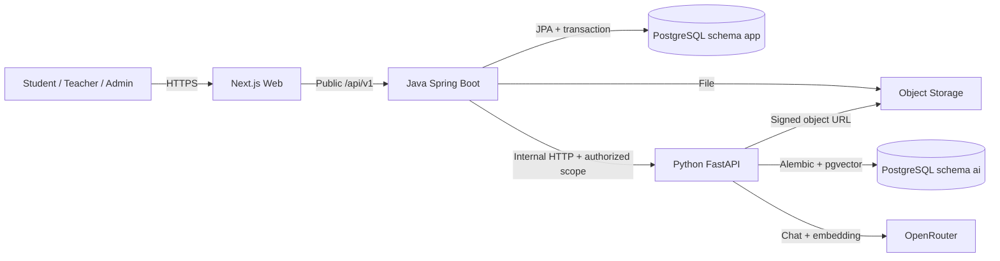

# StudyFlow — High-level Architecture

> Tài liệu kiến trúc chuẩn hiện hành. Các quyết định AI chi tiết nằm trong `ai-implementation-plan.md`; contract nằm trong `api-plan.md`.

## 1. Mô hình nghiệp vụ

```text
Subject ─┐
         ├→ Course Offering ← Teacher owner
Semester ┘          │
                    ├→ Course Enrollment ← Student join request
                    └→ Document Publication → Course Material PDF
```

- Admin quản lý account/role, Subject, Semester và giám sát; không phân công từng lớp trong MVP.
- Teacher tạo Course Offering, quản lý join code, duyệt Student, upload/public Course Material PDF và tạo Quiz AI từ PDF mình sở hữu.
- Student `APPROVED` xem PDF theo trang, lưu Note, dùng Course Material AI Tutor và theo dõi tiến độ ở Dashboard.
- Personal PDF thuộc Student, chỉ dùng trong Personal Document Assistant và Quiz cá nhân.

## 2. Kiến trúc hệ thống


```mermaid
flowchart LR
    U[Student / Teacher / Admin] -->|HTTPS| W[Next.js Web]
    W -->|Public /api/v1| J[Java Spring Boot]
    J -->|JPA + transaction| P[(PostgreSQL schema app)]
    J -->|File| O[Object Storage]
    J -->|Internal HTTP + authorized scope| A[Python FastAPI]
    A -->|Alembic + pgvector| V[(PostgreSQL schema ai)]
    A -->|Signed object URL| O
    A -->|Chat + embedding| M[OpenRouter]
```

Ranh giới bắt buộc:

- Browser chỉ gọi Java. Java xác thực, RBAC, ownership/enrollment và toàn bộ luật nghiệp vụ.
- Java/Flyway sở hữu schema `app`; Python/Alembic sở hữu schema `ai`.
- Python không nhận JWT người dùng cuối, không CRUD user/enrollment/plan và không chấm Quiz.
- Java không đọc/ghi vector trực tiếp; Python chỉ xử lý scope Java đã cấp.

## 3. Trách nhiệm thành phần

| Thành phần | Sở hữu |
|---|---|
| Next.js | UI ba role, PDF Viewer/Note/Tutor, Personal Assistant, Teacher AI Quiz Studio, Review, Dashboard, Kế hoạch & Lịch |
| Spring Boot | Auth/RBAC, Course Offering/Enrollment, Document/Publication, Note, conversation, Quiz lifecycle/scoring, Dashboard/Streak/Daily Goal, Plan và audit |
| FastAPI | PDF parsing/chunk/embed, retrieval, Single Orchestrator Agent, Course Material Tutor, Quiz generation, citation và evaluation |
| PostgreSQL + pgvector | Schema nghiệp vụ `app`; job/index/chunk/vector/agent run ở schema `ai` |
| Object Storage | PDF gốc và preview/page artifact cần thiết |
| OpenRouter | Model chat và embedding; credential chỉ tồn tại ở Python runtime |

## 4. Luồng Course Offering và quyền truy cập

1. Teacher tạo Course Offering theo Subject + Semester và nhận join code.
2. Student gửi join request; Java tạo enrollment `PENDING`.
3. Teacher owner approve/reject; chỉ `APPROVED` mở quyền học liệu.
4. Archive giữ lịch sử; `LOCKED` chặn truy cập theo policy Java.
5. Mọi request PDF/Tutor/Note đều revalidate enrollment và publication, không chỉ dựa vào UI.

## 5. Luồng PDF

### 5.1 Course Material PDF

1. Teacher upload PDF có text layer; Java kiểm owner, MIME/signature/kích thước và lưu Object Storage.
2. Java gửi job index sang Python bằng signed URL và authorized source metadata.
3. Python extract theo trang, chunk, embed và activate index version; OCR/PPTX/DOCX ngoài MVP.
4. Teacher public tài liệu `READY` vào Course Offering mình sở hữu.
5. Student `APPROVED` xem PDF, ghi Note theo `pageNumber` và dùng Course Material AI Tutor.
6. Teacher không có chatbot hoặc AI Tutor trên tài liệu; Teacher chỉ dùng tài liệu làm nguồn cho AI Quiz Generator.

### 5.2 Personal PDF

- Chỉ owner xem, xóa, chọn vào conversation hoặc dùng tạo Quiz.
- Admin không mặc định đọc nội dung; Teacher không truy cập Personal PDF của Student.
- Citation luôn là `documentId + pageNumber + excerpt`.

## 6. Personal Document Assistant — Single Agent

StudyFlow dùng một Single Orchestrator Agent, không dùng multi-agent. Agent chỉ chọn một trong ba tool có schema:

```text
ask_document       → ANSWERED | NO_EVIDENCE
summarize_document → SUMMARIZED | NO_EVIDENCE
generate_quiz      → QUIZ_CREATED | NEEDS_CLARIFICATION | NO_EVIDENCE
```

Luồng:

```text
Web chọn Personal PDF và gửi prompt
→ Java kiểm owner + READY, dựng conversation scope
→ Python Agent phân loại intent và validate args
→ tool retrieval filter document/version/owner
→ thiếu tham số: NEEDS_CLARIFICATION
→ thiếu evidence: NO_EVIDENCE
→ đủ evidence: generate structured result + page citations
→ Java revalidate output/citation, lưu conversation hoặc Quiz draft
→ Web render answer/summary/Quiz card và citation drawer
```

Conversation hỗ trợ Agent hiểu ngữ cảnh, nhưng không được mở rộng authorized scope. Nội dung document và prompt là dữ liệu không tin cậy, không thể thay system rule hoặc tool schema.

## 7. Course Material AI Tutor

1. Java kiểm Student, enrollment `APPROVED`, publication, document/version và page scope.
2. Python retrieval chỉ dùng chunk `COURSE_MATERIAL_PDF` được cấp quyền, ưu tiên trang hiện tại và có thể mở rộng trong cùng document khi contract cho phép.
3. Python trả `ANSWERED` cùng page citations hoặc `NO_EVIDENCE`.
4. Java đối chiếu document/version/page lần cuối rồi mới trả Browser.

Tutor này chỉ dành cho Student. Teacher không có AI Tutor.

## 8. Hai luồng AI Quiz

### 8.1 Student Personal Quiz

- Student yêu cầu tạo Quiz ngay trong Personal Document Assistant.
- Agent hỏi lại khi thiếu số câu/phạm vi quan trọng; tool nhận structured args và Personal PDF scope.
- Java lưu draft `REVIEW_REQUIRED`; Student chấp nhận mới chuyển `READY` để làm.

### 8.2 Teacher Course Quiz

- Teacher chọn Course Material PDF, Course Offering, số câu 5–30, độ khó, chủ đề và khoảng trang.
- Java kiểm ownership/scope rồi gọi Python với mode `COURSE_TEACHER`.
- Teacher review/sửa và quyết định publish; AI không tự công bố.

Cả hai luồng dùng `MCQ_SINGLE`, mỗi câu đúng 4 lựa chọn, một đáp án đúng, explanation và page citation. Java sở hữu lifecycle, attempt và scoring.

## 9. Dashboard, Streak, Daily Goal và kế hoạch

- Không có màn Progress độc lập; Dashboard hiển thị tổng quan và tiến độ từng Course Offering.
- Content Progress tính từ page view, task và Quiz hoàn tất; không suy luận Topic Mastery.
- Study Streak dùng local date có `VIEW_PAGE`, `STUDY_TASK_COMPLETED` hoặc `QUIZ_COMPLETED`. Login, Note và `ASK_AI` không tính.
- Daily Goal lưu target Page/câu Quiz/Study Task; actual do Java tính.
- “Nội dung cần ôn lại” chỉ tổng hợp từ answer sai và citation của câu hỏi.
- Student tự quản lý Kế hoạch & Lịch; AI recommendation tự động ngoài MVP.

## 10. Bảo mật, quan sát và triển khai

- Internal request dùng service credential, `X-Request-Id`, `X-Schema-Version`, timeout và `Idempotency-Key` cho mutation/job.
- Log chỉ ID/action/status/latency/safe error; không log prompt, document text, Note, token, signed URL hoặc secret.
- Mọi document index lưu model, dimensions và index version; đổi embedding config phải reindex.
- Triển khai mục tiêu: Next.js → Spring Boot → FastAPI/worker → PostgreSQL+pgvector/Object Storage/OpenRouter.

Ngoài MVP: OCR, PPTX/DOCX, Teacher chatbot/Tutor, multi-agent, Exam, recommendation tự động, Topic Mastery, XP/badge/leaderboard và advanced analytics.
