# CHƯƠNG 2. PHÂN TÍCH VÀ THIẾT KẾ HỆ THỐNG

Chương này trình bày quá trình phân tích và thiết kế hệ thống StudyFlow — nền tảng hỗ trợ học tập và ôn luyện ứng dụng trí tuệ nhân tạo. Nội dung tập trung vào phạm vi MVP với ba tác nhân Student, Teacher và Admin; mô hình tổ chức theo học kỳ và lớp học phần; quản lý học liệu; hỗ trợ hỏi đáp tài liệu; tạo câu hỏi ôn tập; theo dõi hoạt động học tập và lập kế hoạch cá nhân.

## 2.1. Phân tích bài toán

### 2.1.1. Mô tả bài toán

Trong quá trình học tập, sinh viên thường sử dụng nhiều công cụ và nguồn dữ liệu rời rạc như slide bài giảng, giáo trình PDF, ghi chú cá nhân, lịch học, danh sách công việc và các công cụ hỏi đáp AI. Việc phân tán dữ liệu khiến sinh viên khó quản lý học liệu theo từng môn, khó xác định nội dung đã xem, khó theo dõi kế hoạch và khó tổng hợp tài liệu khi ôn thi.

Ở phía giảng viên, việc chia sẻ tài liệu và quản lý sinh viên theo từng lớp học phần thường được thực hiện qua nhiều kênh khác nhau. Nếu toàn bộ lớp học phần đều phải do quản trị viên tạo và phân công thủ công, khối lượng quản trị sẽ tăng nhanh theo số lượng học kỳ, môn học, giảng viên và sinh viên.

Ngoài ra, các chatbot AI thông thường có thể trả lời ngoài phạm vi tài liệu, thiếu nguồn kiểm chứng hoặc đưa ra nội dung không phù hợp với ngữ cảnh môn học. Vì vậy, hệ thống cần giới hạn phạm vi truy xuất, gắn câu trả lời với bằng chứng cụ thể và không để AI tự quyết định điểm số, tiến độ hoặc mức độ thành thạo của sinh viên.

StudyFlow được đề xuất để giải quyết các vấn đề trên theo mô hình:

```text
Học kỳ → Lớp học phần → Học liệu → Hoạt động học tập
                              ├→ Slide Viewer + Note + AI Tutor
                              ├→ Personal Document RAG
                              └→ Quiz AI + Ôn tập
```

Admin quản lý tài khoản, vai trò, danh mục môn học và học kỳ. Teacher chủ động tạo Course Offering từ môn học và học kỳ hợp lệ, sau đó quản lý yêu cầu tham gia và học liệu của lớp mình. Student nhập join code, chờ Teacher duyệt rồi mới được truy cập học liệu. Bên cạnh học liệu lớp, Student có thể tải PDF cá nhân để hỏi đáp hoặc tạo Quiz theo prompt tự nhập.

### 2.1.2. Mục tiêu hệ thống

Hệ thống hướng tới các mục tiêu sau:

1. Xây dựng một nền tảng web thống nhất cho hoạt động học tập, quản lý học liệu, ghi chú, ôn luyện và kế hoạch cá nhân.
2. Tổ chức dữ liệu đào tạo theo `Semester → Course Offering → Document`, phù hợp với hoạt động của từng học kỳ.
3. Cho phép Teacher tự tạo lớp học phần và duyệt Student tham gia bằng join code, giảm thao tác quản trị thủ công.
4. Phân biệt rõ chính sách sử dụng học liệu: PPTX được xem trên web, ghi chú và hỏi Slide Tutor; PDF của Teacher chỉ được tải xuống.
5. Cung cấp Personal RAG cho PDF cá nhân với câu trả lời có citation theo trang và trạng thái `NO_EVIDENCE` khi không đủ bằng chứng.
6. Cho phép Student chọn tài liệu cá nhân và tự nhập prompt để tạo Quiz `MCQ_SINGLE`, mỗi câu có đúng 4 phương án và một đáp án đúng; Student phải chấp nhận Quiz trước khi làm.
7. Theo dõi Content Progress, Study Streak và Daily Goal bằng quy tắc xác định tại Java Backend, không dùng AI suy luận mức độ thành thạo.
8. Đảm bảo phân quyền, cô lập dữ liệu cá nhân, truy vết thao tác và khả năng kiểm thử các quy tắc nghiệp vụ.

### 2.1.3. Các tác nhân của hệ thống

| Tác nhân | Vai trò |
|---|---|
| Student | Tham gia lớp học phần; truy cập học liệu; xem slide; ghi chú; sử dụng AI Tutor; quản lý PDF cá nhân; hỏi RAG; tạo và làm Quiz; quản lý kế hoạch; theo dõi Dashboard. |
| Teacher | Tạo và quản lý Course Offering; quản lý join code; duyệt enrollment; upload PDF/PPTX; public hoặc thu hồi tài liệu trong lớp mình sở hữu. |
| Admin | Quản lý tài khoản và vai trò; quản lý Subject, Semester; giám sát Course Offering; xử lý phản hồi, audit và cấu hình vận hành. |
| AI Service | Là hệ thống hỗ trợ, không phải người dùng trực tiếp; thực hiện parsing, chunking, embedding, retrieval, RAG, citation và sinh bản nháp Quiz theo scope do Java cấp. |

## 2.2. Phân tích yêu cầu

### 2.2.1. Yêu cầu chức năng Student

| Mã | Yêu cầu chức năng |
|---|---|
| STU-01 | Đăng nhập, xem và cập nhật thông tin cá nhân trong phạm vi cho phép. |
| STU-02 | Nhập join code để gửi yêu cầu tham gia Course Offering và theo dõi trạng thái `PENDING`, `APPROVED`, `REJECTED`. |
| STU-03 | Xem các lớp đang học và lớp đã lưu trữ mà Student có quyền truy cập. |
| STU-04 | Xem danh sách tài liệu Teacher đã public; xem PPTX trên web và tải PDF được phép. |
| STU-05 | Lưu ghi chú riêng theo từng slide và ghi nhận slide đã xem. |
| STU-06 | Hỏi Slide AI Tutor trong phạm vi tài liệu/slide được cấp quyền và nhận citation theo slide. |
| STU-07 | Upload, theo dõi trạng thái và xóa Personal PDF thuộc sở hữu của mình. |
| STU-08 | Chọn một hoặc nhiều Personal PDF `READY`, tạo conversation và hỏi chatbot RAG có citation theo trang. |
| STU-09 | Chọn Personal Documents và tự nhập prompt để sinh Quiz; không phụ thuộc hội thoại chatbot. |
| STU-10 | Review, regenerate, accept hoặc reject Quiz AI; chọn gắn Quiz vào Course Offering hợp lệ hoặc lưu dưới dạng Quiz cá nhân. |
| STU-11 | Làm Quiz `READY`, nộp bài, xem điểm và lịch sử các lần làm; mỗi lần làm tạo một attempt mới. |
| STU-12 | Xem nội dung cần ôn lại được tổng hợp từ câu trả lời sai và nguồn tương ứng. |
| STU-13 | Tự tạo, cập nhật và quản lý Study Plan, Study Task, deadline và lịch tuần. |
| STU-14 | Xem Dashboard gồm tổng quan, tiến độ từng Course Offering, Study Streak và Daily Goal. |
| STU-15 | Cấu hình target Daily Goal; không được gửi hoặc tự tính số liệu actual, score hay streak. |

### 2.2.2. Yêu cầu chức năng Teacher

| Mã | Yêu cầu chức năng |
|---|---|
| TEA-01 | Xem Dashboard gồm lớp đang dạy, số yêu cầu chờ duyệt, số Student và tài liệu đã public. |
| TEA-02 | Tạo Course Offering từ Subject và Semester đang hợp lệ; hệ thống tự sinh join code. |
| TEA-03 | Bật, tắt hoặc tạo lại join code của lớp mình sở hữu. |
| TEA-04 | Xem, duyệt, từ chối hoặc xử lý nhiều enrollment `PENDING`. |
| TEA-05 | Xem danh sách Student đã được duyệt và loại Student khỏi lớp khi có lý do phù hợp. |
| TEA-06 | Upload và quản lý tài liệu PDF/PPTX trong thư viện của mình. |
| TEA-07 | Public tài liệu vào Course Offering mình sở hữu và thu hồi publication khi cần. |
| TEA-08 | Archive Course Offering theo quy tắc học kỳ và quyền sở hữu. |

Teacher không tạo tài khoản Student, không tạo Quiz cho Student trong MVP và không xem ghi chú cá nhân, tài liệu cá nhân hay lịch sử chatbot của Student.

### 2.2.3. Yêu cầu chức năng Admin

| Mã | Yêu cầu chức năng |
|---|---|
| ADM-01 | Xem Dashboard vận hành tổng thể. |
| ADM-02 | Tạo, cập nhật, khóa hoặc mở khóa tài khoản; gán role `STUDENT`, `TEACHER`, `ADMIN`. |
| ADM-03 | Quản lý danh mục Subject. |
| ADM-04 | Quản lý Semester và trạng thái `UPCOMING`, `ACTIVE`, `CLOSED`. |
| ADM-05 | Giám sát, tìm kiếm, lọc, lock hoặc archive Course Offering khi cần. |
| ADM-06 | Tiếp nhận và quản lý feedback/báo cáo lỗi. |
| ADM-07 | Xem audit log của các thao tác quan trọng. |
| ADM-08 | Quản lý các cấu hình vận hành như giới hạn upload và loại file. |

Admin không duyệt từng Course Offering trước khi hoạt động, không quản lý Quiz cá nhân và không mặc định được truy cập Personal Document của Student.

### 2.2.4. Yêu cầu phi chức năng

| Nhóm | Yêu cầu |
|---|---|
| Bảo mật | Xác thực bằng access token/refresh token; RBAC; kiểm tra ownership và enrollment ở Backend; không chuyển JWT người dùng cho Python nếu không cần. |
| Riêng tư | Personal Document, conversation, note, quiz và study plan phải được cô lập theo owner; không log nội dung tài liệu, prompt nhạy cảm hoặc token. |
| Tin cậy AI | RAG chỉ trả lời dựa trên evidence thuộc authorized scope; thiếu bằng chứng phải trả `NO_EVIDENCE`; citation phải trỏ đúng trang hoặc slide. |
| Toàn vẹn nghiệp vụ | Java là system of record, sở hữu scoring, progress, streak, Daily Goal, Quiz lifecycle và authorization. |
| Hiệu năng | Các thao tác upload/index/generate chạy bất đồng bộ; API đọc thông thường cần phân trang và có timeout; artifact dùng signed URL ngắn hạn. |
| Khả dụng | Có loading, empty, processing, error và forbidden state; job hỗ trợ retry có kiểm soát và idempotency. |
| Khả năng mở rộng | Tách Web, Backend và AI Service; PostgreSQL tách schema `app` và `ai`; object file lưu tại Object Storage. |
| Tương thích | Giao diện responsive từ 360 px; hỗ trợ bàn phím, focus visible và mức tương phản WCAG AA. |
| Quan sát | Mỗi request xuyên service có request ID/trace ID; các thao tác quan trọng được audit nhưng không lộ dữ liệu riêng tư. |
| Kiểm thử | Contract test có trường hợp hợp lệ, không hợp lệ và kiểm tra output schema; test dùng dữ liệu tổng hợp. |

## 2.3. Phân tích Use Case

### 2.3.1. Use Case tổng quát

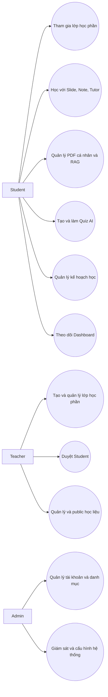

### 2.3.2. Use Case Student

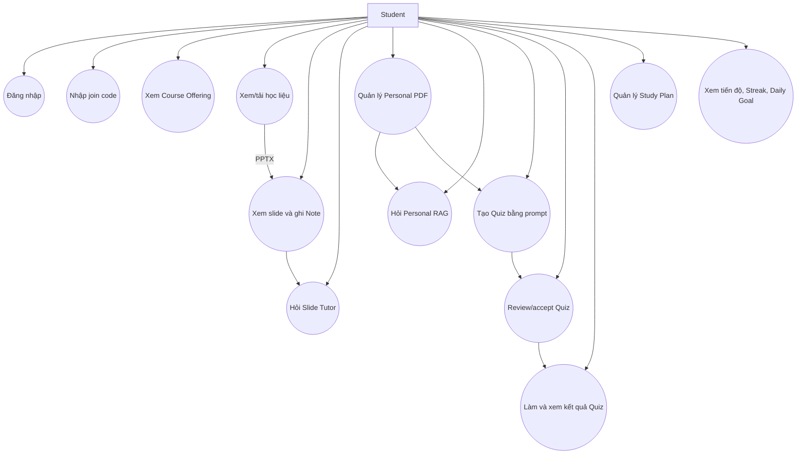

### 2.3.3. Use Case Teacher

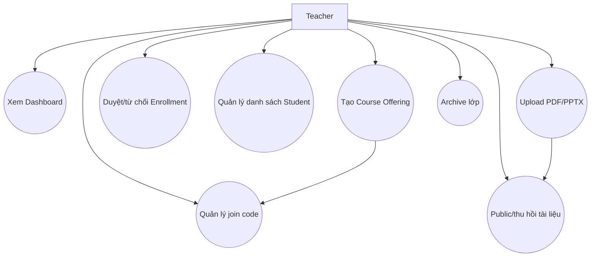

### 2.3.4. Use Case Admin

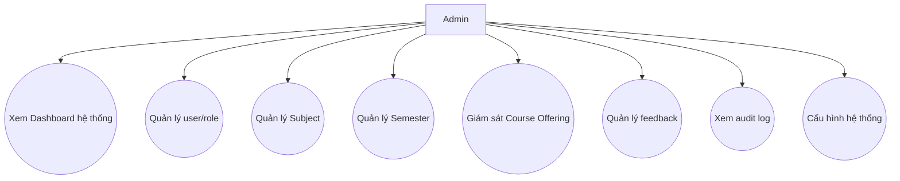

### 2.3.5. Đặc tả các Use Case chính

#### UC-01 — Student tham gia Course Offering

| Thuộc tính | Mô tả |
|---|---|
| Tác nhân | Student, Teacher |
| Tiền điều kiện | Student và Teacher có tài khoản hợp lệ; Course Offering cho phép tham gia. |
| Luồng chính | Student nhập join code → Backend kiểm tra mã → tạo enrollment `PENDING` → Teacher xem yêu cầu → Teacher duyệt → enrollment chuyển `APPROVED` → Student được truy cập lớp và học liệu. |
| Luồng thay thế | Join code sai/hết hiệu lực; yêu cầu trùng; Teacher từ chối; lớp bị khóa hoặc archive. |
| Hậu điều kiện | Quan hệ Student–Course Offering được lưu và audit; quyền đọc học liệu được xác định từ trạng thái enrollment. |

#### UC-02 — Student học với Slide Viewer và AI Tutor

| Thuộc tính | Mô tả |
|---|---|
| Tác nhân | Student |
| Tiền điều kiện | Enrollment `APPROVED` hoặc quyền lịch sử còn hiệu lực; PPTX đang được public. |
| Luồng chính | Student mở PPTX → Backend cấp artifact được phép → Student chuyển slide → hệ thống ghi view event idempotent → Student lưu Note hoặc đặt câu hỏi → Java tạo authorized scope → Python truy xuất chunk theo slide/tài liệu → trả answer và citation. |
| Luồng thay thế | Tài liệu bị revoke; Student ngoài scope; AI không đủ bằng chứng trả `NO_EVIDENCE`; AI Service tạm không khả dụng. |
| Hậu điều kiện | Note thuộc riêng Student; Content Progress được cập nhật; câu trả lời có trace và citation hợp lệ. |

#### UC-03 — Hỏi đáp Personal Document

| Thuộc tính | Mô tả |
|---|---|
| Tác nhân | Student |
| Tiền điều kiện | PDF thuộc owner, có lớp văn bản và đã xử lý `READY`. |
| Luồng chính | Student chọn 1–10 PDF → tạo conversation → nhập câu hỏi → Java kiểm tra owner/version/status → Python retrieval trong đúng scope → sinh câu trả lời → kiểm tra grounding → trả answer và citation theo trang. |
| Luồng thay thế | PDF sai định dạng, mã hóa hoặc không có text; tài liệu chưa sẵn sàng; không đủ evidence; một document không thuộc owner. |
| Hậu điều kiện | Message và citation được lưu theo conversation; không truy xuất tài liệu ngoài lựa chọn. |

#### UC-04 — Sinh và làm Quiz AI

| Thuộc tính | Mô tả |
|---|---|
| Tác nhân | Student |
| Tiền điều kiện | Student chọn Personal Documents `READY` của mình và nhập prompt hợp lệ. |
| Luồng chính | Java xác thực scope → tạo Quiz `GENERATING` → Python sinh danh sách câu `MCQ_SINGLE` có nguồn → Java validate schema/citation → Quiz chuyển `REVIEW_REQUIRED` → Student review và accept → chọn Course Offering `APPROVED` hoặc Quiz cá nhân → Quiz chuyển `READY` → Student làm bài → Java chấm điểm và lưu attempt. |
| Luồng thay thế | Structured output không hợp lệ; citation ngoài scope; generation thất bại; Student reject hoặc regenerate; Course Offering đích không hợp lệ. |
| Hậu điều kiện | Mỗi attempt được lưu độc lập; nội dung cần ôn lại chỉ lấy từ câu sai và source của câu hỏi. |

#### UC-05 — Teacher tạo lớp và public học liệu

| Thuộc tính | Mô tả |
|---|---|
| Tác nhân | Teacher |
| Tiền điều kiện | Teacher có role hợp lệ; Subject tồn tại; Semester cho phép tạo lớp. |
| Luồng chính | Teacher chọn Subject và Semester → tạo Course Offering → hệ thống sinh join code → Teacher upload PDF/PPTX → tài liệu được lưu trong thư viện → Teacher chọn tài liệu và Course Offering thuộc sở hữu → public tài liệu. |
| Luồng thay thế | Semester đóng; mã lớp trùng; file không hợp lệ; Teacher cố public vào lớp không thuộc sở hữu. |
| Hậu điều kiện | Student `APPROVED` nhìn thấy publication; PPTX được xử lý cho Viewer/Tutor, PDF chỉ cho tải xuống. |

#### UC-06 — Theo dõi Dashboard, Streak và Daily Goal

| Thuộc tính | Mô tả |
|---|---|
| Tác nhân | Student |
| Tiền điều kiện | Student đã đăng nhập. |
| Luồng chính | Student mở Dashboard → Java tổng hợp deadline, Course Offering, Content Progress, Quiz, task, streak và Daily Goal theo múi giờ → Frontend hiển thị toàn bộ tổng quan và tiến độ từng lớp. |
| Quy tắc | Streak chỉ tính ngày có `VIEW_SLIDE`, `STUDY_TASK_COMPLETED` hoặc `QUIZ_COMPLETED`; login, Note và `ASK_AI` không được tính. Daily Goal không quyết định streak. |
| Hậu điều kiện | Không có route Progress độc lập; client không tự tính score, actual hoặc streak. |

#### UC-07 — Teacher duyệt yêu cầu tham gia lớp

| Thuộc tính | Mô tả |
|---|---|
| Tác nhân | Teacher |
| Tiền điều kiện | Teacher là owner của Course Offering; enrollment đang ở trạng thái `PENDING`. |
| Luồng chính | Teacher mở danh sách yêu cầu → chọn một hoặc nhiều Student → duyệt → Java kiểm tra ownership và trạng thái → enrollment chuyển `APPROVED` → Student được cấp quyền truy cập học liệu. |
| Luồng thay thế | Teacher từ chối yêu cầu; lớp đã khóa/archive; enrollment đã được xử lý bởi request khác. |
| Hậu điều kiện | Trạng thái enrollment và người xử lý được lưu; thao tác được audit; không tạo tài khoản Student mới. |

#### UC-08 — Student quản lý Study Plan

| Thuộc tính | Mô tả |
|---|---|
| Tác nhân | Student |
| Tiền điều kiện | Student đã đăng nhập. |
| Luồng chính | Student tạo kế hoạch → thêm task/session/deadline → xem trên lịch tuần → cập nhật trạng thái task → khi hoàn thành, Java ghi `STUDY_TASK_COMPLETED` idempotent. |
| Luồng thay thế | Dữ liệu thời gian không hợp lệ; task không thuộc owner; yêu cầu hoàn thành bị gửi lặp. |
| Hậu điều kiện | Kế hoạch thuộc riêng Student; Learning Event hợp lệ được dùng cho Daily Goal và Study Streak. |

#### UC-09 — Ôn lại nội dung sai và làm Quiz lại

| Thuộc tính | Mô tả |
|---|---|
| Tác nhân | Student |
| Tiền điều kiện | Student đã hoàn thành ít nhất một Quiz attempt và có câu trả lời sai. |
| Luồng chính | Student mở Ôn tập → chọn Course Offering hoặc nhóm Quiz cá nhân → hệ thống lấy câu sai và `quiz_question_sources` → Student mở nguồn theo trang/slide → ôn lại → làm lại Quiz → Java tạo attempt mới → Student so sánh kết quả với các attempt trước. |
| Luồng thay thế | Source đã bị thu hồi hoặc ngoài quyền lịch sử; Quiz chưa `READY`; attempt chưa được submit. |
| Hậu điều kiện | Lịch sử cũ không bị ghi đè; nội dung cần ôn lại chỉ dựa trên câu sai và nguồn, không dùng AI suy luận Student yếu/mạnh. |

#### UC-10 — Admin quản lý Subject và Semester

| Thuộc tính | Mô tả |
|---|---|
| Tác nhân | Admin |
| Tiền điều kiện | Admin đã xác thực và có quyền quản lý catalog. |
| Luồng chính | Admin tạo/cập nhật Subject hoặc Semester → Backend kiểm tra mã, ngày và trạng thái → lưu catalog → Teacher có thể dùng bản ghi hợp lệ để tạo Course Offering. |
| Luồng thay thế | Mã trùng; khoảng ngày không hợp lệ; đóng Semester gây xung đột với quy tắc vận hành. |
| Hậu điều kiện | Catalog dùng chung được cập nhật và audit; dữ liệu lịch sử của Course Offering không bị xóa. |

## 2.4. Phân tích luồng nghiệp vụ

### 2.4.1. Activity Diagram

#### Luồng tham gia và học trong Course Offering

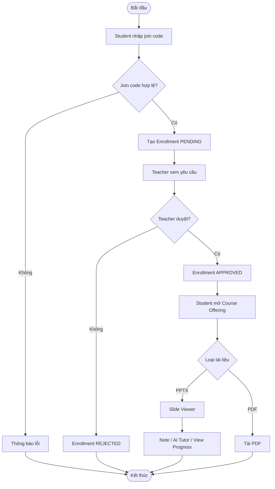

#### Luồng Personal RAG và Quiz

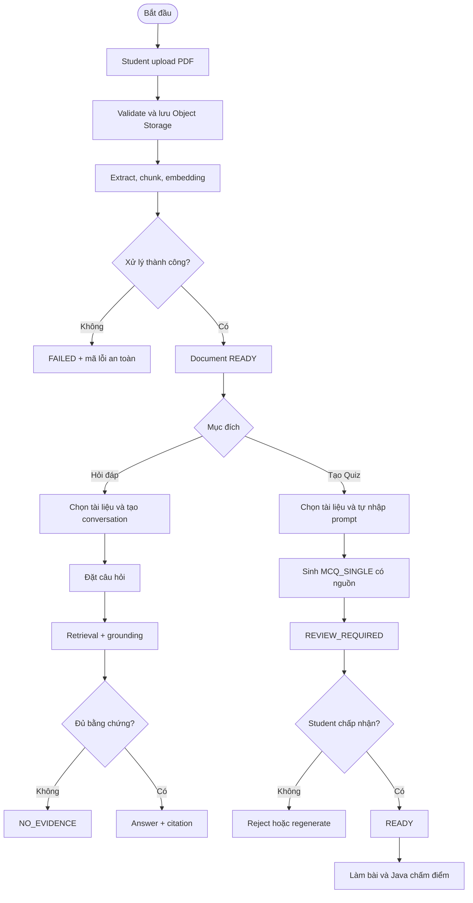

#### Luồng tiến độ và ôn tập

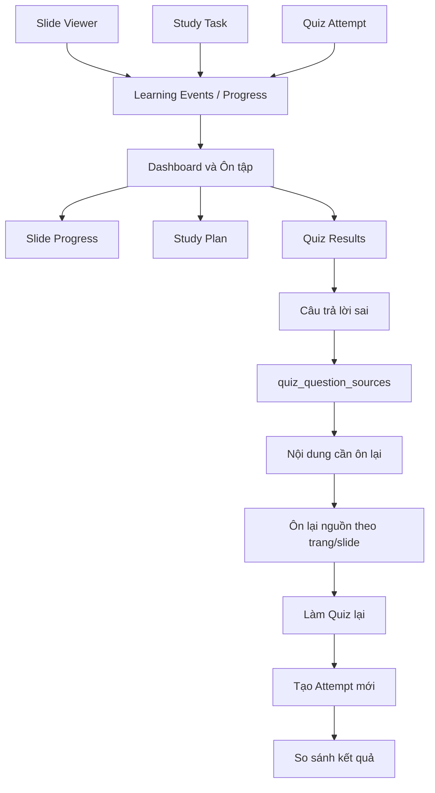

Dashboard và khu vực Ôn tập không tự tạo progress. Hai khu vực này chỉ đọc dữ liệu đã được Java ghi nhận tự động từ các hoạt động học hợp lệ. “Nội dung cần ôn lại” được dẫn xuất xác định từ câu trả lời sai và nguồn của câu hỏi, không phải kết luận năng lực do AI suy đoán.

#### Luồng Learning Event, Daily Goal và Study Streak

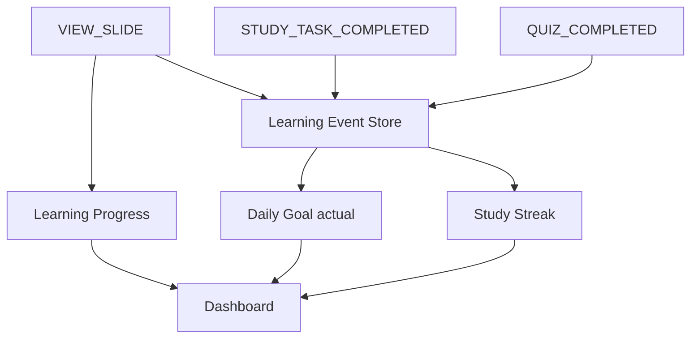

`VIEW_SLIDE` vừa cập nhật Content Progress vừa phát Learning Event idempotent. `STUDY_TASK_COMPLETED` và `QUIZ_COMPLETED` đóng góp vào Learning Event Store. Java tổng hợp event theo local date và múi giờ của Student để tính actual Daily Goal và Study Streak. Việc đạt 100% Daily Goal không phải điều kiện duy trì streak.

### 2.4.2. Sequence Diagram

#### Trình tự hỏi Slide AI Tutor

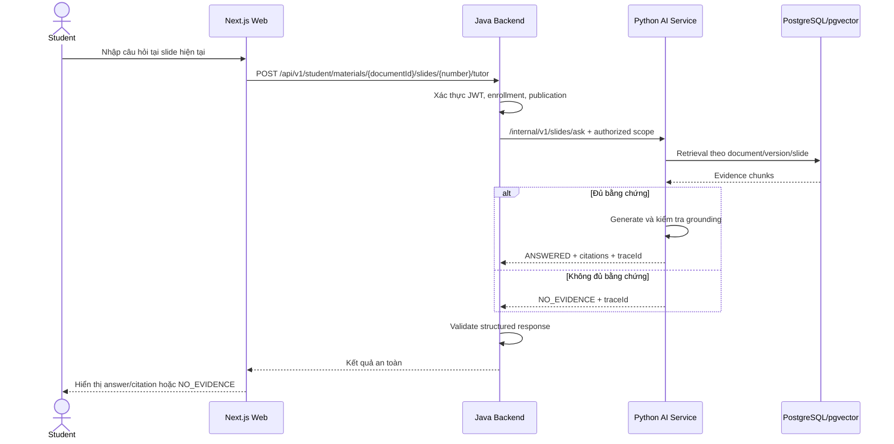

#### Trình tự tạo Quiz AI

```mermaid
sequenceDiagram
    actor Student
    participant FE as Next.js Web
    participant BE as Java Backend
    participant AI as Python AI Service
    participant DB as PostgreSQL

    Student->>FE: Chọn PDF và nhập prompt
    FE->>BE: POST /api/v1/quizzes
    BE->>DB: Kiểm tra owner, READY, version
    BE->>DB: Tạo Quiz GENERATING
    BE-->>FE: 202 Accepted + quizId + GENERATING
    Note over BE,AI: Java xử lý generation nền; FE theo dõi trạng thái Quiz qua Java
    BE->>AI: /internal/v1/quizzes/generate + authorized docs + userPrompt
    AI->>AI: Retrieval + structured generation
    AI-->>BE: Questions + options + answer key + sources
    BE->>BE: Validate đúng 4 options, một đáp án và authorized citation
    alt Output hợp lệ
        BE->>DB: Lưu draft, REVIEW_REQUIRED
        Note over FE,DB: Lần đọc Quiz tiếp theo trả REVIEW_REQUIRED
        Student->>FE: Accept và chọn nơi ôn tập
        FE->>BE: POST /api/v1/review/quizzes/{id}/accept
        BE->>DB: Kiểm tra destination, chuyển READY
    else Output không hợp lệ
        BE->>DB: GENERATION_FAILED
        Note over FE,DB: Lần đọc Quiz tiếp theo trả GENERATION_FAILED và safe error code
    end
```

#### Trình tự hỏi đáp Personal RAG

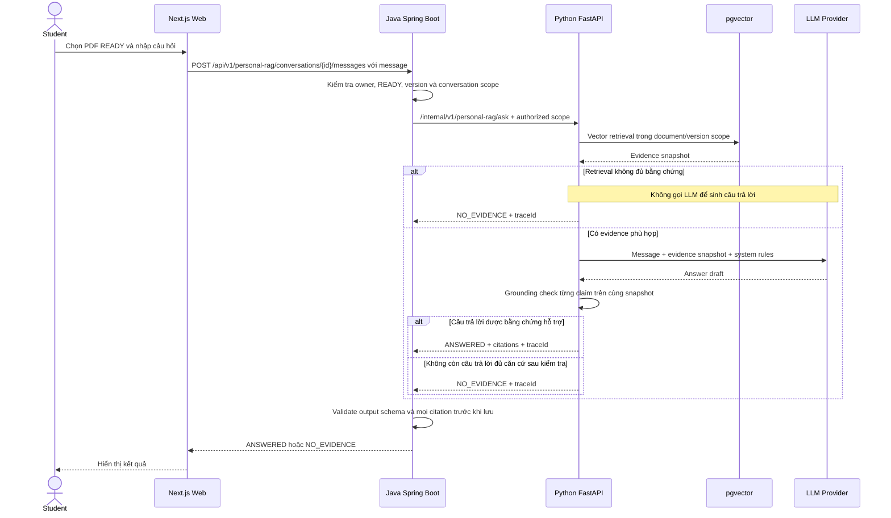

#### Trình tự upload và index Personal PDF

```mermaid
sequenceDiagram
    actor Student
    participant FE as Next.js Web
    participant BE as Java Spring Boot
    participant APP as PostgreSQL app
    participant OS as Object Storage
    participant AI as Python FastAPI
    participant WORKER as Python Index Worker
    participant EMB as Embedding Provider
    participant VDB as PostgreSQL ai / pgvector

    Student->>FE: Chọn PDF và upload
    FE->>BE: POST /api/v1/personal-documents
    BE->>BE: Kiểm tra loại file, MIME, kích thước
    BE->>OS: Lưu file
    BE->>APP: Lưu metadata PENDING_PROCESSING và enqueue yêu cầu index
    BE-->>FE: 202 Accepted + documentId + PENDING_PROCESSING
    BE->>AI: POST /internal/v1/documents/index + Idempotency-Key
    AI->>VDB: Tạo hoặc lấy lại job idempotent
    AI-->>BE: 202 Accepted + jobId + status
    BE->>APP: Lưu jobId, chuyển PROCESSING
    WORKER->>VDB: Nhận job đã enqueue
    WORKER->>OS: Tải file bằng signed URL
    WORKER->>WORKER: Extract text và chunk theo trang
    WORKER->>EMB: Tạo embedding
    EMB-->>WORKER: Vector cùng model/dimension
    alt Xử lý thành công
        WORKER->>VDB: Lưu index/chunks/vectors và trạng thái job thành công
    else Lỗi parsing hoặc embedding
        WORKER->>VDB: Lưu trạng thái job thất bại và safe error code
    end
    loop Java polling có backoff tới trạng thái kết thúc
        BE->>AI: GET /internal/v1/jobs/{jobId}
        AI-->>BE: status + errorCode nếu có
    end
    BE->>APP: Chuyển document READY hoặc FAILED theo kết quả job
    FE->>BE: GET /api/v1/personal-documents/{id}/status
    BE-->>FE: Trạng thái document và safe error code nếu có
    FE-->>Student: READY cho phép RAG/Quiz; FAILED hiển thị hướng dẫn xử lý
```

## 2.5. Thiết kế kiến trúc hệ thống

StudyFlow sử dụng kiến trúc phân lớp và tách service theo trách nhiệm:

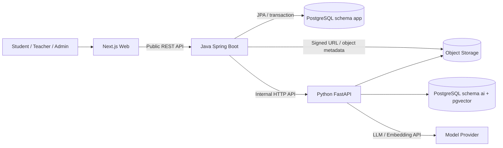

**Next.js Web** chịu trách nhiệm trình bày giao diện, điều hướng theo role, thu thập input và gọi public API của Java. Frontend không gọi trực tiếp Python, cơ sở dữ liệu hoặc model provider, đồng thời không tự chấm điểm hay tính tiến độ.

**Java Spring Boot Backend** là system of record. Thành phần này thực hiện xác thực, RBAC, ownership, Course Offering, Enrollment, tài liệu, publication, Note, Learning Event, Dashboard, Study Plan, Quiz lifecycle và scoring. Trước khi gọi AI, Java phải xây dựng authorized scope tối thiểu và sau khi nhận kết quả phải kiểm tra schema/citation.

**Python AI Service** thực hiện xử lý PDF/PPTX, tạo chunk, embedding, vector retrieval, RAG, citation, Slide Tutor và sinh Quiz có cấu trúc. Python không truy cập trực tiếp bảng user, enrollment, attempt hoặc study plan và không tự cập nhật tiến độ.

**PostgreSQL** dùng chung một cluster nhưng tách schema và database role. Java sở hữu schema `app`; Python sở hữu schema `ai` và extension pgvector. Cách tách này làm rõ quyền sở hữu dữ liệu và hạn chế service truy cập chéo.

**Object Storage** lưu file PDF/PPTX và artifact slide. Các service trao đổi object bằng signed URL có thời hạn; client không nhận storage key nội bộ.

### 2.5.1. Thiết kế AI và RAG Pipeline

AI trong StudyFlow được thiết kế thành các pipeline có scope và output rõ ràng. AI chỉ hỗ trợ xử lý và tạo nội dung; Java vẫn quyết định quyền truy cập, trạng thái nghiệp vụ, tiến độ và điểm số.

#### a. Document Processing Pipeline

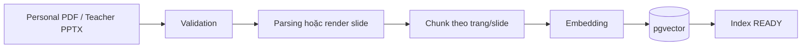

Personal PDF phải có lớp văn bản; file mã hóa trả `PDF_ENCRYPTED`, file không có text trả `PDF_TEXT_REQUIRED`. Teacher PPTX được render thành artifact slide và chunk theo slide. Teacher PDF không đi qua AI indexing trong MVP.

#### b. Personal RAG Pipeline

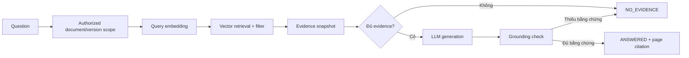

Generation và grounding reviewer dùng cùng một evidence snapshot, tránh retrieval lần hai làm thay đổi căn cứ đánh giá. Mỗi factual claim phải được evidence hỗ trợ; claim không được hỗ trợ phải bị loại hoặc viết lại.

#### c. Slide AI Tutor Pipeline

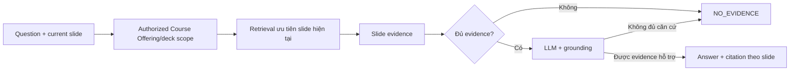

Slide Tutor chỉ dùng Teacher PPTX đang được public và Student có quyền truy cập. Citation phải chứa đúng document version và slide number; prompt trong slide không thể thay system rule hoặc mở rộng scope.

#### d. AI Quiz Generation Pipeline

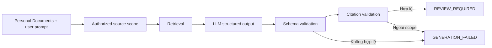

Prompt của Student là yêu cầu nội dung không tin cậy, không thay thế quy tắc `MCQ_SINGLE`, output schema, grounding hoặc authorized scope. Java chỉ lưu batch khi mọi câu hỏi có đúng 4 options không rỗng, không trùng nhau, một `correctOptionIndex` hợp lệ, explanation và ít nhất một nguồn thuộc authorized document/version scope. Python trả draft; Java sở hữu chuyển trạng thái `REVIEW_REQUIRED` hoặc `GENERATION_FAILED`.

## 2.6. Thiết kế cơ sở dữ liệu

### 2.6.1. ERD

Lược đồ tổng quan dưới đây trình bày 30 bảng của schema `app` và `ai` theo dạng bảng thuộc tính, có tên cột, kiểu dữ liệu, PK/FK và quan hệ chân quạ.

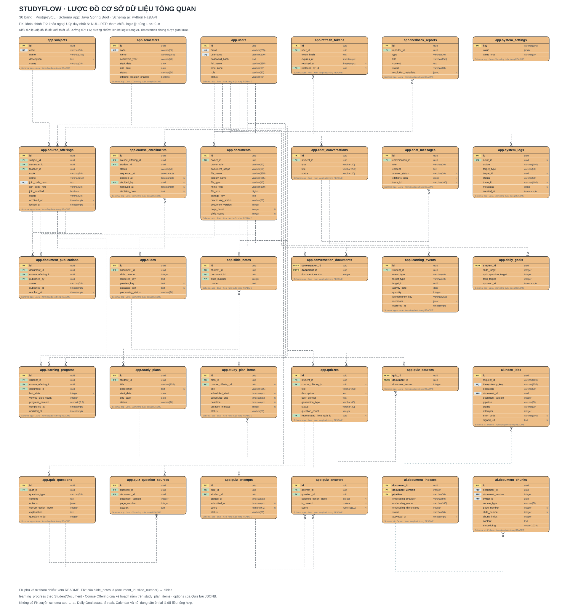

[Mở trang xem và phóng to](diagrams/erd/index.html) · [Mở SVG gốc](diagrams/erd/studyflow-overview.svg) · [Chú giải và ràng buộc](diagrams/erd/README.md).

Kiểu dữ liệu, độ dài và nullable là đề xuất thiết kế phục vụ báo cáo; chưa phải schema đã triển khai. Timestamps chung và metadata xóa mềm được giản lược. Các FK phụ/tự tham chiếu được liệt kê trong chú giải.

Sơ đồ bám theo `database-plan.md`: dùng `chat_conversations`, `chat_messages` và `conversation_documents`; options nằm trong `quiz_questions`; câu trả lời nằm trong `quiz_answers`. `learning_progress` được tổng hợp theo Student/Document, còn liên kết Course Offering của kế hoạch nằm trên `study_plan_items`.

Schema `ai` dùng định danh logic document/version và scope do Java cấp; không có FK xuyên schema tới dữ liệu nghiệp vụ `app`.

### 2.6.2. Mô hình dữ liệu

Dữ liệu được chia thành các nhóm:

- **Identity và RBAC:** tài khoản, role, refresh token, trạng thái khóa.
- **Academic Catalog:** Subject và Semester.
- **Course Offering:** lớp học phần, owner Teacher, join code và enrollment.
- **Document:** metadata tài liệu, version, owner, loại nguồn và publication.
- **Learning:** slide, note, progress, learning event, Daily Goal và Study Plan.
- **Personal AI:** conversation/message/citation trong schema `app`; index/chunk/vector/job trong schema `ai`.
- **Quiz:** Quiz, nguồn, câu hỏi, phương án, answer key, attempt và câu trả lời.
- **Operation:** feedback, audit log và system setting; idempotency key được lưu trên các bản ghi event/job tương ứng.

Các bảng sử dụng khóa chính UUID hoặc định danh không đoán được; có `created_at`, `updated_at` và trạng thái cần thiết. Các ràng buộc duy nhất quan trọng gồm mã môn học, mã học kỳ, join code đang hoạt động, một enrollment trên mỗi cặp Student–Course Offering và một Note trên mỗi cặp Student–Slide.

### 2.6.3. Mô tả các bảng chính

| Bảng | Mục đích và trường tiêu biểu |
|---|---|
| `users` | Tài khoản, email, password hash, role, status, time zone. |
| `subjects` | Danh mục môn học gồm code, name và trạng thái. |
| `semesters` | Học kỳ, ngày bắt đầu/kết thúc và trạng thái. |
| `course_offerings` | Lớp học phần, Subject, Semester, Teacher owner, join code và trạng thái. |
| `course_enrollments` | Quan hệ Student–Course Offering, trạng thái và thông tin duyệt. |
| `documents` | Metadata file, owner, source type, MIME, version, processing status và object key nội bộ. |
| `document_publications` | Quan hệ tài liệu được public vào Course Offering, thời điểm public/revoke. |
| `slides` | Artifact và text metadata của từng slide thuộc PPTX. |
| `slide_notes` | Ghi chú riêng của Student theo slide. |
| `chat_conversations`, `conversation_documents` | Hội thoại của Student và snapshot scope tài liệu được chọn. |
| `chat_messages` | Câu hỏi, câu trả lời, trạng thái, citation và trace ID. |
| `learning_progress` | Tiến độ xem nội dung, không biểu diễn Topic Mastery. |
| `learning_events` | Sự kiện bất biến phục vụ streak, Daily Goal và thống kê; có idempotency key. |
| `daily_goals` | Target slide, câu Quiz và Study Task do Student cấu hình. |
| `study_plans`, `study_plan_items` | Kế hoạch, task, session, deadline và trạng thái hoàn thành. |
| `quizzes` | Owner, trạng thái lifecycle, prompt, destination và thông tin generation. |
| `quiz_questions` | Nội dung câu hỏi MCQ_SINGLE, options dạng JSONB và một correct_option_index. |
| `quiz_question_sources` | Citation nguồn Personal PDF theo document/version/page; Quiz MVP không sinh từ Teacher PPTX. |
| `quiz_attempts`, `quiz_answers` | Mỗi lần làm bài, lựa chọn, điểm số và thời gian nộp. |
| `ai.document_indexes` | Phiên bản index, embedding model/dimension và trạng thái. |
| `ai.document_chunks` | Chunk text, location metadata và vector embedding. |
| `ai.index_jobs` | Job xử lý index/deindex cùng trạng thái retry/idempotency. |

## 2.7. Thiết kế API

### 2.7.1. REST API chính

Public API có prefix `/api/v1`, xác thực phiên người dùng và trả error schema thống nhất gồm `code`, `message`, `traceId` và `details` an toàn. Các đường dẫn trong bảng dưới được viết tương đối với prefix này; tên và phương thức theo `docs/api-plan.md`.

| Nhóm | Endpoint tiêu biểu | Chức năng |
|---|---|---|
| Auth | `POST /auth/login`, `POST /auth/refresh`, `POST /auth/logout` | Xác thực và quản lý phiên. |
| Student Enrollment | `POST /student/course-enrollments/join`, `GET /student/course-enrollments` | Gửi yêu cầu bằng join code và xem trạng thái enrollment. |
| Student Course | `GET /student/course-offerings` | Xem lớp đã được duyệt, lọc ACTIVE/ARCHIVED. |
| Materials | `GET /student/course-offerings/{id}/materials` | Xem publication được phép. |
| Slide | `POST /student/materials/{documentId}/slides/{number}/view-events` | Ghi nhận view với Idempotency-Key. |
| Note | `GET/PUT /student/materials/{documentId}/slides/{number}/note` | Đọc hoặc lưu Note riêng. |
| Slide Tutor | `POST /student/materials/{documentId}/slides/{number}/tutor` | Hỏi Tutor theo authorized slide scope. |
| Personal Document | `POST/GET/DELETE /personal-documents...` | Upload, xem trạng thái và xóa PDF cá nhân. |
| Personal RAG | `POST /personal-rag/conversations` | Tạo conversation theo các PDF được chọn. |
| Personal RAG | `POST /personal-rag/conversations/{id}/messages` | Hỏi và nhận answer/citation. |
| Quiz Generation | `POST /quizzes` | Tạo Quiz từ selectedDocumentIds và prompt tự nhập. |
| Quiz Review | `POST /review/quizzes/{id}/accept`, `POST /review/quizzes/{id}/reject`, `POST /review/quizzes/{id}/regenerate` | Quản lý Quiz chờ review. |
| Quiz Attempt | `POST /review/quizzes/{id}/attempts`, `POST /review/attempts/{id}/submit` | Làm bài và để Java chấm điểm. |
| Dashboard | `GET /student/dashboard` | Tổng hợp progress từng lớp, streak, goal và việc sắp tới. |
| Goal | `GET/PUT /student/daily-goal` | Xem actual và cấu hình target. |
| Study Plan | `GET/POST/PATCH/DELETE /study-plans...` | Quản lý kế hoạch và lịch. |
| Teacher Course | `POST/GET/PATCH /teacher/course-offerings...` | Tạo và quản lý lớp thuộc sở hữu. |
| Enrollment List | `GET /teacher/course-offerings/{id}/enrollments` | Xem enrollment của lớp thuộc sở hữu. |
| Enrollment Decision | `POST /teacher/enrollments/{enrollmentId}/approve`, `POST /teacher/enrollments/{enrollmentId}/reject` | Duyệt hoặc từ chối Student. |
| Teacher Library | `POST/GET /teacher/documents...` | Quản lý PDF/PPTX. |
| Publication | `POST /teacher/documents/{id}/publications`, `DELETE /teacher/publications/{publicationId}` | Public tài liệu vào danh sách lớp được phép hoặc revoke publication. |
| Admin | `/admin/users`, `/admin/subjects`, `/admin/semesters`, `/admin/course-offerings` | Quản trị và giám sát. |

Các endpoint mutation quan trọng sử dụng idempotency key. Backend luôn kiểm tra role, ownership và trạng thái tài nguyên; việc client biết ID không đồng nghĩa có quyền truy cập.

### 2.7.2. Internal AI API

Java gọi Python qua API nội bộ, kèm service credential, `X-Request-Id`, `X-Schema-Version: 3`, timeout và authorized scope. Index/deindex và Quiz generation có `Idempotency-Key`:

| Endpoint | Chức năng |
|---|---|
| `POST /internal/v1/documents/index` | Tạo job xử lý và index Personal PDF hoặc Teacher PPTX. |
| `POST /internal/v1/documents/deindex` | Loại bỏ index theo document/version, hỗ trợ idempotency. |
| `GET /internal/v1/jobs/{jobId}` | Theo dõi trạng thái job. |
| `POST /internal/v1/personal-rag/ask` | Hỏi đáp trong scope Personal Documents của owner. |
| `POST /internal/v1/slides/ask` | Hỏi đáp trong scope Course Offering/document/slide được Java cấp. |
| `POST /internal/v1/quizzes/generate` | Sinh Quiz có cấu trúc từ tài liệu và prompt không tin cậy. |
| `GET /internal/v1/health` | Kiểm tra trạng thái AI Service và dependency cần thiết. |

Python trả dữ liệu có schema; Java phải validate trước khi lưu hoặc trả ra ngoài. Query và document chunk bắt buộc dùng cùng embedding model, dimension và index version. Khi không đủ bằng chứng, API trả trạng thái `NO_EVIDENCE` thay vì tạo câu trả lời không có nguồn.

## 2.8. Thiết kế giao diện

Giao diện sử dụng phong cách đỏ–trắng PTIT, có sidebar trên desktop, drawer trên mobile, topbar, breadcrumb và profile menu. Các thành phần dùng chung gồm Button, Form, Modal, Drawer, Table, Card, Tabs, Status Badge, Citation Card, Toast, Skeleton, Empty State và Error State.

### 2.8.1. Student

- **Dashboard:** hiển thị lớp đang học, deadline, Study Streak, Daily Goal, task, Quiz và tiến độ đầy đủ của từng Course Offering. Không có trang “Tiến độ & Thống kê” riêng.
- **Lớp học phần:** nhập join code, xem trạng thái yêu cầu và truy cập lớp được duyệt.
- **Học liệu:** PPTX hiển thị nút xem slide; PDF hiển thị nút tải xuống.
- **Slide Viewer:** khu vực slide ở trung tâm, điều hướng slide, Note và chatbot Tutor bên phải; citation mở đúng slide nguồn.
- **Tài liệu cá nhân:** upload PDF, trạng thái processing, lựa chọn nhiều tài liệu và workspace chatbot.
- **Tạo Quiz:** chọn Personal Documents `READY` và nhập prompt trống theo ý muốn; không có prompt mẫu bắt buộc và không sinh Quiz từ chat context.
- **Ôn tập:** review Quiz, accept/reject/regenerate, làm bài, xem attempt history và nội dung cần ôn lại từ câu sai.
- **Kế hoạch & Lịch:** danh sách task, form tạo/cập nhật và lịch tuần.

### 2.8.2. Teacher

- **Dashboard:** số lớp, yêu cầu chờ duyệt, Student và tài liệu public.
- **Lớp học phần của tôi:** tạo lớp, xem join code, bật/tắt mã và archive lớp.
- **Enrollment:** bảng yêu cầu `PENDING`, thao tác duyệt/từ chối đơn lẻ hoặc hàng loạt.
- **Danh sách Student:** xem thành viên đã duyệt và thao tác remove có xác nhận.
- **Thư viện tài liệu:** upload PDF/PPTX và theo dõi trạng thái xử lý.
- **Publication:** chọn tài liệu, chọn lớp thuộc sở hữu, public hoặc revoke.

Teacher không có giao diện học như Student cho Note/Tutor và không có chức năng tạo Teacher Quiz trong MVP.

### 2.8.3. Admin

- **Dashboard hệ thống:** số lượng user, Subject, Semester, Course Offering và cảnh báo vận hành.
- **Người dùng & vai trò:** tìm kiếm, lọc, tạo, cập nhật, khóa/mở khóa và gán role.
- **Danh mục:** CRUD Subject và Semester.
- **Giám sát lớp:** lọc theo Teacher, Subject, Semester và trạng thái; lock/archive khi cần.
- **Feedback:** tiếp nhận và cập nhật trạng thái xử lý phản hồi.
- **Audit:** tra cứu sự kiện quản trị và nghiệp vụ quan trọng.
- **Settings:** cấu hình giới hạn upload và tham số vận hành cơ bản.

Tất cả màn hình phải có trạng thái loading, empty, error, processing và forbidden phù hợp. Dữ liệu fixture chỉ được dùng ở demo và phải có nhãn “Dữ liệu demo”.

### 2.8.4. Wireframe các màn hình chính

Các wireframe dưới đây mô tả bố cục thông tin ở mức thiết kế. Màu sắc, typography và component chi tiết được áp dụng theo design system đỏ–trắng PTIT khi triển khai.

**Hình 2.1 — Student Dashboard**

```text
┌──────────────┬──────────────────────────────────────────────────────────┐
│ Logo         │ Dashboard                            🔔  Student ▾       │
│ Dashboard    ├──────────────┬──────────────┬────────────────────────────┤
│ Lớp học phần │ Study Streak │ Daily Goal   │ Việc sắp tới               │
│ Tài liệu     │  7 ngày      │  6/10 slide │ • Quiz CSDL                │
│ Tài liệu CN  ├──────────────┴──────────────┴────────────────────────────┤
│ Ôn tập       │ Tiến độ theo Course Offering                            │
│ Kế hoạch     │ Cơ sở dữ liệu       Slide 65% │ Điểm TB 7/10 │ Task 4/6     │
│              │ Trí tuệ nhân tạo    Slide 40% │ Điểm TB 5,5/10 │ Task 2/5     │
└──────────────┴──────────────────────────────────────────────────────────┘
```

**Hình 2.2 — Course Offering Detail**

```text
┌──────────────┬──────────────────────────────────────────────────────────┐
│ Sidebar      │ Cơ sở dữ liệu · HK1 2026                               │
│              │ Teacher: Nguyễn Văn A     Enrollment: APPROVED          │
│              ├──────────────────────────────────────────────────────────┤
│              │ [Tài liệu] [Thông tin lớp]                              │
│              │ PPTX  Transaction và ACID          [Xem slide]          │
│              │ PPTX  Isolation Level              [Xem slide]          │
│              │ PDF   Đề cương môn học             [Tải xuống]          │
└──────────────┴──────────────────────────────────────────────────────────┘
```

Màn hình này tập trung vào thông tin lớp và học liệu. Tiến độ chi tiết theo lớp vẫn được trình bày trực tiếp trên Dashboard, không tạo màn Progress độc lập.

**Hình 2.3 — Slide Viewer + AI Tutor**

```text
┌───────────────────────────────────────────────┬─────────────────────────┐
│ Transaction và ACID                Slide 8/24 │ AI Tutor                │
├───────────────────────────────────────────────┤ Hỏi về slide hiện tại…  │
│                                               │                         │
│                SLIDE CONTENT                  │ Answer                  │
│                                               │ [Nguồn: Slide 8]        │
├───────────────────────────────────────────────┤─────────────────────────┤
│ [←] [8 / 24] [→]   Note của tôi: _________   │ [Nhập câu hỏi] [Gửi]   │
└───────────────────────────────────────────────┴─────────────────────────┘
```

**Hình 2.4 — Personal Document RAG**

```text
┌──────────────────────────────────────────┬──────────────────────────────┐
│ Chatbot tài liệu cá nhân                 │ Nguồn đang sử dụng           │
│ Session: Ôn tập CSDL                     │ ☑ Giáo trình CSDL.pdf READY  │
├──────────────────────────────────────────┤ ☑ Đề cương ôn tập.pdf READY  │
│ Student: ACID gồm những tính chất nào?   │                              │
│ AI: ...                                  │ Citation                     │
│ [1] Giáo trình CSDL.pdf · Trang 42       │ Trang 42: “...”              │
│                                          │ [Mở chi tiết nguồn]          │
├──────────────────────────────────────────┤                              │
│ [Nhập câu hỏi]                    [Gửi]  │                              │
└──────────────────────────────────────────┴──────────────────────────────┘
```

**Hình 2.5 — Quiz và Review Hub**

```text
┌──────────────┬──────────────────────────────────────────────────────────┐
│ Ôn tập       │ [Quiz] [Lịch sử Attempt] [Nội dung cần ôn lại]          │
│ Cơ sở dữ liệu├──────────────────────────────────────────────────────────┤
│ AI           │ Quiz Transaction       READY        Điểm gần nhất: 8/10 │
│ Cá nhân      │ [Làm bài] [Xem lịch sử]                                │
│              ├──────────────────────────────────────────────────────────┤
│              │ Câu sai: Isolation Level                                │
│              │ Nguồn: Giáo trình CSDL.pdf · Trang 58    [Ôn lại nguồn] │
│              │                                      [Làm Quiz lại]     │
└──────────────┴──────────────────────────────────────────────────────────┘
```

**Hình 2.6 — Teacher Course Management**

```text
┌──────────────┬──────────────────────────────────────────────────────────┐
│ Teacher      │ Lớp học phần của tôi                  [+ Tạo lớp]       │
│ Dashboard    ├──────────────────────────────────────────────────────────┤
│ Lớp của tôi  │ Cơ sở dữ liệu · HK1 2026 · ACTIVE                       │
│ Enrollment   │ Join code: CSDL26A   [Tắt mã] [Sao chép]                │
│ Tài liệu     │ 45 Student · 6 tài liệu · 3 yêu cầu chờ duyệt           │
│ Publication  │ [Quản lý Student] [Public tài liệu] [Archive]           │
└──────────────┴──────────────────────────────────────────────────────────┘
```

## 2.9. Thiết kế bảo mật và phân quyền

Hệ thống áp dụng bảo mật theo nhiều lớp:

1. **Xác thực:** mật khẩu chỉ lưu dạng hash; access token có thời hạn ngắn; refresh token được quản lý và thu hồi khi logout hoặc khóa tài khoản.
2. **RBAC:** endpoint được giới hạn theo `STUDENT`, `TEACHER`, `ADMIN`. Role trên client chỉ phục vụ hiển thị; Backend luôn là nơi quyết định quyền.
3. **Ownership:** Teacher chỉ quản lý Course Offering và publication do mình sở hữu; Student chỉ truy cập Note, Personal Document, conversation, Quiz và Study Plan của chính mình.
4. **Enrollment authorization:** Student chỉ xem học liệu lớp khi enrollment `APPROVED` hoặc chính sách truy cập lịch sử cho phép. Join code không phải bằng chứng truy cập học liệu.
5. **AI scope:** Java tạo authorized scope gồm user, document, version, Course Offering và page/slide phù hợp. Python chỉ retrieval trong scope này; mọi citation ngoài scope bị Java từ chối.
6. **File security:** kiểm tra extension, MIME thực, kích thước và cấu trúc file; Personal Document chỉ nhận PDF; Teacher chỉ upload PDF/PPTX. MVP không xử lý DOCX hoặc OCR.
7. **Object security:** không công khai storage key; download/view dùng signed URL ngắn hạn sau authorization.
8. **Prompt security:** prompt của Student được xem là nội dung không tin cậy, không thể thay system rule, output schema, grounding hoặc authorized scope.
9. **Service-to-service:** Java–Python dùng service credential riêng, request ID, schema version, timeout và idempotency key; không chuyển tiếp JWT nếu không cần.
10. **Data protection:** không log nội dung tài liệu, prompt nhạy cảm, token, password hoặc API key; audit chỉ giữ metadata cần thiết.
11. **Integrity:** scoring, Content Progress, Streak, Daily Goal và Quiz lifecycle được thực hiện bằng quy tắc Java có thể kiểm thử; client và AI không được tự quyết định.
12. **Chống truy cập trực tiếp:** API trả `404` hoặc lỗi an toàn cho tài nguyên ngoài scope, tránh làm lộ sự tồn tại và metadata của dữ liệu người dùng khác.

Ma trận quyền khái quát:

| Tài nguyên/thao tác | Student | Teacher | Admin |
|---|---:|---:|---:|
| Tham gia Course Offering | Có | Không | Không |
| Duyệt enrollment | Không | Có, lớp sở hữu | Không trong luồng thường |
| Xem học liệu public | Có, khi được duyệt | Quản lý metadata lớp sở hữu | Giám sát metadata |
| Upload Personal PDF | Có | Không | Không |
| Xem Personal Document/Chat | Chỉ owner | Không | Không mặc định |
| Tạo Course Offering | Không | Có | Không trong luồng thường |
| Upload/public Teacher Document | Không | Có, lớp sở hữu | Không trong luồng thường |
| Quản lý Subject/Semester | Không | Chỉ đọc | Có |
| Quản lý user/role | Không | Không | Có |
| Chấm Quiz và tính progress | Không | Không | Java Backend thực hiện |

## 2.10. Tổng kết chương

Chương 2 đã phân tích bài toán và thiết kế StudyFlow theo mô hình Course Offering với ba tác nhân Student, Teacher và Admin. Hệ thống tách rõ trách nhiệm giữa Next.js Web, Java Spring Boot Backend và Python AI Service. Java là nguồn dữ liệu nghiệp vụ chính, trong khi Python chỉ xử lý document intelligence và trả kết quả có cấu trúc, có citation.

Thiết kế đáp ứng các luồng cốt lõi gồm tham gia lớp bằng join code, quản lý và public học liệu, học với Slide Viewer/Note/Tutor, hỏi đáp Personal PDF, tạo Quiz bằng prompt tự do, chấm điểm, lập kế hoạch và theo dõi Dashboard. Các quy tắc phân quyền, ownership, authorized scope và `NO_EVIDENCE` giúp hạn chế truy cập sai phạm vi và giảm rủi ro AI tạo nội dung không có căn cứ.

Kết quả phân tích trong chương này là cơ sở để triển khai cơ sở dữ liệu, API, giao diện và AI pipeline ở các giai đoạn tiếp theo, đồng thời là căn cứ xây dựng test case và đánh giá hệ thống trong các chương sau.
