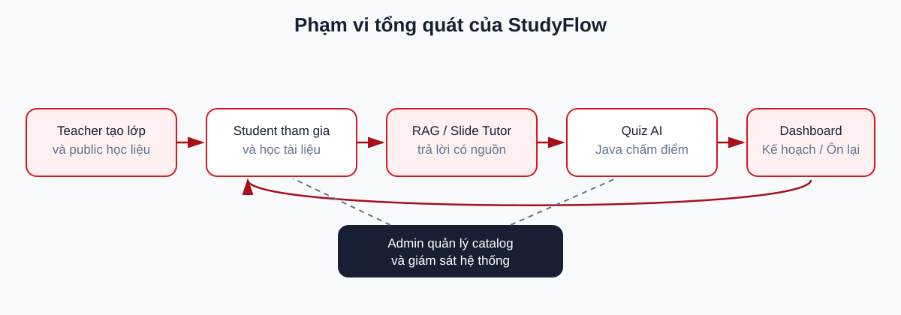

# CHƯƠNG 1. TỔNG QUAN ĐỀ TÀI

## 1.1. Đặt vấn đề

Sinh viên thường sử dụng nhiều công cụ rời rạc để xem học liệu, ghi chú, quản lý lịch học, ôn tập và hỏi đáp kiến thức. Tài liệu nằm ở nhiều định dạng và nguồn khác nhau khiến việc tìm lại nội dung, xác định trang hoặc slide liên quan và theo dõi quá trình tự học mất nhiều thời gian. Các mô hình ngôn ngữ có thể hỗ trợ giải thích và tạo câu hỏi, nhưng nếu không giới hạn nguồn và kiểm tra citation thì câu trả lời có nguy cơ thiếu căn cứ.

Từ thực tế đó, đề tài xây dựng StudyFlow — nền tảng web thống nhất hoạt động học tập theo lớp học phần và tài liệu cá nhân, đồng thời tích hợp AI theo hướng có bằng chứng. Hệ thống không giao cho AI quyền quyết định kết quả học tập; các luật phân quyền, chấm điểm, tiến độ và kế hoạch vẫn do backend thực hiện bằng quy tắc có thể kiểm thử.

## 1.2. Tên và định hướng đề tài

**Tên đề tài:** Xây dựng hệ thống hỗ trợ học tập và ôn luyện ứng dụng Trí tuệ Nhân tạo.

Luồng tổng quát của hệ thống:

```text
Tài liệu → Xem/Ghi chú/Phiên học → AI Tutor/Quiz → Đánh giá
         → Dashboard/Study Plan/Nội dung cần ôn → Làm lại
```

StudyFlow tổ chức môn học theo `Semester → Course Offering → Documents`. Teacher tự tạo Course Offering từ danh mục Subject và Semester, quản lý join code, duyệt Student và public học liệu. Student sử dụng PPTX của lớp, PDF tải xuống và Personal PDF cho chatbot hoặc Quiz. Admin quản lý danh mục, tài khoản và giám sát hệ thống.



*Hình 1.1. Phạm vi và vòng lặp học tập tổng quát của StudyFlow.*

## 1.3. Mục tiêu đề tài

### 1.3.1. Mục tiêu tổng quát

Xây dựng nền tảng web hỗ trợ sinh viên quản lý hoạt động tự học, khai thác học liệu và ôn tập bằng AI trên một hệ thống thống nhất, bảo đảm câu trả lời và câu hỏi sinh ra bám đúng nguồn được cấp quyền.

### 1.3.2. Mục tiêu cụ thể

- Quản lý tài khoản và phân quyền Student, Teacher, Admin.
- Tổ chức Course Offering theo Subject và Semester, hỗ trợ join code và duyệt enrollment.
- Quản lý học liệu PDF/PPTX của Teacher và Personal PDF của Student.
- Xây dựng Personal RAG trả lời có citation theo trang và `NO_EVIDENCE` khi thiếu căn cứ.
- Xây dựng Slide AI Tutor trong Slide Viewer, trả citation theo slide.
- Sinh Quiz `MCQ_SINGLE` từ Personal Documents và prompt tự do; Student review trước khi làm.
- Chấm điểm bằng Java, lưu attempt, tổng hợp câu sai về nguồn cần ôn lại.
- Dashboard hiển thị tiến độ, Study Streak và Daily Goal; Kế hoạch & Lịch hiển thị task/deadline theo lịch tuần riêng.
- Đánh giá retrieval, groundedness, citation, refusal và tính hợp lệ của Quiz bằng dữ liệu tổng hợp.

## 1.4. Đối tượng sử dụng

- **Student:** tham gia lớp, sử dụng học liệu, ghi chú slide, hỏi AI, quản lý Personal Documents, tạo/làm Quiz, xem Dashboard và lập kế hoạch.
- **Teacher:** tạo Course Offering, quản lý join code/enrollment, upload và public PDF/PPTX của lớp.
- **Admin:** quản lý user, Subject, Semester, giám sát Course Offering, feedback, audit và cấu hình.

## 1.5. Phạm vi đề tài

### 1.5.1. Trong phạm vi MVP

- Web responsive cho ba vai trò.
- Teacher PPTX: xem web, Note cá nhân và Slide Tutor đối với Student được duyệt.
- Teacher PDF: chỉ tải xuống; không Viewer, Note, Tutor hoặc AI indexing.
- Personal Document: chỉ PDF có text layer.
- Personal RAG, Slide Tutor và Quiz AI có citation trong authorized scope.
- Quiz đúng bốn phương án, một đáp án; Java quản lý lifecycle và chấm điểm.
- Dashboard chứa toàn bộ tiến độ tổng quan và theo từng Course Offering.
- Study Plan, Calendar, Study Streak và Daily Goal theo quy tắc xác định.

### 1.5.2. Ngoài phạm vi MVP

DOCX, OCR cho PDF scan, Topic Mastery, Teacher Quiz, Exam/Mock Exam, recommendation tự động, AI điều phối kế hoạch, XP, badge, level, achievement, leaderboard và mô hình multi-agent tự điều phối không thuộc MVP.

## 1.6. Phương pháp thực hiện

Đề tài được thực hiện theo các bước: khảo sát nghiệp vụ; đặc tả yêu cầu và use case; thiết kế kiến trúc, dữ liệu và API; xây dựng Frontend, Java Backend và Python AI Service theo contract; kiểm thử từng service và luồng end-to-end; đánh giá riêng chất lượng RAG/Tutor/Quiz; cuối cùng hoàn thiện demo và báo cáo.

Kiến trúc tách trách nhiệm nhằm giảm phụ thuộc ngôn ngữ: Java sở hữu nghiệp vụ và dữ liệu ứng dụng, Python sở hữu pipeline AI, còn Next.js chỉ giao tiếp với Java. Dữ liệu kiểm thử AI là dữ liệu tổng hợp hoặc được phép sử dụng; không đưa tài liệu cá nhân thật vào test.

## 1.7. Ý nghĩa của đề tài

Về thực tiễn, hệ thống giảm việc chuyển đổi giữa nhiều công cụ và giúp sinh viên truy ngược câu trả lời/câu hỏi về đúng trang hoặc slide. Về kỹ thuật, đề tài minh họa cách tích hợp RAG và sinh nội dung có kiểm soát vào hệ thống nghiệp vụ, trong đó authorization, lifecycle, scoring và audit không phụ thuộc vào quyết định tự do của LLM.

## 1.8. Bố cục báo cáo

- Chương 1 trình bày bài toán, mục tiêu, phạm vi và phương pháp thực hiện.
- Chương 2 phân tích yêu cầu, use case, luồng nghiệp vụ và thiết kế hệ thống.
- Chương 3 trình bày thiết kế chi tiết ba chức năng trọng tâm, cấu trúc triển khai và phương pháp kiểm thử/đánh giá.
- Các chương tiếp theo, khi được xây dựng, trình bày kết quả thực nghiệm, triển khai, kết luận và hướng phát triển.

## 1.9. Tổng kết chương

Chương 1 đã xác định StudyFlow là nền tảng hỗ trợ tự học và ôn luyện có AI nhưng lấy backend và bằng chứng nguồn làm nền tảng kiểm soát. Phạm vi MVP tập trung vào Course Offering, học liệu, Personal RAG, Slide Tutor, Quiz, Dashboard và kế hoạch học; các chức năng suy luận năng lực hoặc gamification được để ngoài phạm vi.
