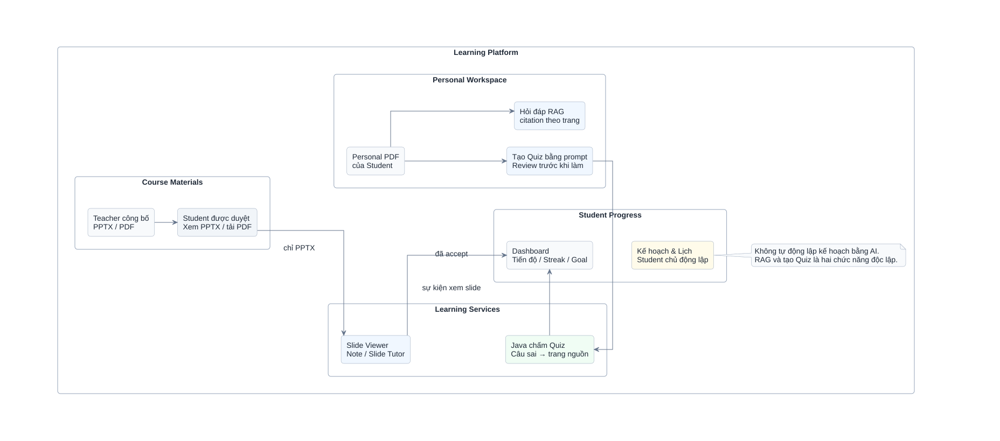

# CHƯƠNG 1. TỔNG QUAN ĐỀ TÀI

## 1.1. Đặt vấn đề

Sinh viên thường sử dụng nhiều công cụ rời rạc để xem học liệu, ghi chú, quản lý lịch học, ôn tập và hỏi đáp kiến thức. Tài liệu nằm ở nhiều nguồn khác nhau khiến việc tìm lại nội dung, xác định trang liên quan và theo dõi quá trình tự học mất nhiều thời gian. Các mô hình ngôn ngữ có thể hỗ trợ giải thích và tạo câu hỏi, nhưng nếu không giới hạn nguồn và kiểm tra citation thì câu trả lời có nguy cơ thiếu căn cứ.

Từ thực tế đó, đề tài xây dựng StudyFlow — nền tảng web thống nhất hoạt động học tập theo lớp học phần và tài liệu cá nhân, đồng thời tích hợp AI theo hướng có bằng chứng. Hệ thống không giao cho AI quyền quyết định kết quả học tập; các luật phân quyền, chấm điểm, tiến độ và kế hoạch vẫn do backend thực hiện bằng quy tắc có thể kiểm thử.

## 1.2. Tên và định hướng đề tài

**Tên đề tài:** Xây dựng hệ thống hỗ trợ học tập và ôn luyện ứng dụng Trí tuệ Nhân tạo.

Hình 1.1 phân biệt hai nguồn học liệu và những hoạt động chính trong phạm vi MVP.

*Hình 1.1. Phạm vi chức năng và các nhánh học tập của StudyFlow.*

Hình cho thấy Course Material PDF và Personal PDF đi theo hai nhánh quyền riêng. Student Tutor chỉ dùng PDF lớp đã công bố; Personal Document Assistant dùng một Agent cho hỏi đáp, tóm tắt và tạo Quiz. Java ghi nhận sự kiện học tập và chấm Quiz, còn sinh viên chủ động quản lý Kế hoạch & Lịch. Đây là sơ đồ phạm vi nghiệp vụ, không phải trình tự API hoặc minh chứng implementation đã hoàn thành.

StudyFlow tổ chức môn học theo `Semester → Course Offering → Documents`. Teacher tự tạo Course Offering, quản lý join code, duyệt Student, public Course Material PDF và sinh Quiz AI. Student đọc PDF của lớp, ghi chú/hỏi Tutor theo trang; trang Tài liệu cá nhân đồng thời cho phép quản lý Personal PDF, hỏi đáp, tóm tắt và tạo Quiz. Admin quản lý danh mục, tài khoản và giám sát hệ thống.

Quy trình học tập và ôn luyện phân định rõ hai nhánh: học liệu chính thức do Giảng viên công bố cho lớp học phần và tài liệu cá nhân PDF do Sinh viên tự tải lên. Ngay trong trang Tài liệu cá nhân, Sinh viên có thể hỏi đáp, yêu cầu tóm tắt hoặc tạo Quiz bằng ngôn ngữ tự nhiên; Single Agent nhận diện ý định và gọi đúng tool, không bắt buộc phải hỏi đáp trước khi tạo Quiz. Backend kiểm soát quyền truy cập, vòng đời Quiz, chấm điểm và các sự kiện học tập thực tế, giúp sinh viên chủ động lập kế hoạch và ôn luyện phần kiến thức còn thiếu.

## 1.3. Mục tiêu đề tài

### 1.3.1. Mục tiêu tổng quát

Xây dựng nền tảng web hỗ trợ sinh viên quản lý hoạt động tự học, khai thác học liệu và ôn tập bằng AI trên một hệ thống thống nhất, bảo đảm câu trả lời và câu hỏi sinh ra bám đúng nguồn được cấp quyền.

### 1.3.2. Mục tiêu cụ thể

- Quản lý tài khoản và phân quyền Student, Teacher, Admin.
- Tổ chức Course Offering theo Subject và Semester, hỗ trợ join code và duyệt enrollment.
- Quản lý Course Material PDF của Teacher và Personal PDF của Student.
- Xây dựng Personal Document Assistant bằng Single Agent cho hỏi đáp, tóm tắt và tạo Quiz có citation theo trang.
- Xây dựng Course Material AI Tutor trong PDF Viewer cho Student, trả citation theo trang.
- Sinh Quiz `MCQ_SINGLE` cho Student từ Personal PDF và cho Teacher từ Course Material PDF; người sở hữu review trước khi dùng hoặc public.
- Chấm điểm bằng Java, lưu attempt, tổng hợp câu sai về nguồn cần ôn lại.
- Dashboard hiển thị tiến độ, Study Streak và Daily Goal; Kế hoạch & Lịch hiển thị task/deadline theo lịch tuần riêng.
- Đánh giá retrieval, groundedness, citation, refusal và tính hợp lệ của Quiz bằng dữ liệu tổng hợp.

## 1.4. Đối tượng sử dụng

- **Student:** tham gia lớp, xem Course Material PDF, ghi chú và hỏi Tutor theo trang; quản lý Personal PDF, hỏi đáp, tóm tắt và tạo Quiz trên cùng trang; làm Quiz, xem Dashboard và lập kế hoạch.
- **Teacher:** tạo Course Offering, quản lý join code/enrollment, upload/public Course Material PDF và tạo/review/publish Quiz AI.
- **Admin:** quản lý user, Subject, Semester, giám sát Course Offering, feedback, audit và cấu hình.

## 1.5. Phạm vi đề tài

### 1.5.1. Trong phạm vi MVP

- Web responsive cho ba vai trò.
- Course Material PDF: Student được duyệt xem web, lưu Note và dùng AI Tutor; Teacher không có Tutor.
- Course Material PDF: được index theo trang; Student có enrollment `APPROVED` được Viewer, lưu Page Note và dùng Tutor sau khi Teacher public.
- Personal Document: chỉ PDF có text layer.
- Personal Assistant, Course Material Tutor và Quiz AI có citation trang trong authorized scope.
- Quiz đúng bốn phương án, một đáp án; Java quản lý lifecycle và chấm điểm.
- Dashboard chứa toàn bộ tiến độ tổng quan và theo từng Course Offering.
- Study Plan, Calendar, Study Streak và Daily Goal theo quy tắc xác định.

### 1.5.2. Ngoài phạm vi MVP

PPTX/DOCX, OCR cho PDF scan, Topic Mastery, Teacher chatbot/Tutor, Exam/Mock Exam, recommendation tự động, AI điều phối kế hoạch, XP, badge, level, achievement, leaderboard và mô hình multi-agent không thuộc MVP.

## 1.6. Phương pháp thực hiện

Đề tài được thực hiện theo các bước: khảo sát nghiệp vụ; đặc tả yêu cầu và use case; thiết kế kiến trúc, dữ liệu và API; xây dựng Frontend, Java Backend và Python AI Service theo contract; kiểm thử từng service và luồng end-to-end; đánh giá riêng chất lượng RAG/Tutor/Quiz; cuối cùng hoàn thiện demo và báo cáo.

Kiến trúc tách trách nhiệm nhằm giảm phụ thuộc ngôn ngữ: Java sở hữu nghiệp vụ và dữ liệu ứng dụng, Python sở hữu pipeline AI, còn Next.js chỉ giao tiếp với Java. Dữ liệu kiểm thử AI là dữ liệu tổng hợp hoặc được phép sử dụng; không đưa tài liệu cá nhân thật vào test.

## 1.7. Ý nghĩa của đề tài

Về thực tiễn, hệ thống giảm việc chuyển đổi giữa nhiều công cụ và giúp sinh viên truy ngược câu trả lời/câu hỏi về đúng trang PDF. Về kỹ thuật, đề tài minh họa cách tích hợp RAG và sinh nội dung có kiểm soát vào hệ thống nghiệp vụ, trong đó authorization, lifecycle, scoring và audit không phụ thuộc vào quyết định tự do của LLM.

## 1.8. Bố cục báo cáo

- Chương 1 trình bày bài toán, mục tiêu, phạm vi và phương pháp thực hiện.
- Chương 2 trình bày pha phân tích hệ thống: phân tích yêu cầu, form 9 chức năng của 3 thành viên, hệ thống biểu đồ Use Case và kịch bản Use Case chi tiết.
- Chương 3 trình bày pha thiết kế hệ thống: kiến trúc sơ đồ khối tổng thể, lớp thực thể chung, thiết kế CSDL ERD, biểu đồ lớp chi tiết và biểu đồ hoạt động/tuần tự cho các chức năng đã chọn.
- Các chương tiếp theo trình bày kết quả cài đặt thực nghiệm, kiểm thử đánh giá, kết luận và hướng phát triển.

## 1.9. Tổng kết chương

Chương 1 đã xác định StudyFlow là nền tảng hỗ trợ tự học và ôn luyện có AI nhưng lấy backend và bằng chứng nguồn làm nền tảng kiểm soát. Phạm vi MVP tập trung vào Course Offering, PDF, Personal Document Assistant, Course Material Tutor, Student/Teacher Quiz, Dashboard và kế hoạch học; các chức năng suy luận năng lực hoặc gamification được để ngoài phạm vi.
