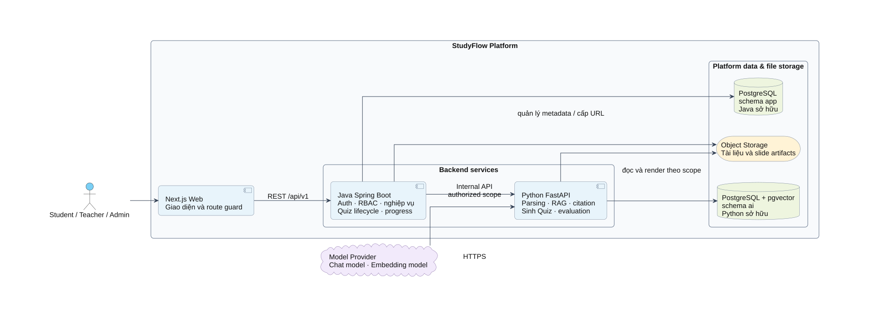
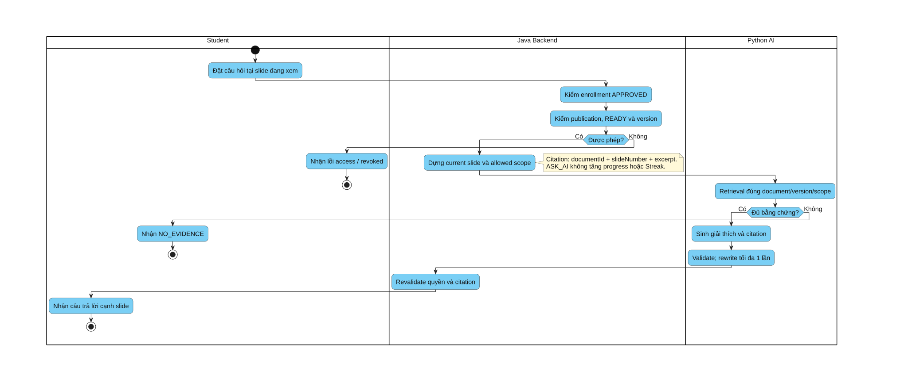
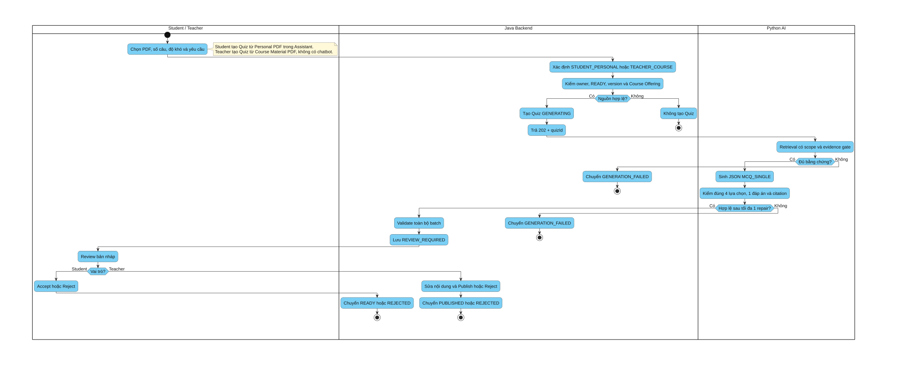
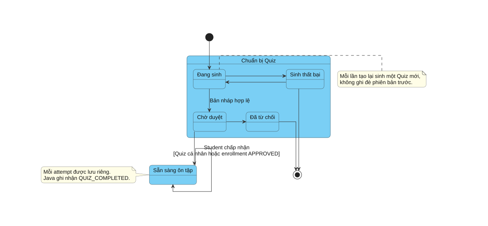

# BÁO CÁO THÀNH VIÊN PHỤ TRÁCH AI — CHƯƠNG 2 VÀ CHƯƠNG 3

**Đề tài:** Xây dựng hệ thống hỗ trợ học tập và ôn luyện ứng dụng Trí tuệ Nhân tạo — StudyFlow.

**Phạm vi báo cáo cá nhân:** thành viên AI phụ trách ba chức năng:

1. AI-F01 / UC-RAG-01 — Hỏi đáp và tóm tắt tài liệu cá nhân.
2. AI-F02 / UC-TUTOR-01 — Hỏi đáp nội dung tài liệu bài giảng.
3. AI-F03 / UC-QUIZ-01 — Sinh bộ câu hỏi trắc nghiệm cho Sinh viên và Giảng viên.

Ba chức năng trên chỉ làm việc với tài liệu PDF có thể đọc được chữ. Báo cáo này trình bày bằng ngôn ngữ nghiệp vụ để người đọc không học công nghệ thông tin vẫn có thể hiểu mục đích, cách sử dụng và kết quả của từng chức năng.

File này không thay thế [Chương 2 toàn hệ thống](chuong-2-phan-tich-va-thiet-ke-he-thong.md) và [Chương 3 toàn hệ thống](chuong-3-thiet-ke-chi-tiet-va-cai-dat.md).

---

# CHƯƠNG 2. PHÂN TÍCH CÁC CHỨC NĂNG AI

## 2.1. Mô tả bài toán

Sinh viên thường phải đọc nhiều trang tài liệu để tìm câu trả lời, tóm tắt nội dung và tự xây dựng câu hỏi ôn tập. Khi học tài liệu do Giảng viên cung cấp, Sinh viên cũng cần được giải thích đúng theo nội dung môn học thay vì nhận câu trả lời chung chung trên Internet. Giảng viên lại mất nhiều thời gian để soạn câu hỏi trắc nghiệm sau mỗi buổi học.

StudyFlow hỗ trợ ba nhu cầu này bằng cách dùng nội dung trong các file PDF đã được phép sử dụng. Mỗi câu trả lời hoặc câu hỏi được tạo ra đều chỉ rõ tài liệu và số trang làm căn cứ. Nếu tài liệu không đủ thông tin, hệ thống thông báo không tìm thấy căn cứ thay vì tự suy đoán.

## 2.2. Mục tiêu và nguyên tắc chung

- Giúp Sinh viên hỏi đáp và tóm tắt tài liệu cá nhân ngay tại trang Tài liệu cá nhân.
- Giúp Sinh viên hỏi nội dung bài giảng ngay bên cạnh trang PDF đang xem.
- Giúp Sinh viên và Giảng viên tạo bộ câu hỏi trắc nghiệm từ tài liệu được phép sử dụng.
- Mỗi câu trả lời và mỗi câu hỏi đều có nguồn tài liệu, số trang và đoạn nội dung liên quan.
- Mỗi câu trắc nghiệm có đúng bốn phương án và chỉ một đáp án đúng.
- AI chỉ tạo nội dung đề xuất. Hệ thống chính kiểm tra quyền sử dụng, lưu dữ liệu, chấm điểm và ghi nhận kết quả học tập.
- Không dùng AI để tự đánh giá Sinh viên mạnh hay yếu, tự thay đổi tiến độ hoặc tự lập kế hoạch học tập.

## 2.3. Ba chức năng trọng tâm

Phần này chỉ giới thiệu ngắn phạm vi đóng góp của thành viên AI. Cách người dùng thực hiện từng chức năng được trình bày riêng tại mục 2.4 để tránh lặp lại cùng một nội dung.

| Mã và tên chức năng | Người sử dụng | Mục tiêu | Kết quả chính |
|---|---|---|---|
| AI-F01 — Hỏi đáp và tóm tắt tài liệu cá nhân | Sinh viên | Giúp Sinh viên hiểu nhanh PDF do mình tải lên | Câu trả lời hoặc bản tóm tắt kèm trang nguồn |
| AI-F02 — Hỏi đáp nội dung tài liệu bài giảng | Sinh viên | Giải thích đúng nội dung PDF của lớp học phần | Lời giải thích kèm trang nguồn |
| AI-F03 — Sinh bộ câu hỏi trắc nghiệm | Sinh viên và Giảng viên | Hỗ trợ tạo câu hỏi ôn tập từ PDF | Bản nháp bộ câu hỏi để người dùng xem lại |

Thành viên AI phụ trách đọc nội dung PDF, tìm phần liên quan, tạo nội dung và chỉ rõ trang nguồn. Việc kiểm tra tài khoản, quản lý lớp, duyệt bộ câu hỏi, chấm điểm và lưu kết quả thuộc trách nhiệm của hệ thống chính.

## 2.4. Đặc tả các ca sử dụng chính

### 2.4.1. UC-RAG-01 — Hỏi đáp và tóm tắt tài liệu cá nhân

| Nội dung | Mô tả |
|---|---|
| **Tác nhân** | Sinh viên |
| **Mục tiêu** | Tìm câu trả lời hoặc tạo bản tóm tắt từ PDF cá nhân mà không phải đọc lại toàn bộ tài liệu. |
| **Tiền điều kiện** | Sinh viên đã đăng nhập; tài liệu thuộc chính Sinh viên; PDF có thể đọc được chữ và đã được hệ thống xử lý xong. |
| **Điều kiện bắt đầu** | Sinh viên chọn tài liệu, mở khu vực hỏi đáp và gửi câu hỏi hoặc yêu cầu tóm tắt. |
| **Luồng chính** | 1. Hệ thống kiểm tra tài liệu có thuộc Sinh viên hay không. 2. Hệ thống tìm các trang liên quan trong đúng tài liệu đã chọn. 3. AI tạo câu trả lời hoặc bản tóm tắt từ nội dung tìm được. 4. Hệ thống kiểm tra lại tên tài liệu, số trang và đoạn nguồn. 5. Kết quả được hiển thị để Sinh viên xem và mở trang nguồn đối chiếu. |
| **Luồng thay thế** | **A1 — Tóm tắt tài liệu, thay cho bước 2–3:** Sinh viên yêu cầu tóm tắt thay vì đặt câu hỏi. Hệ thống đọc toàn bộ phạm vi đã chọn, tạo bản tóm tắt rồi tiếp tục bước 4–5. **A2 — Dùng nhiều tài liệu, bổ sung tại bước 2:** Hệ thống tìm trong tất cả tài liệu được chọn và giữ riêng nguồn của từng nội dung trước khi tiếp tục bước 3. **A3 — Yêu cầu chưa rõ, phát sinh trước bước 2:** Hệ thống đề nghị Sinh viên nói rõ muốn hỏi hay tóm tắt, đồng thời bổ sung phạm vi nếu cần. Sau khi Sinh viên bổ sung, luồng quay lại bước 2. **A4 — Không đủ căn cứ, phát sinh tại bước 2:** Hệ thống không tạo câu trả lời, chuyển thẳng đến bước 5 và hiển thị thông báo không tìm thấy căn cứ. |
| **Ngoại lệ** | Tài liệu không thuộc Sinh viên; tài liệu chưa xử lý xong; PDF không đọc được chữ; yêu cầu không có căn cứ trong tài liệu. Trong các trường hợp này, hệ thống thông báo lý do và không tạo câu trả lời thiếu kiểm chứng. |
| **Hậu điều kiện** | Sinh viên nhận được câu trả lời hoặc bản tóm tắt có trang nguồn, hoặc nhận thông báo không tìm thấy căn cứ. Kết quả không tự thay đổi điểm số, tiến độ hay kế hoạch học tập. |
| **Quy tắc nghiệp vụ** | Chỉ dùng tài liệu Sinh viên đã chọn; không dùng tài liệu của người khác; không bổ sung kiến thức không có trong tài liệu; chỉ nhận PDF có thể đọc được chữ. |

**Tiêu chí nghiệm thu:**

- Câu trả lời đúng trọng tâm và bản tóm tắt bao quát đúng phạm vi được chọn.
- Nguồn mở đúng tài liệu, đúng trang và đúng đoạn liên quan.
- Không xuất hiện nội dung từ tài liệu của Sinh viên khác.
- Câu hỏi ngoài nội dung tài liệu nhận thông báo không tìm thấy căn cứ.

### 2.4.2. UC-TUTOR-01 — Hỏi đáp nội dung tài liệu bài giảng

| Nội dung | Mô tả |
|---|---|
| **Tác nhân** | Sinh viên |
| **Mục tiêu** | Giải thích nội dung bài giảng theo đúng PDF của lớp học phần ngay trong lúc Sinh viên đang đọc tài liệu. |
| **Tiền điều kiện** | Sinh viên đã được chấp nhận vào lớp học phần; Giảng viên đã công bố tài liệu; tài liệu chưa bị thu hồi và đã được hệ thống xử lý xong. |
| **Điều kiện bắt đầu** | Sinh viên mở PDF bài giảng và gửi câu hỏi tại khu vực hỏi đáp bên cạnh tài liệu. |
| **Luồng chính** | 1. Hệ thống kiểm tra Sinh viên còn quyền xem tài liệu. 2. Hệ thống ưu tiên tìm thông tin ở trang đang mở. 3. Khi cần, hệ thống tìm thêm các trang liên quan trong cùng tài liệu. 4. AI tạo lời giải thích từ nội dung tìm được. 5. Hệ thống kiểm tra lại tài liệu và số trang nguồn. 6. Câu trả lời được hiển thị bên cạnh PDF để Sinh viên đối chiếu. |
| **Luồng thay thế** | **A1 — Trang hiện tại chưa đủ thông tin, phát sinh tại bước 2:** Hệ thống tìm thêm các trang liên quan trong cùng tài liệu rồi tiếp tục bước 4; kết quả phải chỉ rõ từng trang đã sử dụng. **A2 — Câu hỏi chưa rõ, phát sinh trước bước 2:** Hệ thống đề nghị Sinh viên bổ sung nội dung cần giải thích. Sau khi bổ sung, luồng quay lại bước 2. **A3 — Không đủ căn cứ, phát sinh tại bước 3:** Hệ thống bỏ qua bước 4–5, chuyển đến bước 6 và hiển thị thông báo không tìm thấy căn cứ. |
| **Ngoại lệ** | Sinh viên chưa được chấp nhận vào lớp; quyền tham gia lớp đã bị hủy; tài liệu chưa công bố, đã bị thu hồi hoặc không có căn cứ phù hợp. Hệ thống dừng xử lý và thông báo rõ lý do. |
| **Hậu điều kiện** | Sinh viên nhận được lời giải thích có trang nguồn hoặc thông báo không tìm thấy căn cứ. Việc đặt câu hỏi không tự làm tăng tiến độ học tập. |
| **Quy tắc nghiệp vụ** | Không tìm sang lớp hoặc tài liệu khác; việc thu hồi tài liệu có hiệu lực ngay; Giảng viên không sử dụng chức năng hỏi đáp này. |

**Tiêu chí nghiệm thu:**

- Không để lộ tài liệu của lớp học phần khác.
- Câu trả lời bám đúng nội dung bài giảng và chỉ đúng trang nguồn.
- Câu hỏi ngoài tài liệu nhận thông báo không tìm thấy căn cứ.
- Sinh viên mất quyền hoặc tài liệu bị thu hồi không thể tiếp tục hỏi.

### 2.4.3. UC-QUIZ-01 — Sinh bộ câu hỏi trắc nghiệm

| Nội dung | Mô tả |
|---|---|
| **Tác nhân** | Sinh viên và Giảng viên |
| **Mục tiêu** | Giúp Sinh viên tạo bộ câu hỏi tự ôn tập và giúp Giảng viên tạo bộ câu hỏi sau buổi học từ tài liệu PDF. |
| **Tiền điều kiện** | Người dùng đã đăng nhập và tài liệu đã được xử lý xong. PDF cá nhân phải thuộc Sinh viên; PDF bài giảng phải thuộc lớp học phần do Giảng viên quản lý. |
| **Điều kiện bắt đầu** | Người dùng chọn tài liệu, nhập số câu, mức độ, chủ đề, phạm vi trang nếu cần và yêu cầu tạo bộ câu hỏi. |
| **Luồng chính** | 1. Hệ thống kiểm tra quyền sử dụng tài liệu. 2. Hệ thống tìm nội dung phù hợp trong phạm vi được chọn. 3. AI tạo bản nháp bộ câu hỏi. 4. Hệ thống kiểm tra mỗi câu có đủ bốn phương án, một đáp án đúng, lời giải thích và trang nguồn. 5. Sinh viên xem lại để chấp nhận trước khi ôn; Giảng viên xem lại và có thể chỉnh sửa trước khi công bố. 6. Khi người học làm bài, hệ thống chính chấm điểm và lưu kết quả. |
| **Luồng thay thế** | **A1 — Sinh viên tạo câu hỏi trong Tài liệu cá nhân, thay cho màn hình tạo riêng:** Hệ thống tiếp nhận yêu cầu tại khu vực tài liệu, xác nhận lại số câu, mức độ và phạm vi rồi bắt đầu bước 1. **A2 — Sinh viên dùng biểu mẫu riêng:** Sinh viên điền các lựa chọn trên biểu mẫu rồi bắt đầu bước 1. **A3 — Giảng viên tạo câu hỏi cho lớp:** Giảng viên chọn PDF của lớp học phần; sau bước 4, Giảng viên được chỉnh sửa bản nháp trước khi duyệt và công bố. **A4 — Người dùng từ chối bản nháp, phát sinh tại bước 5:** Bộ hiện tại được giữ trong lịch sử ở trạng thái bị từ chối. Nếu người dùng yêu cầu tạo lại, hệ thống tạo một bộ mới và quay về bước 1. **A5 — Yêu cầu chưa đủ thông tin, phát sinh trước bước 1:** Hệ thống đề nghị bổ sung số câu, mức độ, chủ đề hoặc phạm vi trang rồi mới tiếp tục. |
| **Ngoại lệ** | Tài liệu không được phép sử dụng; nội dung không đủ để tạo câu hỏi; kết quả thiếu phương án, có nhiều đáp án đúng hoặc không có trang nguồn. Hệ thống không cho chấp nhận hoặc công bố bản nháp chưa hợp lệ. |
| **Hậu điều kiện** | Một bản nháp mới được lưu để người dùng xem lại. Bộ câu hỏi của Sinh viên chỉ sẵn sàng sau khi Sinh viên chấp nhận; bộ câu hỏi của lớp chỉ được công bố sau khi Giảng viên duyệt. |
| **Quy tắc nghiệp vụ** | Mỗi câu có đúng bốn phương án và một đáp án đúng; AI không tự công bố, không chấm điểm; mỗi lần tạo lại sinh một bộ mới và không ghi đè bộ cũ; Giảng viên không cần khu vực trò chuyện cá nhân để tạo câu hỏi. |

**Tiêu chí nghiệm thu:**

- Bộ câu hỏi đúng số lượng, mức độ, chủ đề và phạm vi trang đã chọn.
- Mỗi câu có đúng bốn phương án, một đáp án đúng, lời giải thích và trang nguồn.
- Sinh viên phải chấp nhận trước khi ôn; Giảng viên phải duyệt trước khi công bố.
- Hệ thống từ chối kết quả thiếu thông tin hoặc sai quy tắc.

## 2.5. So sánh ba chức năng

| Nội dung so sánh | Tài liệu cá nhân | Tài liệu bài giảng | Sinh câu hỏi trắc nghiệm |
|---|---|---|---|
| Người sử dụng | Sinh viên | Sinh viên | Sinh viên và Giảng viên |
| Nguồn tài liệu | PDF do Sinh viên tải lên | PDF do Giảng viên công bố | PDF cá nhân của Sinh viên hoặc PDF bài giảng của Giảng viên |
| Kết quả | Câu trả lời hoặc bản tóm tắt | Lời giải thích nội dung bài giảng | Bản nháp bộ câu hỏi |
| Cách kiểm tra | Tên tài liệu, số trang, đoạn nguồn | Tên tài liệu, số trang, đoạn nguồn | Nguồn của từng câu hỏi |
| Quyết định cuối cùng | Sinh viên tự sử dụng kết quả | Sinh viên tự sử dụng kết quả | Sinh viên chấp nhận để ôn; Giảng viên duyệt để công bố |

## 2.6. Tổng kết chương 2

Ba chức năng có mục đích khác nhau nhưng cùng tuân theo một nguyên tắc: chỉ sử dụng tài liệu đã được phép và luôn cho người dùng biết kết quả dựa trên trang nào. AI hỗ trợ đọc hiểu và tạo nội dung; hệ thống chính vẫn chịu trách nhiệm kiểm tra quyền, lưu dữ liệu, chấm điểm và ghi nhận hoạt động học tập.

---

# CHƯƠNG 3. THIẾT KẾ VÀ CÁCH THỰC HIỆN PHẦN AI

## 3.1. Vị trí của phần AI trong hệ thống

Hình sau cho thấy trang sử dụng gửi yêu cầu đến hệ thống chính. Sau khi kiểm tra tài khoản và quyền sử dụng tài liệu, hệ thống chính mới chuyển phần việc cần thiết sang dịch vụ AI. Kết quả quay lại hệ thống chính để được kiểm tra lần cuối trước khi hiển thị hoặc lưu.

*Hình 3.1. Vị trí của phần AI trong kiến trúc StudyFlow.*

Sơ đồ làm rõ rằng giao diện không gửi yêu cầu thẳng đến dịch vụ AI. Cách tổ chức này giúp giữ quyền truy cập tài liệu, thông tin người dùng, việc chấm điểm và kết quả học tập trong hệ thống chính.

## 3.2. Chuẩn bị tài liệu PDF

Trước khi người dùng có thể hỏi hoặc tạo câu hỏi, tài liệu trải qua các bước sau:

1. Kiểm tra file có đúng định dạng PDF và có thể đọc được chữ.
2. Đọc nội dung theo từng trang.
3. Chia nội dung dài thành các đoạn nhỏ nhưng vẫn giữ số trang.
4. Lưu thông tin cần thiết để có thể tìm lại đoạn phù hợp khi người dùng đặt câu hỏi.
5. Đánh dấu tài liệu đã sẵn sàng.

Nếu file bị khóa, chỉ gồm hình ảnh hoặc không đọc được chữ, hệ thống thông báo rõ nguyên nhân để người dùng đổi file. Trong phạm vi hiện tại, hệ thống không tự nhận dạng chữ từ ảnh.

## 3.3. Thiết kế chức năng hỏi đáp và tóm tắt tài liệu cá nhân

Sinh viên thao tác ngay trong trang Tài liệu cá nhân:

1. Tải PDF lên và chờ hệ thống xử lý.
2. Chọn một hoặc nhiều tài liệu.
3. Nhấn nút hỏi đáp tài liệu cá nhân.
4. Nhập câu hỏi hoặc yêu cầu tóm tắt.
5. Xem câu trả lời cùng nguồn theo trang.
6. Nhấn vào nguồn để đối chiếu với PDF.

Nếu yêu cầu chưa rõ, hệ thống đề nghị Sinh viên bổ sung thông tin. Nếu tài liệu không có nội dung phù hợp, hệ thống trả thông báo không tìm thấy căn cứ thay vì tạo câu trả lời thiếu kiểm chứng.

## 3.4. Thiết kế chức năng hỏi đáp tài liệu bài giảng

Hình sau mô tả toàn bộ quá trình từ lúc Sinh viên đặt câu hỏi đến khi nhận câu trả lời.

*Hình 3.2. Luồng hỏi đáp tài liệu bài giảng PDF.*

Điểm quan trọng của luồng là quyền sử dụng được kiểm tra trước và sau khi xử lý. Trang đang xem được ưu tiên để câu trả lời phù hợp với nội dung học hiện tại. Tuy nhiên, hệ thống vẫn có thể tìm thêm các trang liên quan trong cùng tài liệu nếu cần thiết.

## 3.5. Thiết kế chức năng sinh bộ câu hỏi trắc nghiệm

Hình sau thể hiện hai cách sử dụng chung một khả năng tạo câu hỏi: Sinh viên tạo bộ câu hỏi để tự ôn tập, còn Giảng viên tạo bộ câu hỏi cho lớp học phần.

*Hình 3.3. Luồng sinh bộ câu hỏi trắc nghiệm cho Sinh viên và Giảng viên.*

Với Sinh viên, yêu cầu có thể được nhập trong khu vực Tài liệu cá nhân hoặc tại biểu mẫu tạo câu hỏi. Bộ câu hỏi luôn ở trạng thái chờ xem lại; Sinh viên phải chấp nhận trước khi làm bài.

Với Giảng viên, yêu cầu được nhập tại màn hình tạo câu hỏi của lớp học phần. Giảng viên lựa chọn tài liệu, số câu, mức độ, chủ đề và phạm vi trang. Sau khi nhận bản nháp, Giảng viên có thể chỉnh sửa, từ chối hoặc công bố. Giảng viên không cần khu vực trò chuyện cá nhân và không dùng chức năng hỏi đáp tài liệu bài giảng.

### 3.5.1. Trạng thái của một bộ câu hỏi

Hình sau mô tả các trạng thái chính từ lúc bắt đầu tạo đến khi bộ câu hỏi sẵn sàng hoặc bị từ chối.

*Hình 3.4. Các trạng thái của một bộ câu hỏi trắc nghiệm.*

Mỗi lần yêu cầu tạo lại sẽ sinh một bộ câu hỏi mới để giữ lịch sử. Mỗi lần làm bài cũng được lưu riêng. AI không thay đổi trạng thái, không chấm điểm và không ghi nhận tiến độ; các việc này do hệ thống chính thực hiện theo quy tắc đã thống nhất.

## 3.6. Dữ liệu cần lưu và bảo vệ

Phần AI chỉ lưu những thông tin cần thiết để tìm đúng nội dung trong PDF và dẫn lại đúng trang. Tài liệu cá nhân phải gắn với chủ sở hữu. Tài liệu bài giảng phải gắn với đúng lớp học phần và trạng thái công bố.

Hệ thống không ghi toàn bộ nội dung tài liệu, câu hỏi riêng tư hoặc khóa truy cập vào nhật ký hoạt động. Khi tài liệu bị xóa, thay phiên bản hoặc thu hồi, dữ liệu hỗ trợ tìm kiếm liên quan cũng phải được ngừng sử dụng.

## 3.7. Thiết kế giao diện liên quan

Các khung giao diện được chốt trong [UI Design](../ui-design.md):

- Tài liệu cá nhân: danh sách PDF, nút hỏi đáp tài liệu cá nhân và khu vực hội thoại được mở ngay trong trang.
- Trang đọc bài giảng: PDF ở bên trái, ghi chú và khu vực hỏi đáp ở bên phải.
- Tạo câu hỏi cho Sinh viên: chọn nguồn, số câu, mức độ, chủ đề và trang.
- Tạo câu hỏi cho Giảng viên: chọn tài liệu của lớp, số câu tùy chọn, xem lại và công bố.

Khu vực AI phải hiển thị rõ trạng thái đang xử lý, không tìm thấy căn cứ, gặp lỗi và nguồn theo trang. Người dùng luôn có thể quay lại PDF để kiểm tra.

## 3.8. Kiểm thử và đánh giá

Việc đánh giá dùng tài liệu và câu hỏi mẫu do nhóm tự tạo, không dùng tài liệu cá nhân thật. Ba nhóm tiêu chí chính gồm:

1. **Đúng nội dung:** câu trả lời hoặc câu hỏi có phù hợp với nội dung PDF hay không.
2. **Đúng nguồn:** tên tài liệu, số trang và đoạn dẫn có thật sự chứa căn cứ hay không.
3. **Đúng quyền:** người dùng có chỉ nhận kết quả từ tài liệu mình được phép sử dụng hay không.

Đối với chức năng sinh câu hỏi, cần kiểm tra thêm số lượng câu, mức độ, đúng bốn phương án, chỉ một đáp án đúng, lời giải thích và nguồn của từng câu. Kết quả chỉ được xem là đạt khi vượt qua đầy đủ các điều kiện này.

Các trường hợp bắt buộc phải thử gồm:

- Câu hỏi có câu trả lời rõ trong tài liệu.
- Câu hỏi không có căn cứ trong tài liệu.
- Yêu cầu tóm tắt toàn bộ hoặc một phần tài liệu.
- Sinh viên cố sử dụng tài liệu của người khác.
- Sinh viên không còn quyền vào lớp học phần.
- Tài liệu bài giảng đã bị thu hồi.
- Yêu cầu tạo câu hỏi thiếu số lượng hoặc phạm vi chưa rõ.
- Bộ câu hỏi thiếu phương án, có nhiều đáp án đúng hoặc dẫn sai trang.

## 3.9. Đối chiếu từ yêu cầu đến kết quả

| Chức năng | Người sử dụng | Kết quả cần có | Cách kiểm tra |
|---|---|---|---|
| AI-F01 — Hỏi đáp và tóm tắt tài liệu cá nhân | Sinh viên | Câu trả lời hoặc bản tóm tắt | So sánh với nội dung và số trang PDF cá nhân |
| AI-F02 — Hỏi đáp tài liệu bài giảng | Sinh viên | Lời giải thích theo bài giảng | So sánh với PDF của đúng lớp học phần |
| AI-F03 — Sinh bộ câu hỏi trắc nghiệm | Sinh viên, Giảng viên | Bản nháp bộ câu hỏi có nguồn | Kiểm tra cấu trúc từng câu, đáp án và trang nguồn |

## 3.10. Tổng kết chương 3

Phần AI được thiết kế để hỗ trợ đọc hiểu và tạo câu hỏi từ PDF, không thay thế các quyết định nghiệp vụ của hệ thống chính. Ba chức năng dùng chung cách kiểm soát nguồn và quyền sử dụng nhưng có giao diện, người dùng và kết quả khác nhau. Cách tách này giúp báo cáo phản ánh rõ đóng góp của thành viên AI, đồng thời tránh nhầm lẫn giữa việc tạo nội dung bằng AI với việc quản lý lớp, chấm điểm và theo dõi tiến độ.
