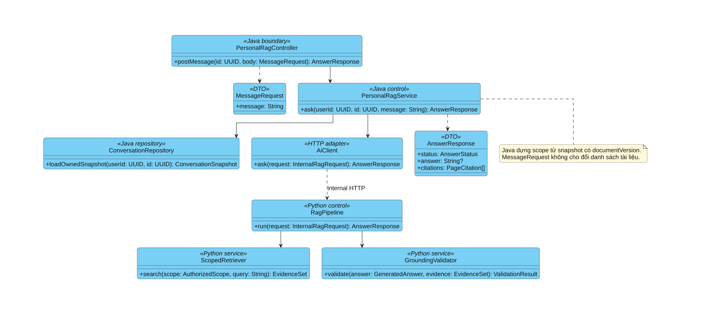
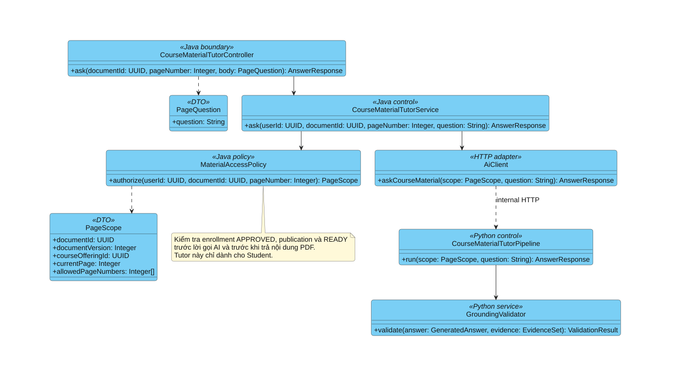

# BÁO CÁO THÀNH VIÊN PHỤ TRÁCH AI — CHƯƠNG 2 VÀ CHƯƠNG 3

**Đề tài:** Xây dựng hệ thống hỗ trợ học tập và ôn luyện ứng dụng Trí tuệ Nhân tạo — StudyFlow.

**Phạm vi báo cáo cá nhân:** hai chức năng trọng tâm: (1) Hỏi đáp tài liệu cá nhân, tích hợp tóm tắt và nhánh sinh/duyệt Quiz; (2) Hỏi đáp Course Material PDF. File này không thay thế [Chương 2 toàn hệ thống](chuong-2-phan-tich-va-thiet-ke-he-thong.md) và [Chương 3 toàn hệ thống](chuong-3-thiet-ke-chi-tiet-va-cai-dat.md).

**Quy ước mã:** giữ `UC-RAG-01 / AI-F01` cho tài liệu cá nhân, `UC-TUTOR-01 / AI-F02` cho Tutor và `UC-QUIZ-01 / AI-F03` cho nhánh Quiz. Việc gộp là cách tổ chức báo cáo cá nhân, không đổi mã Use Case hoặc xóa chức năng Quiz khỏi hệ thống. AI-F03 không được tính thành chức năng chính thứ ba trong báo cáo này.

**Trạng thái nội dung:** phân tích và thiết kế mục tiêu. Không khẳng định AI đã triển khai hoàn chỉnh hoặc đạt chất lượng thực nghiệm. Các phần nghiệp vụ Java được trình bày để làm rõ tích hợp, không nhận là đóng góp cài đặt riêng của thành viên AI.

**Nguồn đối chiếu:** [Kế hoạch AI](../ai-implementation-plan.md), [API contract](../api-plan.md), [kiến trúc](../architecture.md), [CSDL](../database-plan.md), [UI Design](../ui-design.md). Những thay đổi nghiệp vụ sau này phải đồng bộ với các tài liệu này.

---

# CHƯƠNG 2. PHÂN TÍCH PHÂN HỆ HỖ TRỢ HỌC TẬP BẰNG AI

## 2.1. Bài toán và phạm vi giải quyết

### 2.1.1. Mô tả bài toán

Trong quá trình tự học, sinh viên thường phải đọc nhiều trang tài liệu để tìm một khái niệm, đối chiếu nội dung và tự xây dựng câu hỏi ôn tập. Chatbot trả lời bằng kiến thức tổng quát có thể cung cấp thông tin không xuất hiện trong tài liệu đang học; câu trả lời đúng về mặt kiến thức vẫn có thể không phù hợp với phạm vi môn học hoặc không thể kiểm chứng nguồn.

StudyFlow giải quyết vấn đề bằng cách gắn các tác vụ AI với tài liệu PDF được cấp quyền. Sinh viên sử dụng một không gian tài liệu cá nhân để hỏi đáp, tóm tắt và yêu cầu tạo Quiz. Trong quá trình học trên lớp, sinh viên sử dụng Tutor ngay cạnh trang Course Material PDF đang xem. Hai luồng dùng chung các kỹ thuật xử lý tài liệu và kiểm chứng trích dẫn nhưng khác nhau về ngữ cảnh và điều kiện truy cập.

### 2.1.2. Mục tiêu

- Trả lời và giải thích dựa trên bằng chứng trong PDF; cho phép người học kiểm tra lại trang nguồn.
- Tóm tắt đúng phạm vi tài liệu được chọn, không chỉ những đoạn có độ tương đồng cao với một câu hỏi.
- Cho phép yêu cầu sinh Quiz ngay trong hội thoại cá nhân, sau đó chuyển sang bước duyệt trước khi ôn tập.
- Hỗ trợ hỏi đáp học liệu lớp theo trang hiện tại với điều kiện enrollment và publication hợp lệ.
- Cô lập nguồn theo người dùng, tài liệu, phiên bản và phạm vi trang; từ chối khi thiếu căn cứ.

### 2.1.3. Hai chức năng trọng tâm và ranh giới đóng góp

| Chức năng chính trong báo cáo | Mã giữ nguyên | Nội dung bao gồm |
|---|---|---|
| Hỏi đáp tài liệu cá nhân | AI-F01 / UC-RAG-01 | Hỏi đáp RAG, tóm tắt, nhận diện ý định bằng Single Orchestrator; tích hợp nhánh AI-F03 / UC-QUIZ-01 để sinh và duyệt Quiz |
| Hỏi đáp Course Material PDF | AI-F02 / UC-TUTOR-01 | Hỏi đáp trong PDF Viewer của Student, ưu tiên trang hiện tại, trả citation theo quyền của lớp |

Việc tích hợp Quiz vào chức năng thứ nhất không có nghĩa mọi lượt hỏi đáp đều sinh Quiz. Đây là hành vi tùy chọn khi Student yêu cầu tạo câu hỏi. Tool AI chỉ sinh bản nháp; Student quyết định chấp nhận/từ chối, còn Java quản lý trạng thái và nơi lưu Quiz.

Luồng sinh Quiz bằng form riêng của Student và AI Quiz Studio của Teacher vẫn thuộc thiết kế toàn hệ thống. Báo cáo này tập trung nhánh Quiz của Personal Assistant, không chuyển Teacher sang chatbot và không xóa form sinh đề riêng. Làm bài, chấm điểm, Dashboard và Kế hoạch & Lịch là các điểm tích hợp, không được tính là chức năng AI phụ trách riêng.

## 2.2. Tác nhân và yêu cầu

### 2.2.1. Tác nhân

| Tác nhân | Vai trò trong phạm vi hai chức năng |
|---|---|
| Student | Chọn Personal PDF, gửi yêu cầu, kiểm tra citation, duyệt Quiz; hỏi Tutor khi được quyền học liệu lớp |
| Nhà cung cấp mô hình | Dịch vụ ngoài hỗ trợ sinh nội dung và embedding thông qua adapter phía Python |
| Teacher | Cung cấp/công bố Course Material PDF và duyệt enrollment ở luồng liên quan; không sử dụng Tutor hay Personal Chatbot |

Java Backend, Python AI và cơ sở dữ liệu là các thành phần nội bộ của StudyFlow, không vẽ thành actor người dùng trong Use Case nghiệp vụ. Teacher chỉ là tác nhân của các tiền trình quản lý lớp/học liệu, không phải actor trực tiếp của UC-TUTOR-01.

### 2.2.2. Yêu cầu chức năng

| Mã yêu cầu cục bộ | Nội dung | Truy vết |
|---|---|---|
| AI-REQ-01 | Chọn 1–10 Personal PDF READY thuộc Student; hội thoại phải gắn với nguồn hợp lệ | UC-RAG-01 |
| AI-REQ-02 | Nhận prompt tự nhiên và chọn một tool hỏi đáp, tóm tắt hoặc tạo Quiz trong một lượt | UC-RAG-01 |
| AI-REQ-03 | Hỏi lại khi thiếu số câu/phạm vi cần thiết hoặc ý định chưa rõ | UC-RAG-01, nhánh Quiz |
| AI-REQ-04 | Hỏi đáp và tóm tắt kèm trích dẫn tài liệu/trang; không lấy câu trả lời cũ làm evidence | UC-RAG-01 |
| AI-REQ-05 | Quiz dùng MCQ_SINGLE, đúng 4 lựa chọn, một đáp án đúng, giải thích và nguồn | UC-QUIZ-01 trong UC-RAG-01 |
| AI-REQ-06 | Bản nháp phải qua REVIEW_REQUIRED; Student accept/reject; regenerate tạo Quiz mới | Nhánh Quiz, Java thực thi |
| AI-REQ-07 | Tutor chỉ dùng Course Material PDF READY đã công bố cho lớp Student được APPROVED | UC-TUTOR-01 |
| AI-REQ-08 | Trang đang xem là ngữ cảnh ưu tiên; không tự mở rộng sang tài liệu/lớp khác | UC-TUTOR-01 |
| AI-REQ-09 | Không đủ bằng chứng trả NO_EVIDENCE; lỗi hạ tầng có mã lỗi riêng | Cả hai chức năng |
| AI-REQ-10 | Revalidate quyền và citation trước khi trả kết quả hoặc lưu draft | Cả hai chức năng, Java/Python phối hợp |

Các mã AI-REQ ở trên chỉ dùng trong tài liệu cá nhân để truy vết, không thay mã yêu cầu toàn hệ thống.

### 2.2.3. Yêu cầu phi chức năng

Tính bảo mật yêu cầu mọi thao tác được kiểm tra ở cấp tài nguyên, không chỉ theo role. Prompt, PDF và output LLM là dữ liệu không tin cậy. Python chỉ truy xuất theo authorized scope do Java dựng, không tự đọc các bảng nghiệp vụ để quyết định quyền.

Tính tin cậy yêu cầu schema rõ ràng, validation đầu vào/đầu ra, timeout, retry có giới hạn và idempotency cho tác vụ có side effect. Output sai schema không được lưu như kết quả thành công. Log chỉ chứa metadata an toàn phục vụ trace, không ghi toàn bộ PDF, prompt cá nhân hoặc khóa truy cập.

Tính sử dụng được thể hiện qua việc đặt Tutor cạnh PDF, tích hợp hỏi đáp trong Tài liệu cá nhân, hiển thị citation rõ ràng và giữ trạng thái xử lý/lỗi. Hiệu năng được đánh giá bằng thời gian từng bước và phân vị end-to-end; chưa đặt số đo đã đạt khi chưa có thực nghiệm.

## 2.3. UC-RAG-01 — Hỏi đáp tài liệu cá nhân, tích hợp tóm tắt và Quiz

### 2.3.1. Đặc tả chung

| Thuộc tính | Nội dung |
|---|---|
| Chức năng | AI-F01 — Hỏi đáp tài liệu cá nhân |
| Tác nhân chính | Student |
| Mục tiêu | Khai thác Personal PDF bằng một hội thoại có nguồn; có thể yêu cầu tóm tắt hoặc tạo Quiz |
| Kích hoạt | Bấm Hỏi đáp tài liệu cá nhân trong kho PDF, chọn nguồn và gửi prompt |
| Tiền điều kiện | Đã đăng nhập; conversation thuộc owner; 1–10 PDF READY có text layer; snapshot phiên bản hợp lệ |
| Đầu vào | Message 1–2.000 ký tự theo contract chat; conversation và lựa chọn nguồn do Java xác minh |
| Đầu ra | Câu trả lời, bản tóm tắt, câu hỏi làm rõ, thông báo thiếu bằng chứng hoặc thông tin bản nháp Quiz |
| Hậu điều kiện | Java lưu kết quả hợp lệ theo scope; không tự thay đổi điểm số, progress hoặc kế hoạch |

### 2.3.2. Luồng chính hỏi đáp

1. Student mở Tài liệu cá nhân; mặc định hệ thống hiển thị kho PDF.
2. Student bấm Hỏi đáp tài liệu cá nhân, chọn nguồn READY và mở/tạo phiên hội thoại.
3. Student gửi câu hỏi. Java kiểm owner, trạng thái tài liệu và snapshot phiên bản; dựng authorized scope.
4. Python nhận yêu cầu và ngữ cảnh được phép. Single Orchestrator chọn tool hỏi đáp và kiểm tra tham số.
5. Tool truy xuất các đoạn liên quan trong đúng scope, kiểm tra mức đủ bằng chứng.
6. Nếu có bằng chứng, hệ thống sinh câu trả lời và kiểm tra các nhận định cùng citation.
7. Java kiểm lại quyền và output, lưu tin nhắn hợp lệ rồi trả kết quả về giao diện.
8. Student bấm citation để xem đoạn trích và vị trí trang nguồn; có thể hỏi tiếp hoặc quay lại kho.

### 2.3.3. Nhánh tóm tắt

Khi Student yêu cầu tóm tắt, Agent chọn `summarize_document`. Nếu phạm vi không rõ, hệ thống hỏi lại. Khi phạm vi đã xác định, tool đọc các chunk theo thứ tự trang trong toàn bộ phần cần tóm tắt, chia thành các nhóm có giới hạn nếu tài liệu dài, sau đó tổng hợp và kiểm tra citation. Không dùng một số ít kết quả top-k như đại diện cho toàn bộ tài liệu.

Lịch sử hội thoại có thể giúp hiểu “phần vừa chọn” hoặc phong cách trình bày, nhưng không được dùng làm tài liệu chứng minh. Kết quả tóm tắt vẫn phải dựa trên PDF trong scope hiện tại.

### 2.3.4. Nhánh UC-QUIZ-01 — Sinh và duyệt Quiz AI, tích hợp AI-F03

| Thuộc tính | Nội dung |
|---|---|
| Quan hệ với luồng chính | Nhánh tùy chọn của Personal Assistant khi Student yêu cầu tạo Quiz; không là chức năng chính thứ ba trong báo cáo |
| Kích hoạt | Ví dụ: “Tạo 10 câu khó về Transaction từ tài liệu đã chọn” |
| Tiền điều kiện riêng | Nguồn hợp lệ; số câu và tham số cần thiết đã xác định; đủ bằng chứng để tạo câu hỏi |
| Đầu vào AI | Structured args: instruction, questionCount, difficulty/phạm vi trang nếu có; nguồn do runtime context cấp |
| Output AI | Danh sách câu hỏi MCQ_SINGLE có đúng 4 options, một correctOptionIndex, explanation và sources |
| Hậu điều kiện nghiệp vụ | Java lưu REVIEW_REQUIRED; chỉ sau Student accept mới chuyển READY |

Luồng tích hợp gồm các bước:

1. Tại cùng composer, Student yêu cầu sinh bộ câu hỏi từ các PDF đã chọn.
2. Agent nhận diện ý định tạo Quiz. Nếu thiếu số câu hoặc phạm vi mơ hồ, trả NEEDS_CLARIFICATION và chờ Student bổ sung.
3. Structured args được kiểm tra với schema và scope; LLM không được tự truyền owner hoặc tài liệu ngoài lựa chọn.
4. Java quản lý generation/run identity và trạng thái; Python kiểm evidence rồi sinh bản nháp theo schema.
5. Python kiểm số câu, bốn lựa chọn, đáp án, sự trùng lặp và nguồn; sửa có giới hạn khi policy cho phép.
6. Java kiểm tra lại toàn bộ bản nháp và quyền hiện tại, lưu REVIEW_REQUIRED. Hội thoại trả thẻ Quiz để Student đi tới khu vực duyệt.
7. Student đọc câu hỏi, đáp án, giải thích và nguồn trước khi quyết định.
8. Nếu chấp nhận, Student chọn giữ là Quiz cá nhân hoặc gắn vào Course Offering có enrollment APPROVED. Java xác nhận điều kiện rồi chuyển READY.
9. Nếu từ chối, Java chuyển REJECTED. Nếu yêu cầu tạo lại, hệ thống tạo Quiz mới, không ghi đè phiên bản cũ.

Làm bài và chấm điểm diễn ra sau nhánh này. Python không accept Quiz, không chấm điểm và không phát sự kiện QUIZ_COMPLETED. Gắn Quiz vào lớp để ôn tập không chuyển Personal PDF thành học liệu công khai hoặc cho phép Teacher đọc nguồn cá nhân.

### 2.3.5. Luồng thay thế và ngoại lệ

| Tình huống | Xử lý mong đợi |
|---|---|
| Không chọn nguồn hoặc nguồn chưa READY | Không gọi generation; hướng dẫn chọn/tải tài liệu hợp lệ |
| Ý định mơ hồ/nhiều tác vụ | Hỏi lại, không tự thực thi nhiều tool trong một lượt |
| Không đủ evidence | Trả NO_EVIDENCE hoặc lỗi thiếu bằng chứng của generation theo contract; không bù bằng kiến thức ngoài PDF |
| Tài liệu bị xóa/đổi phiên bản | Dừng sử dụng snapshot cũ, yêu cầu cập nhật nguồn |
| Citation hoặc Quiz sai schema | Không công nhận thành công; sửa có giới hạn hoặc kết thúc lỗi an toàn |
| Lỗi provider/timeout | Mã lỗi hạ tầng và requestId; không đánh đồng với thiếu bằng chứng |
| Destination không hợp lệ lúc accept | Giữ trạng thái chưa accept và yêu cầu chọn lại; Java kiểm quyền cuối cùng |
| Retry hoặc regenerate | Retry cùng thao tác dùng identity phù hợp; regenerate chủ động tạo Quiz mới |

## 2.4. UC-TUTOR-01 — Hỏi đáp Course Material PDF

### 2.4.1. Đặc tả

| Thuộc tính | Nội dung |
|---|---|
| Chức năng | AI-F02 — Hỏi đáp Course Material PDF |
| Tác nhân chính | Student; không phải Teacher |
| Mục tiêu | Giải thích nội dung học liệu đang đọc bằng câu trả lời có trích dẫn theo trang |
| Kích hoạt | Student gửi câu hỏi tại panel Tutor cạnh PDF Viewer |
| Tiền điều kiện | Enrollment APPROVED; tài liệu READY đã công bố; document/version/page còn được phép |
| Đầu vào | Câu hỏi, documentId và trang đang xem; authorized page scope do Java xác định |
| Đầu ra | ANSWERED + citation hoặc NO_EVIDENCE; lỗi truy cập/hạ tầng có mã riêng |
| Hậu điều kiện | Hiển thị kết quả cạnh PDF; ASK_AI không cộng viewing progress hoặc Streak |

### 2.4.2. Luồng chính

1. Student mở Course Offering được duyệt, chọn học liệu và chuyển tới trang PDF cần tìm hiểu.
2. Student gửi câu hỏi qua AI Tutor.
3. Java kiểm enrollment, publication, document version, READY và số trang hợp lệ.
4. Java dựng scope rồi gọi workflow Course Material Tutor trực tiếp; không đi qua Agent của Personal Assistant.
5. Python retrieval trong đúng tài liệu/phiên bản/phạm vi, ưu tiên ngữ cảnh trang hiện tại.
6. Hệ thống kiểm evidence, sinh lời giải thích và kiểm citation; chỉ sửa trong giới hạn cho phép trên cùng evidence.
7. Java kiểm lại quyền để xử lý trường hợp bị revoke trong lúc chờ, sau đó trả câu trả lời.
8. Student xem citation và tiếp tục đọc/hỏi. VIEW_PAGE, nếu phát sinh, được Java ghi nhận theo luồng đọc tài liệu riêng.

### 2.4.3. Ngoại lệ và khác biệt với Personal Assistant

Tutor bị từ chối khi enrollment chưa APPROVED, quyền bị thu hồi, publication không còn hiệu lực hoặc trang nằm ngoài scope. Không tự chuyển sang kho cá nhân hoặc tài liệu khác để cố trả lời. Khi thiếu bằng chứng, hệ thống trả NO_EVIDENCE; khi provider lỗi, dùng error contract riêng.

| Tiêu chí | Personal Assistant | Course Material Tutor |
|---|---|---|
| Nguồn | Personal PDF của owner | PDF Teacher công bố trong lớp được phép |
| Điểm vào | Nút Hỏi đáp trong Tài liệu cá nhân | Panel cạnh PDF Viewer |
| Điều phối | Single Orchestrator, ba tool | Workflow hỏi đáp trực tiếp |
| Quiz trong phạm vi báo cáo | Có, nhánh tùy chọn trong hội thoại | Không tự thêm công cụ sinh Quiz vào Tutor |
| Quyền | Owner/conversation/document/version | Enrollment/publication/document/version/page |

## 2.5. Quy ước Use Case và tiêu chí chấp nhận

Trong sơ đồ Use Case cá nhân, Student liên kết với hai Use Case trọng tâm. Nhánh sinh/duyệt Quiz được trình bày trong phần đặc tả mở rộng của Personal Assistant. Nếu tách thành ellipse phụ khi vẽ, chỉ dùng extend khi đã định nghĩa extension point “Student yêu cầu tạo Quiz”; không dùng include để ngụ ý mọi lần hỏi đều phải tạo Quiz. Quan hệ Use Case không thay thế Activity/Sequence mô tả thứ tự thực thi.

Phân hệ được chấp nhận khi mỗi request chỉ sử dụng nguồn được cấp quyền, các nhận định có bằng chứng, nhánh Quiz tuân thủ schema và bước duyệt, còn Tutor bảo toàn điều kiện truy cập lớp. Tiêu chí này cần được kiểm chứng bằng test; mô tả yêu cầu không phải kết quả đã đạt.

## 2.6. Tổng kết chương

Chương 2 xác định hai chức năng trọng tâm của thành viên AI, phân tích đầu vào, kết quả, tác nhân và ngoại lệ. Sinh/duyệt Quiz được gộp vào hành trình khai thác tài liệu cá nhân nhưng vẫn giữ mã truy vết AI-F03/UC-QUIZ-01 và ranh giới nghiệp vụ Java. Phần tiếp theo chuyển yêu cầu thành thiết kế xử lý và phương án xác minh.

---

# CHƯƠNG 3. THIẾT KẾ PHÂN HỆ AI VÀ TÍCH HỢP

## 3.1. Kiến trúc và phân công trách nhiệm

Để đặt đóng góp AI trong tổng thể StudyFlow, Hình AI-3.1 sử dụng sơ đồ kiến trúc chung của dự án.


*Hình AI-3.1. Vị trí phân hệ AI trong kiến trúc toàn hệ thống.*

Luồng gọi đi từ Next.js tới Java rồi mới tới Python. Java xác thực và quản lý nghiệp vụ; Python thực hiện xử lý tài liệu, retrieval, generation và kiểm chứng citation. Các khối quản lý lớp, scoring và progress trong hình là bối cảnh tích hợp, không được tính là phần thành viên AI tự triển khai. PostgreSQL tách schema app/ai và role truy cập; Java không truy cập vector trực tiếp.

| Thành phần | Trách nhiệm trong báo cáo |
|---|---|
| Frontend | Chọn nguồn, hiển thị chat/Tutor, trạng thái, citation và bản nháp; chỉ gọi Java |
| Java | Authorized scope; conversation; revalidation; Quiz lifecycle, accept/reject và persistence nghiệp vụ |
| Python API | Service authentication, schema validation, request context và safe error mapping |
| Python Agent/workflows | Điều phối tool cá nhân; Tutor workflow; PDF processing và Quiz generation |
| AI repository | Chunk/index/evidence metadata trong schema ai, truy vấn có scope filter |
| Provider adapter | Embedding và generation; timeout và ánh xạ lỗi; không lộ secret |

Thiết kế hiện chọn FastAPI, Pydantic, LangChain Agent harness và pgvector theo kế hoạch dự án. Đây là lựa chọn kiến trúc, không là tuyên bố phiên bản thư viện/model cụ thể đã được cài đặt hoặc xác minh khả dụng. Model ID là cấu hình backend và phải được kiểm tra khi tích hợp provider, không đưa lựa chọn model vào giao diện Student.

## 3.2. Thiết kế pipeline PDF và dữ liệu

### 3.2.1. Lập chỉ mục

Pipeline nhận PDF đã qua kiểm soát upload, kiểm MIME/signature/kích thước/mã hóa, trích xuất văn bản theo trang, chuẩn hóa, chia chunk, tạo embedding và lưu chỉ mục. PDF mã hóa trả PDF_ENCRYPTED; PDF không có text layer trả PDF_TEXT_REQUIRED. Không OCR và không nhận PPTX/DOCX trong MVP.

Mỗi chunk giữ documentId, documentVersion, sourceType, owner/scope liên quan, pageNumber, chunkIndex và indexVersion. Query và chunk phải dùng cùng embedding model, số chiều và phiên bản chỉ mục. Cấu hình thiết kế là 1024 chiều, cosine; thay model hoặc dimensions yêu cầu reindex và chuyển active version có kiểm soát.

Index/deindex dùng job idempotent. Một lần chạy lại không tạo chunk trùng. Không đánh dấu READY khi mới nhận file; chỉ kích hoạt chỉ mục hợp lệ sau khi hoàn tất pipeline.

### 3.2.2. Dữ liệu cần thiết và quyền sở hữu

| Nhóm dữ liệu | Chủ sở hữu | Mục đích |
|---|---|---|
| Document metadata, owner, version, publication, enrollment | Java / app | Xác minh quyền và trạng thái tài nguyên |
| Conversation/message và nguồn phiên hội thoại | Java / app | Lịch sử người dùng, snapshot nguồn |
| Quiz/question/source và lifecycle | Java / app | Lưu bản nháp, chấp nhận/từ chối và phục vụ ôn tập |
| Attempt/answer/score | Java / app | Nghiệp vụ làm bài ngoài trách nhiệm AI |
| Index job, document index và chunks/vector | Python / ai | Xử lý tài liệu và retrieval đúng scope |
| Agent run và evidence snapshot | Thiết kế dự kiến phía ai | Trace/evaluation; schema chi tiết cần chốt bằng migration |

Các định danh document/version đi qua contract là tham chiếu logic. Không tạo quyền đọc bảng app cho Python để tiện lấy ownership. Evidence snapshot phục vụ kiểm chứng phải được lưu trữ có kiểm soát; log vận hành chỉ ghi định danh/metadata an toàn, không sao chép nội dung riêng vào log.

## 3.3. Thiết kế chức năng tài liệu cá nhân và nhánh Quiz

### 3.3.1. Phân rã trách nhiệm

Hình AI-3.2 thể hiện thiết kế lớp của Personal Assistant từ bộ sơ đồ dùng chung, dùng để xác định điểm phân chia giữa điều phối và công cụ.



*Hình AI-3.2. Phân rã xử lý Personal Assistant và các công cụ được cấp phép.*

Java tải context hội thoại và quyền truy cập. Agent phía Python chỉ chọn tool trong allowlist; các tool dùng chung scope và cơ chế kiểm evidence. Nhánh Quiz là một khả năng bên trong Assistant; việc duyệt bản nháp nằm ở Java và được đặc tả thêm trong mục 3.3.4. Sơ đồ mô tả thiết kế trách nhiệm, không chứng minh mọi lớp đã có trong code.

### 3.3.2. Hợp đồng tool và context

Authorized context do Java dựng gồm requestId, actor, conversation nếu có, sourceType và các document/version/page scope. LLM không được tự khai owner, tài liệu hoặc quyền. Page range do tool trích xuất phải nằm trong context đã được cấp.

| Tool | Args | Input/context | Output | Errors/caller |
|---|---|---|---|---|
| ask_document | question:string bắt buộc; pageFrom/pageTo tùy chọn, mặc định theo scope | Personal PDF READY; câu hỏi đã validate; history giới hạn | ANSWERED hoặc NO_EVIDENCE, answer và citations | Sai args/scope: dừng; provider lỗi: safe error, không giả là thiếu evidence |
| summarize_document | instruction:string; style theo enum đã chốt; range tùy chọn | Toàn bộ chunk trong phạm vi theo thứ tự trang | SUMMARIZED hoặc NO_EVIDENCE, nội dung và citations | Range mơ hồ: hỏi lại; quá hạn mức: lỗi có kiểm soát |
| generate_quiz | instruction:string, questionCount:int bắt buộc; difficulty/range theo schema | Evidence từ PDF trong scope, không từ câu trả lời chat | Structured draft gồm questions/options/correctOptionIndex/explanation/sources | Thiếu args: clarification; thiếu evidence/output sai: không trả draft thành công |

Giới hạn số câu của tool Student cần chốt theo contract của Student; không tự dùng giới hạn 5–30 của form Teacher. Không dùng Any/Object hoặc chuỗi JSON tự do thay schema tại service boundary. Side effect nghiệp vụ như lưu message/Quiz do Java thực hiện sau validation; tool không tự accept hoặc ghi score.

### 3.3.3. Hỏi đáp và tóm tắt

Hỏi đáp thực hiện embedding câu hỏi, retrieval có filter, kiểm evidence rồi mới generation. Citation được dựng từ chunk thực sự đã lấy, không tin documentId/page do model tự bịa. Sau generation, validator đối chiếu schema và nguồn; bước kiểm ngữ nghĩa xem nhận định có được evidence hỗ trợ hay không. Hai bước này bổ sung cho nhau: đúng định dạng citation chưa đủ chứng minh câu trả lời đúng.

Tóm tắt tải đủ nội dung của phạm vi yêu cầu rồi xử lý single-pass hoặc bounded map/reduce. Các kết quả trung gian vẫn phải truy vết được về chunk/trang gốc. History chỉ hỗ trợ giải nghĩa yêu cầu, không được thay nguồn tham chiếu.

### 3.3.4. Trình tự tích hợp sinh và duyệt Quiz

Chuỗi dưới đây mô tả thông điệp trong nhánh Quiz của cùng Personal Assistant; không mở thêm chatbot cho Quiz.

```text
Student gửi prompt tạo Quiz trong Tài liệu cá nhân
  → Java kiểm conversation/owner/READY và dựng scope
  → Python Single Orchestrator chọn generate_quiz
  → Validate args; thiếu tham số thì hỏi lại Student
  → Retrieval/evidence gate → sinh MCQ_SINGLE → validate schema/grounding
  → Java revalidate và lưu Quiz REVIEW_REQUIRED
  → Giao diện hiện thẻ bản nháp → Student mở màn duyệt
  → Student accept hoặc reject qua Java
  → READY để ôn tập, hoặc REJECTED; regenerate tạo Quiz khác
```

Java gắn generation/run identity để một kết quả đến muộn hoặc một retry không ghi đè bản mới. Internal tool trả draft có cấu trúc; Java mới gắn trạng thái nghiệp vụ. Nếu luồng dùng tác vụ nền, client chỉ nhận/truy vấn ID qua Java; không coi việc Python gọi provider là một API public cho browser.

Validation Quiz gồm: số câu đúng yêu cầu hợp lệ; mỗi câu đúng bốn lựa chọn khác nhau; correctOptionIndex thuộc 0..3; một đáp án đúng về mặt nội dung; explanation và nguồn phù hợp; không trùng câu. Kiểm index chỉ bảo đảm hình thức một đáp án, không thay việc kiểm chứng ngữ nghĩa rằng chỉ một lựa chọn thực sự đúng.

Việc gộp báo cáo không thay endpoint/form sinh đề riêng: `/quiz/create` vẫn phục vụ Student muốn tạo đề trực tiếp. Hai đường vào có thể dùng chung pipeline generation và lifecycle nhưng không bắt buộc tạo conversation cho form riêng.

## 3.4. Thiết kế Course Material Tutor

### 3.4.1. Các thành phần xử lý

Hình AI-3.3 làm rõ thành phần kiểm quyền học liệu lớp trước khi gọi xử lý AI.



*Hình AI-3.3. Thiết kế lớp Course Material PDF Tutor.*

Tên file nguồn còn chứa “slide-tutor” để tương thích bộ hình cũ; nghiệp vụ trong báo cáo là PDF theo trang. Material access policy kiểm enrollment/publication, còn Tutor workflow xử lý retrieval và câu trả lời. Không dùng Agent cá nhân để tự chọn một bộ tài liệu khác khi Tutor thiếu bằng chứng.

### 3.4.2. Hoạt động và kiểm quyền lại

Hình AI-3.4 minh họa các bước hỏi đáp và trách nhiệm giữa Student, Java và Python.


*Hình AI-3.4. Luồng hoạt động Tutor trên Course Material PDF.*

Student gửi câu hỏi từ trang đang đọc; Java xác định scope trước retrieval. Nhánh không đủ bằng chứng không đi tiếp để tạo lời giải không có nguồn. Sau khi Python trả kết quả, Java kiểm quyền lại để chặn trường hợp publication/enrollment đã thay đổi trong thời gian chờ. Các lỗi provider hoặc output không hợp lệ tuân theo error contract riêng, không được xem là một nhánh thành công chỉ vì đã có chuỗi answer.

Trang hiện tại là tín hiệu ưu tiên, không thay thế phạm vi cấp quyền. Nếu được phép truy xuất các trang khác trong cùng tài liệu, citation phải chỉ rõ trang thực được sử dụng. Nếu chỉ được cấp một khoảng trang, không được vượt khỏi khoảng đó để cải thiện câu trả lời.

## 3.5. Thiết kế API tích hợp

### 3.5.1. Public Java API liên quan

| Endpoint | Vai trò trong hai chức năng |
|---|---|
| POST `/api/v1/student/chat/conversations` | Tạo conversation với nguồn Personal PDF hợp lệ |
| POST `/api/v1/student/chat/conversations/{id}/messages` | Gửi prompt; nhận khả năng xử lý và structured result/citation |
| GET `/api/v1/student/chat/conversations/{id}` | Đọc lịch sử đúng owner |
| POST `/api/v1/student/materials/{documentId}/pages/{number}/tutor` | Hỏi Course Material PDF theo ngữ cảnh trang |
| GET `/api/v1/review/quizzes/{id}` | Đọc trạng thái/bản nháp Quiz của owner |
| POST `/api/v1/review/quizzes/{id}/accept` | Student chọn nơi lưu và chấp nhận bản nháp |
| POST `/api/v1/review/quizzes/{id}/reject` | Từ chối bản nháp |
| POST `/api/v1/review/quizzes/{id}/regenerate` | Yêu cầu thế hệ Quiz mới, bảo toàn bản cũ |

Đầu vào, mã HTTP và error envelope chi tiết phải theo api-plan.md. Client không gửi actorId làm căn cứ phân quyền hoặc tự đặt READY. Form sinh đề trực tiếp và Teacher API được giữ trong tài liệu chung, không phải API chat mới được tạo thêm trong báo cáo này.

### 3.5.2. Internal Java–Python API

| Endpoint | Input cốt lõi | Output |
|---|---|---|
| POST `/internal/v1/personal-assistant/runs` | Authorized Personal PDF scope, message, history window được phép | ANSWERED, SUMMARIZED, QUIZ_CREATED, NEEDS_CLARIFICATION hoặc NO_EVIDENCE; payload/citations |
| POST `/internal/v1/course-materials/ask` | User/document/version/current page/allowed pages/question | ANSWERED hoặc NO_EVIDENCE và page citations |
| POST `/internal/v1/quizzes/generate` | Mode, structured args, authorized document/version/page scope | Structured MCQ_SINGLE draft; không tự ghi lifecycle |
| POST `/internal/v1/documents/index` và `/deindex` | Document/version/pipeline, payload theo contract | Job được tiếp nhận, identity và trạng thái |
| GET `/internal/v1/jobs/{jobId}` | Job identity được phép | Trạng thái xử lý và lỗi an toàn |

Tool generate_quiz có thể tái sử dụng service generation nội bộ Python; không bắt buộc tự gọi HTTP vào chính Python để chạy tool. Endpoint generation phục vụ các workflow trực tiếp gọi từ Java. Việc dùng chung logic không đồng nghĩa bỏ validation scope ở từng boundary.

Internal request dùng service credential, X-Request-Id, X-Schema-Version: 3 và Idempotency-Key cho mutation/job theo contract. GET có retry/backoff giới hạn; không retry mù request sinh nội dung sau timeout. Không chuyển JWT người dùng thành service credential hoặc trả raw provider payload cho client.

## 3.6. Thiết kế giao diện trong phạm vi cá nhân

Giao diện tuân theo các khung ổn định tại [UI Design](../ui-design.md), không tự đổi menu khi cập nhật báo cáo:

| Khung | Ý nghĩa trong báo cáo |
|---|---|
| S05 | Kho Personal PDF mặc định; nút Hỏi đáp tài liệu cá nhân |
| S06, S06a | Hội thoại, chọn nguồn, hỏi đáp/tóm tắt/Quiz; clarification và NO_EVIDENCE |
| G03 | Drawer trích dẫn: PDF, trang, excerpt và metadata được phép |
| S09a, S09b | Kiểu trình bày bản nháp và chọn nơi lưu khi accept; luồng chat phải gắn đúng draft do Java lưu |
| S04, S04a | PDF Viewer với panel Tutor hoặc ghi chú; chỉ Student có quyền sử dụng |

Chat nằm bên trái, nguồn Personal PDF bên phải ở desktop. Tutor nằm cạnh PDF và gắn với ngữ cảnh đang xem. Hai giao diện không dùng chung một lựa chọn nguồn ngầm định. Mobile phải giữ khả năng chọn nguồn, đọc câu trả lời và truy cập citation, không ép ba cột desktop vào màn hẹp.

## 3.7. Kiểm thử và đánh giá

### 3.7.1. Chiến lược kiểm thử

| Nhóm | Ca kiểm thử tiêu biểu | Kỳ vọng |
|---|---|---|
| Parser/index | PDF tổng hợp hợp lệ, mã hóa, scan-only, nhiều trang; chạy job lặp | Page metadata đúng; lỗi an toàn; không chunk trùng |
| Scope | User A yêu cầu tài liệu B; sai version; revoked publication; vượt page range | Từ chối, không lọt chunk/citation ngoài quyền |
| Routing | Hỏi đáp, tóm tắt, tạo Quiz, thiếu số câu, prompt nhiều ý định | Chọn tool hợp lệ hoặc hỏi lại; không chạy ngoài allowlist |
| RAG/Tutor | Đủ/thiếu evidence; citation sai trang; prompt injection trong PDF | Grounded answer hoặc NO_EVIDENCE, không đổi system rule |
| Summary | Phạm vi dài, thông tin phân bố đầu/cuối tài liệu | Bao phủ phạm vi, không chỉ tóm tắt top-k |
| Quiz nhánh chat | 3/5 options; nhiều đáp án đúng; thiếu nguồn; count sai; regenerate | Không công nhận draft sai; Quiz mới khi tạo lại |
| Lifecycle tích hợp | Accept khi enrollment đổi; reject; submit khi chưa READY | Java từ chối/cho phép đúng rule; AI không quyết định |
| Contract | Input hợp lệ, input sai, output schema, headers, timeout | DTO/error đúng schema; không lộ dữ liệu nhạy cảm |

Unit test dùng fake provider và dữ liệu tổng hợp. Test tích hợp thật cần môi trường và quyền riêng; không lấy tài liệu cá nhân của người dùng làm fixture mặc định.

### 3.7.2. Xây dựng bộ đánh giá

Bộ đánh giá được xây dựng từ PDF thử nghiệm được phép sử dụng, không giả định dự án đã có kho 100–200 câu trắc nghiệm giảng viên cung cấp. Mỗi ca cần lưu task type, câu hỏi/yêu cầu, authorized scope, evidence tham chiếu theo trang, kỳ vọng trả lời hay từ chối và tiêu chí chấm. Với Quiz, bổ sung số câu, độ khó yêu cầu và ràng buộc đáp án; với Summary, bổ sung các ý cần bao phủ.

Tách tập phát triển để điều chỉnh prompt/pipeline khỏi tập kiểm tra khóa để báo cáo kết quả. Khóa phiên bản corpus, parser/chunker/index, model cấu hình, prompt và rubric để có thể tái lập. Ca phát sinh lỗi được đưa vào regression set, không âm thầm sửa reference để nâng điểm.

### 3.7.3. Tách đánh giá retrieval khỏi generation

Đánh giá retrieval kiểm hệ thống có tìm đủ và đúng đoạn nguồn cần thiết hay không. Đánh giá generation kiểm câu trả lời có sử dụng đúng evidence thực đã truy xuất và có đáp ứng yêu cầu không. Một câu trả lời đúng theo kiến thức bên ngoài nhưng không được evidence hỗ trợ không được xem là RAG grounded thành công.

Khi đánh giá một lượt chạy, phải dùng đúng evidence snapshot của lượt đó, không retrieval lại rồi dùng ngữ cảnh mới để chấm câu trả lời cũ. Có thể chạy một phép thử bổ sung với evidence tham chiếu cố định để phân biệt lỗi truy xuất và lỗi sinh, nhưng phải báo cáo riêng với kết quả end-to-end.

### 3.7.4. Các chỉ số và cách diễn giải

| Nhóm | Chỉ số/tiêu chí | Ý nghĩa |
|---|---|---|
| Routing | Tool accuracy; clarification accuracy; unsafe tool-call rate | Hiểu đúng yêu cầu và không tự thực hiện thao tác ngoài phạm vi |
| Retrieval | Context precision/recall theo evidence gán nhãn | Độ liên quan và mức tìm đủ thông tin cần trả lời |
| Answer | Factual correctness, faithfulness/groundedness, relevancy | Tách độ đúng với reference, độ bám evidence và mức trả lời đúng câu hỏi |
| Citation | Validity, entailment/correctness, coverage | Nguồn tồn tại/đúng quyền; thực sự hỗ trợ nhận định; đủ trích dẫn |
| Refusal | Đúng từ chối câu không đủ bằng chứng; không từ chối nhầm câu có thể trả lời | Chấm riêng nhóm answerable/unanswerable |
| Summary | Coverage, factual consistency, citation coverage | Không bỏ sót ý quan trọng hoặc thêm ý ngoài phạm vi |
| Quiz | Count/schema validity, uniqueness, một đáp án thực sự đúng, groundedness | Chất lượng bộ câu hỏi và tính ôn tập được |
| Tutor | Page-scope correctness và citation theo trang | Đúng học liệu/lớp và ngữ cảnh được phép |
| Vận hành | Success/error rate, p50/p95 latency, chi phí nếu đo được | Hiệu năng dưới cấu hình, cỡ mẫu và tải được mô tả rõ |

Factual Correctness không phải chỉ số duy nhất. Reference thiếu ý, evidence sai phiên bản hoặc rubric không nhất quán có thể làm kết quả khó diễn giải. Trước khi tối ưu điểm, cần rà soát dữ liệu tham chiếu và chấm thử một tập nhỏ có kiểm tra thủ công. LLM-as-judge chỉ hỗ trợ chấm ngữ nghĩa, không thay kiểm scope, schema, cardinality hoặc quyền bằng code.

### 3.7.5. Điều kiện nghiệm thu và báo cáo kết quả

Theo kế hoạch AI, mục tiêu là không có scope violation trong tập kiểm tra, citation validity đạt 100% và không có hallucination nghiêm trọng trong locked test set. Đây là mục tiêu trên tập thử được mô tả, không là cam kết mô hình không bao giờ sai. Citation validity 100% cũng không có nghĩa mọi citation đều hỗ trợ đúng nhận định; phải báo cáo entailment riêng.

Các ngưỡng chất lượng còn lại cần được chốt trước khi chạy đánh giá chính thức. Bảng kết quả phải ghi dataset version, số ca từng nhóm, tỷ lệ lỗi, cấu hình và minh chứng. Khi chưa chạy, ghi “chưa đo”, không điền số minh họa như kết quả thực nghiệm. Không dùng một tỷ lệ 80% chung để thay thế toàn bộ tiêu chí bảo mật, retrieval, answer và Quiz.

## 3.8. Truy vết và tổng kết

| Chức năng chính | Thiết kế tương ứng | Minh chứng cần có khi nghiệm thu |
|---|---|---|
| UC-RAG-01 / AI-F01, gồm nhánh UC-QUIZ-01 / AI-F03 | Agent ba tool; authorized scope; RAG/Summary; generation + Java review/accept | Routing/isolation/citation tests; summary coverage; Quiz schema/grounding và tích hợp lifecycle |
| UC-TUTOR-01 / AI-F02 | Tutor workflow theo document/page; enrollment/publication revalidation | Scope/revoke tests; answer/citation evaluation và kiểm tra giao diện Viewer |

Chương 3 phân rã hai chức năng thành các thành phần có hợp đồng và tiêu chí kiểm chứng. Điểm trọng tâm của thành viên AI là xử lý tài liệu, điều phối công cụ có giới hạn, truy xuất có phân quyền, sinh nội dung có bằng chứng và thiết kế đánh giá. Phần Java quyết định quyền/lifecycle và FE trình bày kết quả được nêu như các trách nhiệm phối hợp. Việc hoàn thành thiết kế không đồng nghĩa đã hoàn thành cài đặt hoặc đạt KPI; các kết luận này chỉ được bổ sung khi có minh chứng thực tế.
