# CHƯƠNG 2. PHA PHÂN TÍCH HỆ THỐNG

Chương này trình bày toàn bộ kết quả của pha phân tích trong quy trình phát triển hệ thống StudyFlow, bao gồm: phân tích bài toán thực tế, xác định mục tiêu và các tác nhân; phân tích yêu cầu chức năng và phi chức năng; xây dựng form mô tả 9 chức năng trọng tâm chia đều cho 3 thành viên (trong đó 3 chức năng AI đã được chốt và mô tả chi tiết, các chức năng của hai thành viên còn lại được chuẩn bị sẵn form mẫu để hoàn thiện); xây dựng hệ thống biểu đồ Use Case (Use Case Diagram); và đặc tả kịch bản Use Case (Use Case Scenarios) chi tiết cho các ca sử dụng đã chốt của hệ thống.

---

## 2.1. Phân tích bài toán và mục tiêu hệ thống

### 2.1.1. Mô tả bài toán thực tế

Trong môi trường giáo dục đại học hiện nay, sinh viên thường phải đối mặt với tình trạng quá tải thông tin và phân mảnh công cụ học tập. Quá trình tự học và ôn thi của sinh viên thường gặp các khó khăn điển hình:
1. **Phân mảnh tài liệu học tập:** Học liệu chính thức của giảng viên (bài giảng slide PPTX, tài liệu tham khảo PDF) và tài liệu nghiên cứu cá nhân của sinh viên được lưu trữ rời rạc trên nhiều nền tảng (email, mạng xã hội, ổ đĩa cá nhân), gây mất nhiều thời gian tìm kiếm và đồng bộ.
2. **Khai thác kiến thức thiếu định hướng và nguy cơ sai lệch từ AI:** Việc ứng dụng các mô hình ngôn ngữ lớn (LLM) phổ thông như ChatGPT trong học tập tiềm ẩn rủi ro "ảo giác" (hallucination), cung cấp thông tin không có căn cứ hoặc nằm ngoài giáo trình được giảng dạy. Sinh viên không thể xác minh câu trả lời trích xuất từ trang sách hay slide bài giảng nào.
3. **Thiếu công cụ tự đánh giá gắn liền với nguồn học liệu:** Việc tự ôn luyện bằng trắc nghiệm thường thiếu sự liên kết trực tiếp với bài học. Khi làm sai, sinh viên không được chỉ dẫn chính xác đoạn kiến thức cụ thể cần đọc lại để củng cố.
4. **Quản lý kế hoạch và theo dõi tiến độ thụ động:** Sinh viên thiếu công cụ định lượng nỗ lực học tập thực tế hàng ngày (thời gian đọc slide, số câu hỏi ôn tập hoàn thành) và khó duy trì động lực học tập đều đặn.

Từ bài toán trên, StudyFlow được định hướng xây dựng như một nền tảng hỗ trợ học tập và ôn luyện thông minh, thống nhất học liệu chính thức theo lớp học phần với tài liệu tự học cá nhân, tích hợp công nghệ Trí tuệ Nhân tạo có kiểm soát (Retrieval-Augmented Generation - RAG) với nguyên tắc trích dẫn nguồn minh bạch (grounded citations) và từ chối trả lời khi thiếu căn cứ (`NO_EVIDENCE`).

### 2.1.2. Mục tiêu hệ thống

Hệ thống StudyFlow hướng tới các mục tiêu cụ thể:
- **Tổ chức học liệu theo cấu trúc học phần:** Giảng viên chủ động tạo lớp học phần (Course Offering), công bố học liệu bài giảng (PPTX, PDF) và kiểm soát sinh viên tham gia lớp thông qua mã mời (join code).
- **Hỗ trợ học tập tương tác trên bài giảng:** Sinh viên có thể xem trực tiếp slide bài giảng trên web, ghi chú cá nhân theo từng slide và tương tác với Trợ lý AI (Slide AI Tutor) được giới hạn phạm vi kiến thức trong bài giảng đó.
- **Không gian học tập cá nhân hóa:** Sinh viên tải lên và quản lý tài liệu nghiên cứu cá nhân (Personal PDF), thực hiện hỏi đáp chuyên sâu (Personal RAG) trên một hoặc nhiều tài liệu được chọn với trích dẫn số trang chính xác.
- **Hệ thống tạo Quiz và ôn luyện thông minh:** Tự động sinh câu hỏi trắc nghiệm một đáp án đúng (`MCQ_SINGLE`) từ tài liệu do sinh viên lựa chọn; hỗ trợ sinh viên duyệt (review) bộ câu hỏi trước khi học; tự động chấm điểm và điều hướng người học về đúng trang tài liệu chứa kiến thức của các câu trả lời sai.
- **Thống kê và thúc đẩy động lực:** Tự động ghi nhận các sự kiện học tập thực tế (`VIEW_SLIDE`, `STUDY_TASK_COMPLETED`, `QUIZ_COMPLETED`), tính toán chuỗi ngày học tập liên tục (Study Streak), tiến độ hoàn thành mục tiêu ngày (Daily Goal) và quản lý lịch học (Study Plan & Calendar).

### 2.1.3. Các tác nhân tham gia hệ thống (Actors)

| Tác nhân | Phân loại | Mô tả vai trò và trách nhiệm chính trong hệ thống |
|---|---|---|
| **Student** (Sinh viên) | Tác nhân con người (Primary User) | Tham gia lớp học phần bằng mã mời; xem bài giảng PPTX trực tuyến, ghi chú slide; tải tài liệu PDF của giảng viên; tải lên và quản lý tài liệu cá nhân; hỏi đáp với Trợ lý AI (Personal RAG và Slide Tutor); tạo, duyệt và làm bài Quiz; xem thống kê Dashboard, quản lý kế hoạch và lịch học cá nhân. |
| **Teacher** (Giảng viên) | Tác nhân con người (Primary User) | Khởi tạo và quản lý lớp học phần (Course Offering) theo học kỳ và môn học; cấu hình mã mời (join code); xét duyệt hoặc từ chối sinh viên tham gia lớp; tải lên và công bố tài liệu bài giảng (PPTX, PDF) cho sinh viên trong lớp; quản lý lưu trữ tài liệu môn học. |
| **Admin** (Quản trị viên) | Tác nhân con người (System Administrator) | Quản lý danh mục đào tạo (Môn học - Subject, Học kỳ - Semester); quản trị tài khoản người dùng và phân quyền; giám sát hoạt động của các lớp học phần; xem nhật ký hệ thống (Audit Log), phản hồi người dùng và cấu hình thông số hệ thống. |
| **AI Service** | Tác nhân hệ thống (Internal Subsystem) | Dịch vụ AI nội bộ (Python FastAPI) chịu trách nhiệm trích xuất văn bản tài liệu, phân đoạn (chunking), tạo vector nhúng (embedding), lập chỉ mục (indexing), tìm kiếm tương đồng vector (retrieval), tạo prompt và phối hợp với LLM để sinh câu trả lời RAG, Slide Tutor và câu hỏi trắc nghiệm kèm trích dẫn nguồn. |
| **LLM & Embedding Provider** | Tác nhân bên ngoài (External Service) | Nhà cung cấp dịch vụ mô hình ngôn ngữ lớn và mô hình nhúng (thông qua API tương thích OpenAI) phục vụ việc tính toán vector và sinh văn bản theo cấu trúc. |

---

## 2.2. Phân tích yêu cầu hệ thống

### 2.2.1. Yêu cầu chức năng phân hệ Sinh viên (Student)

1. **Quản lý tài khoản và hồ sơ:** Đăng ký tài khoản, đăng nhập hệ thống qua JWT, xem và cập nhật thông tin cá nhân, đổi mật khẩu.
2. **Tham gia lớp học phần:** Nhập mã mời (join code) để gửi yêu cầu tham gia lớp; theo dõi trạng thái yêu cầu (`PENDING`, `APPROVED`, `REJECTED`); truy cập không gian học tập của lớp khi đã được duyệt.
3. **Khai thác học liệu của lớp:** Xem danh sách bài giảng đã được công bố; đọc slide PPTX trực tiếp qua trình xem trực tuyến (Slide Viewer); ghi chú riêng theo từng slide; tải tài liệu tham khảo định dạng PDF của giảng viên về máy tính cá nhân.
4. **Tương tác với Slide AI Tutor:** Đặt câu hỏi thắc mắc ngay tại slide đang xem; nhận câu trả lời có trích dẫn đúng số slide bài giảng; nhận thông báo `NO_EVIDENCE` nếu câu hỏi nằm ngoài phạm vi kiến thức của bài giảng.
5. **Quản lý tài liệu học tập cá nhân (Personal Documents):** Tải lên các tệp tài liệu PDF cá nhân; theo dõi tiến trình xử lý và lập chỉ mục (`PROCESSING`, `READY`, `FAILED`); đổi tên hoặc xóa tài liệu khi không còn sử dụng.
6. **Hỏi đáp tài liệu cá nhân (Personal RAG):** Lựa chọn từ 1 đến 10 tài liệu PDF cá nhân đang ở trạng thái `READY`; tạo cuộc hội thoại mới; gửi câu hỏi truy vấn; nhận câu trả lời kèm trích dẫn số trang và đoạn trích dẫn đối chiếu; nhận thông báo `NO_EVIDENCE` khi tài liệu không chứa đủ thông tin trả lời.
7. **Khởi tạo và duyệt Quiz AI (AI Quiz Generation & Review):** Chọn tài liệu cá nhân làm nguồn kiến thức; nhập yêu cầu (prompt) tùy chỉnh về số lượng câu hỏi, mức độ khó, chủ đề trọng tâm; xem trước bản nháp câu hỏi trắc nghiệm gồm 4 phương án, đáp án đúng, giải thích và căn cứ nguồn; thực hiện Chấp nhận (Accept) để đưa vào kho ôn tập, Tạo lại (Regenerate) hoặc Hủy bỏ (Reject).
8. **Luyện tập và ôn thi (Take Quiz & Review):** Làm bài trắc nghiệm với giao diện trực quan; nộp bài để nhận kết quả chấm điểm tức thì từ hệ thống; xem lại lịch sử các lần làm bài (attempts); xem danh sách các câu trả lời sai kèm liên kết dẫn trực tiếp về trang tài liệu cần đọc lại.
9. **Theo dõi tiến độ và Kế hoạch học tập:** Xem Dashboard tổng quan về tỷ lệ hoàn thành học phần, số slide đã học, số câu hỏi Quiz đã làm; theo dõi chuỗi ngày học tập liên tục (Study Streak); thiết lập mục tiêu học tập hàng ngày (Daily Goal); quản lý danh sách công việc (Task) và lịch học tập theo tuần (Study Plan & Calendar).

### 2.2.2. Yêu cầu chức năng phân hệ Giảng viên (Teacher)

1. **Quản lý lớp học phần (Course Offering):** Tạo lớp học phần mới trên cơ sở Môn học (Subject) và Học kỳ (Semester) hợp lệ trong danh mục; cập nhật thông tin lớp; lưu trữ (Archive) lớp học phần khi kết thúc học kỳ.
2. **Quản lý mã mời và thành viên lớp:** Bật/tắt hoặc cấp lại mã mời (join code) ngẫu nhiên cho lớp; xem danh sách sinh viên đang chờ duyệt (`PENDING`); thực hiện duyệt (`APPROVED`) hoặc từ chối (`REJECTED`) yêu cầu tham gia; xóa sinh viên khỏi lớp học khi cần thiết.
3. **Quản lý kho học liệu môn học:** Tải lên các tệp bài giảng PPTX và tài liệu tham khảo PDF vào thư viện học liệu cá nhân; theo dõi quá trình trích xuất và xử lý slide bài giảng.
4. **Công bố học liệu (Publishing):** Lựa chọn tài liệu từ thư viện để công bố (Public) vào lớp học phần cụ thể cho sinh viên truy cập; thu hồi (Revoke) quyền truy cập tài liệu khi cần chỉnh sửa hoặc thay thế.

### 2.2.3. Yêu cầu chức năng phân hệ Quản trị viên (Admin)

1. **Quản lý danh mục đào tạo:** Quản lý danh sách các Môn học (Subject) gồm mã môn, tên môn, số tín chỉ; quản lý danh sách các Học kỳ (Semester) gồm mã học kỳ, năm học, thời gian bắt đầu và kết thúc; cấu hình trạng thái cho phép mở lớp học phần.
2. **Quản trị người dùng:** Quản lý danh sách tài khoản toàn hệ thống; phân quyền vai trò (Role: Student, Teacher, Admin); kích hoạt, khóa hoặc mở khóa tài khoản.
3. **Giám sát hoạt động lớp học:** Xem danh sách toàn bộ các lớp học phần trên hệ thống; hỗ trợ khóa hoặc lưu trữ lớp học phần trong trường hợp vi phạm quy định.
4. **Giám sát hệ thống:** Xem nhật ký vận hành và bảo mật (Audit Logs); tiếp nhận và xử lý các báo cáo phản hồi (Feedback) từ người dùng; quản lý các tham số cấu hình chung của hệ thống.

### 2.2.4. Yêu cầu phi chức năng

- **Bảo mật và Phân quyền (Security & Authorization):** Áp dụng kiến trúc xác thực Stateless dựa trên JWT (Access Token ngắn hạn trong Header và Refresh Token trong Cookie HttpOnly/SameSite). Phân quyền theo vai trò (RBAC) và theo quyền sở hữu tài nguyên (Resource Ownership). Sinh viên chỉ được truy cập học liệu của lớp khi có trạng thái `APPROVED`, chỉ được thao tác trên tài liệu cá nhân của chính mình.
- **Tính toàn vẹn và Tin cậy của AI (AI Grounding & Hallucination Prevention):** Toàn bộ truy xuất AI phải được giới hạn trong phạm vi tài liệu được cấp phép (Authorized Scope). Phải có cơ chế kiểm duyệt căn cứ (Evidence Gate) trước khi sinh văn bản; bắt buộc trích dẫn nguồn (Citations) kèm số trang/số slide; kiên quyết trả về trạng thái `NO_EVIDENCE` khi thông tin nguồn không đủ chứng minh.
- **Tính nhất quán nghiệp vụ (Business Rule Consistency):** Backend Java đóng vai trò là "System of Record", sở hữu toàn bộ logic nghiệp vụ, trạng thái vòng đời Quiz, chấm điểm trắc nghiệm và tính toán tiến độ. AI Service tuyệt đối không can thiệp trực tiếp vào cơ sở dữ liệu nghiệp vụ hoặc tự ý chấm điểm.
- **Hiệu năng và Tính sẵn sàng (Performance & Scalability):** Các tác vụ xử lý tệp nặng (trích xuất slide, tạo embedding, sinh câu hỏi) phải được thực hiện bất đồng bộ (Asynchronous Background Jobs) với cơ chế Idempotency Key để tránh xử lý lặp. Thời gian phản hồi cho các truy vấn đọc dữ liệu thông thường dưới 500ms.
- **Trải nghiệm người dùng và Chuẩn giao diện (UI/UX Standards):** Thiết kế giao diện responsive tương thích từ màn hình di động (360px) đến máy tính để bàn; tuân thủ chuẩn thẩm mỹ hiện đại với tông màu nhận diện học đường (Đỏ PTIT - Trắng - Xám Slate); hỗ trợ điều hướng bàn phím và khả năng tiếp cận (Accessibility - WCAG AA).

---

## 2.3. Form thống nhất mô tả chức năng trọng tâm của các thành viên

Theo quy định phân công đồ án tốt nghiệp trong nhóm 3 thành viên, mỗi thành viên đảm nhận **3 chức năng trọng tâm** có độ phức tạp kỹ thuật cao và thuộc phân hệ mình trực tiếp phụ trách (tổng cộng 9 chức năng cho cả nhóm). Toàn bộ 9 chức năng được chuẩn hóa trình bày theo một **form mẫu thống nhất gồm 10 trường thông tin chi tiết**:

| Trường thông tin | Ý nghĩa và nội dung cần trình bày |
|---|---|
| **Mã và tên chức năng** | Mã định danh duy nhất và tên nghiệp vụ chuẩn hóa của chức năng |
| **Thành viên/phạm vi phụ trách** | Thành viên chịu trách nhiệm chính và phân hệ công nghệ liên quan |
| **Mục tiêu** | Vấn đề chức năng giải quyết và giá trị nghiệp vụ mang lại |
| **Tác nhân** | Tác nhân con người hoặc hệ thống tham gia trực tiếp |
| **Tiền điều kiện** | Trạng thái hệ thống hoặc dữ liệu bắt buộc trước khi thực hiện |
| **Đầu vào** | Cấu trúc dữ liệu, tham số và giới hạn đầu vào |
| **Luồng xử lý chính** | Các bước xử lý tuần tự bảo đảm đúng ranh giới kiến trúc |
| **Đầu ra** | Dữ liệu trả về có cấu trúc và hiệu ứng thay đổi trạng thái (side effects) |
| **Ngoại lệ và quy tắc** | Xử lý lỗi nghiệp vụ, bảo mật và các ràng buộc toàn vẹn |
| **Tiêu chí nghiệm thu** | Điều kiện kỹ thuật cụ thể dùng để xác nhận chức năng đạt chuẩn |

> **Lưu ý về tiến độ thống nhất chức năng của nhóm:**
> Hiện tại, nhóm **đã chốt chính thức 3 chức năng trọng tâm của Thành viên 1 (Phụ trách AI)** và đã được liệt kê chi tiết dưới đây. Các chức năng của **Thành viên 2** và **Thành viên 3** đang trong quá trình thảo luận chốt danh mục cụ thể; do đó báo cáo chuẩn bị sẵn form mẫu chuẩn để hai thành viên điền nội dung chi tiết sau khi chốt chính thức.

---

### 2.3.1. Ba chức năng trọng tâm của Thành viên 1 (Phụ trách AI — Đã chốt chính thức)

#### AI-F01 — Hỏi đáp tài liệu cá nhân bằng RAG (Personal RAG)

| Trường thông tin | Nội dung |
|---|---|
| **Mã và tên chức năng** | **AI-F01: Hỏi đáp tài liệu cá nhân bằng RAG (Personal RAG)** |
| **Thành viên/phạm vi phụ trách** | Thành viên 1 - AI Python; Python AI Service, xử lý văn bản, vector embedding, retrieval, LLM prompt generation và trích dẫn nguồn |
| **Mục tiêu** | Cho phép Student đặt câu hỏi trên một hoặc nhiều tài liệu PDF cá nhân đã chọn và nhận câu trả lời bám sát bằng chứng thực tế kèm số trang trích dẫn |
| **Tác nhân** | Student, Next.js Web, Java Backend, Python AI Service, Embedding/LLM Provider |
| **Tiền điều kiện** | Student đã đăng nhập; là owner của tài liệu; tài liệu PDF có lớp văn bản; tài liệu và chỉ mục đang ở trạng thái `READY` |
| **Đầu vào** | Câu hỏi truy vấn của Student, mã cuộc hội thoại `conversationId` và danh sách từ 1 đến 10 `documentId` được Java xác thực quyền sở hữu |
| **Luồng xử lý chính** | 1. Java kiểm tra quyền owner và trạng thái tài liệu → gọi nội bộ sang Python AI Service. 2. Python embed câu hỏi bằng đúng phiên bản mô hình nhúng. 3. Lọc phạm vi theo `ownerId`, `documentId`, `version` và tìm kiếm Cosine trên pgvector. 4. Đưa các đoạn trích qua bộ lọc kiểm tra căn cứ (Evidence Gate). 5. Đóng gói context và gửi prompt tới LLM sinh câu trả lời kèm citation. 6. Kiểm tra tính hợp lệ của trích dẫn (Grounding Validator) và trả về JSON có cấu trúc cho Java. |
| **Đầu ra** | Trạng thái `ANSWERED` cùng nội dung câu trả lời và mảng citation (`documentId + pageNumber + excerpt`), hoặc trạng thái `NO_EVIDENCE` |
| **Ngoại lệ và quy tắc** | Tuyệt đối không dùng chunk ngoài scope; prompt injection trong tài liệu không được thay đổi system rule; thiếu bằng chứng bắt buộc trả `NO_EVIDENCE`; không ghi log nội dung tài liệu hoặc prompt nhạy cảm |
| **Tiêu chí nghiệm thu** | Cách ly dữ liệu giữa các user/document/version đạt 100%; citation trỏ đúng trang và chứng minh được nội dung trả lời; câu hỏi ngoài phạm vi tài liệu trả về `NO_EVIDENCE`; schema phản hồi hợp lệ |

#### AI-F02 — Hỏi đáp nội dung bài giảng với Slide AI Tutor

| Trường thông tin | Nội dung |
|---|---|
| **Mã và tên chức năng** | **AI-F02: Hỏi đáp nội dung bài giảng với Slide AI Tutor** |
| **Thành viên/phạm vi phụ trách** | Thành viên 1 - AI Python; bóc tách cấu trúc PPTX, trích xuất văn bản theo từng slide, retrieval theo lớp học phần và điều phối Slide AI Tutor |
| **Mục tiêu** | Giải thích nội dung kiến thức bài giảng theo đúng slide mà Student đang xem trên web hoặc phạm vi bài giảng được phép, có trích dẫn đúng số slide bài giảng |
| **Tác nhân** | Student, Java Backend, Python AI Service, Object Storage, Embedding/LLM Provider |
| **Tiền điều kiện** | Student có enrollment `APPROVED`; bài giảng PPTX đã được Giảng viên công bố và trạng thái chỉ mục là `READY`; lớp và tài liệu chưa bị khóa/thu hồi |
| **Đầu vào** | Câu hỏi của Student, `documentId`, `documentVersion`, `courseOfferingId`, `slideNumber` hiện tại và phạm vi slide được Java cấp quyền |
| **Luồng xử lý chính** | 1. Java kiểm tra quyền enrollment và publication → cấp authorized scope cho Python. 2. Python lọc đúng bài giảng/phiên bản/lớp học phần. 3. Ưu tiên ngữ cảnh slide hiện tại kết hợp truy xuất các slide liên quan gần kề. 4. LLM sinh lời giải thích bám sát bài giảng. 5. Validator kiểm tra citation theo slide và trả kết quả cấu trúc về Java. |
| **Đầu ra** | Trạng thái `ANSWERED` cùng citation (`documentId + slideNumber + excerpt`), hoặc trạng thái `NO_EVIDENCE` |
| **Ngoại lệ và quy tắc** | Tài liệu PDF của Giảng viên chỉ cho tải về, không áp dụng Slide Tutor; Student không được tải tệp PPTX gốc; publication bị thu hồi phải chặn truy vấn ngay lập tức; không suy diễn ngoài nội dung có bằng chứng trong slide |
| **Tiêu chí nghiệm thu** | Tuyệt đối không truy xuất ngoài lớp học phần được phép; citation trỏ đúng số slide bài giảng; câu hỏi ngoài nội dung bài giảng trả `NO_EVIDENCE`; prompt injection không thay đổi được phạm vi bài giảng |

#### AI-F03 — Sinh bộ câu hỏi ôn tập AI (AI Quiz Generator)

| Trường thông tin | Nội dung |
|---|---|
| **Mã và tên chức năng** | **AI-F03: Sinh bộ câu hỏi ôn tập AI (AI Quiz Generator)** |
| **Thành viên/phạm vi phụ trách** | Thành viên 1 - AI Python; retrieval có grounding và structured Quiz generation tuân thủ schema nghiêm ngặt trong Python AI Service |
| **Mục tiêu** | Tự động sinh bộ câu hỏi trắc nghiệm một đáp án đúng (`MCQ_SINGLE`) từ các tài liệu cá nhân do Student chủ động lựa chọn kết hợp prompt yêu cầu tự do |
| **Tác nhân** | Student, Java Backend, Python AI Service, Embedding/LLM Provider |
| **Tiền điều kiện** | Student là owner của các tài liệu; các tài liệu PDF cá nhân đang ở trạng thái `READY`; Java đã khởi tạo Quiz ở trạng thái `GENERATING` |
| **Đầu vào** | Danh sách `selectedDocumentIds`, phiên bản tài liệu và prompt tự do mô tả số lượng câu, độ khó, chủ đề cần tập trung; không phụ thuộc vào ngữ cảnh chat trước |
| **Luồng xử lý chính** | 1. Java xác thực nguồn tài liệu và tạo scope. 2. Python truy xuất các đoạn kiến thức trọng tâm từ tài liệu. 3. LLM sinh JSON theo định dạng chuẩn `MCQ_SINGLE`. 4. Kiểm tra mỗi câu có đúng 4 phương án, đúng 1 đáp án chính xác, có giải thích và trích dẫn số trang. 5. Sửa lỗi cấu trúc tự động (repair) tối đa 1 lần nếu cần. 6. Trả bản nháp Quiz có cấu trúc cho Java lưu trữ. |
| **Đầu ra** | Bản nháp Quiz chứa danh sách câu hỏi, các phương án lựa chọn, chỉ số `correctOptionIndex`, lời giải thích và sources; Java chuyển sang `REVIEW_REQUIRED` hoặc `GENERATION_FAILED` |
| **Ngoại lệ và quy tắc** | Prompt tự do của Student không được phép phá vỡ schema hoặc mở rộng scope; Python không tự ý chấp nhận (Accept), chấm điểm hay cập nhật tiến độ; output không hợp lệ sau khi repair sẽ trả lỗi có cấu trúc |
| **Tiêu chí nghiệm thu** | 100% câu hỏi sinh ra đúng schema `MCQ_SINGLE` với 4 phương án và 1 đáp án đúng; toàn bộ câu hỏi đều có nguồn dẫn chứng hợp lệ; Java kiểm soát hoàn toàn vòng đời Quiz và việc chấm điểm |

---

### 2.3.2. Form chức năng của Thành viên 2 (Java Backend 1 — Đang hoàn thiện, để form chờ chốt)

*(Phần này chuẩn bị sẵn form mẫu theo quy chuẩn 10 trường thông tin để Thành viên 2 điền chi tiết sau khi nhóm thống nhất chốt danh mục 3 chức năng)*

#### BE1-F01 — [Chức năng 1 của Thành viên 2 - Đang cập nhật]

| Trường thông tin | Nội dung (Chờ Thành viên 2 cập nhật) |
|---|---|
| **Mã và tên chức năng** | **BE1-F01: [Tên chức năng 1 của Thành viên 2]** |
| **Thành viên/phạm vi phụ trách** | Thành viên 2 - Java Backend 1 |
| **Mục tiêu** | *[Mục tiêu giải quyết của chức năng]* |
| **Tác nhân** | *[Các tác nhân tham gia]* |
| **Tiền điều kiện** | *[Điều kiện bắt buộc trước khi thực hiện]* |
| **Đầu vào** | *[Dữ liệu và tham số đầu vào]* |
| **Luồng xử lý chính** | *[Các bước xử lý chính theo đúng ranh giới kiến trúc]* |
| **Đầu ra** | *[Kết quả trả về và thay đổi trạng thái]* |
| **Ngoại lệ và quy tắc** | *[Xử lý lỗi và ràng buộc nghiệp vụ]* |
| **Tiêu chí nghiệm thu** | *[Điều kiện xác nhận hoàn thành]* |

#### BE1-F02 — [Chức năng 2 của Thành viên 2 - Đang cập nhật]

| Trường thông tin | Nội dung (Chờ Thành viên 2 cập nhật) |
|---|---|
| **Mã và tên chức năng** | **BE1-F02: [Tên chức năng 2 của Thành viên 2]** |
| **Thành viên/phạm vi phụ trách** | Thành viên 2 - Java Backend 1 |
| **Mục tiêu** | *[Mục tiêu giải quyết của chức năng]* |
| **Tác nhân** | *[Các tác nhân tham gia]* |
| **Tiền điều kiện** | *[Điều kiện bắt buộc trước khi thực hiện]* |
| **Đầu vào** | *[Dữ liệu và tham số đầu vào]* |
| **Luồng xử lý chính** | *[Các bước xử lý chính]* |
| **Đầu ra** | *[Kết quả trả về]* |
| **Ngoại lệ và quy tắc** | *[Xử lý lỗi và ràng buộc nghiệp vụ]* |
| **Tiêu chí nghiệm thu** | *[Điều kiện xác nhận hoàn thành]* |

#### BE1-F03 — [Chức năng 3 của Thành viên 2 - Đang cập nhật]

| Trường thông tin | Nội dung (Chờ Thành viên 2 cập nhật) |
|---|---|
| **Mã và tên chức năng** | **BE1-F03: [Tên chức năng 3 của Thành viên 2]** |
| **Thành viên/phạm vi phụ trách** | Thành viên 2 - Java Backend 1 |
| **Mục tiêu** | *[Mục tiêu giải quyết của chức năng]* |
| **Tác nhân** | *[Các tác nhân tham gia]* |
| **Tiền điều kiện** | *[Điều kiện bắt buộc trước khi thực hiện]* |
| **Đầu vào** | *[Dữ liệu và tham số đầu vào]* |
| **Luồng xử lý chính** | *[Các bước xử lý chính]* |
| **Đầu ra** | *[Kết quả trả về]* |
| **Ngoại lệ và quy tắc** | *[Xử lý lỗi và ràng buộc nghiệp vụ]* |
| **Tiêu chí nghiệm thu** | *[Điều kiện xác nhận hoàn thành]* |

---

### 2.3.3. Form chức năng của Thành viên 3 (Java Backend 2 / Frontend — Đang hoàn thiện, để form chờ chốt)

*(Phần này chuẩn bị sẵn form mẫu theo quy chuẩn 10 trường thông tin để Thành viên 3 điền chi tiết sau khi nhóm thống nhất chốt danh mục 3 chức năng)*

#### BE2-F01 — [Chức năng 1 của Thành viên 3 - Đang cập nhật]

| Trường thông tin | Nội dung (Chờ Thành viên 3 cập nhật) |
|---|---|
| **Mã và tên chức năng** | **BE2-F01: [Tên chức năng 1 của Thành viên 3]** |
| **Thành viên/phạm vi phụ trách** | Thành viên 3 - Java Backend 2 / Frontend |
| **Mục tiêu** | *[Mục tiêu giải quyết của chức năng]* |
| **Tác nhân** | *[Các tác nhân tham gia]* |
| **Tiền điều kiện** | *[Điều kiện bắt buộc trước khi thực hiện]* |
| **Đầu vào** | *[Dữ liệu và tham số đầu vào]* |
| **Luồng xử lý chính** | *[Các bước xử lý chính]* |
| **Đầu ra** | *[Kết quả trả về]* |
| **Ngoại lệ và quy tắc** | *[Xử lý lỗi và ràng buộc nghiệp vụ]* |
| **Tiêu chí nghiệm thu** | *[Điều kiện xác nhận hoàn thành]* |

#### BE2-F02 — [Chức năng 2 của Thành viên 3 - Đang cập nhật]

| Trường thông tin | Nội dung (Chờ Thành viên 3 cập nhật) |
|---|---|
| **Mã và tên chức năng** | **BE2-F02: [Tên chức năng 2 của Thành viên 3]** |
| **Thành viên/phạm vi phụ trách** | Thành viên 3 - Java Backend 2 / Frontend |
| **Mục tiêu** | *[Mục tiêu giải quyết của chức năng]* |
| **Tác nhân** | *[Các tác nhân tham gia]* |
| **Tiền điều kiện** | *[Điều kiện bắt buộc trước khi thực hiện]* |
| **Đầu vào** | *[Dữ liệu và tham số đầu vào]* |
| **Luồng xử lý chính** | *[Các bước xử lý chính]* |
| **Đầu ra** | *[Kết quả trả về]* |
| **Ngoại lệ và quy tắc** | *[Xử lý lỗi và ràng buộc nghiệp vụ]* |
| **Tiêu chí nghiệm thu** | *[Điều kiện xác nhận hoàn thành]* |

#### BE2-F03 — [Chức năng 3 của Thành viên 3 - Đang cập nhật]

| Trường thông tin | Nội dung (Chờ Thành viên 3 cập nhật) |
|---|---|
| **Mã và tên chức năng** | **BE2-F03: [Tên chức năng 3 của Thành viên 3]** |
| **Thành viên/phạm vi phụ trách** | Thành viên 3 - Java Backend 2 / Frontend |
| **Mục tiêu** | *[Mục tiêu giải quyết của chức năng]* |
| **Tác nhân** | *[Các tác nhân tham gia]* |
| **Tiền điều kiện** | *[Điều kiện bắt buộc trước khi thực hiện]* |
| **Đầu vào** | *[Dữ liệu và tham số đầu vào]* |
| **Luồng xử lý chính** | *[Các bước xử lý chính]* |
| **Đầu ra** | *[Kết quả trả về]* |
| **Ngoại lệ và quy tắc** | *[Xử lý lỗi và ràng buộc nghiệp vụ]* |
| **Tiêu chí nghiệm thu** | *[Điều kiện xác nhận hoàn thành]* |

---

## 2.4. Biểu đồ Use Case hệ thống

### 2.4.1. Biểu đồ Use Case tổng quát

Biểu đồ Use Case tổng quát thể hiện bức tranh toàn cảnh về ranh giới tương tác của ba nhóm tác nhân chính: Sinh viên (Student), Giảng viên (Teacher), và Quản trị viên (Admin) đối với các phân hệ chức năng của nền tảng StudyFlow.

*Hình 2.1. Biểu đồ Use Case tổng quát toàn hệ thống StudyFlow.*

**Thuyết minh biểu đồ Hình 2.1:**
- Tác nhân **Student** tương tác với các nhóm ca sử dụng hướng tới hoạt động học tập và ôn tập: tham gia lớp học phần, đọc bài giảng PPTX và tài liệu PDF, tương tác với Trợ lý Slide AI Tutor, quản lý tài liệu cá nhân, thực hiện hỏi đáp Personal RAG, khởi tạo và làm bài Quiz AI, quản lý kế hoạch học tập cá nhân và theo dõi Dashboard.
- Tác nhân **Teacher** tương tác với nhóm ca sử dụng quản lý đào tạo và học liệu: khởi tạo lớp học phần, xét duyệt danh sách sinh viên tham gia lớp, tải lên và quản lý thư viện tài liệu, công bố bài giảng cho lớp học.
- Tác nhân **Admin** quản trị toàn diện hệ thống ở mức danh mục và vận hành: quản lý người dùng, quản lý môn học và học kỳ, giám sát lớp học phần, theo dõi nhật ký hệ thống.
- Biểu đồ phân định ranh giới nghiệp vụ rõ ràng: Giảng viên và Quản trị viên không can thiệp vào kho tài liệu cá nhân, nội dung hỏi đáp riêng tư, kết quả làm Quiz và lịch học của từng sinh viên.

---

### 2.4.2. Biểu đồ Use Case phân hệ Sinh viên (Student)

Biểu đồ phân rã chi tiết các ca sử dụng dành riêng cho tác nhân Sinh viên trong quá trình học tập và ôn luyện trên hệ thống.

*Hình 2.2. Biểu đồ Use Case chi tiết phân hệ Sinh viên (Student).*

**Thuyết minh biểu đồ Hình 2.2:**
- Nhóm ca sử dụng lớp học phần: Sinh viên nhập mã mời (Join Class), khi được duyệt sẽ có quyền xem slide bài giảng trực tuyến, ghi chú slide (`slide_notes`), và đặt câu hỏi cho Slide AI Tutor (`<<extend>>` từ việc xem slide).
- Nhóm ca sử dụng tài liệu cá nhân và RAG: Sinh viên tải lên tài liệu PDF cá nhân; chọn tài liệu để tạo phiên hội thoại hỏi đáp RAG. Ca sử dụng "Hỏi đáp tài liệu cá nhân" yêu cầu (`<<include>>`) kiểm tra căn cứ nguồn và trích dẫn số trang.
- Nhóm ca sử dụng Quiz AI: Sinh viên chọn tài liệu và nhập prompt để hệ thống sinh bản nháp Quiz; sinh viên duyệt bản nháp (Accept/Reject/Regenerate) trước khi tiến hành làm bài; hệ thống tự động chấm điểm và trích xuất danh sách câu sai liên kết về nguồn học liệu.
- Nhóm ca sử dụng tiến độ và kế hoạch: Sinh viên thiết lập Daily Goal, quản lý các đầu việc Task trên giao diện lịch tuần và theo dõi thống kê chuỗi ngày học Streak trên Dashboard.

---

### 2.4.3. Biểu đồ Use Case phân hệ Giảng viên (Teacher)

Biểu đồ mô tả chi tiết các quyền hạn và chức năng nghiệp vụ thuộc phạm vi phụ trách của tác nhân Giảng viên.

*Hình 2.3. Biểu đồ Use Case chi tiết phân hệ Giảng viên (Teacher).*

**Thuyết minh biểu đồ Hình 2.3:**
- Giảng viên trực tiếp khởi tạo lớp học phần (Create Course Offering) dựa trên danh mục Môn học và Học kỳ do Nhà trường/Admin ban hành mà không cần chờ phê duyệt lớp.
- Quản lý thành viên lớp: Giảng viên xem danh sách yêu cầu tham gia, thực hiện phê duyệt (`Approve Enrollment`) để cấp quyền cho sinh viên hoặc từ chối (`Reject Enrollment`). Giảng viên có quyền tạo mới hoặc vô hiệu hóa mã mời (Manage Join Code).
- Quản lý học liệu: Giảng viên tải lên tài liệu bài giảng PPTX và tài liệu tham khảo PDF vào thư viện tài liệu của mình; thực hiện thao tác công bố (`Publish Document`) tài liệu vào một hoặc nhiều lớp học phần đang giảng dạy, hoặc thu hồi (`Revoke Publication`) khi cần thiết.

---

### 2.4.4. Biểu đồ Use Case phân hệ Quản trị viên (Admin)

Biểu đồ xác định phạm vi quản trị danh mục, giám sát hệ thống và phân quyền của tác nhân Quản trị viên.

*Hình 2.4. Biểu đồ Use Case chi tiết phân hệ Quản trị viên (Admin).*

**Thuyết minh biểu đồ Hình 2.4:**
- Quản lý danh mục cốt lõi: Khởi tạo, cập nhật các Môn học (Subject) và Học kỳ (Semester), cấu hình thời gian mở đăng ký lớp.
- Quản lý tài khoản: Xem danh sách người dùng, kích hoạt hoặc khóa tài khoản vi phạm, điều chỉnh phân quyền người dùng.
- Giám sát vận hành: Theo dõi hoạt động của các lớp học phần (khóa hoặc lưu trữ khi cần); xem xét các báo cáo phản hồi (Feedback) và tra cứu nhật ký hệ thống (Audit Logs) để bảo đảm an toàn thông tin.

---

## 2.5. Kịch bản Use Case chi tiết (Use Case Scenarios)

Nhằm đảm bảo tính chính xác và đầy đủ của pha phân tích, phần này xây dựng kịch bản đặc tả chi tiết (Use Case Specifications) cho các ca sử dụng thuộc phạm vi **3 chức năng trọng tâm của AI đã chốt** và các ca sử dụng liên quan trực tiếp đến luồng dữ liệu học tập theo mẫu chuẩn kỹ thuật phần mềm. *(Các kịch bản ca sử dụng thuộc phạm vi của Thành viên 2 và Thành viên 3 sẽ được bổ sung sau khi hai thành viên chốt danh mục chức năng)*.

### 2.5.1. UC-RAG-01: Hỏi đáp tài liệu cá nhân bằng RAG (Chi tiết cho AI-F01)

| Thuộc tính | Nội dung mô tả |
|---|---|
| **Mã Use Case** | **UC-RAG-01** |
| **Tên Use Case** | **Hỏi đáp tài liệu cá nhân bằng RAG (Personal RAG Query with Grounded Citations)** |
| **Tác nhân** | Student, AI Service, LLM Provider |
| **Mục tiêu** | Cung cấp câu trả lời chính xác, bám sát nội dung cho câu hỏi của sinh viên dựa trên tập tài liệu PDF cá nhân đã chọn, kèm trích dẫn số trang cụ thể. |
| **Tiền điều kiện** | Sinh viên đã đăng nhập; đã chọn từ 1 đến 10 tài liệu cá nhân đang ở trạng thái `READY`. |
| **Hậu điều kiện** | Câu hỏi và câu trả lời kèm danh sách trích dẫn nguồn (hoặc thông báo `NO_EVIDENCE`) được lưu vào lịch sử hội thoại. |
| **Luồng sự kiện chính (Main Flow)** | 1. Sinh viên tích chọn từ 1 đến 10 tài liệu PDF từ danh sách tài liệu cá nhân và nhấn "Bắt đầu hỏi đáp". 2. Hệ thống khởi tạo một phiên hội thoại mới trong bảng `chat_conversations` và lưu danh sách tài liệu làm việc vào `conversation_documents`. 3. Sinh viên nhập câu hỏi vào ô chat và nhấn "Gửi". 4. Java Backend tiếp nhận yêu cầu, kiểm tra quyền sở hữu đối với các tài liệu trong phiên hội thoại, chuẩn bị ngữ cảnh và gửi yêu cầu nội bộ sang Python AI Service qua `POST /internal/v1/personal-rag/ask`. 5. Python AI Service nhúng câu hỏi thành vector bằng mô hình embedding. 6. Python AI Service thực hiện tìm kiếm tương đồng Cosine trên bảng `ai.document_chunks` với bộ lọc nghiêm ngặt theo `document_id`, `version` và `owner_id`. 7. Hệ thống thu thập Top-K đoạn văn bản phù hợp nhất và đưa qua bộ lọc kiểm tra căn cứ (Evidence Gate). 8. Nếu đủ căn cứ, hệ thống đóng gói context và gửi prompt tới LLM yêu cầu trả lời kèm trích dẫn đoạn nguồn theo schema quy định. 9. Python AI Service kiểm tra tính hợp lệ của trích dẫn (Grounding Validator) đối chiếu với các đoạn trích dẫn thực tế; đóng gói kết quả có cấu trúc gửi về Java Backend. 10. Java Backend lưu trữ tin nhắn vào bảng `chat_messages` và trả về kết quả hiển thị cho giao diện sinh viên gồm nội dung trả lời và các badge trích dẫn (Tên tài liệu, Trang số, Đoạn trích). |
| **Luồng rẽ nhánh (Alternative Flows)** | - **A1: Tài liệu không chứa đủ bằng chứng trả lời (No Evidence Flow):** Tại bước 7 hoặc bước 9, nếu mức độ tương đồng dưới ngưỡng quy định hoặc LLM không tìm thấy thông tin hỗ trợ trong context, hệ thống dừng lại và trả về trạng thái `NO_EVIDENCE` kèm thông báo: "Tài liệu được chọn không chứa thông tin để trả lời câu hỏi này", tuyệt đối không dùng kiến thức ngoài để suy diễn. |
| **Luồng ngoại lệ (Exception Flows)** | - **E1: Sinh viên cố tình truy vấn tài liệu không thuộc quyền sở hữu:** Tại bước 4, Java Backend phát hiện `owner_id` không khớp, lập tức từ chối và trả về mã lỗi 403 Forbidden. - **E2: Dịch vụ LLM gặp sự cố hoặc quá tải (Timeout):** Hệ thống trả về mã lỗi 504 Gateway Timeout với thông báo lịch sự, không làm treo ứng dụng và cho phép người dùng thử lại. |
| **Quy tắc nghiệp vụ** | - Nguyên tắc "Zero Hallucination Tolerance": Không có căn cứ bắt buộc trả lời `NO_EVIDENCE`. - Toàn bộ trích dẫn phải chỉ rõ số trang (`pageNumber`) để sinh viên có thể nhấp vào và đối chiếu trực tiếp trên tệp PDF. |

---

### 2.5.2. UC-TUTOR-01: Hỏi đáp nội dung bài giảng với Slide AI Tutor (Chi tiết cho AI-F02)

| Thuộc tính | Nội dung mô tả |
|---|---|
| **Mã Use Case** | **UC-TUTOR-01** |
| **Tên Use Case** | **Hỏi đáp nội dung bài giảng với Slide AI Tutor (Slide-Contextual AI Tutor)** |
| **Tác nhân** | Student, AI Service, LLM Provider |
| **Mục tiêu** | Giải đáp thắc mắc của sinh viên về nội dung kiến thức của slide bài giảng đang học, có trích dẫn đúng số slide trong bài giảng. |
| **Tiền điều kiện** | Sinh viên có trạng thái tham gia lớp học phần là `APPROVED`; tài liệu bài giảng PPTX đã được công bố (`PUBLISHED`) và ở trạng thái `READY`. |
| **Hậu điều kiện** | Sinh viên nhận được lời giải thích cặn kẽ bám sát slide bài giảng kèm số slide dẫn chứng. |
| **Luồng sự kiện chính (Main Flow)** | 1. Sinh viên mở một bài giảng PPTX trong lớp học phần trên giao diện Slide Viewer. 2. Sinh viên di chuyển đến slide cụ thể (ví dụ: Slide số 15) và mở khung Trợ lý "Slide AI Tutor". 3. Sinh viên nhập câu hỏi thắc mắc liên quan đến nội dung slide này. 4. Java Backend kiểm tra quyền tham gia lớp học phần của sinh viên và trạng thái công bố của bài giảng. 5. Java Backend xác định phạm vi truy vấn (Authorized Scope gồm: `course_offering_id`, `document_id`, `slide_number_hien_tai`) và gọi API nội bộ `POST /internal/v1/slides/ask` sang Python AI Service. 6. Python AI Service ưu tiên lấy toàn bộ nội dung văn bản của slide hiện tại kết hợp truy xuất các slide lân cận có liên quan trong cùng bài giảng. 7. Hệ thống xây dựng ngữ cảnh và yêu cầu LLM giải thích trọng tâm vấn đề của slide. 8. Python AI Service kiểm tra kết quả và gắn nhãn trích dẫn theo định dạng `documentId + slideNumber`. 9. Java Backend nhận phản hồi, kiểm tra lại tính hợp lệ của citation và trả về giao diện hiển thị cho sinh viên. |
| **Luồng rẽ nhánh (Alternative Flows)** | - **A1: Câu hỏi không nằm trong nội dung bài giảng:** Hệ thống phản hồi trạng thái `NO_EVIDENCE` và thông báo nội dung câu hỏi không được đề cập trong bài giảng này. |
| **Luồng ngoại lệ (Exception Flows)** | - **E1: Sinh viên chưa được duyệt vào lớp hoặc bài giảng bị thu hồi:** Java Backend chặn ngay tại bước 4 và trả về lỗi 403 Forbidden: "Bạn không có quyền truy cập bài giảng này". - **E2: Truy vấn slide ngoài phạm vi bài giảng:** Nếu yêu cầu gửi kèm số slide không tồn tại trong bài giảng, hệ thống báo lỗi 400 Bad Request. |
| **Quy tắc nghiệp vụ** | - Slide AI Tutor chỉ giải thích kiến thức trong phạm vi bài giảng của giảng viên, không thay thế giảng viên đưa ra các nhận định ngoài chương trình học. - Hoạt động hỏi đáp với AI Tutor (`ASK_AI`) không được tính vào điều kiện duy trì chuỗi học tập (Study Streak). |

---

### 2.5.3. UC-QUIZ-01: Tạo bộ câu hỏi ôn tập bằng AI (Chi tiết cho AI-F03)

| Thuộc tính | Nội dung mô tả |
|---|---|
| **Mã Use Case** | **UC-QUIZ-01** |
| **Tên Use Case** | **Tạo bộ câu hỏi ôn tập bằng AI (AI Quiz Generation and Student Review)** |
| **Tác nhân** | Student, AI Service, LLM Provider |
| **Mục tiêu** | Sinh bộ câu hỏi trắc nghiệm một đáp án đúng (`MCQ_SINGLE`) từ tài liệu cá nhân đã chọn dựa trên yêu cầu tự do của sinh viên; cho phép sinh viên duyệt trước khi đưa vào luyện tập. |
| **Tiền điều kiện** | Sinh viên đã đăng nhập; các tài liệu cá nhân được chọn đang ở trạng thái `READY`. |
| **Hậu điều kiện** | Một bộ Quiz được khởi tạo ở trạng thái `REVIEW_REQUIRED`, sau khi sinh viên Chấp nhận (Accept) sẽ chuyển sang `READY` để làm bài. |
| **Luồng sự kiện chính (Main Flow)** | 1. Sinh viên vào mục "Quiz ôn tập", chọn "Tạo Quiz mới bằng AI". 2. Sinh viên lựa chọn từ 1 đến 5 tài liệu cá nhân PDF làm nguồn kiến thức. 3. Sinh viên nhập prompt hướng dẫn: số lượng câu hỏi (ví dụ: 10 câu), độ khó (Cơ bản/Nâng cao), chủ đề cần tập trung. 4. Java Backend kiểm tra tính hợp lệ của tài liệu, khởi tạo bản ghi trong bảng `quizzes` với trạng thái `GENERATING` và lưu danh sách nguồn vào `quiz_sources`. 5. Java Backend gọi API nội bộ `POST /internal/v1/quizzes/generate` sang Python AI Service. 6. Python AI Service trích xuất các đoạn văn bản trọng tâm từ tài liệu nguồn, xây dựng prompt kỹ thuật yêu cầu LLM sinh JSON đúng định dạng `MCQ_SINGLE` (mỗi câu có đúng 4 phương án, đúng 1 đáp án chính xác `correctOptionIndex`, giải thích chi tiết và căn cứ số trang). 7. Python AI Service thực hiện kiểm tra cấu trúc (Schema Validation). Nếu có lỗi nhỏ, hệ thống tự động sửa (repair) tối đa 1 lần. 8. Python AI Service trả về bản nháp Quiz có cấu trúc cho Java Backend. 9. Java Backend kiểm tra lại toàn bộ dữ liệu, lưu các câu hỏi vào `quiz_questions` và chuyển trạng thái Quiz sang `REVIEW_REQUIRED`. 10. Giao diện hiển thị màn hình Review cho sinh viên xem xét từng câu hỏi, đáp án, lời giải thích và căn cứ trích dẫn nguồn. 11. Sinh viên nhấn "Chấp nhận bộ Quiz" (Accept Quiz) và lựa chọn gắn vào lớp học phần liên quan hoặc lưu trữ cá nhân. 12. Hệ thống cập nhật trạng thái Quiz sang `READY` và sẵn sàng cho việc làm bài. |
| **Luồng rẽ nhánh (Alternative Flows)** | - **A1: Sinh viên yêu cầu tạo lại (Regenerate Quiz):** Tại bước 10, nếu không hài lòng với bộ câu hỏi, sinh viên nhấn "Tạo lại"; hệ thống giữ nguyên cấu hình cũ và kích hoạt tạo một Quiz mới hoàn toàn. - **A2: Sinh viên hủy bỏ bản nháp (Reject Quiz):** Sinh viên nhấn "Hủy bỏ"; hệ thống chuyển trạng thái Quiz sang `REJECTED`. |
| **Luồng ngoại lệ (Exception Flows)** | - **E1: Bộ tạo không thể sinh câu hỏi đúng chuẩn schema sau khi sửa:** Tại bước 7, nếu dữ liệu trả về từ LLM không đáp ứng chuẩn 4 phương án hoặc trích dẫn sai nguồn, hệ thống chuyển trạng thái Quiz sang `GENERATION_FAILED` kèm lý do lỗi rõ ràng, không lưu dữ liệu rác. |
| **Quy tắc nghiệp vụ** | - 100% câu hỏi Quiz phải là `MCQ_SINGLE` với đúng 4 lựa chọn không trùng lặp và duy nhất 1 đáp án đúng. - Mọi câu hỏi đều phải có nguồn trích dẫn từ tài liệu đã chọn (`document_id + page_number`). - Sinh viên bắt buộc phải trải qua bước Review trước khi làm bài, đảm bảo người học chủ động kiểm soát nội dung ôn tập. |

---

### 2.5.4. UC-DOC-01: Tải lên và quản lý tài liệu cá nhân PDF (Chuẩn bị nguồn cho AI)

| Thuộc tính | Nội dung mô tả |
|---|---|
| **Mã Use Case** | **UC-DOC-01** |
| **Tên Use Case** | **Tải lên và quản lý tài liệu cá nhân PDF (Upload Personal PDF Documents)** |
| **Tác nhân** | Student, AI Service |
| **Mục tiêu** | Sinh viên tải lên các tệp tài liệu học tập cá nhân định dạng PDF để hệ thống bóc tách văn bản, tạo vector nhúng phục vụ cho Personal RAG và sinh Quiz AI. |
| **Tiền điều kiện** | Sinh viên đã đăng nhập vào hệ thống; tệp tải lên là tệp PDF có lớp văn bản (text layer). |
| **Hậu điều kiện** | Tài liệu được phân tích trích xuất nội dung theo trang, tạo vector nhúng và sẵn sàng ở trạng thái `READY` cho việc truy vấn AI. |
| **Luồng sự kiện chính (Main Flow)** | 1. Sinh viên truy cập mục "Tài liệu cá nhân" và chọn "Tải lên PDF". 2. Sinh viên chọn tệp `.pdf` từ máy tính (dung lượng dưới 30MB). 3. Java Backend kiểm tra quyền sở hữu, dung lượng lưu trữ hiện tại của sinh viên và kiểm tra định dạng MIME của tệp. 4. Java Backend lưu tệp vào Object Storage tại vùng lưu trữ riêng của sinh viên, tạo bản ghi tài liệu trong bảng `documents` với `owner_id = current_student_id` và trạng thái `PROCESSING`. 5. Java Backend kích hoạt pipeline lập chỉ mục bằng cách gọi `POST /internal/v1/documents/index` sang Python AI Service. 6. Python AI Service bóc tách văn bản từng trang, chia nhỏ văn bản (chunking) bảo đảm không cắt rời ngữ cảnh trang, tính toán vector embedding và lưu trữ vào bảng `ai.document_chunks` cùng chỉ mục HNSW. 7. Khi pipeline hoàn tất thành công, trạng thái tài liệu được cập nhật thành `READY`. 8. Giao diện người dùng hiển thị tài liệu trong danh sách sẵn sàng với thông tin: tên tệp, số trang, dung lượng và trạng thái `READY`. |
| **Luồng rẽ nhánh (Alternative Flows)** | - **A1: Sinh viên xóa tài liệu cá nhân:** Sinh viên chọn tài liệu và nhấn "Xóa"; hệ thống gọi API xóa dữ liệu vector trong `schema ai`, xóa tệp trên Object Storage và cập nhật trạng thái tài liệu thành `DELETED`. |
| **Luồng ngoại lệ (Exception Flows)** | - **E1: Tệp PDF scan không có lớp văn bản:** Tại bước 6, nếu bộ bóc tách không tìm thấy ký tự văn bản, hệ thống trả về mã lỗi `PDF_TEXT_REQUIRED`, cập nhật trạng thái `FAILED` và khuyến nghị người dùng sử dụng tệp PDF chuẩn có văn bản số. - **E2: Tệp PDF có mật khẩu bảo vệ:** Bộ xử lý trả về mã lỗi `PDF_ENCRYPTED`, hệ thống thông báo người dùng gỡ bỏ mật khẩu trước khi tải lên. |
| **Quy tắc nghiệp vụ** | - Tài liệu cá nhân là tài nguyên riêng tư tuyệt đối của từng sinh viên. Giảng viên và Quản trị viên không có quyền truy cập, đọc nội dung hoặc biến tài liệu này thành học liệu chung. |

---

### 2.5.5. UC-QUIZ-02: Luyện tập bài trắc nghiệm và điều hướng câu sai (Đánh giá Quiz AI)

| Thuộc tính | Nội dung mô tả |
|---|---|
| **Mã Use Case** | **UC-QUIZ-02** |
| **Tên Use Case** | **Luyện tập bài trắc nghiệm và điều hướng câu sai (Take Quiz & Wrong Answer Review)** |
| **Tác nhân** | Student |
| **Mục tiêu** | Cho phép sinh viên thực hiện bài kiểm tra trắc nghiệm từ bộ câu hỏi AI đã sinh, nhận kết quả chấm điểm khách quan từ Java Backend và nhận diện các trang tài liệu cần đọc lại từ câu trả lời sai. |
| **Tiền điều kiện** | Bộ Quiz đang ở trạng thái `READY`. |
| **Hậu điều kiện** | Lượt làm bài (`quiz_attempts`) được lưu lại đầy đủ; điểm số được tính toán; sự kiện `QUIZ_COMPLETED` được phát sinh; danh sách kiến thức cần ôn lại được cập nhật. |
| **Luồng sự kiện chính (Main Flow)** | 1. Sinh viên chọn một bộ Quiz `READY` và nhấn "Bắt đầu làm bài". 2. Java Backend tạo một bản ghi lượt làm mới trong bảng `quiz_attempts` với `started_at = NOW()`. 3. Giao diện hiển thị danh sách các câu hỏi trắc nghiệm kèm 4 lựa chọn (được xáo trộn ngẫu nhiên thứ tự hiển thị). 4. Sinh viên lần lượt chọn đáp án cho từng câu hỏi. 5. Sau khi hoàn thành, sinh viên nhấn "Nộp bài" (Submit Quiz). 6. Java Backend tiếp nhận danh sách câu trả lời của sinh viên: &nbsp;&nbsp;&nbsp;&nbsp;a. Đối soát từng câu trả lời với `correct_option_index` được lưu trong cơ sở dữ liệu. &nbsp;&nbsp;&nbsp;&nbsp;b. Ghi nhận chi tiết từng câu vào bảng `quiz_answers` (lựa chọn của sinh viên, đúng/sai). &nbsp;&nbsp;&nbsp;&nbsp;c. Tính toán tổng điểm số và tỷ lệ phần trăm chính xác. &nbsp;&nbsp;&nbsp;&nbsp;d. Cập nhật `score`, `completed_at` vào bảng `quiz_attempts`. 7. Java Backend phát sinh sự kiện học tập `QUIZ_COMPLETED` để cập nhật tiến độ học tập và tính toán chuỗi ngày học Streak. 8. Hệ thống tổng hợp các câu trả lời sai, trích xuất thông tin tài liệu và số trang từ `quiz_question_sources` để tạo danh sách "Nội dung cần ôn lại". 9. Giao diện hiển thị bảng điểm tổng kết, danh sách câu đúng/sai kèm lời giải thích chi tiết và liên kết dẫn thẳng đến trang tài liệu cần đọc lại. |
| **Luồng rẽ nhánh (Alternative Flows)** | - **A1: Sinh viên làm lại bài Quiz (Retake):** Sinh viên có thể bấm "Làm lại bài"; hệ thống tạo một `quiz_attempt` hoàn toàn mới, bảo lưu toàn bộ lịch sử các lần làm trước đó để theo dõi sự tiến bộ. |
| **Luồng ngoại lệ (Exception Flows)** | - **E1: Mất kết nối trong quá trình làm bài:** Client lưu tạm lựa chọn vào Local Storage; khi có mạng trở lại, sinh viên tiếp tục hoàn thành và nộp bài bình thường. - **E2: Nộp bài trùng lặp (Double Submit):** Hệ thống sử dụng Idempotency Key trên lượt làm; nếu nhận yêu cầu nộp trùng, hệ thống trả về kết quả đã chấm trước đó mà không tạo thêm bản ghi điểm mới. |
| **Quy tắc nghiệp vụ** | - Việc chấm điểm hoàn toàn do Java Backend thực hiện bằng thuật toán so khớp chính xác, tuyệt đối không dùng LLM để chấm điểm. - "Nội dung cần ôn lại" chỉ dựa trên căn cứ nguồn của các câu trả lời sai thực tế, không dùng AI để suy đoán điểm mạnh/yếu chủ quan. |

---

## 2.6. Tổng kết chương

Chương 2 đã hoàn thành toàn diện các nội dung của **Pha phân tích hệ thống (System Analysis Phase)**:
1. Đã làm rõ bài toán thực tế của sinh viên đại học trong bối cảnh phân mảnh học liệu và rủi ro khi dùng AI không có kiểm soát; xác định mục tiêu và phạm vi ranh giới của các tác nhân (Student, Teacher, Admin, AI Service).
2. Đã phân tích chi tiết các yêu cầu chức năng cho từng tác nhân và các yêu cầu phi chức năng nghiêm ngặt về bảo mật, hiệu năng, nguyên tắc trích dẫn nguồn có căn cứ (`grounded citations`) và phòng ngừa ảo giác (`NO_EVIDENCE`).
3. Đã chuẩn hóa form thống nhất gồm 10 trường thông tin chi tiết cho 9 chức năng trọng tâm chia đều cho 3 thành viên; trong đó khẳng định rõ và hoàn thiện chi tiết 3 chức năng AI chủ lực của Thành viên 1, đồng thời thiết lập sẵn khung form mẫu chuẩn cho Thành viên 2 và Thành viên 3 hoàn thiện sau khi chốt danh mục.
4. Đã xây dựng hệ thống biểu đồ Use Case trực quan, bao gồm Biểu đồ Use Case tổng quát và 3 biểu đồ Use Case phân rã chi tiết cho Student, Teacher và Admin.
5. Đã xây dựng bộ kịch bản đặc tả Use Case chi tiết (Use Case Specifications) cho các ca sử dụng thuộc phạm vi chức năng AI đã chốt và luồng xử lý học liệu liên quan, làm cơ sở vững chắc cho pha thiết kế ở Chương 3.
