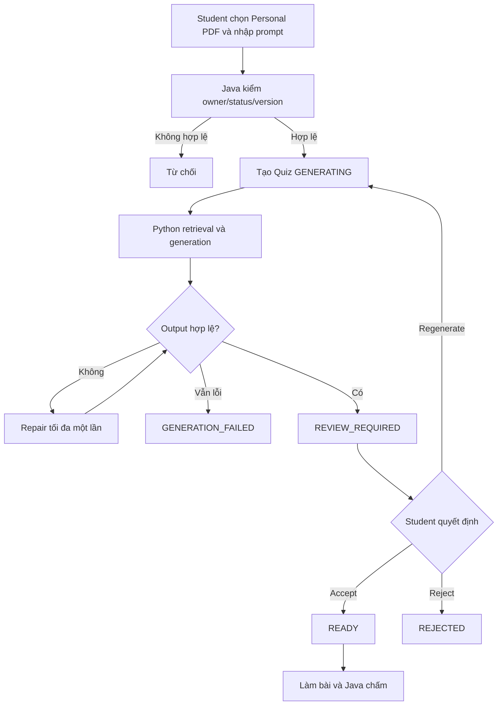
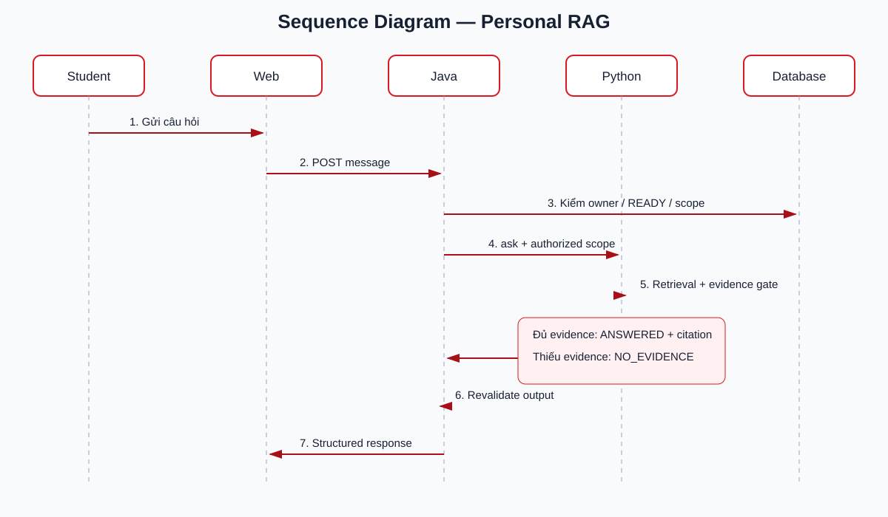

# CHƯƠNG 2. PHÂN TÍCH VÀ THIẾT KẾ HỆ THỐNG

## 2.1. Phân tích bài toán

### 2.1.1. Mô tả bài toán

StudyFlow cần thống nhất ba nhóm dữ liệu: lớp học phần và học liệu chính thức; tài liệu cá nhân; hoạt động học và ôn tập. Hệ thống phải giải quyết đồng thời quyền sở hữu, enrollment, vòng đời tài liệu, truy xuất AI có giới hạn nguồn và các phép tính học tập có thể kiểm thử. Thách thức chính là bảo đảm LLM không vượt authorized scope và không thay thế Java trong chấm điểm hoặc cập nhật tiến độ.

### 2.1.2. Mục tiêu hệ thống

Hệ thống cung cấp quy trình từ tạo lớp, tham gia, công bố học liệu đến học/ôn tập; hỗ trợ RAG và Quiz có citation; lưu lịch sử học tập; hiển thị Dashboard, Streak, Daily Goal và kế hoạch. Các thao tác riêng tư phải được bảo vệ theo owner, role, Course Offering và trạng thái publication/enrollment.

### 2.1.3. Các tác nhân của hệ thống

| Tác nhân | Trách nhiệm chính |
|---|---|
| Student | Học tài liệu, hỏi AI, tạo/làm Quiz, quản lý kế hoạch và xem Dashboard |
| Teacher | Tạo lớp, duyệt Student, quản lý và public học liệu |
| Admin | Quản lý tài khoản/danh mục, giám sát và vận hành |
| AI Service | Xử lý tài liệu, retrieval, generation và citation trong scope Java cấp |
| LLM/Embedding Provider | Cung cấp model qua adapter nội bộ của AI Service |

## 2.2. Phân tích yêu cầu

### 2.2.1. Yêu cầu chức năng Student

- Đăng ký, đăng nhập, xem/cập nhật hồ sơ.
- Nhập join code, theo dõi yêu cầu và truy cập lớp khi `APPROVED`.
- Xem PPTX public, ghi Note riêng, sử dụng Slide Tutor; tải Teacher PDF.
- Upload/xóa Personal PDF và theo dõi trạng thái xử lý.
- Chọn 1–10 PDF `READY`, tạo conversation và hỏi đáp có citation.
- Tạo Quiz bằng prompt tự do từ tài liệu đã chọn; review/accept/reject/regenerate.
- Làm Quiz, xem điểm, lịch sử attempt và nguồn của câu sai.
- Quản lý Kế hoạch & Lịch tuần, task và deadline; cấu hình Daily Goal và xem Dashboard/Study Streak.

### 2.2.2. Yêu cầu chức năng Teacher

- Tạo Course Offering theo Subject và Semester hợp lệ.
- Bật/tắt hoặc tạo lại join code; xem, duyệt, từ chối và remove enrollment.
- Upload PDF/PPTX vào thư viện; theo dõi xử lý PPTX.
- Public/revoke tài liệu vào Course Offering mình sở hữu.
- Archive Course Offering và giữ lịch sử.
- Không đọc Note, Personal Document, chat, Quiz result hay kế hoạch riêng của Student.

### 2.2.3. Yêu cầu chức năng Admin

- Quản lý user, role và trạng thái tài khoản.
- Quản lý Subject, Semester và cấu hình mở tạo Course Offering.
- Giám sát, lock/archive Course Offering khi cần.
- Quản lý feedback, audit log và system settings.
- Không mặc định đọc dữ liệu học tập cá nhân hoặc quản lý Quiz/Progress của Student.

### 2.2.4. Yêu cầu phi chức năng

- Bảo mật theo least privilege, session an toàn và credential tách service.
- Responsive từ 360 px, hỗ trợ bàn phím, focus visible và WCAG AA.
- Request xuyên service có request ID; mutation bất đồng bộ có idempotency.
- Không log document content, prompt nhạy cảm, token hoặc signed URL.
- Citation và Quiz output có schema; Java revalidate trước khi lưu.
- Index/deindex có retry giới hạn; timeout LLM không retry mù.
- Database migration tiến, backup/restore và quan sát health/metrics theo kế hoạch triển khai.

## 2.3. Phân tích Use Case

### 2.3.1. Use Case tổng quát



*Hình 2.1. Use Case tổng quát của ba tác nhân trong StudyFlow.*

### 2.3.2. Use Case Student

Các use case chính gồm xác thực; join lớp; xem/tải tài liệu; xem slide, Note, Tutor; quản lý Personal PDF; chat RAG; tạo/review/làm Quiz; xem nội dung cần ôn; quản lý kế hoạch, lịch, Daily Goal và Dashboard.

### 2.3.3. Use Case Teacher

Teacher tạo/archived lớp, quản lý join code, duyệt enrollment, upload tài liệu, theo dõi processing, public/revoke PDF/PPTX. Teacher không có use case tạo Quiz hoặc xem dữ liệu học riêng của Student trong MVP.

### 2.3.4. Use Case Admin

Admin quản lý user/role/status, Subject, Semester, giám sát Course Offering, xử lý feedback/audit/settings. Admin không phân công Teacher cho từng lớp và không phê duyệt lớp trong MVP.

### 2.3.5. Đặc tả các Use Case chính

| Use case | Tiền điều kiện | Luồng chính | Ngoại lệ/kết quả |
|---|---|---|---|
| Join Course Offering | Student đăng nhập, code hợp lệ | Nhập code → tạo `PENDING` → Teacher duyệt | Code sai/disabled; chỉ `APPROVED` được học |
| Personal RAG | PDF owner và `READY` | Chọn nguồn → tạo conversation → hỏi → retrieval → answer/citation | Thiếu evidence → `NO_EVIDENCE`; sai owner → từ chối |
| Slide Tutor | Enrollment `APPROVED`, PPTX public | Mở slide → hỏi → Java cấp scope → Python trả answer/citation | Revoke/locked → cấm; thiếu evidence → `NO_EVIDENCE` |
| Tạo Quiz | Personal PDF `READY` | Chọn nguồn + prompt → generate → validate → review | Output sai sau repair → `GENERATION_FAILED` |
| Làm Quiz | Quiz `READY` | Tạo attempt → chọn đáp án → submit → Java chấm | Submit trùng không ghi đè attempt hoàn thành |

## 2.4. Phân tích luồng nghiệp vụ

### 2.4.1. Activity Diagram



### 2.4.2. Sequence Diagram



*Hình 2.2. Trình tự Web, Java và Python xử lý một câu hỏi Personal RAG.*

## 2.5. Thiết kế kiến trúc hệ thống

```text
Next.js Web → Java Spring Boot → Python FastAPI
                    ├→ PostgreSQL schema app
                    ├→ Object Storage
                    └→ Internal AI API
                           ├→ PostgreSQL schema ai + pgvector
                           └→ LLM/Embedding Provider
```


*Hình 2.3. Kiến trúc logic và ranh giới dữ liệu của StudyFlow.*

Next.js không gọi Python, database hoặc model trực tiếp. Java sở hữu business rules và schema `app`; Python sở hữu parsing, vector, RAG và schema `ai`. Authorized scope được tạo ở Java và truyền qua internal API. Object Storage lưu file/artifact, còn metadata/quyền truy cập nằm ở Java.

## 2.6. Thiết kế cơ sở dữ liệu

### 2.6.1. ERD

ERD tổng quan một hình được quản lý tại [trang ERD](../diagrams/erd/index.html). Quan hệ trung tâm là `users → course_offerings/course_enrollments`, `documents → publications/slides`, `documents → AI indexes/chunks`, và `quizzes → questions → attempts/answers`.

### 2.6.2. Mô hình dữ liệu

PostgreSQL dùng chung cluster nhưng tách schema/role. Schema `app` lưu identity, catalog, lớp, tài liệu, chat, Quiz, plan và learning events. Schema `ai` lưu job, index và chunk/vector. Không tạo foreign key xuyên schema; `documentId` và version được truyền qua contract.

### 2.6.3. Mô tả các bảng chính

| Nhóm | Bảng chính | Vai trò |
|---|---|---|
| Identity | `users`, `refresh_tokens` | Tài khoản, role và session |
| Academic | `subjects`, `semesters`, `course_offerings`, `course_enrollments` | Danh mục, lớp và membership |
| Documents | `documents`, `document_publications`, `slides`, `slide_notes` | Metadata, public, artifact và Note |
| Chat | `chat_conversations`, `conversation_documents`, `chat_messages` | Lịch sử và snapshot nguồn |
| AI | `ai.index_jobs`, `ai.document_indexes`, `ai.document_chunks` | Job, index version và vector |
| Quiz | `quizzes`, `quiz_sources`, `quiz_questions`, `quiz_question_sources`, `quiz_attempts`, `quiz_answers` | Generation, review, scoring và lịch sử |
| Learning | `learning_progress`, `learning_events`, `daily_goals`, `study_plans`, `study_plan_items` | Dashboard, streak, goal và lịch |

## 2.7. Thiết kế API

### 2.7.1. REST API chính

Browser chỉ gọi `/api/v1`. Các nhóm chính gồm auth/profile; catalog; Student enrollment/materials/slide Tutor/Personal Documents/RAG/Quiz/Dashboard/plan; Teacher offering/enrollment/documents/publications; Admin users/catalog/monitoring/audit/settings. Error thống nhất: `code`, `message`, `details`, `traceId`.

### 2.7.2. Internal AI API

- `POST /internal/v1/documents/index`
- `POST /internal/v1/documents/deindex`
- `GET /internal/v1/jobs/{jobId}`
- `POST /internal/v1/personal-rag/ask`
- `POST /internal/v1/slides/ask`
- `POST /internal/v1/quizzes/generate`
- `GET /internal/v1/health`

Request có service credential, `X-Request-Id`, `X-Schema-Version: 3`, timeout và authorized scope; mutation phù hợp có `Idempotency-Key`. Python trả structured data, Java validate trước khi lưu.

## 2.8. Thiết kế giao diện

### 2.8.1. Student

App shell đỏ–trắng PTIT gồm sidebar/drawer có thể thu gọn, topbar, breadcrumb và profile. Các màn hình bám `mvp.html`: Dashboard, lớp, học liệu, Slide Viewer + Note + Tutor, Personal Documents, chatbot riêng, Quiz review/attempt/result và Kế hoạch & Lịch tuần. Không có menu Progress độc lập; Dashboard hiển thị toàn bộ tiến độ, Streak và Daily Goal.

### 2.8.2. Teacher

Teacher có Dashboard, danh sách Course Offering, join code, enrollment approval, thư viện PDF/PPTX, trạng thái processing, publication/revoke và archive. Giao diện không hiển thị dữ liệu học cá nhân của Student.

### 2.8.3. Admin

Admin có Dashboard vận hành, quản lý user, Subject, Semester, giám sát Course Offering, feedback, audit và settings. Các màn hình phải có loading, empty, error, forbidden và processing state.

## 2.9. Thiết kế bảo mật và phân quyền

- Java kiểm tra role, owner, enrollment và publication ở application service.
- Access token ngắn hạn; refresh token rotation trong cookie HttpOnly/Secure/SameSite.
- Frontend không lưu JWT/service credential trong local storage và không chứa AI key.
- Python chỉ tin authorized scope đã ký/xác thực từ Java, nhưng vẫn validate schema và filter lại.
- Personal Document chỉ owner sử dụng; Admin không mặc định biến thành Official Content.
- Signed URL có thời hạn, chỉ cấp sau kiểm quyền; không trả storage key.
- Prompt/document content là dữ liệu không tin cậy; system rule và schema có ưu tiên cao hơn.
- Audit các thao tác quản trị quan trọng; log không chứa nội dung tài liệu, prompt nhạy cảm hoặc secret.

## 2.10. Tổng kết chương

Chương 2 đã chuyển bài toán StudyFlow thành yêu cầu, use case, luồng, kiến trúc, mô hình dữ liệu, API, giao diện và cơ chế bảo mật nhất quán. Thiết kế đặt Java làm system of record, tách Python AI Service và giới hạn mọi truy xuất theo authorized scope, tạo nền tảng cho ba chức năng trọng tâm được trình bày chi tiết ở Chương 3.
