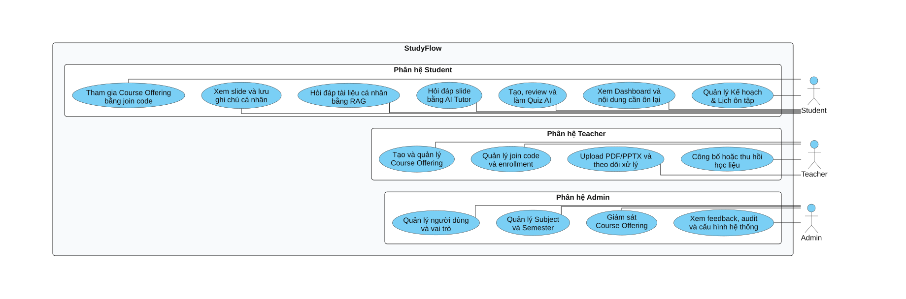
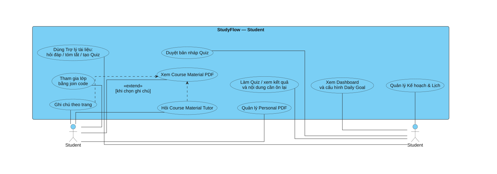
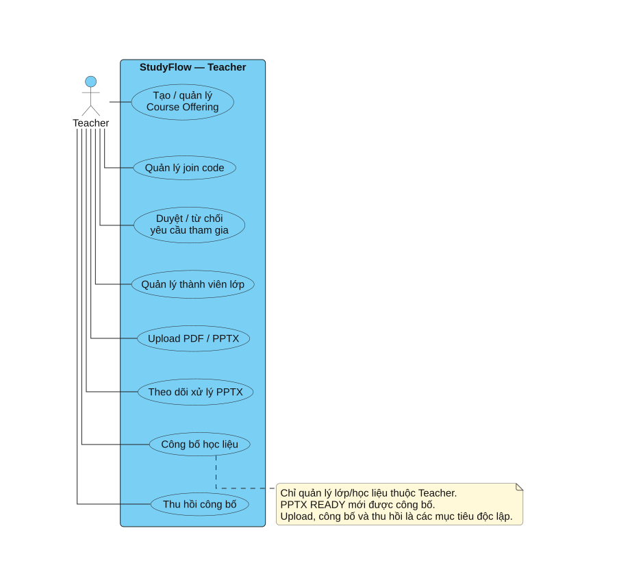
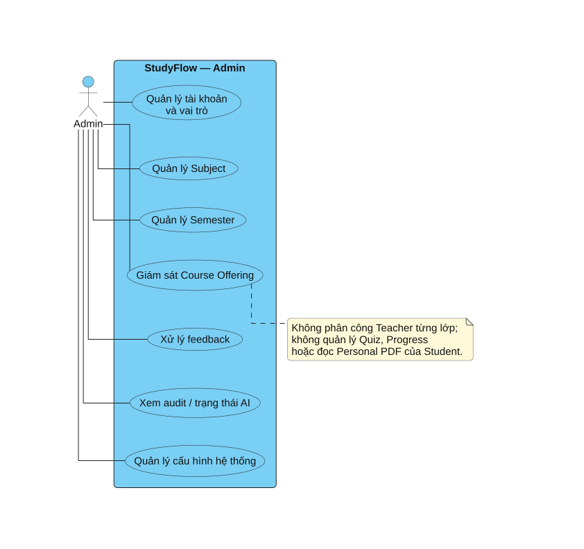

# CHƯƠNG 2. PHA PHÂN TÍCH HỆ THỐNG

Chương này trình bày toàn bộ kết quả của pha phân tích trong quy trình phát triển hệ thống StudyFlow, bao gồm: phân tích bài toán thực tế, xác định mục tiêu và các tác nhân; phân tích yêu cầu chức năng và phi chức năng; xây dựng form mô tả 9 chức năng trọng tâm chia đều cho 3 thành viên (trong đó 3 chức năng AI đã được chốt và mô tả chi tiết, các chức năng của hai thành viên còn lại được chuẩn bị sẵn form mẫu để hoàn thiện); xây dựng hệ thống biểu đồ Use Case (Use Case Diagram); và đặc tả kịch bản Use Case (Use Case Scenarios) chi tiết cho các ca sử dụng đã chốt của hệ thống.

---

## 2.1. Phân tích bài toán và mục tiêu hệ thống

### 2.1.1. Mô tả bài toán thực tế

Trong môi trường giáo dục đại học hiện nay, sinh viên thường phải đối mặt với tình trạng quá tải thông tin và phân mảnh công cụ học tập. Quá trình tự học và ôn thi của sinh viên thường gặp các khó khăn điển hình:
1. **Phân mảnh tài liệu học tập:** Course Material PDF của giảng viên và tài liệu PDF cá nhân của sinh viên được lưu trữ rời rạc trên nhiều nền tảng, gây mất thời gian tìm kiếm và thiếu một không gian học tập thống nhất.
2. **Khai thác kiến thức thiếu định hướng và nguy cơ sai lệch từ AI:** Việc dùng LLM phổ thông tiềm ẩn rủi ro “ảo giác”, cung cấp thông tin không có căn cứ hoặc ngoài giáo trình. Sinh viên khó xác minh câu trả lời được lấy từ trang tài liệu nào.
3. **Thiếu công cụ tự đánh giá gắn liền với nguồn học liệu:** Việc tự ôn luyện bằng trắc nghiệm thường thiếu sự liên kết trực tiếp với bài học. Khi làm sai, sinh viên không được chỉ dẫn chính xác đoạn kiến thức cụ thể cần đọc lại để củng cố.
4. **Quản lý kế hoạch và theo dõi tiến độ thụ động:** Sinh viên thiếu công cụ định lượng nỗ lực hàng ngày như số trang PDF đã đọc, số câu Quiz và task đã hoàn thành.

Từ bài toán trên, StudyFlow được định hướng xây dựng như một nền tảng hỗ trợ học tập và ôn luyện thông minh, thống nhất học liệu chính thức theo lớp học phần với tài liệu tự học cá nhân, tích hợp công nghệ Trí tuệ Nhân tạo có kiểm soát (Retrieval-Augmented Generation - RAG) với nguyên tắc trích dẫn nguồn minh bạch (grounded citations) và từ chối trả lời khi thiếu căn cứ (`NO_EVIDENCE`).

### 2.1.2. Mục tiêu hệ thống

Hệ thống StudyFlow hướng tới các mục tiêu cụ thể:
- **Tổ chức học liệu theo cấu trúc học phần:** Giảng viên tạo Course Offering, công bố Course Material PDF và kiểm soát sinh viên bằng join code/enrollment.
- **Hỗ trợ học tập tương tác trên PDF:** Sinh viên đọc PDF trực tuyến, ghi chú theo trang và dùng Course Material AI Tutor trong phạm vi tài liệu đã được cấp quyền.
- **Không gian học tập cá nhân hóa:** Sinh viên dùng một Trợ lý tài liệu với Single Agent để hỏi đáp, tóm tắt hoặc tạo Quiz từ 1–10 Personal PDF, kèm trích dẫn trang.
- **Hệ thống Quiz cho hai vai trò:** Student tạo Quiz cá nhân trong Trợ lý; Teacher sinh Quiz từ Course Material PDF theo số câu, độ khó, chủ đề và khoảng trang. Mọi draft được review trước khi sử dụng hoặc công bố.
- **Thống kê và thúc đẩy động lực:** Ghi nhận `VIEW_PAGE`, `STUDY_TASK_COMPLETED`, `QUIZ_COMPLETED`, tính Study Streak, Daily Goal và Study Plan & Calendar.

### 2.1.3. Các tác nhân tham gia hệ thống (Actors)

| Tác nhân | Phân loại | Mô tả vai trò và trách nhiệm chính trong hệ thống |
|---|---|---|
| **Student** (Sinh viên) | Tác nhân con người (Primary User) | Tham gia lớp; xem Course Material PDF, ghi chú/hỏi Tutor theo trang; quản lý Personal PDF; dùng Trợ lý AI để hỏi đáp, tóm tắt hoặc tạo Quiz; làm bài, xem Dashboard và quản lý lịch cá nhân. |
| **Teacher** (Giảng viên) | Tác nhân con người (Primary User) | Tạo/quản lý Course Offering, join code và enrollment; tải lên/công bố Course Material PDF; cấu hình, review và publish Quiz AI. Teacher không có chatbot cá nhân hoặc AI Tutor. |
| **Admin** (Quản trị viên) | Tác nhân con người (System Administrator) | Quản lý danh mục đào tạo (Môn học - Subject, Học kỳ - Semester); quản trị tài khoản người dùng và phân quyền; giám sát hoạt động của các lớp học phần; xem nhật ký hệ thống (Audit Log), phản hồi người dùng và cấu hình thông số hệ thống. |
| **LLM & Embedding Provider** | Tác nhân bên ngoài (External Service) | Nhà cung cấp dịch vụ mô hình ngôn ngữ lớn và mô hình nhúng (thông qua API tương thích OpenAI) phục vụ việc tính toán vector và sinh văn bản theo cấu trúc. |

---

Python AI Service, Java Backend và Next.js là các thành phần nội bộ, không phải tác nhân bên ngoài khi ranh giới Use Case là toàn bộ StudyFlow. Nhà cung cấp mô hình là tác nhân hỗ trợ; tương tác kỹ thuật với dịch vụ này được trình bày ở biểu đồ kiến trúc và tuần tự Chương 3.

## 2.2. Phân tích yêu cầu hệ thống

### 2.2.1. Yêu cầu chức năng phân hệ Sinh viên (Student)

1. **Quản lý tài khoản và hồ sơ:** Đăng ký tài khoản, đăng nhập hệ thống qua JWT, xem và cập nhật thông tin cá nhân, đổi mật khẩu.
2. **Tham gia lớp học phần:** Nhập mã mời (join code) để gửi yêu cầu tham gia lớp; theo dõi trạng thái yêu cầu (`PENDING`, `APPROVED`, `REJECTED`); truy cập không gian học tập của lớp khi đã được duyệt.
3. **Khai thác học liệu của lớp:** Xem Course Material PDF đã công bố, đọc trực tuyến và ghi chú riêng theo từng trang.
4. **Tương tác với Course Material AI Tutor:** Đặt câu hỏi tại trang đang xem; nhận câu trả lời có trích dẫn đúng trang hoặc `NO_EVIDENCE`.
5. **Quản lý tài liệu học tập cá nhân (Personal Documents):** Tải lên các tệp tài liệu PDF cá nhân; theo dõi tiến trình xử lý và lập chỉ mục (`PROCESSING`, `READY`, `FAILED`); đổi tên hoặc xóa tài liệu khi không còn sử dụng.
6. **Trợ lý tài liệu cá nhân:** Chọn 1–10 Personal PDF `READY`, nhập prompt tự nhiên để hỏi đáp, tóm tắt hoặc tạo Quiz; Agent hỏi lại khi thiếu tham số và mọi kết quả phải có citation trang.
7. **Duyệt Quiz AI:** Mở bản nháp `REVIEW_REQUIRED`, kiểm tra 4 phương án/một đáp án/giải thích/nguồn rồi Accept, Regenerate hoặc Reject.
8. **Luyện tập và ôn thi (Take Quiz & Review):** Làm bài trắc nghiệm với giao diện trực quan; nộp bài để nhận kết quả chấm điểm tức thì từ hệ thống; xem lại lịch sử các lần làm bài (attempts); xem danh sách các câu trả lời sai kèm liên kết dẫn trực tiếp về trang tài liệu cần đọc lại.
9. **Theo dõi tiến độ và Kế hoạch học tập:** Xem Dashboard về số trang PDF đã học, Quiz/task, Study Streak và Daily Goal; quản lý task và lịch tuần.

### 2.2.2. Yêu cầu chức năng phân hệ Giảng viên (Teacher)

1. **Quản lý lớp học phần (Course Offering):** Tạo lớp học phần mới trên cơ sở Môn học (Subject) và Học kỳ (Semester) hợp lệ trong danh mục; cập nhật thông tin lớp; lưu trữ (Archive) lớp học phần khi kết thúc học kỳ.
2. **Quản lý mã mời và thành viên lớp:** Bật/tắt hoặc cấp lại mã mời (join code) ngẫu nhiên cho lớp; xem danh sách sinh viên đang chờ duyệt (`PENDING`); thực hiện duyệt (`APPROVED`) hoặc từ chối (`REJECTED`) yêu cầu tham gia; xóa sinh viên khỏi lớp học khi cần thiết.
3. **Quản lý kho học liệu môn học:** Tải Course Material PDF có lớp văn bản, theo dõi xử lý/index và công bố vào lớp sở hữu.
4. **Công bố học liệu (Publishing):** Lựa chọn tài liệu từ thư viện để công bố (Public) vào lớp học phần cụ thể cho sinh viên truy cập; thu hồi (Revoke) quyền truy cập tài liệu khi cần chỉnh sửa hoặc thay thế.
5. **Sinh Quiz AI cho lớp:** Chọn PDF, Course Offering, số câu, độ khó, chủ đề và khoảng trang; review/sửa bản nháp trước khi publish.

### 2.2.3. Yêu cầu chức năng phân hệ Quản trị viên (Admin)

1. **Quản lý danh mục đào tạo:** Quản lý danh sách các Môn học (Subject) gồm mã môn, tên môn, số tín chỉ; quản lý danh sách các Học kỳ (Semester) gồm mã học kỳ, năm học, thời gian bắt đầu và kết thúc; cấu hình trạng thái cho phép mở lớp học phần.
2. **Quản trị người dùng:** Quản lý danh sách tài khoản toàn hệ thống; phân quyền vai trò (Role: Student, Teacher, Admin); kích hoạt, khóa hoặc mở khóa tài khoản.
3. **Giám sát hoạt động lớp học:** Xem danh sách toàn bộ các lớp học phần trên hệ thống; hỗ trợ khóa hoặc lưu trữ lớp học phần trong trường hợp vi phạm quy định.
4. **Giám sát hệ thống:** Xem nhật ký vận hành và bảo mật (Audit Logs); tiếp nhận và xử lý các báo cáo phản hồi (Feedback) từ người dùng; quản lý các tham số cấu hình chung của hệ thống.

### 2.2.4. Yêu cầu phi chức năng

- **Bảo mật và Phân quyền (Security & Authorization):** Áp dụng kiến trúc xác thực Stateless dựa trên JWT (Access Token ngắn hạn trong Header và Refresh Token trong Cookie HttpOnly/SameSite). Phân quyền theo vai trò (RBAC) và theo quyền sở hữu tài nguyên (Resource Ownership). Sinh viên chỉ được truy cập học liệu của lớp khi có trạng thái `APPROVED`, chỉ được thao tác trên tài liệu cá nhân của chính mình.
- **Tính toàn vẹn và Tin cậy của AI (AI Grounding & Hallucination Prevention):** Toàn bộ truy xuất AI phải giới hạn trong Authorized Scope, citation theo trang PDF và trả `NO_EVIDENCE` khi thiếu căn cứ. Single Agent chỉ được gọi ba tool có schema và phải trả `NEEDS_CLARIFICATION` khi thiếu tham số.
- **Tính nhất quán nghiệp vụ (Business Rule Consistency):** Backend Java đóng vai trò là "System of Record", sở hữu toàn bộ logic nghiệp vụ, trạng thái vòng đời Quiz, chấm điểm trắc nghiệm và tính toán tiến độ. AI Service tuyệt đối không can thiệp trực tiếp vào cơ sở dữ liệu nghiệp vụ hoặc tự ý chấm điểm.
- **Hiệu năng và Tính sẵn sàng (Performance & Scalability):** Các tác vụ parse PDF, embedding và sinh Quiz chạy bất đồng bộ với Idempotency Key; API đọc dữ liệu thông thường đáp ứng mục tiêu hiệu năng đã quy định.
- **Trải nghiệm người dùng và Chuẩn giao diện (UI/UX Standards):** Thiết kế giao diện responsive tương thích từ màn hình di động (360px) đến máy tính để bàn; tuân thủ chuẩn thẩm mỹ hiện đại với tông màu nhận diện học đường (Đỏ PTIT - Trắng - Xám Slate); hỗ trợ điều hướng bàn phím và khả năng tiếp cận (Accessibility - WCAG AA).

---

## 2.3. Form thống nhất mô tả chức năng trọng tâm của các thành viên

Theo quy định phân công đồ án tốt nghiệp trong nhóm 3 thành viên, mỗi thành viên đảm nhận **3 chức năng trọng tâm** có độ phức tạp kỹ thuật cao và thuộc phân hệ mình trực tiếp phụ trách (tổng cộng 9 chức năng cho cả nhóm). Toàn bộ 9 chức năng được chuẩn hóa trình bày theo một **form mẫu thống nhất gồm 10 trường thông tin chi tiết**:

| Trường thông tin | Ý nghĩa và nội dung cần trình bày |
|---|---|
| **Mã và tên chức năng** | Mã định danh duy nhất và tên nghiệp vụ chuẩn hóa của chức năng |
| **Thành viên/phạm vi phụ trách** | Thành viên chịu trách nhiệm chính và phân hệ công nghệ liên quan |
| **Mục tiêu** | Vấn đề chức năng giải quyết và giá trị nghiệp vụ mang lại |
| **Tác nhân** | Tác nhân con người hoặc hệ thống tham gia trực tiếp |
| **Tiền điều kiện** | Trạng thái hệ thống hoặc dữ liệu bắt buộc trước khi thực hiện |
| **Đầu vào** | Cấu trúc dữ liệu, tham số và giới hạn đầu vào |
| **Luồng xử lý chính** | Các bước xử lý tuần tự bảo đảm đúng ranh giới kiến trúc |
| **Đầu ra** | Dữ liệu trả về có cấu trúc và hiệu ứng thay đổi trạng thái (side effects) |
| **Ngoại lệ và quy tắc** | Xử lý lỗi nghiệp vụ, bảo mật và các ràng buộc toàn vẹn |
| **Tiêu chí nghiệm thu** | Điều kiện kỹ thuật cụ thể dùng để xác nhận chức năng đạt chuẩn |

> **Lưu ý về tiến độ thống nhất chức năng của nhóm:**
> Hiện tại, nhóm **đã chốt chính thức 3 chức năng trọng tâm của Thành viên 1 (Phụ trách AI)** và đã được liệt kê chi tiết dưới đây. Các chức năng của **Thành viên 2** và **Thành viên 3** đang trong quá trình thảo luận chốt danh mục cụ thể; do đó báo cáo chuẩn bị sẵn form mẫu chuẩn để hai thành viên điền nội dung chi tiết sau khi chốt chính thức.

---

### 2.3.1. Ba chức năng trọng tâm của Thành viên 1 (Phụ trách AI — Đã chốt chính thức)

#### AI-F01 — Trợ lý tài liệu cá nhân bằng RAG

| Trường thông tin | Nội dung |
|---|---|
| **Mã và tên chức năng** | **AI-F01: Trợ lý tài liệu cá nhân bằng RAG** |
| **Thành viên/phạm vi phụ trách** | Thành viên 1 - AI Python; Single Orchestrator Agent, PDF retrieval, tool calling và citation validation |
| **Mục tiêu** | Cho phép Student dùng một giao diện để hỏi đáp, tóm tắt hoặc yêu cầu tạo Quiz trên Personal PDF, luôn bám bằng chứng trang |
| **Tác nhân** | Student (chính), nhà cung cấp mô hình (hỗ trợ); các service là thành phần thực thi |
| **Tiền điều kiện** | Student đã đăng nhập; là owner của tài liệu; tài liệu PDF có lớp văn bản; tài liệu và chỉ mục đang ở trạng thái `READY` |
| **Đầu vào** | Conversation có 1–10 `selectedDocumentIds`; body `{message}` 1–2.000 ký tự; Java cấp document/version scope và bounded history |
| **Luồng xử lý chính** | 1. Java kiểm owner/READY và dựng scope. 2. Agent nhận diện intent và validate args. 3. Agent gọi đúng một tool `ask_document`, `summarize_document` hoặc `generate_quiz`. 4. Tool retrieval trên pgvector trong scope và tạo evidence snapshot. 5. LLM sinh structured result; validator kiểm citation/schema. 6. Java revalidate rồi lưu conversation hoặc Quiz draft. |
| **Đầu ra** | `ANSWERED`, `SUMMARIZED`, `QUIZ_CREATED`, `NEEDS_CLARIFICATION` hoặc `NO_EVIDENCE`; kết quả có `documentId + pageNumber + excerpt` khi dùng bằng chứng |
| **Ngoại lệ và quy tắc** | Không dùng chunk ngoài scope; không cho prompt injection đổi system/tool; thiếu args phải hỏi lại; thiếu evidence trả `NO_EVIDENCE`; không log nội dung tài liệu/prompt |
| **Tiêu chí nghiệm thu** | Owner isolation 100%; route đúng tool; citation đúng trang; intent mơ hồ được hỏi lại; không scope leakage |

#### AI-F02 — Hỏi đáp Course Material PDF với AI Tutor

| Trường thông tin | Nội dung |
|---|---|
| **Mã và tên chức năng** | **AI-F02: Hỏi đáp Course Material PDF với AI Tutor** |
| **Thành viên/phạm vi phụ trách** | Thành viên 1 - AI Python; PDF parsing theo trang, retrieval theo Course Offering và grounding validator |
| **Mục tiêu** | Giải thích nội dung Course Material PDF cho Student được duyệt, ưu tiên trang đang xem và trích dẫn đúng trang |
| **Tác nhân** | Student (chính), nhà cung cấp mô hình (hỗ trợ) |
| **Tiền điều kiện** | Student có enrollment `APPROVED`; Course Material PDF đã public và index `READY`; lớp/tài liệu không bị khóa/thu hồi |
| **Đầu vào** | Câu hỏi, `documentId`, `documentVersion`, `courseOfferingId`, `pageNumber` hiện tại và allowed page scope từ Java |
| **Luồng xử lý chính** | 1. Java kiểm enrollment/publication. 2. Python filter đúng PDF/version/lớp. 3. Ưu tiên page hiện tại và retrieval trong allowed scope. 4. Evidence Gate từ chối khi thiếu căn cứ. 5. Validator kiểm page citation và trả structured result. |
| **Đầu ra** | `ANSWERED` với `documentId + pageNumber + excerpt` hoặc `NO_EVIDENCE` |
| **Ngoại lệ và quy tắc** | Chỉ Student dùng Tutor; Teacher không có Tutor; revoke chặn request kế tiếp; không suy diễn ngoài evidence |
| **Tiêu chí nghiệm thu** | Không retrieval ngoài Course Offering được phép; citation đúng trang; câu ngoài nguồn trả `NO_EVIDENCE` |

#### AI-F03 — Sinh bộ câu hỏi ôn tập AI (AI Quiz Generator)

| Trường thông tin | Nội dung |
|---|---|
| **Mã và tên chức năng** | **AI-F03: Sinh bộ câu hỏi ôn tập AI (AI Quiz Generator)** |
| **Thành viên/phạm vi phụ trách** | Thành viên 1 - AI Python; retrieval có grounding và structured Quiz generation tuân thủ schema nghiêm ngặt trong Python AI Service |
| **Mục tiêu** | Sinh `MCQ_SINGLE` có căn cứ cho hai chế độ: Student từ Personal PDF và Teacher từ Course Material PDF |
| **Tác nhân** | Student hoặc Teacher (chính), nhà cung cấp mô hình (hỗ trợ) |
| **Tiền điều kiện** | Nguồn PDF `READY`; Java đã xác thực Student owner hoặc Teacher sở hữu document/Course Offering |
| **Đầu vào** | `mode=PERSONAL_STUDENT|COURSE_TEACHER`, authorized document/version/page scope, số câu, độ khó, chủ đề và yêu cầu bổ sung; Student có thể cung cấp qua tool của Agent, Teacher qua form |
| **Luồng xử lý chính** | 1. Java xác thực nguồn tài liệu và tạo scope. 2. Python truy xuất các đoạn kiến thức trọng tâm từ tài liệu. 3. LLM sinh JSON theo định dạng chuẩn `MCQ_SINGLE`. 4. Kiểm tra mỗi câu có đúng 4 phương án, đúng 1 đáp án chính xác, có giải thích và trích dẫn số trang. 5. Sửa lỗi cấu trúc tự động (repair) tối đa 1 lần nếu cần. 6. Trả bản nháp Quiz có cấu trúc cho Java lưu trữ. |
| **Đầu ra** | Bản nháp Quiz chứa danh sách câu hỏi, các phương án lựa chọn, chỉ số `correctOptionIndex`, lời giải thích và sources; Java chuyển sang `REVIEW_REQUIRED` hoặc `GENERATION_FAILED` |
| **Ngoại lệ và quy tắc** | Prompt/instructions không phá schema/scope; Python không accept/publish/chấm/update progress; Teacher phải review trước publish, Student review trước attempt |
| **Tiêu chí nghiệm thu** | 100% câu đúng schema với 4 phương án, 1 đáp án đúng và page source; Java kiểm soát lifecycle/scoring |

---

### 2.3.2. Form chức năng của Thành viên 2 (Java Backend 1 — Đang hoàn thiện, để form chờ chốt)

*(Phần này chuẩn bị sẵn form mẫu theo quy chuẩn 10 trường thông tin để Thành viên 2 điền chi tiết sau khi nhóm thống nhất chốt danh mục 3 chức năng)*

#### BE1-F01 — [Chức năng 1 của Thành viên 2 - Đang cập nhật]

| Trường thông tin | Nội dung (Chờ Thành viên 2 cập nhật) |
|---|---|
| **Mã và tên chức năng** | **BE1-F01: [Tên chức năng 1 của Thành viên 2]** |
| **Thành viên/phạm vi phụ trách** | Thành viên 2 - Java Backend 1 |
| **Mục tiêu** | *[Mục tiêu giải quyết của chức năng]* |
| **Tác nhân** | *[Các tác nhân tham gia]* |
| **Tiền điều kiện** | *[Điều kiện bắt buộc trước khi thực hiện]* |
| **Đầu vào** | *[Dữ liệu và tham số đầu vào]* |
| **Luồng xử lý chính** | *[Các bước xử lý chính theo đúng ranh giới kiến trúc]* |
| **Đầu ra** | *[Kết quả trả về và thay đổi trạng thái]* |
| **Ngoại lệ và quy tắc** | *[Xử lý lỗi và ràng buộc nghiệp vụ]* |
| **Tiêu chí nghiệm thu** | *[Điều kiện xác nhận hoàn thành]* |

#### BE1-F02 — [Chức năng 2 của Thành viên 2 - Đang cập nhật]

| Trường thông tin | Nội dung (Chờ Thành viên 2 cập nhật) |
|---|---|
| **Mã và tên chức năng** | **BE1-F02: [Tên chức năng 2 của Thành viên 2]** |
| **Thành viên/phạm vi phụ trách** | Thành viên 2 - Java Backend 1 |
| **Mục tiêu** | *[Mục tiêu giải quyết của chức năng]* |
| **Tác nhân** | *[Các tác nhân tham gia]* |
| **Tiền điều kiện** | *[Điều kiện bắt buộc trước khi thực hiện]* |
| **Đầu vào** | *[Dữ liệu và tham số đầu vào]* |
| **Luồng xử lý chính** | *[Các bước xử lý chính]* |
| **Đầu ra** | *[Kết quả trả về]* |
| **Ngoại lệ và quy tắc** | *[Xử lý lỗi và ràng buộc nghiệp vụ]* |
| **Tiêu chí nghiệm thu** | *[Điều kiện xác nhận hoàn thành]* |

#### BE1-F03 — [Chức năng 3 của Thành viên 2 - Đang cập nhật]

| Trường thông tin | Nội dung (Chờ Thành viên 2 cập nhật) |
|---|---|
| **Mã và tên chức năng** | **BE1-F03: [Tên chức năng 3 của Thành viên 2]** |
| **Thành viên/phạm vi phụ trách** | Thành viên 2 - Java Backend 1 |
| **Mục tiêu** | *[Mục tiêu giải quyết của chức năng]* |
| **Tác nhân** | *[Các tác nhân tham gia]* |
| **Tiền điều kiện** | *[Điều kiện bắt buộc trước khi thực hiện]* |
| **Đầu vào** | *[Dữ liệu và tham số đầu vào]* |
| **Luồng xử lý chính** | *[Các bước xử lý chính]* |
| **Đầu ra** | *[Kết quả trả về]* |
| **Ngoại lệ và quy tắc** | *[Xử lý lỗi và ràng buộc nghiệp vụ]* |
| **Tiêu chí nghiệm thu** | *[Điều kiện xác nhận hoàn thành]* |

---

### 2.3.3. Form chức năng của Thành viên 3 (Java Backend 2 / Frontend — Đang hoàn thiện, để form chờ chốt)

*(Phần này chuẩn bị sẵn form mẫu theo quy chuẩn 10 trường thông tin để Thành viên 3 điền chi tiết sau khi nhóm thống nhất chốt danh mục 3 chức năng)*

#### BE2-F01 — [Chức năng 1 của Thành viên 3 - Đang cập nhật]

| Trường thông tin | Nội dung (Chờ Thành viên 3 cập nhật) |
|---|---|
| **Mã và tên chức năng** | **BE2-F01: [Tên chức năng 1 của Thành viên 3]** |
| **Thành viên/phạm vi phụ trách** | Thành viên 3 - Java Backend 2 / Frontend |
| **Mục tiêu** | *[Mục tiêu giải quyết của chức năng]* |
| **Tác nhân** | *[Các tác nhân tham gia]* |
| **Tiền điều kiện** | *[Điều kiện bắt buộc trước khi thực hiện]* |
| **Đầu vào** | *[Dữ liệu và tham số đầu vào]* |
| **Luồng xử lý chính** | *[Các bước xử lý chính]* |
| **Đầu ra** | *[Kết quả trả về]* |
| **Ngoại lệ và quy tắc** | *[Xử lý lỗi và ràng buộc nghiệp vụ]* |
| **Tiêu chí nghiệm thu** | *[Điều kiện xác nhận hoàn thành]* |

#### BE2-F02 — [Chức năng 2 của Thành viên 3 - Đang cập nhật]

| Trường thông tin | Nội dung (Chờ Thành viên 3 cập nhật) |
|---|---|
| **Mã và tên chức năng** | **BE2-F02: [Tên chức năng 2 của Thành viên 3]** |
| **Thành viên/phạm vi phụ trách** | Thành viên 3 - Java Backend 2 / Frontend |
| **Mục tiêu** | *[Mục tiêu giải quyết của chức năng]* |
| **Tác nhân** | *[Các tác nhân tham gia]* |
| **Tiền điều kiện** | *[Điều kiện bắt buộc trước khi thực hiện]* |
| **Đầu vào** | *[Dữ liệu và tham số đầu vào]* |
| **Luồng xử lý chính** | *[Các bước xử lý chính]* |
| **Đầu ra** | *[Kết quả trả về]* |
| **Ngoại lệ và quy tắc** | *[Xử lý lỗi và ràng buộc nghiệp vụ]* |
| **Tiêu chí nghiệm thu** | *[Điều kiện xác nhận hoàn thành]* |

#### BE2-F03 — [Chức năng 3 của Thành viên 3 - Đang cập nhật]

| Trường thông tin | Nội dung (Chờ Thành viên 3 cập nhật) |
|---|---|
| **Mã và tên chức năng** | **BE2-F03: [Tên chức năng 3 của Thành viên 3]** |
| **Thành viên/phạm vi phụ trách** | Thành viên 3 - Java Backend 2 / Frontend |
| **Mục tiêu** | *[Mục tiêu giải quyết của chức năng]* |
| **Tác nhân** | *[Các tác nhân tham gia]* |
| **Tiền điều kiện** | *[Điều kiện bắt buộc trước khi thực hiện]* |
| **Đầu vào** | *[Dữ liệu và tham số đầu vào]* |
| **Luồng xử lý chính** | *[Các bước xử lý chính]* |
| **Đầu ra** | *[Kết quả trả về]* |
| **Ngoại lệ và quy tắc** | *[Xử lý lỗi và ràng buộc nghiệp vụ]* |
| **Tiêu chí nghiệm thu** | *[Điều kiện xác nhận hoàn thành]* |

---

## 2.4. Biểu đồ Use Case hệ thống

Biểu đồ dùng ký pháp UML tham khảo Visual Paradigm: actor ngoài ranh giới hệ thống, Use Case hình elip và association đường liền. Quan hệ `extend` đi từ hành vi tùy chọn tới Use Case gốc; không dùng `include`/`extend` để diễn tả thao tác xảy ra trước/sau. Chi tiết quy ước và nguồn tham khảo tại [hướng dẫn biểu đồ](../diagrams/README.md).

Danh sách Use Case bao quát chức năng toàn hệ thống; không đồng nhất với chín chức năng nhóm chọn để báo cáo chuyên sâu. Đăng nhập là tiền điều kiện dùng chung của các Use Case cần bảo vệ; không vẽ lại đường include tới đăng nhập ở mọi chức năng.

### 2.4.1. Biểu đồ Use Case tổng quát

Biểu đồ Use Case tổng quát thể hiện bức tranh toàn cảnh về ranh giới tương tác của ba nhóm tác nhân chính: Sinh viên (Student), Giảng viên (Teacher), và Quản trị viên (Admin) đối với các phân hệ chức năng của nền tảng StudyFlow.

*Hình 2.1. Biểu đồ Use Case tổng quát toàn hệ thống StudyFlow.*

**Thuyết minh biểu đồ Hình 2.1:**
- Tác nhân **Student** tương tác với Course Offering, Course Material PDF/Page Note/Tutor, Personal Document Assistant, Quiz/Review, Dashboard và Kế hoạch & Lịch.
- Tác nhân **Teacher** tạo/quản lý Course Offering, enrollment, Course Material PDF/publication và AI Quiz Generator; không có chatbot hoặc Tutor.
- Tác nhân **Admin** quản lý người dùng, vai trò, Subject, Semester, giám sát Course Offering, feedback, audit và cấu hình hệ thống; Admin không mặc định được đọc dữ liệu học tập cá nhân của Student.
- Ba khung chức năng nằm trong một System Boundary duy nhất của StudyFlow. Hình 2.2–2.4 tiếp tục phân rã nghiệp vụ theo từng vai trò để tránh đưa chi tiết luồng xử lý vào biểu đồ tổng quát.
- Biểu đồ phân định ranh giới nghiệp vụ rõ ràng: Giảng viên và Quản trị viên không can thiệp vào kho tài liệu cá nhân, nội dung hỏi đáp riêng tư, kết quả làm Quiz và lịch học của từng sinh viên.

---

### 2.4.2. Biểu đồ Use Case phân hệ Sinh viên (Student)

Biểu đồ phân rã chi tiết các ca sử dụng dành riêng cho tác nhân Sinh viên trong quá trình học tập và ôn luyện trên hệ thống.

*Hình 2.2. Biểu đồ Use Case chi tiết phân hệ Sinh viên (Student).*

**Thuyết minh biểu đồ Hình 2.2:**
- Ký hiệu Student được lặp ở hai phía nhưng cùng biểu diễn một tác nhân; cách trình bày này rút ngắn association, giữ đường nối thẳng và không tạo thêm vai trò nghiệp vụ.
- Nhóm lớp học phần: khi được duyệt, Student xem Course Material PDF, lưu `page_notes` và hỏi Course Material AI Tutor.
- Nhóm tài liệu cá nhân: Student upload PDF, chọn nguồn rồi dùng cùng một Assistant để hỏi, tóm tắt hoặc tạo Quiz; citation theo trang và thiếu căn cứ trả `NO_EVIDENCE`.
- Nhóm Quiz AI: Quiz Student tạo trong Assistant phải review trước attempt; Java chấm điểm và tổng hợp câu sai theo page source.
- Nhóm ca sử dụng tiến độ và kế hoạch: Sinh viên thiết lập Daily Goal, quản lý các đầu việc Task trên giao diện lịch tuần và theo dõi thống kê chuỗi ngày học Streak trên Dashboard.

---

### 2.4.3. Biểu đồ Use Case phân hệ Giảng viên (Teacher)

Biểu đồ mô tả chi tiết các quyền hạn và chức năng nghiệp vụ thuộc phạm vi phụ trách của tác nhân Giảng viên.

*Hình 2.3. Biểu đồ Use Case chi tiết phân hệ Giảng viên (Teacher).*

**Thuyết minh biểu đồ Hình 2.3:**
- Giảng viên trực tiếp khởi tạo lớp học phần (Create Course Offering) dựa trên danh mục Môn học và Học kỳ do Nhà trường/Admin ban hành mà không cần chờ phê duyệt lớp.
- Quản lý thành viên lớp: Giảng viên xem danh sách yêu cầu tham gia, thực hiện phê duyệt (`Approve Enrollment`) để cấp quyền cho sinh viên hoặc từ chối (`Reject Enrollment`). Giảng viên có quyền tạo mới hoặc vô hiệu hóa mã mời (Manage Join Code).
- Quản lý học liệu và Quiz: Giảng viên upload/public/revoke Course Material PDF, sau đó có thể chọn PDF, số câu, độ khó, chủ đề và trang để tạo Quiz AI; Teacher review trước khi publish.

---

### 2.4.4. Biểu đồ Use Case phân hệ Quản trị viên (Admin)

Biểu đồ xác định phạm vi quản trị danh mục, giám sát hệ thống và phân quyền của tác nhân Quản trị viên.

*Hình 2.4. Biểu đồ Use Case chi tiết phân hệ Quản trị viên (Admin).*

**Thuyết minh biểu đồ Hình 2.4:**
- Quản lý danh mục cốt lõi: Khởi tạo, cập nhật các Môn học (Subject) và Học kỳ (Semester), cấu hình thời gian mở đăng ký lớp.
- Quản lý tài khoản: Xem danh sách người dùng, kích hoạt hoặc khóa tài khoản vi phạm, điều chỉnh phân quyền người dùng.
- Giám sát vận hành: Theo dõi hoạt động của các lớp học phần (khóa hoặc lưu trữ khi cần); xem xét các báo cáo phản hồi (Feedback) và tra cứu nhật ký hệ thống (Audit Logs) để bảo đảm an toàn thông tin.

---

## 2.5. Kịch bản Use Case chi tiết

Mỗi đặc tả dùng cùng một form: mã/tên, mục tiêu, tác nhân, kích hoạt, tiền điều kiện, luồng chính, luồng thay thế, ngoại lệ và hậu điều kiện. Phân tích mô tả hành vi quan sát được; các lớp thực thi, API và tương tác giữa service được cụ thể hóa ở Chương 3. Các Use Case chung dưới đây không tự động được phân công làm chức năng báo cáo riêng của thành viên nào.

### 2.5.1. UC-RAG-01 — Hỏi đáp tài liệu cá nhân (AI-F01)

| Thuộc tính | Nội dung |
|---|---|
| Mục tiêu / tác nhân | Student nhận câu trả lời dựa trên Personal PDF của mình; nhà cung cấp mô hình hỗ trợ xử lý |
| Kích hoạt | Student gửi câu hỏi trong hội thoại đã chọn nguồn |
| Tiền điều kiện | Đăng nhập; hội thoại thuộc Student; 1–10 Personal PDF thuộc owner, READY, có snapshot phiên bản hợp lệ |
| Luồng chính | 1. Chọn nguồn và tạo hội thoại. 2. Nhập câu hỏi dài 1–2.000 ký tự. 3. Hệ thống kiểm tra lại quyền và trạng thái nguồn trong snapshot. 4. Truy xuất các đoạn có liên quan trong đúng phạm vi được cấp quyền. 5. Kiểm tra bằng chứng trước khi sinh câu trả lời. 6. Sinh và kiểm tra grounding/citation; cho phép rewrite tối đa một lần trên cùng evidence snapshot. 7. Kiểm tra lại quyền truy cập trước khi trả nội dung; lưu tin nhắn và hiển thị citation theo trang. |
| Thay thế | Không đủ bằng chứng hoặc câu trả lời vẫn không đạt grounding sau lần rewrite cho phép: trả `NO_EVIDENCE`, không bổ sung kiến thức ngoài nguồn |
| Ngoại lệ | Nguồn đã xóa/đổi phiên bản/không còn được phép: dừng và yêu cầu cập nhật nguồn. Lỗi provider, timeout hoặc lỗi index được trả bằng error code riêng; không giả thành `NO_EVIDENCE`. HTTP status theo API contract, không tiết lộ sự tồn tại của tài liệu người khác |
| Hậu điều kiện | Có câu trả lời được kiểm tra kèm `documentId + pageNumber + excerpt`, hoặc thông báo thiếu căn cứ; không làm thay đổi điểm Quiz, viewing progress hay Streak |

`NO_EVIDENCE` là cơ chế từ chối có kiểm soát, không phải cam kết mô hình không bao giờ sai. Chất lượng cần được kiểm chứng bằng tập đánh giá có bằng chứng tham chiếu; số liệu nghiệm thu chỉ được công bố sau khi chạy đánh giá.

### 2.5.2. UC-TUTOR-01 — Hỏi đáp Course Material PDF (AI-F02)

| Thuộc tính | Nội dung |
|---|---|
| Mục tiêu / tác nhân | Student hiểu nội dung trang PDF đang học; nhà cung cấp mô hình hỗ trợ |
| Kích hoạt | Student nhập câu hỏi trong khung Tutor cạnh PDF Viewer |
| Tiền điều kiện | Enrollment APPROVED; Course Material PDF đã công bố và READY; trang tồn tại trong authorized scope |
| Luồng chính | 1. Mở trang PDF và nhập câu hỏi. 2. Java kiểm enrollment/publication/version. 3. Dựng scope gồm trang hiện tại và phạm vi trang được phép. 4. Python retrieval trong scope, ưu tiên trang hiện tại. 5. Sinh giải thích và validate citation. 6. Java kiểm lại quyền/kết quả trước khi trả Viewer. |
| Thay thế | Thiếu căn cứ: `NO_EVIDENCE`; Student có thể điều chỉnh câu hỏi |
| Ngoại lệ | Chưa được duyệt, bị remove, tài liệu bị revoke/khóa hoặc page không tồn tại: từ chối theo contract; lỗi hạ tầng có error code riêng |
| Hậu điều kiện | Trả citation `documentId + pageNumber + excerpt`; không dùng publicationId thay documentId |

Không tự mở rộng sang tài liệu khác hoặc toàn bộ lớp. Teacher không có Tutor. `ASK_AI` không được tính vào Streak; `VIEW_PAGE` được ghi nhận riêng theo luật Java.

### 2.5.3. UC-QUIZ-01 — Sinh và duyệt Quiz AI (AI-F03)

| Thuộc tính | Nội dung |
|---|---|
| Mục tiêu / tác nhân | Student hoặc Teacher tạo bộ ôn tập có nguồn; nhà cung cấp mô hình sinh bản nháp |
| Kích hoạt | Student yêu cầu trong Personal Assistant hoặc Teacher gửi form AI Quiz Studio |
| Tiền điều kiện | PDF READY; Java xác thực Student owner hoặc Teacher sở hữu PDF/Course Offering |
| Luồng chính | 1. Java dựng source/page scope và mode. 2. Student Agent hỏi lại nếu thiếu args; Teacher form được validate. 3. Java tạo Quiz GENERATING và gọi Python. 4. Python retrieval, sinh mỗi câu đúng 4 phương án, một `correctOptionIndex`, explanation và page citations. 5. Java validate toàn batch rồi lưu REVIEW_REQUIRED. 6. Student accept thành READY hoặc Teacher review/edit rồi PUBLISHED. |
| Thay thế | Reject chuyển REJECTED; regenerate tạo Quiz mới và bảo toàn bản cũ/lịch sử; destination không hợp lệ thì chưa accept |
| Ngoại lệ | Thiếu nguồn, provider lỗi hoặc output không đạt sau repair: Java ghi GENERATION_FAILED, không lưu bộ câu hỏi không hợp lệ |
| Hậu điều kiện | Quiz chỉ làm được sau accept; Python không tự cập nhật lifecycle hoặc chấm điểm |

Prompt/instructions chỉ nêu chủ đề và yêu cầu sư phạm; không thay system rule, authorized scope, schema hoặc citation. Nguồn sinh Quiz và nơi ôn tập/công bố là hai khái niệm độc lập.

### 2.5.4. UC-DOC-01 — Chuẩn bị Personal PDF

| Thuộc tính | Nội dung |
|---|---|
| Mục tiêu / tác nhân | Student chuẩn bị nguồn riêng cho RAG và Quiz |
| Kích hoạt / tiền điều kiện | Chọn upload khi đã đăng nhập; chỉ PDF tối đa 20 MB |
| Luồng chính | 1. Java kiểm tra MIME, kích thước và quyền. 2. Lưu tệp riêng tư, tạo metadata PENDING_PROCESSING. 3. Gửi yêu cầu index và nhận `202 + jobId`. 4. Worker parse theo trang, chunk, embed và lưu index/version. 5. Java poll job với backoff, cập nhật READY/FAILED; browser chỉ poll Java. |
| Ngoại lệ | PDF mã hóa: `PDF_ENCRYPTED`; không có text layer: `PDF_TEXT_REQUIRED`; lỗi xử lý: FAILED và safe error |
| Thay thế | Xóa tài liệu: Java chuyển DELETING và chặn dùng ngay; deindex/xóa object theo job và chính sách lưu metadata, không tự đặt thêm trạng thái DELETED |
| Hậu điều kiện | Chỉ nguồn READY được chọn cho AI; quyền riêng tư không thay đổi sau indexing |

### 2.5.5. UC-QUIZ-02 — Làm bài và xem nội dung cần ôn lại

| Thuộc tính | Nội dung |
|---|---|
| Mục tiêu / tác nhân | Student tự kiểm tra kiến thức và tìm lại nguồn của câu trả lời sai |
| Kích hoạt / tiền điều kiện | Bắt đầu một Quiz READY thuộc Student, có quyền truy cập hợp lệ |
| Luồng chính | 1. Java tạo attempt mới. 2. FE hiển thị câu hỏi và bốn lựa chọn, không đưa đáp án chuẩn vào payload làm bài. 3. Student chọn đáp án, nộp bài. 4. Java đối chiếu đáp án đã lưu, ghi từng answer và điểm trong transaction. 5. Ghi QUIZ_COMPLETED một lần cho attempt. 6. Hiển thị kết quả, giải thích và các trang Personal PDF liên quan tới câu sai. |
| Thay thế | Làm lại tạo attempt mới, không ghi đè lịch sử |
| Ngoại lệ | Submit lặp trả lại kết quả đã ghi, không cộng event lần nữa; mất kết nối hiển thị lỗi và cho thử lại an toàn, không mặc định cam kết chế độ offline |
| Hậu điều kiện | Cập nhật thống kê Quiz, Daily Goal và Streak theo sự kiện hợp lệ; không tăng page progress từ điểm Quiz |

“Nội dung cần ôn lại” là phép tổng hợp từ câu sai và nguồn của câu hỏi, không phải kết luận AI về mức độ yếu/mạnh hoặc Topic Mastery.

### 2.5.6. Các Use Case chung của hệ thống

| Mã / tác nhân / kích hoạt | Tiền điều kiện | Luồng chính và kết quả | Ngoại lệ / giới hạn |
|---|---|---|---|
| UC-ENROLL-01 / Student, Teacher / nhập code | Lớp cho phép tham gia, code hợp lệ | Student gửi yêu cầu PENDING → Teacher owner duyệt APPROVED hoặc REJECTED → chỉ Student APPROVED được truy cập học liệu public | Code sai, lớp khóa, yêu cầu trùng được xử lý theo state machine; Admin không phải bước duyệt |
| UC-OFFERING-01 / Teacher / tạo lớp | Teacher active, Subject hợp lệ và Semester cho phép tạo | Chọn Subject + Semester → nhập thông tin lớp → Java tạo Course Offering thuộc Teacher | Không tự đặt teacherId của người khác; không cần Admin phân công |
| UC-PUBLISH-01 / Teacher / công bố học liệu | Cùng owner với lớp; PDF READY | Upload/index PDF → Teacher publish → Student APPROVED xem/Note/Tutor | Revoke chặn truy cập mới; không nhận PPTX/DOCX |
| UC-DASH-01 / Student / mở Dashboard | Đăng nhập | Java tổng hợp tiến độ chung/từng lớp, câu sai, Streak và Daily Goal; FE hỗ trợ mở/thu các khối | Không có route tiến độ độc lập; chỉ ba event học hợp lệ tính Streak |
| UC-PLAN-01 / Student / thêm task hoặc lịch | Plan thuộc Student | Chọn tuần/ô giờ → nhập task hoặc lịch → Java validate và lưu → lịch tuần phản ánh dữ liệu; hoàn tất task sinh event một lần | Không tự động xếp lịch bằng AI; thao tác vượt owner bị từ chối |
| UC-ADMIN-01 / Admin / quản trị | Đăng nhập với role Admin | Quản lý user/Subject/Semester/settings, xem feedback/audit và giám sát lớp | Không đọc mặc định Personal PDF/chat/Note/Quiz cá nhân; không tạo/publish Quiz thay Teacher |

### 2.5.7. Ma trận truy vết sang thiết kế và kiểm thử

| Yêu cầu / Use Case | Thiết kế ở Chương 3 | Kiểm thử cần có |
|---|---|---|
| AI-F01 / UC-RAG-01 | Lớp RAG, activity RAG, sequence RAG | Owner/document/version isolation; evidence gate; citation theo trang; provider timeout |
| AI-F02 / UC-TUTOR-01 | Lớp Tutor, activity Tutor, sequence Tutor | Enrollment/revoke; allowed pages; citation theo page; không cộng Streak |
| AI-F03 / UC-QUIZ-01 | Lớp Quiz, activity/sequence Quiz và lifecycle | Hai mode; bốn phương án; một đáp án; scope; Student accept/Teacher publish |
| UC-DOC-01 / UC-PUBLISH-01 | Sequence index và ranh giới lưu trữ | 202/poll; index idempotent; text-required; PDF READY không tự public |
| UC-ENROLL-01 / UC-OFFERING-01 | Entity/ERD và activity enrollment | Teacher owner; code; trạng thái pending/approved; từ chối vượt quyền |
| UC-QUIZ-02 / UC-DASH-01 / UC-PLAN-01 | Entity/ERD, lifecycle và quy tắc event | Chấm bằng Java; submit/task idempotent; timezone; viewing progress tách Quiz |
| UC-ADMIN-01 | Kiến trúc, dữ liệu và ma trận phân quyền | RBAC; audit an toàn; không lộ dữ liệu riêng |

## 2.6. Tổng kết chương

Chương 2 xác định các tác nhân, yêu cầu và ranh giới của MVP, đồng thời đặc tả ba chức năng AI được chọn và các Use Case chung cần cho luồng end-to-end. Use Case mô tả mục tiêu của người dùng; thiết kế kỹ thuật triển khai các mục tiêu đó được trình bày trong Chương 3.

Form của hai thành viên còn lại được giữ để nhóm chốt và điền sau; không xem các ô chờ này là nội dung đã hoàn tất. Các tiêu chí nghiệm thu trong chương là yêu cầu cần kiểm thử, không phải số liệu đã đo hoặc khẳng định implementation đã hoàn thành.
