# CHƯƠNG 3. PHA THIẾT KẾ HỆ THỐNG

Từ yêu cầu và Use Case của Chương 2, chương này trình bày kiến trúc, mô hình thực thể, cơ sở dữ liệu, lớp xử lý và tương tác động của StudyFlow. Phần chuyên sâu tập trung vào ba chức năng AI: Personal Document Assistant bằng RAG, Course Material PDF Tutor và sinh Quiz AI cho Student/Teacher. Các sơ đồ là thiết kế mục tiêu, không thay thế bằng chứng cài đặt và kiểm thử.

Nguồn đối chiếu là [đặc tả](../specification.md), [kiến trúc](../architecture.md), [API contract](../api-plan.md), [database plan](../database-plan.md) và [kế hoạch AI](../ai-implementation-plan.md). Ký pháp UML tham khảo Visual Paradigm; quy ước hình, nguồn chỉnh sửa và vị trí chèn được tập hợp tại [bộ sơ đồ](../diagrams/README.md).

## 3.1. Thiết kế kiến trúc chung

### 3.1.1. Sơ đồ khối hệ thống

Hình 3.1 mô tả các khối xử lý và quyền sở hữu dữ liệu; các mũi tên thể hiện hướng giao tiếp, không biểu diễn trình tự thao tác của người dùng.

*Hình 3.1. Kiến trúc logic và ranh giới giữa các service.*

Next.js chỉ gọi Java qua `/api/v1`. Java là system of record, quyết định quyền truy cập, vòng đời Quiz, chấm điểm, tiến độ và kế hoạch. Python nhận authorized scope từ Java để xử lý tài liệu, embedding, retrieval, RAG/Tutor, citation và sinh bản nháp Quiz; không tự truy cập dữ liệu nghiệp vụ của Student.

PostgreSQL dùng chung cluster nhưng tách schema và database role: Java sở hữu `app`, Python sở hữu `ai` và pgvector. PDF gốc cùng preview/page artifact cần thiết nằm tại Object Storage; cơ sở dữ liệu lưu metadata và object key. API key chỉ nằm phía Python.

### 3.1.2. Phân tầng và hợp đồng tích hợp

| Khối | Trách nhiệm | Không được thực hiện |
|---|---|---|
| Web | Giao diện ba role; form, trạng thái, Viewer, citation và polling Java | Gọi Python/provider trực tiếp; tự quyết định điểm hoặc progress |
| Java Controller/Application/Domain | Xác thực DTO, RBAC + object ownership, nghiệp vụ, transaction và audit | Tin scope/destination/status do client tự khai |
| Java Repository/Integration | Truy cập schema app; adapter HTTP AI và Object Storage | Đọc/ghi vector trực tiếp |
| Python API/Pipeline/Worker | Validate scope, parsing/indexing, retrieval có filter, generation và grounding | Accept Quiz, chấm điểm, thay enrollment hoặc Study Plan |
| Model adapter | Bao bọc embedding và chat provider, timeout và safe error | Để provider payload/secret/trace nội bộ lộ ra người dùng |

Internal API dùng `Authorization: Bearer <service-token>`, `X-Request-Id`, `X-Schema-Version: 3`; mutation index/deindex/Quiz generation có `Idempotency-Key`. Không chuyển tiếp JWT người dùng làm service credential.

Index/deindex nhận job rồi trả `202 + jobId`; Java poll trạng thái với backoff. Sinh Quiz cũng trả `202 + quizId` ở public API, nhưng internal Quiz API trả structured draft cho tác vụ nền của Java. Không nhầm hai loại bất đồng bộ này, không bổ sung callback ngoài contract.

### 3.1.3. Quyết định thiết kế và hệ quả

Tách Java và Python cho phép quản lý nghiệp vụ độc lập với thay đổi model. Đổi lại, hệ thống cần timeout, request identity, validation hai phía và cơ chế đối soát job để tránh trạng thái treo. Các lời gọi mạng không nằm trong một transaction PostgreSQL xuyên service; Java lưu trạng thái trung gian và chỉ công nhận kết quả sau khi kiểm tra.

Scope phải chứa định danh, phiên bản và phạm vi nguồn tối thiểu. Đổi embedding model/dimensions bắt buộc có index version mới và reindex; query và document phải tương thích. Cấu hình vector hiện chốt là 1024 chiều với cosine, không dùng model sinh văn bản để tạo embedding.

## 3.2. Thiết kế thực thể và quan hệ nghiệp vụ

### 3.2.1. Sơ đồ Entity tổng quan mức logic

Hình 3.2 thể hiện các Entity nghiệp vụ cốt lõi theo dạng bảng của Visual Paradigm. Mỗi Entity hiển thị khóa chính, khóa ngoại, kiểu dữ liệu và một số thuộc tính quan trọng; ký hiệu chân quạ thể hiện bội số quan hệ. Các đường nối được trình bày bằng đoạn thẳng hoặc đoạn vuông góc để tránh giao cắt không cần thiết. Để bảo đảm khả năng đọc trong báo cáo, các bảng liên kết nguồn, citation và dữ liệu kỹ thuật đầy đủ được trình bày ở ERD vật lý tại mục 3.3.

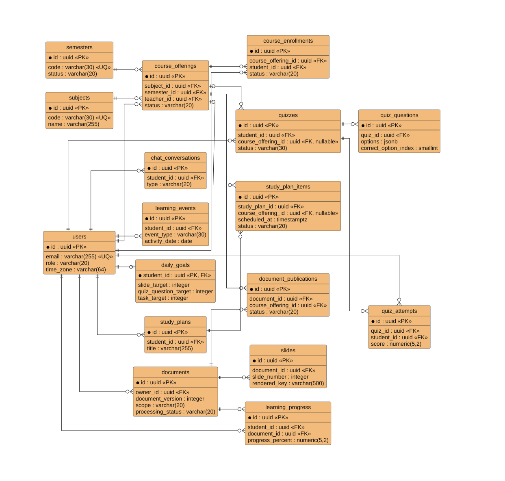

*Hình 3.2. Sơ đồ Entity tổng quan mức logic của StudyFlow.*

Một Course Offering gắn với một Subject, một Semester và một Teacher; Student tham gia qua Course Enrollment. Document là tài nguyên có owner; Document Publication nối học liệu Teacher với lớp, không chuyển quyền sở hữu. Personal PDF không tự trở thành học liệu chung sau khi được dùng cho RAG hoặc Quiz.

Quiz có thể không gắn lớp nên đầu Course Offering có bội số `0..1`. Một Student có `0..1` cấu hình Daily Goal; chưa cấu hình không đồng nghĩa không có quyền học. Quiz đang GENERATING có thể chưa có câu hỏi; Quiz đã READY phải có bộ câu hỏi hợp lệ. Các association trong hình không mặc định cho phép xóa dây chuyền lịch sử.

### 3.2.2. Quy tắc toàn vẹn mức miền

- Conversation Document và Quiz Source giữ `documentVersion` để bảo toàn snapshot. Có FK tới Document không thay thế kiểm tra owner, trạng thái và version hiện tại.
- Page Note thuộc Student và vị trí `documentId + pageNumber`; không phải ghi chú dùng chung của Teacher.
- Quiz Question lưu đúng bốn options, một đáp án chuẩn và source theo trang Personal PDF. Quiz Answer thuộc một attempt và một question; mỗi lần làm lại tạo attempt mới.
- Learning Progress là viewing progress của Course Material PDF theo trang, độc lập với điểm Quiz. Learning Event dùng ngày địa phương do Java xác định theo múi giờ của Student.
- Study Plan Item là nguồn của task/lịch tuần. Calendar, Streak và nội dung cần ôn lại là các phép tổng hợp, không phải ba thực thể lưu trữ mới.

## 3.3. Thiết kế cơ sở dữ liệu chung

### 3.3.1. ERD tổng quan

Hình 3.3 trình bày ERD vật lý tổng quan gồm 27 bảng trong schema `app` và 4 bảng trong schema `ai`, giữ tên cột, kiểu dữ liệu đề xuất và ký hiệu PK/FK để hỗ trợ đối chiếu khi triển khai migration.

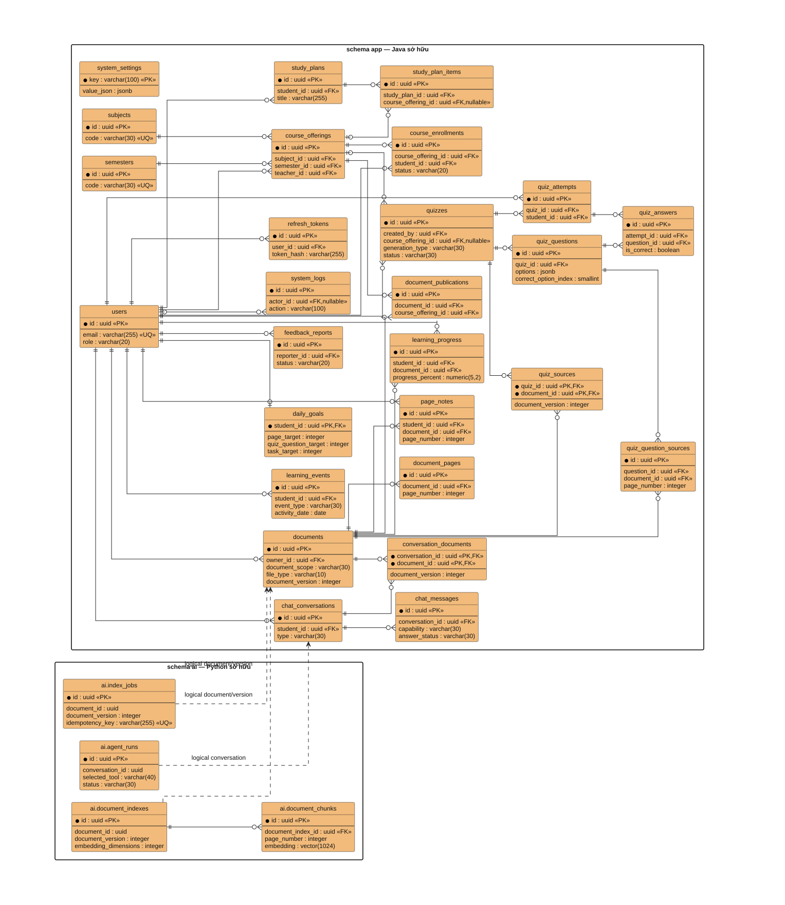

*Hình 3.3. ERD tổng quan: 27 bảng schema app và 4 bảng schema ai.*

Quan hệ chân quạ thể hiện bội số; PK là khóa chính, FK là khóa ngoại và nullable là cho phép NULL. Các định danh document/version/conversation trong schema `ai` là tham chiếu logic từ contract, không tạo FK xuyên sang schema `app`. Hình tổng hợp 31 bảng nên được chèn ở trang ngang hoặc phụ lục khổ lớn; khi cần đọc thuộc tính phải dùng SVG gốc, không ép ảnh xuống một trang dọc.

Đây là thiết kế đề xuất, chưa phải kết quả introspect database đã chạy. Độ dài varchar, precision, nullable và một số khóa ghép phải được chốt bằng migration. [Quy ước sơ đồ](../diagrams/README.md) ghi phạm vi và cách sử dụng ERD vật lý trong báo cáo.

### 3.3.2. Danh mục bảng và dữ liệu chính

| Bảng | Dữ liệu chính / khóa | Vai trò và ràng buộc |
|---|---|---|
| app.users | id, email, username, password_hash, role, status, time_zone | Unique email/username; public registration chỉ tạo Student; không lưu mật khẩu thô |
| app.refresh_tokens | id, user_id, token_hash, expires_at, revoked_at, replaced_by_id | Rotation/revocation theo policy; chỉ lưu hash |
| app.subjects | id, code, name, status | Danh mục môn do Admin quản lý; code unique |
| app.semesters | id, code, start_date, end_date, status, offering_creation_enabled | Ngày kết thúc không trước ngày bắt đầu; Java kiểm điều kiện tạo lớp |
| app.course_offerings | id, subject_id, semester_id, teacher_id, join_code_hash, status | Owner Teacher; code unique theo học kỳ; không log join code |
| app.course_enrollments | id, course_offering_id, student_id, status, decided_by | Unique cặp lớp/Student; PENDING/APPROVED/REJECTED/REMOVED |
| app.documents | id, owner_id, document_scope, file_type, storage_key, document_version, processing_status, page_count | Personal và Course Material chỉ PDF text layer; object key không trả browser |
| app.document_publications | id, document_id, course_offering_id, published_by, status | Unique tài liệu/lớp; PUBLISHED/REVOKED; cùng Teacher owner |
| app.document_pages | id, document_id, page_number, preview_key | Unique tài liệu/số trang; metadata page cho Viewer/Note/progress |
| app.page_notes | id, student_id, document_id, page_number, content | Unique Student/tài liệu/trang; kiểm quyền ở mỗi lần đọc/ghi |
| app.chat_conversations | id, student_id, type, title, status | Hội thoại riêng của owner; loại PERSONAL_ASSISTANT |
| app.conversation_documents | conversation_id, document_id, document_version | Snapshot nguồn; unique hội thoại/tài liệu |
| app.chat_messages | id, conversation_id, role, content, answer_status, citations_json, trace_id | Citation đã được Java validate; không sao chép content vào audit |
| app.learning_progress | id, student_id, document_id, course_offering_id, last_page, viewed_page_count, progress_percent | Unique Student/tài liệu; không lưu mastery |
| app.learning_events | id, student_id, event_type, activity_date, quantity, idempotency_key | Chống ghi trùng; activity_date do Java chốt |
| app.daily_goals | student_id (PK/FK), page_target, quiz_question_target, task_target | Chỉ lưu target; actual tính từ event |
| app.study_plans | id, student_id, thông tin kế hoạch | Owner Student; không có AI tự lập plan |
| app.study_plan_items | id, plan_id, course_offering_id?, trạng thái và lịch | Lớp tùy chọn; nguồn dựng lịch tuần |
| app.quizzes | id, created_by, creator_role, generation_type, course_offering_id?, status, regenerated_from_quiz_id? | Java quản lý lifecycle cho Student Quiz và Teacher Quiz |
| app.quiz_sources | quiz_id, document_id, document_version | Snapshot độc lập với destination của Quiz |
| app.quiz_questions | id, quiz_id, options, correct_option_index, explanation | Options JSONB đúng bốn phần tử; index trong 0..3 |
| app.quiz_question_sources | id, question_id, document_id, page_number, đoạn trích | Căn cứ câu hỏi và điều hướng câu sai |
| app.quiz_attempts | id, quiz_id, student_id, started_at, completed_at, score | Mỗi lượt một bản ghi; bảo toàn lịch sử |
| app.quiz_answers | id, attempt_id, question_id, selected_option_index, is_correct | Unique attempt/question; Java xác định đúng/sai |
| app.feedback_reports | id, reporter_id, nội dung/trạng thái phản hồi | Phục vụ xử lý phản hồi, không cấp quyền đọc dữ liệu riêng |
| app.system_logs | id, actor_id?, action, target_type/id, safe metadata | Audit tối thiểu; không chứa prompt, nội dung tài liệu hoặc secret |
| app.system_settings | key, giá trị cấu hình theo schema | Cấu hình vận hành; không làm kho chứa API key |
| ai.index_jobs | id, request_id, idempotency_key, operation, document/version/pipeline, status, attempt, safe error | Job idempotent; xóa signed URL tạm sau trạng thái kết thúc |
| ai.document_indexes | document/version/pipeline, embedding model/dimensions, status | Quản lý phiên bản chỉ mục; không đồng nhất với document version |
| ai.document_chunks | id, document/version/owner/source, page_number, chunk_index, content, vector(1024) | Filter scope trước cosine; unique document/version/chunk_index |

### 3.3.3. Index, transaction và dữ liệu tổng hợp

B-tree hỗ trợ các truy vấn owner/status, enrollment và scope; HNSW cosine phục vụ tìm kiếm vector. Điều kiện owner/document/version/source phải nằm trong truy vấn retrieval, không tìm toàn bộ rồi chỉ lọc phía ứng dụng.

Java chấm và lưu attempt/answers trong transaction, bảo đảm một lượt nộp chỉ ghi một `QUIZ_COMPLETED`. Hoàn tất task cũng phải chống event trùng. `VIEW_PAGE` khử trùng theo Student, document/page và ngày; các quan hệ unique được nêu trong database plan.

Daily Goal giới hạn target: page 0..100, câu Quiz 0..200, task 0..50 và tổng target > 0. Java tính actual/phần trăm theo ngày. Streak chỉ cần ngày có ít nhất một `VIEW_PAGE`, `STUDY_TASK_COMPLETED` hoặc `QUIZ_COMPLETED`; không bắt buộc hoàn thành Daily Goal.

## 3.4. Thiết kế lớp chi tiết cho chức năng đã chọn

Các lớp dưới đây là thiết kế trách nhiệm đề xuất, không khẳng định tất cả tên lớp đã có trong source. Đường liền là liên hệ sử dụng; đường đứt là dependency. HTTP adapter thể hiện ranh giới service, không phải kế thừa hoặc composition giữa Java và Python.

### 3.4.1. Personal Document Assistant — AI-F01

Hình 3.4 phân chia việc lấy snapshot hội thoại ở Java với retrieval và grounding ở Python.

*Hình 3.4. Biểu đồ lớp xử lý Personal Document Assistant và RAG tools.*

Controller nhận message cùng danh sách Personal PDF đã chọn; application service tải conversation snapshot thuộc owner và dựng `InternalAssistantRequest`. Single Agent chỉ chọn một trong ba tool được allowlist: hỏi đáp, tóm tắt hoặc tạo Quiz. Mỗi tool bắt buộc nhận `AuthorizedScope`; `AssistantResponse` trả capability, trạng thái, nội dung/Quiz draft và citation có cấu trúc, không mang raw provider payload.

### 3.4.2. Course Material PDF Tutor — AI-F02

Hình 3.5 bổ sung MaterialAccessPolicy để thể hiện điều kiện truy cập đặc thù của học liệu lớp.

*Hình 3.5. Biểu đồ lớp xử lý Course Material PDF Tutor.*

Java xác định documentVersion và allowedPageNumbers từ quyền hiện tại. Client không được tự mở rộng page scope. Sau lời gọi AI, Java kiểm tra lại quyền nhằm xử lý publication bị thu hồi trong lúc chờ; citation phải trỏ về page trong scope.

### 3.4.3. Sinh Quiz AI — AI-F03

Hình 3.6 tách tác vụ generation khỏi nghiệp vụ accept và lifecycle.

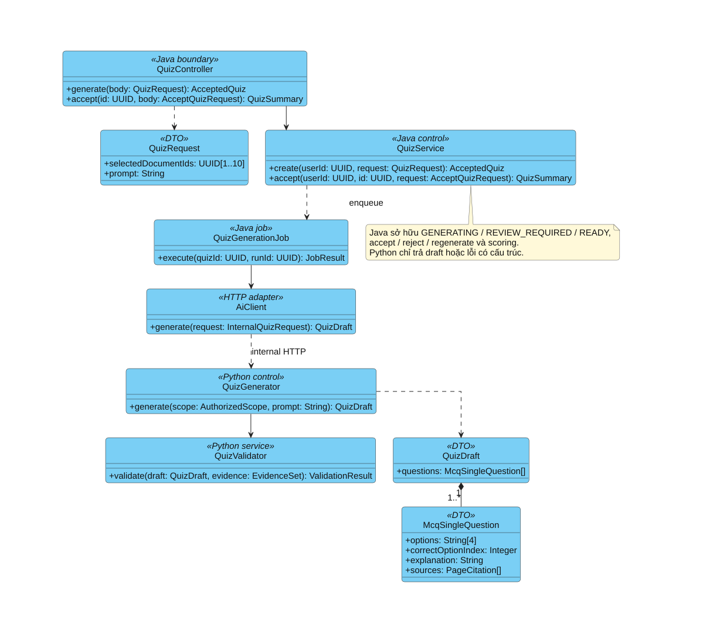

*Hình 3.6. Biểu đồ lớp sinh và tiếp nhận bản nháp Quiz.*

QuizGenerationJob của Java nhận quiz/run identity, gọi Python và xử lý kết quả. Python trả QuizDraft chứa McqSingleQuestion có bốn options, một đáp án và nguồn. Java kiểm tra toàn bộ batch rồi mới lưu REVIEW_REQUIRED. Scoring thuộc Java ở Use Case làm bài; không gộp thành trách nhiệm Python hoặc tự gán cho chức năng chưa được thành viên khác chọn.

### 3.4.4. Contract của các nhóm lớp

| Boundary / input | Output và side effect | Lỗi và cách caller xử lý |
|---|---|---|
| MessageRequest: message bắt buộc 1–2.000 ký tự; conversationId trên URL; 1–10 Personal PDF | AssistantResponse: ANSWERED/SUMMARIZED/QUIZ_CREATED/NEEDS_CLARIFICATION/NO_EVIDENCE; Java lưu chat hoặc Quiz REVIEW_REQUIRED | Validation/access/version lỗi: dừng; provider lỗi: safe error + requestId |
| PageQuestion: question; documentId và page hợp lệ trên URL | AnswerResponse theo page; không cập nhật viewing progress từ ASK_AI | Enrollment/publication/page lỗi: từ chối; không mở rộng scope để thử lại |
| QuizRequest: mode, authorized PDF/version/page scope, count/difficulty/topic | 202 AcceptedQuiz; tạo GENERATING và tác vụ có identity | Nguồn/owner không hợp lệ: không tạo; generation lỗi: GENERATION_FAILED |
| Internal request: credential + headers + AuthorizedScope do Java dựng | Structured result; Python chỉ ghi schema ai trong pipeline cho phép | Sai credential/schema/scope: từ chối; timeout không retry mù mutation |
| QuizGenerationJob: quizId, runId bắt buộc | JobResult; lưu toàn bộ draft hợp lệ hoặc ghi lỗi | Chạy lại không tạo câu hỏi trùng; kết quả run cũ không ghi đè run mới |

Khi triển khai, chữ ký lớp phải dùng DTO/type cụ thể, mô tả args/input/output/errors và có contract test. Các lớp khái quát như EvidenceSet, AuthorizedScope và ValidationResult phải được định nghĩa schema, không thay bằng Object/Any ở ranh giới service.

### 3.4.5. Phần của hai thành viên còn lại

Sáu chức năng BE1-F01..03 và BE2-F01..03 chưa chốt ở Chương 2 nên chưa gán biểu đồ lớp riêng. Khi chốt, mỗi chức năng bổ sung cùng form: trách nhiệm lớp, DTO, dependency, contract, activity, sequence, ngoại lệ và tiêu chí kiểm thử. Các sơ đồ chung trong chương vẫn dùng cho toàn nhóm.

## 3.5. Thiết kế hành vi: Activity, Sequence và State Diagram

Activity làm rõ quyết định nghiệp vụ; Sequence làm rõ thứ tự thông điệp giữa các thành phần; State Diagram làm rõ chuyển trạng thái. Không dùng ba loại hình này thay thế lẫn nhau. Các nhánh lỗi hạ tầng được xử lý bằng error contract; không coi mọi lỗi là thiếu bằng chứng.

### 3.5.1. Activity Personal Document Assistant

Hình 3.7 mô tả thứ tự kiểm quyền, retrieval, evidence gate và kiểm tra câu trả lời.

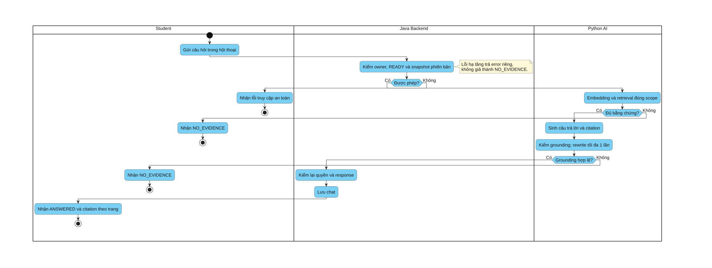

*Hình 3.7. Hoạt động Single Agent chọn tool hỏi đáp, tóm tắt hoặc tạo Quiz.*

Nhánh thiếu bằng chứng kết thúc bằng NO_EVIDENCE trước bước sinh câu trả lời. Nhánh có bằng chứng vẫn phải qua grounding validation; rewrite bị giới hạn một lần và không được đổi nguồn. Quyền không hợp lệ làm luồng dừng trước retrieval. Các swimlane Student, Java Backend và Python AI chỉ rõ thành phần chịu trách nhiệm ở từng bước.

### 3.5.2. Activity Course Material PDF Tutor

Hình 3.8 thể hiện Tutor trong phạm vi Course Material PDF đã công bố cho Student được duyệt.

*Hình 3.8. Hoạt động hỏi đáp Course Material PDF theo trang.*

Khác với Personal Assistant kiểm owner, Tutor kiểm enrollment và publication. Page hiện tại định hướng retrieval nhưng không thay thế allowed scope. Kết quả trả Viewer có citation theo trang; ASK_AI không duy trì Streak.

### 3.5.3. Activity sinh Quiz

Hình 3.9 mô tả tạo bản nháp, kiểm tra và bàn giao quyền quyết định cho Student hoặc Teacher theo đúng chế độ sinh Quiz.

*Hình 3.9. Hoạt động sinh và review Quiz AI.*

Java tạo GENERATING và trả 202 để giao diện không giữ request chờ sinh đề. Python kiểm tra schema và grounding; Java là lớp kiểm tra cuối trước REVIEW_REQUIRED. Student review rồi accept/reject; Teacher có thể sửa rồi publish/reject. Không có đường từ output LLM tới làm bài trực tiếp.

### 3.5.4. Sequence Personal Document Assistant

Hình 3.10 xác định thứ tự message qua Web, Java, Python, pgvector và provider.

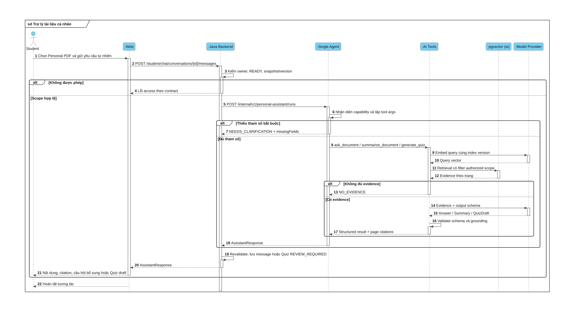

*Hình 3.10. Tương tác tuần tự của Personal Document Assistant.*

Khung alt phân biệt sai quyền, thiếu tool args, thiếu evidence và có evidence. Single Agent chọn tool, nhưng Java vẫn dựng scope và revalidate kết quả. Query embedding xảy ra trước tìm kiếm; khi thiếu bằng chứng, tool không được sinh answer/summary/Quiz không có nguồn.

### 3.5.5. Sequence Course Material PDF Tutor

Hình 3.11 gắn tương tác hỏi PDF với public endpoint hiện hành và scope do Java cấp.

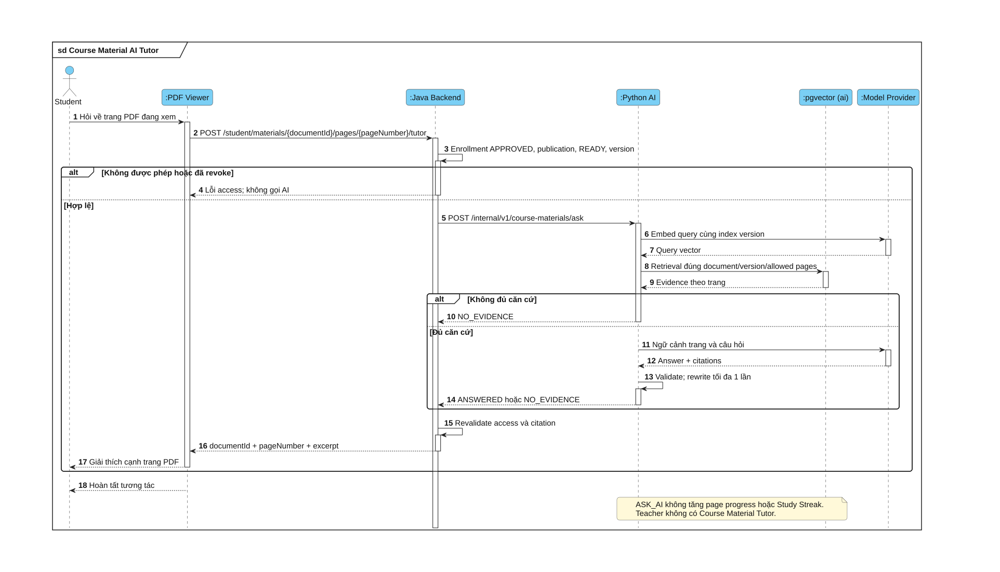

*Hình 3.11. Tương tác tuần tự của Course Material PDF Tutor.*

Public endpoint là `POST /api/v1/student/materials/{documentId}/pages/{number}/tutor`. Mỗi lần hỏi phải kiểm tra quyền hiện tại; conversation không cho phép bỏ kiểm tra publication. Citation dùng documentId và pageNumber.

### 3.5.6. Sequence tạo và duyệt Quiz

Hình 3.12 phân biệt response 202 ban đầu, tác vụ generation và thao tác accept sau đó.

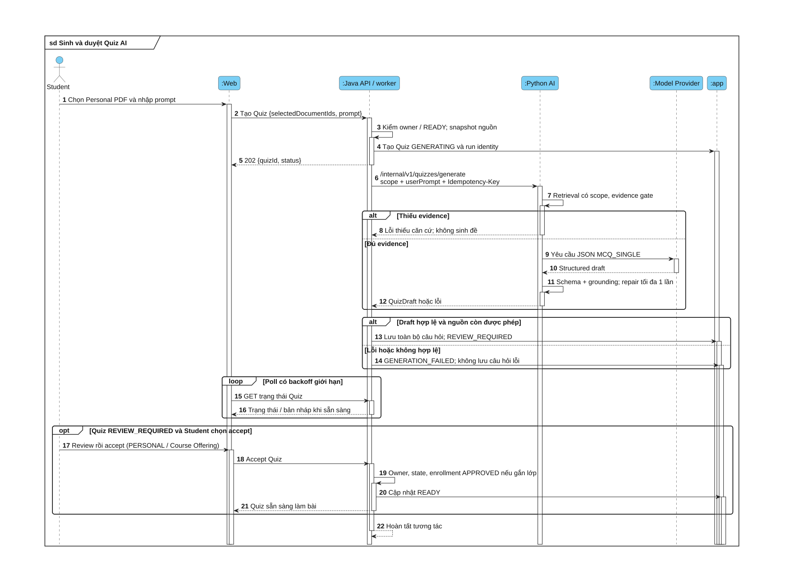

*Hình 3.12. Tương tác tạo bản nháp và duyệt Quiz cho Student/Teacher.*

FE chỉ poll Java. Idempotency/run identity ngăn việc retry hoặc timeout tạo nhiều bộ câu hỏi cho cùng tác vụ. Student accept Quiz cá nhân sang `READY`; Teacher review/chỉnh sửa rồi publish Quiz lớp sang `PUBLISHED`. Nguồn Personal PDF không bị chuyển thành học liệu lớp.

### 3.5.7. Luồng chung: tham gia lớp học phần

Hình 3.13 thể hiện điều kiện chuyển từ yêu cầu tham gia sang quyền học tập.

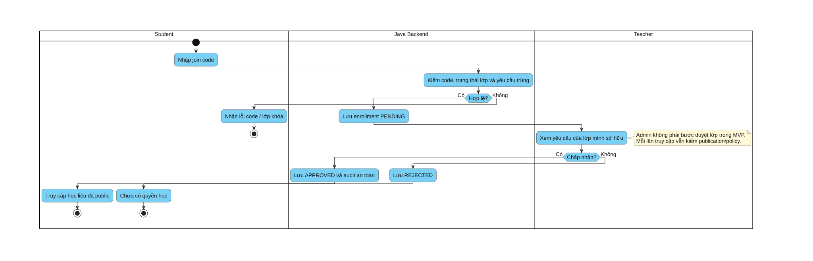

*Hình 3.13. Hoạt động tham gia và xét duyệt Course Enrollment.*

Student không tự đặt APPROVED; Teacher owner quyết định yêu cầu. Sau khi được duyệt, từng lần truy cập học liệu vẫn phải kiểm publication và chính sách lock/archive, không cấp quyền vĩnh viễn chỉ vì từng tham gia lớp.

### 3.5.8. Luồng chung: xử lý tài liệu bất đồng bộ

Hình 3.14 áp dụng cho Personal PDF và Course Material PDF; cả hai được index theo trang với `sourceType` riêng.

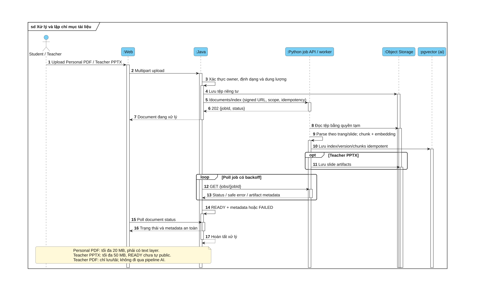

*Hình 3.14. Tiếp nhận, lập chỉ mục và đồng bộ trạng thái tài liệu.*

Python nhận job và trả 202 trước khi worker chạy. Java poll job để lấy trạng thái, sau đó cập nhật document. Chỉ PDF text layer được nhận; document READY vẫn cần Teacher chủ động public. PDF mã hóa hoặc không có text layer chuyển lỗi tương ứng.

### 3.5.9. Luồng chung: vòng đời Quiz

Hình 3.15 biểu diễn trạng thái Quiz độc lập với các attempt làm bài.

*Hình 3.15. Trạng thái Quiz và điều kiện chuyển trạng thái.*

GENERATING chỉ chuyển REVIEW_REQUIRED khi toàn bộ draft hợp lệ. Student accept để chuyển `READY`; Teacher publish để chuyển `PUBLISHED`. Thao tác làm bài không đưa Quiz về GENERATING mà tạo attempt mới. Regenerate tạo một Quiz khác và giữ lịch sử. Java chấm Quiz và ghi event một lần, không dùng model AI để chấm.

### 3.5.10. Luồng chung: Kế hoạch & Lịch

Hình 3.16 mô tả việc Student chủ động tạo task/lịch từ lịch tuần và hoàn tất task.

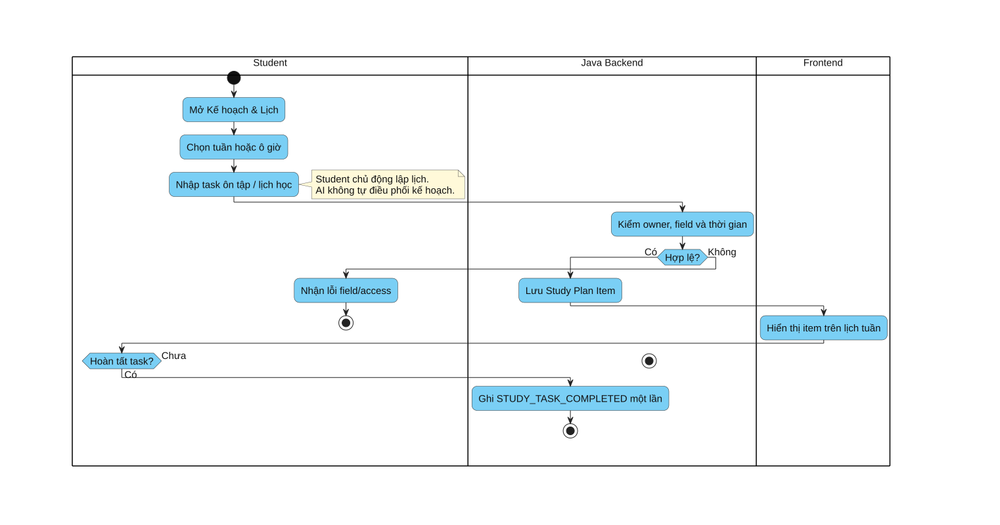

*Hình 3.16. Hoạt động quản lý task và lịch tuần.*

Java kiểm owner và dữ liệu trước khi lưu plan item. Lịch tuần phản ánh các item, không tự tạo thêm learning event. Chỉ thao tác hoàn tất task hợp lệ mới ghi STUDY_TASK_COMPLETED và phải chống ghi trùng; AI không tự điều phối lịch.

### 3.5.11. Luồng chung: Dashboard và sự kiện học tập

Hình 3.17 phân biệt ghi nhận hoạt động với tính Streak, Daily Goal và viewing progress.

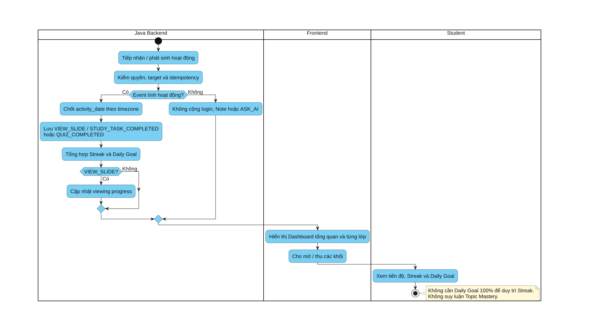

*Hình 3.17. Tổng hợp sự kiện học tập cho Dashboard.*

Java chốt ngày theo timezone và khử trùng event trước khi tổng hợp. Chỉ ba loại sự kiện học hợp lệ duy trì Streak; Note, đăng nhập và ASK_AI không được tính. Dashboard chứa toàn bộ tiến độ chung/từng lớp và hỗ trợ mở/thu các khối; không có trang tiến độ riêng.

## 3.6. Thiết kế bảo mật và phân quyền

### 3.6.1. Ma trận quyền theo tài nguyên

| Tài nguyên | Student | Teacher | Admin | Python |
|---|---|---|---|---|
| Course Offering / enrollment | Gửi yêu cầu, xem lớp được phép | Tạo/quản lý lớp sở hữu; duyệt enrollment | Danh mục, giám sát/khóa theo policy | Không truy cập bảng app |
| Course Material PDF public | Viewer/Page Note/Tutor khi APPROVED | Upload, publish/revoke và dùng làm nguồn Teacher Quiz | Giám sát metadata | Xử lý/index đúng scope |
| Personal PDF / chat | Chỉ owner | Không đọc mặc định | Không đọc mặc định | Chỉ scope Java cấp cho request/job |
| Quiz / attempt / kết quả | Student tạo/review/làm Quiz cá nhân/lớp | Teacher tạo/review/publish Quiz lớp | Không quản lý Quiz cá nhân | Chỉ trả draft có nguồn; không chấm |
| Dashboard / Note / Plan | Owner xem và thao tác được phép | Không quản lý học tập riêng | Không sửa progress cá nhân | Không tính điểm, progress, plan |

### 3.6.2. Kiểm soát dữ liệu và truy cập

RBAC chỉ là lớp đầu; mọi thao tác cần kiểm tra ownership, enrollment, publication, version và trạng thái tài nguyên. Frontend route guard không thay thế kiểm tra ở Java. Signed URL/preview PDF có thời hạn ngắn và chỉ cấp sau kiểm quyền; revoke có hiệu lực chắc chắn ở request kế tiếp.

Tài liệu/prompt/output mô hình là dữ liệu không tin cậy. Pipeline phải giới hạn loại tệp/kích thước, kiểm schema, tách instruction khỏi evidence, chặn nguồn ngoài scope và không thực thi nội dung tài liệu như lệnh. HTTP error không chứa raw provider payload, object key, token hoặc nội dung riêng.

Credential, API key và database password không đưa vào source hoặc báo cáo. Audit chỉ ghi actor/action/target, kết quả và requestId an toàn. Cookie/token policy phải được kiểm thử cùng CSRF/XSS và session revocation; không tuyên bố một cờ cookie đơn lẻ loại bỏ toàn bộ các rủi ro đó.

### 3.6.3. Kế hoạch xác minh thiết kế

| Nhóm | Kiểm tra tối thiểu | Minh chứng cần lưu khi chạy |
|---|---|---|
| Contract | Input hợp lệ/không hợp lệ/output schema; headers và scope | Kết quả contract test hai phía, phiên bản schema |
| Isolation | Owner/document/version/allowed pages; revoke trong khi chờ AI | Test dữ liệu tổng hợp, safe requestId |
| RAG/Tutor | Retrieval relevance, groundedness, citation, refusal, prompt injection | Dataset version, reference evidence, rubric và kết quả theo từng nhóm câu hỏi |
| Quiz | Bốn options, một đáp án, nguồn đúng, repair giới hạn; accept/attempt/event | Test schema + nghiệp vụ và mẫu lỗi có kiểm soát |
| Job | 202/poll, timeout, retry/idempotency; không chunk trùng | Trạng thái job và số bản ghi tổng hợp, không log content |
| UI/end-to-end | Ba role, upload policy, citation, review/accept, Dashboard và lịch tuần | Test flow và ảnh chụp dữ liệu demo có nhãn |
| Phi chức năng | Responsive, keyboard, latency, tải đồng thời và phân quyền | Cấu hình môi trường, cỡ mẫu, cách đo và phân vị latency |

Không đưa các số Recall, Factual Correctness hoặc latency trong bản nháp cũ thành kết quả thực nghiệm nếu chưa có log đánh giá hợp lệ. Đánh giá câu trả lời cần tách khả năng tìm đúng evidence khỏi độ đúng/bám nguồn của generation; câu không thể trả lời phải được chấm theo khả năng từ chối, không chỉ so khớp câu trả lời chuẩn. Chi tiết rubric và cách tạo bộ kiểm thử nằm trong kế hoạch AI, không mặc định hệ thống có sẵn 100–200 câu trắc nghiệm giảng viên cung cấp.

## 3.7. Tổng kết chương

Chương 3 chuyển yêu cầu thành kiến trúc, mô hình dữ liệu và thiết kế hành vi có thể kiểm thử. Phần chung gồm kiến trúc, entity, ERD, enrollment, xử lý tài liệu, lifecycle Quiz và phân quyền. Ba chức năng AI được mô tả thống nhất bằng lớp, activity và sequence, làm rõ authorized scope, evidence gate và ranh giới nghiệp vụ Java/Python.

Bộ hình tham khảo màu sắc theo từng loại biểu đồ trong hướng dẫn Visual Paradigm và có câu dẫn, chú thích, giải thích đi kèm; không quy định bắt buộc màu xám. Sáu chức năng của hai thành viên còn lại vẫn chờ nhóm lựa chọn; cần bổ sung biểu đồ chuyên sâu theo cùng form. Thiết kế không đồng nghĩa với tính năng đã hoàn tất, database đã migrate hoặc chất lượng AI đã đạt KPI; các kết luận đó thuộc phần cài đặt và đánh giá có minh chứng.
