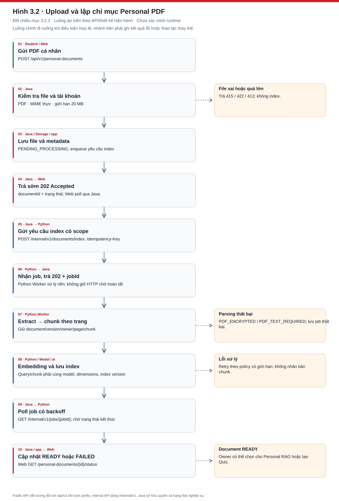
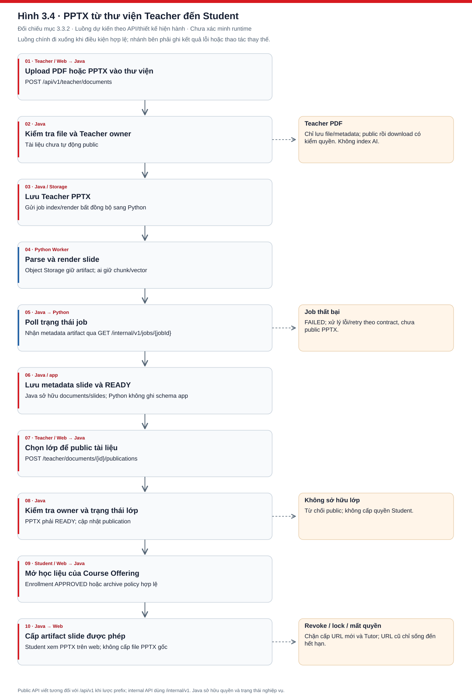
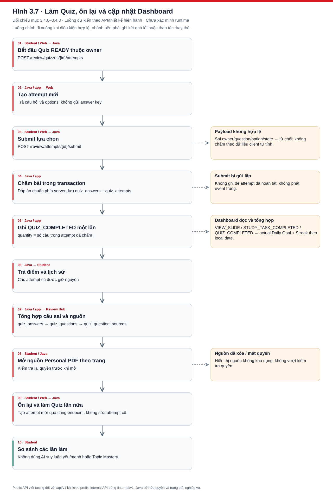

# CHƯƠNG 3. THIẾT KẾ CHI TIẾT VÀ CÀI ĐẶT CÁC CHỨC NĂNG TRỌNG TÂM

Chương này trình bày thiết kế chi tiết cho ba chức năng có hàm lượng kỹ thuật cao của StudyFlow: hỏi đáp tài liệu cá nhân bằng RAG, Slide AI Tutor và tạo Quiz AI kết hợp ôn tập. Tại thời điểm biên soạn, các service mới ở giai đoạn cấu trúc và kế hoạch; vì vậy nội dung về module, thuật toán và dữ liệu dưới đây là thiết kế triển khai đã chốt, còn kết quả chạy, ảnh giao diện và số liệu đo thực tế chỉ được bổ sung sau khi có minh chứng từ hệ thống.

## 3.1. Môi trường và công nghệ cài đặt

### 3.1.1. Môi trường phát triển

| Thành phần | Công nghệ mục tiêu | Vai trò |
|---|---|---|
| Frontend | Next.js, TypeScript, Tailwind CSS | Giao diện Student, Teacher và Admin |
| Backend | Java Spring Boot | Xác thực, phân quyền và nghiệp vụ |
| AI Service | Python FastAPI | Xử lý tài liệu, retrieval, RAG, Tutor và sinh Quiz |
| Database | PostgreSQL | Dữ liệu nghiệp vụ trong schema `app` |
| Vector Search | PostgreSQL + pgvector | Chỉ mục và vector trong schema `ai` |
| Object Storage | S3-compatible storage | PDF, PPTX và artifact slide |
| LLM | Provider tương thích OpenAI API | Sinh câu trả lời và Quiz có cấu trúc |
| Embedding | `text-embedding-3-large`, 1024 chiều theo kế hoạch | Biểu diễn truy vấn và chunk |

Phiên bản runtime, thư viện parser, model/provider và thông số retrieval phải được lấy từ bản build thực tế trước khi xuất báo cáo cuối. Không đưa API key, service credential hoặc dữ liệu người dùng vào báo cáo.

### 3.1.2. Cấu trúc triển khai

```text
Student / Teacher / Admin
           │ HTTPS
           ▼
       Next.js Web
           │ /api/v1
           ▼
    Spring Boot Backend ─────► PostgreSQL schema app
           │                 └► Object Storage
           │ /internal/v1
           ▼
     FastAPI AI Service ─────► PostgreSQL schema ai + pgvector
           └─────────────────► LLM / Embedding Provider
```

*Hình 3.1. Kiến trúc triển khai dự kiến của StudyFlow.*

Frontend chỉ gọi Java Backend. Java là system of record và chịu trách nhiệm xác thực, phân quyền, vòng đời Quiz, chấm điểm và tiến độ. Python chỉ nhận authorized scope do Java cấp để xử lý tài liệu, retrieval, generation và citation. Hai service dùng chung PostgreSQL cluster nhưng tách schema và database role.

## 3.2. Hỏi đáp tài liệu cá nhân bằng RAG

### 3.2.1. Mục tiêu

Student tải PDF cá nhân có lớp văn bản, chờ trạng thái `READY`, chọn từ một đến mười tài liệu rồi tạo cuộc hội thoại. Câu trả lời chỉ được dựa trên phiên bản tài liệu đã chọn và phải có citation theo trang. Khi bằng chứng không đủ, hệ thống trả `NO_EVIDENCE` thay vì dùng kiến thức ngoài nguồn.

### 3.2.2. Xử lý và lập chỉ mục PDF

Java kiểm tra quyền sở hữu, MIME, kích thước và trạng thái tệp, lưu file vào Object Storage rồi gọi `POST /internal/v1/documents/index` với request ID, schema version, service credential và idempotency key. Python tiếp nhận job bất đồng bộ, tải file qua URL có thời hạn, kiểm tra PDF mã hóa hoặc không có text, trích xuất theo trang, chia chunk, tạo embedding và ghi chỉ mục. Java thăm dò `GET /internal/v1/jobs/{jobId}` để cập nhật `READY` hoặc `FAILED` bằng mã lỗi an toàn như `PDF_ENCRYPTED` và `PDF_TEXT_REQUIRED`.



*Hình 3.2. Luồng upload và lập chỉ mục Personal PDF.*

Mỗi chunk giữ tối thiểu `documentId`, `documentVersion`, `ownerId`, `pageNumber`, `chunkIndex`, nội dung và embedding. Chunking không được nối nội dung qua ranh giới trang nếu điều đó làm mất khả năng truy ngược citation. Kích thước chunk, overlap và Top-K là tham số cần benchmark, không cố định trong báo cáo trước khi đo.

### 3.2.3. Thiết kế dữ liệu

```text
app.documents (document_version, owner_id, status)
       │ document_id + document_version
       ▼
ai.document_indexes (model, dimensions, index_version, status)
       │ index_id
       ▼
ai.document_chunks (page_number, chunk_index, content, embedding)

app.chat_conversations ──< app.conversation_documents
       └─────────────────< app.chat_messages
```

StudyFlow không tạo bảng `document_versions` riêng trong MVP. `documents.document_version` xác định phiên bản nghiệp vụ; index và chunk luôn mang cùng document/version để tránh truy xuất nhầm dữ liệu cũ. Schema `app` do Java sở hữu, schema `ai` do Python sở hữu. Conversation lưu snapshot phạm vi tài liệu; message request không cho client tự chèn thêm document ID.

### 3.2.4. Thuật toán retrieval

```text
Input: question, conversationId, authorizedDocuments[]

1. validateScope(authorizedDocuments)
2. normalizedQuery = normalize(question, allowedConversationHistory)
3. queryVector = embed(normalizedQuery)
4. chunks = vectorSearch(
       vector=queryVector,
       filters=documentId + version + owner + sourceType,
       topK=K,
       distance=COSINE
   )
5. chunks = postFilterAndDeduplicate(chunks, authorizedDocuments)
6. evidenceSnapshot = freeze(chunks)
7. if evidenceGate(evidenceSnapshot) == FAIL:
       return NO_EVIDENCE
8. context = buildUntrustedContext(evidenceSnapshot)
9. draft = generate(question, context)
10. result = validateClaimsAndCitations(draft, evidenceSnapshot)
11. if result không đạt: rewrite tối đa một lần
12. return ANSWERED + citations hoặc NO_EVIDENCE
```

Filter được đẩy xuống truy vấn vector và kiểm tra lại sau retrieval để phòng thủ nhiều lớp. Nội dung chunk được xem là dữ liệu không tin cậy, không phải instruction. Evidence snapshot dùng cho generation cũng chính là snapshot dùng để đánh giá grounding; hệ thống không retrieval lần hai khi chấm để tránh thay đổi bằng chứng.

### 3.2.5. Sinh câu trả lời và citation

Prompt gồm system rules, câu hỏi và evidence snapshot đã đánh dấu ranh giới. Kết quả nội bộ ánh xạ claim về `chunkId`; citation hiển thị được dựng bằng code từ chunk đã truy xuất, gồm `documentId`, tên tài liệu, `pageNumber` và excerpt. Python kiểm tra citation thuộc snapshot; Java kiểm tra lại owner, document/version và vị trí trước khi lưu message.

Citation hợp lệ không chỉ là ID tồn tại. Đoạn nguồn phải thực sự hỗ trợ claim gắn với nó. Claim quan trọng được phân loại `SUPPORTED`, `PARTIALLY_SUPPORTED`, `UNSUPPORTED` hoặc `CONTRADICTED`; claim thiếu căn cứ phải bị loại bỏ, sửa tối đa một lần hoặc làm response chuyển thành `NO_EVIDENCE`.

### 3.2.6. Xử lý `NO_EVIDENCE`

Evidence gate chạy trước LLM. Nếu không có chunk phù hợp hoặc bằng chứng không đạt ngưỡng, hệ thống không gọi model để đoán. Sau generation, grounding check có thể tiếp tục hạ kết quả thành `NO_EVIDENCE` nếu câu trả lời không được snapshot hỗ trợ.


*Hình 3.3. Luồng Personal RAG có kiểm tra phạm vi, bằng chứng và citation.*

### 3.2.7. Cấu trúc cài đặt dự kiến

```text
Spring Boot
├── document/api/PersonalDocumentController
├── document/application/PersonalDocumentService
├── conversation/api/PersonalRagController
├── conversation/application/PersonalRagService
└── integration/ai/AiServiceClient
                         │ internal HTTP
FastAPI                  ▼
├── api/routes/documents.py
├── api/routes/personal_rag.py
├── services/indexing.py
├── services/embedding.py
├── services/retrieval.py
├── services/rag.py
├── repositories/vector.py
└── workers/index_worker.py
```

Tên lớp/module trên là cấu trúc mục tiêu, chưa phải khẳng định source đã tồn tại. Controller chỉ xử lý contract HTTP; application service xác minh quyền và điều phối; AI client cô lập contract nội bộ. Phía Python, route validate schema, worker thực hiện index, repository áp dụng scope filter, còn RAG service quản lý evidence gate, generation và citation.

### 3.2.8. Kết quả và giao diện thực tế

Khi triển khai xong, phần kết quả phải nêu rõ commit/build, endpoint đã chạy, trạng thái index, retrieval và response contract. Phần giao diện phải có ảnh liên tiếp: Upload → `PROCESSING` → `READY` → chọn tài liệu → hỏi → Answer + Citation, đồng thời có một trường hợp `NO_EVIDENCE`.

Hiện chưa có code chạy và ảnh chụp runtime đã kiểm chứng, nên báo cáo chưa tuyên bố chức năng hoàn thành. Nội dung này sẽ được thay bằng minh chứng thực tế, không dùng mock hoặc sơ đồ thiết kế làm kết quả cài đặt.

## 3.3. Slide AI Tutor

### 3.3.1. Mục tiêu

Slide AI Tutor cho phép Student có enrollment `APPROVED` hỏi trong lúc xem PPTX được Teacher public. Hệ thống ưu tiên slide hiện tại, chỉ truy xuất trong document/version và các slide được cấp quyền, rồi trả citation theo slide. PDF của Teacher chỉ tải xuống và không tham gia Tutor.

### 3.3.2. Xử lý PPTX

Teacher upload PPTX vào thư viện của mình. Java kiểm tra ownership và trạng thái Course Offering; Python parse nội dung, render artifact từng slide, chia chunk theo slide, tạo embedding và trả metadata job. Java chỉ cho public khi tài liệu `READY`; Student xem artifact qua endpoint có kiểm quyền chứ không nhận storage key trực tiếp.



*Hình 3.4. Luồng xử lý và public PPTX từ thư viện Teacher đến Student.*

### 3.3.3. Thiết kế dữ liệu

```text
app.documents (type=PPTX, teacher_owner_id, document_version)
       ├──< app.slides (slide_number, artifact metadata)
       └──< app.document_publications >── app.course_offerings

ai.document_indexes
       └──< ai.document_chunks (source_type=TEACHER_SLIDE, slide_number)

app.slide_notes (student_id, document_id, slide_number)
```

Publication quyết định PPTX xuất hiện ở Course Offering nào. Enrollment và publication nằm trong Java; Python không đọc trực tiếp bảng user hoặc enrollment. Chunk slide giữ document/version, `slideNumber` và source type để tạo citation chính xác.

### 3.3.4. Xác định ngữ cảnh slide

Browser chỉ gửi câu hỏi tại route của slide. Java suy ra `courseOfferingId`, `documentId`, version, slide hiện tại và allowed slide scope sau khi kiểm tra enrollment `APPROVED`, publication còn hiệu lực và trạng thái document. Client không được tự khai báo owner hoặc mở rộng phạm vi.

### 3.3.5. Authorized Scope và retrieval

Retrieval dùng cùng nguyên tắc với Personal RAG nhưng filter theo `TEACHER_SLIDE`, document/version và allowed slides. Current slide được ưu tiên trong ranking; slide lân cận hoặc liên quan chỉ được dùng nếu còn trong authorized scope. Nếu publication bị revoke, enrollment không hợp lệ hoặc evidence thiếu, hệ thống từ chối hoặc trả `NO_EVIDENCE` trước generation.

### 3.3.6. Sinh câu trả lời và citation

Output có `status`, `answer`, `citations[]` và `traceId`. Mỗi citation chứa `documentId`, `slideNumber` và excerpt được dựng từ retrieved chunk. Java revalidate mọi citation trước khi trả browser. Nội dung slide không được phép thay đổi system rule hoặc yêu cầu truy cập nguồn khác.


*Hình 3.5. Luồng hỏi đáp Slide AI Tutor trong phạm vi được cấp quyền.*

### 3.3.7. Cấu trúc cài đặt dự kiến

```text
Spring Boot
├── document/application/TeacherDocumentService
├── slide/api/StudentSlideController
├── slide/application/SlideAccessService
├── note/application/SlideNoteService
└── integration/ai/AiServiceClient
                         │
FastAPI                  ▼
├── api/routes/slides.py
├── pipelines/pptx_parser.py
├── services/slide_indexing.py
├── services/retrieval.py
├── services/slide_tutor.py
└── workers/index_worker.py
```

Java sở hữu access check và artifact delivery; Python sở hữu parse, index và generation. Tên module là thiết kế mục tiêu và sẽ được hiệu chỉnh theo source thực tế mà không thay đổi boundary.

### 3.3.8. Kết quả và giao diện thực tế

Minh chứng cần có hai nhóm: (1) trạng thái xử lý/public PPTX và contract Tutor; (2) ảnh Slide Viewer với slide hiện tại, Note, câu hỏi, câu trả lời, citation và trường hợp bị từ chối hoặc `NO_EVIDENCE`. Hiện chưa có runtime evidence nên chưa điền kết quả đạt/không đạt.

## 3.4. AI Quiz và hỗ trợ ôn tập

### 3.4.1. Tiếp nhận yêu cầu

Student chọn từ một đến mười Personal Document `READY` và nhập prompt tự do, ví dụ yêu cầu số lượng, chủ đề hoặc độ khó. Java tải lại ownership, status và version; Quiz được tạo ở trạng thái `GENERATING`. Prompt là dữ liệu không tin cậy, không thể thay system rule, `MCQ_SINGLE`, authorized scope, citation hoặc output schema.

### 3.4.2. Retrieval

Python nhúng prompt hoặc truy vấn đã chuẩn hóa, tìm evidence trong đúng document/version được cấp, lọc trùng và lưu source metadata. Quiz không phụ thuộc conversation/chat context. Nếu không có bằng chứng phù hợp, generation thất bại an toàn thay vì tạo câu hỏi từ kiến thức nền của model.

### 3.4.3. Prompt

System instruction bắt buộc mỗi câu là `MCQ_SINGLE`, có đúng bốn phương án, đúng một `correctOptionIndex`, explanation và nguồn. Retrieved context được delimit như dữ liệu. User prompt chỉ điều khiển nội dung hợp lệ như số câu, trọng tâm và độ khó trong giới hạn hệ thống.

### 3.4.4. Structured Output

```json
{
  "questions": [
    {
      "question": "Nội dung câu hỏi",
      "options": ["A", "B", "C", "D"],
      "correctOptionIndex": 1,
      "explanation": "Giải thích đáp án",
      "sources": [
        {"documentId": "doc_...", "pageNumber": 25, "chunkId": "chunk_..."}
      ]
    }
  ]
}
```

Python trả structured draft; Java không tin cậy output này mà validate lại trước khi lưu `quiz_questions` và `quiz_question_sources`.

### 3.4.5. Validation, retry và xử lý lỗi

```text
LLM output → Parse JSON → Validate schema
                            ├─ hợp lệ → Validate từng câu và source
                            │             ├─ đạt → REVIEW_REQUIRED
                            │             └─ lỗi sửa được → repair tối đa 1 lần
                            └─ không hợp lệ → repair tối đa 1 lần
                                                   ├─ đạt → REVIEW_REQUIRED
                                                   └─ không đạt → GENERATION_FAILED
```

Validation kiểm tra số lượng, đúng bốn option không rỗng/không trùng, chỉ số đáp án trong khoảng `0..3`, explanation có nội dung và mọi citation thuộc authorized evidence snapshot. Retry phải có giới hạn và cùng request/run identity để không tạo Quiz trùng. Timeout không được retry mù. Lỗi trả mã an toàn và trace ID, không trả prompt nội bộ hay provider payload.

### 3.4.6. Review Quiz

Quiz hợp lệ chuyển `REVIEW_REQUIRED`; Student xem câu hỏi, đáp án, explanation và nguồn rồi Accept, Reject hoặc Regenerate. Accept đưa Quiz sang `READY` và gắn vào Course Offering có enrollment `APPROVED` hoặc giữ là Quiz cá nhân. Nguồn sinh Quiz và nơi ôn tập là hai khái niệm độc lập.


*Hình 3.6. Luồng sinh, kiểm tra, review và chấp nhận Quiz AI.*

### 3.4.7. Làm bài và chấm điểm

Mỗi lần bắt đầu tạo một `quiz_attempt` mới. Khi submit, Java so sánh lựa chọn với `correctOptionIndex`, lưu từng `quiz_answer`, tính điểm theo quy tắc kiểm thử được và phát `QUIZ_COMPLETED` idempotent. LLM không tham gia chấm điểm và attempt đã hoàn thành không bị ghi đè.

### 3.4.8. Xác định nội dung cần ôn

```text
quiz_answers sai
   → quiz_questions
   → quiz_question_sources
   → document + pageNumber
   → nội dung cần ôn lại
   → mở nguồn và làm attempt mới
```

Review item được tổng hợp bằng truy vấn xác định từ câu trả lời sai và nguồn câu hỏi. Hệ thống không dùng AI suy luận Student yếu/mạnh và không triển khai Topic Mastery trong MVP.



*Hình 3.7. Luồng làm Quiz, xác định nội dung cần ôn lại và cập nhật dữ liệu Dashboard.*

### 3.4.9. Cấu trúc cài đặt dự kiến

```text
Spring Boot
├── quiz/api/QuizController
├── quiz/application/QuizGenerationService
├── quiz/application/QuizReviewService
├── quiz/application/QuizAttemptService
├── review/application/WrongAnswerReviewService
└── integration/ai/AiQuizClient
                         │
FastAPI                  ▼
├── api/routes/quizzes.py
├── schemas/quiz.py
├── services/retrieval.py
├── services/quiz_generation.py
└── services/output_validation.py
```

Quiz lifecycle, persistence và scoring ở Java; Python chỉ tạo draft có nguồn. Đây là cấu trúc mục tiêu, không phải danh sách class đã hoàn thành.

### 3.4.10. Kết quả và giao diện thực tế

Kết quả backend cần chứng minh các chuyển trạng thái `GENERATING → REVIEW_REQUIRED → READY` và nhánh `GENERATION_FAILED`, validation bốn phương án, scoring và attempt history. Ảnh giao diện cần thể hiện chọn tài liệu, nhập prompt, Review, Accept, làm bài, kết quả, câu sai và mở nguồn. Hiện các bằng chứng này chưa tồn tại trong repository nên chưa được ghi là đã hoàn thành.

## 3.5. Kiểm thử và đánh giá

### 3.5.1. Phương pháp

Kiểm thử được chia thành unit, integration, contract, end-to-end và AI evaluation. Unit test dùng parser input tổng hợp và fake provider; không gọi model thật. Contract test bắt buộc có input hợp lệ, input sai và kiểm tra output schema. Evaluation gọi đúng entry point của pipeline mục tiêu và dùng evidence snapshot đã thực sự truyền vào generation.

### 3.5.2. Personal RAG

| Mã | Trường hợp | Kết quả mong đợi |
|---|---|---|
| RAG-01 | Câu hỏi có bằng chứng | `ANSWERED`, citation đúng trang |
| RAG-02 | Không đủ bằng chứng | `NO_EVIDENCE`, không đoán |
| RAG-03 | Document không thuộc owner | Từ chối trước retrieval |
| RAG-04 | Document chưa `READY` | Không cho tạo scope |
| RAG-05 | Chọn nhiều PDF | Chỉ truy xuất trong snapshot đã chọn |
| RAG-06 | Prompt injection trong PDF | Không đổi instruction hoặc scope |

### 3.5.3. Slide AI Tutor

| Mã | Trường hợp | Kết quả mong đợi |
|---|---|---|
| TUTOR-01 | Hỏi nội dung slide hiện tại | Answer và citation đúng slide |
| TUTOR-02 | Không đủ evidence | `NO_EVIDENCE` |
| TUTOR-03 | Enrollment chưa `APPROVED` | Từ chối |
| TUTOR-04 | Publication đã revoke | Không truy cập artifact/Tutor |
| TUTOR-05 | Citation ngoài allowed slides | Output bị từ chối |

### 3.5.4. AI Quiz

| Mã | Trường hợp | Kết quả mong đợi |
|---|---|---|
| QUIZ-01 | Prompt hợp lệ | Draft chuyển `REVIEW_REQUIRED` |
| QUIZ-02 | Model trả JSON sai | Repair tối đa một lần hoặc `GENERATION_FAILED` |
| QUIZ-03 | Option thiếu/trùng | Không lưu draft cho Student dùng |
| QUIZ-04 | Citation ngoài scope | Java từ chối output |
| QUIZ-05 | Accept Quiz | `READY`, destination hợp lệ |
| QUIZ-06 | Submit attempt | Java chấm đúng và không ghi đè history |
| QUIZ-07 | Câu trả lời sai | Review item trỏ về đúng nguồn |

### 3.5.5. Đánh giá chất lượng AI

Personal RAG và Slide Tutor phải được báo cáo riêng. Dataset pilot dự kiến 50–100 case do người duyệt; khi mở rộng dùng 150–300 case, tách `development set`, `locked test set` và regression set. Case gồm câu trực tiếp, tổng hợp nhiều chunk/slide, nhiều PDF, câu nối tiếp, thiếu bằng chứng, ngoài phạm vi, tiếng Việt và prompt injection.

| Nhóm chỉ số | Ý nghĩa |
|---|---|
| Context precision/recall@K | Retrieval lấy đúng và đủ evidence |
| Factual correctness F1 | Độ chính xác claim so với đáp án tham chiếu |
| Faithfulness | Claim có được evidence hỗ trợ hay không |
| Answer relevancy | Câu trả lời có đúng trọng tâm câu hỏi |
| Citation validity/entailment | Citation hợp lệ và thực sự chứng minh claim |
| Refusal accuracy/false refusal | `NO_EVIDENCE` đúng và không từ chối nhầm |
| Scope violation rate | Có dùng dữ liệu ngoài authorized scope hay không |
| Quiz validity | Đúng schema, bốn option, một đáp án và nguồn hợp lệ |

Ngưỡng pilot theo kế hoạch gồm faithfulness ≥ 0,90, answer relevancy ≥ 0,85, factual correctness F1 ≥ 0,70, context precision ≥ 0,70, citation validity ≥ 98%, từ chối đúng câu ngoài phạm vi ≥ 90% và scope violation bằng 0. Đây là tiêu chí nghiệm thu dự kiến, không phải kết quả đã đo. Mỗi benchmark chạy ba lần trên cùng dataset snapshot và ghi model, prompt/retrieval version, Top-K, latency và độ dao động. LLM-as-judge chỉ là một tín hiệu; case lỗi và hallucination nghiêm trọng phải được con người xem lại.

### 3.5.6. Nhận xét

Thiết kế kiểm thử bao phủ đúng bốn lớp: chức năng, phân quyền/scope, grounding/citation và chất lượng AI. Báo cáo cuối chỉ điền cột kết quả sau khi có test log hoặc báo cáo evaluation tái lập được; không suy diễn từ giao diện mock. Rủi ro lớn nhất cần kiểm chứng là chất lượng parser, lựa chọn chunk/Top-K, citation entailment, output không ổn định của LLM và latency của pipeline có reviewer.

## 3.6. Tổng kết chương

Chương 3 đã xác định chi tiết data flow, thuật toán, module boundary, xử lý lỗi và phương pháp đánh giá cho Personal RAG, Slide AI Tutor và AI Quiz. Thiết kế giữ nguyên nguyên tắc Java sở hữu nghiệp vụ, Python xử lý AI, retrieval luôn nằm trong authorized scope và mọi output hướng người dùng đều có kiểm chứng bằng code. Phần còn lại để hoàn thiện báo cáo là triển khai source, chạy test/evaluation và thay các mục trạng thái bằng số liệu cùng ảnh chụp thực tế.
