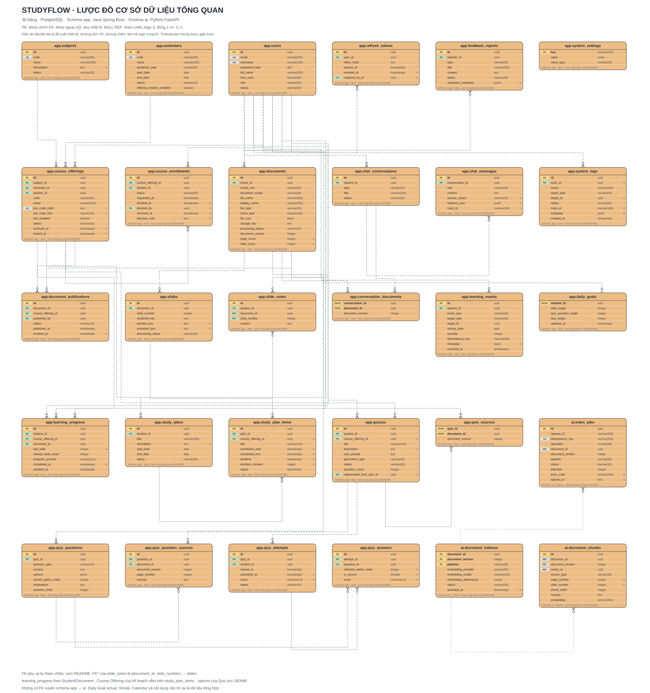
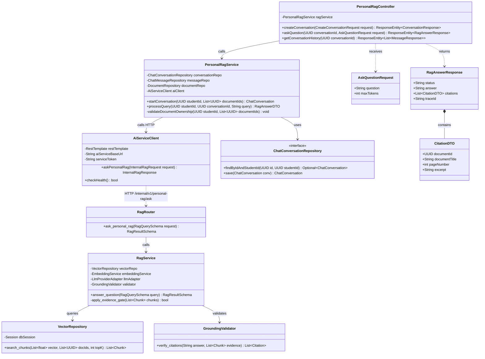
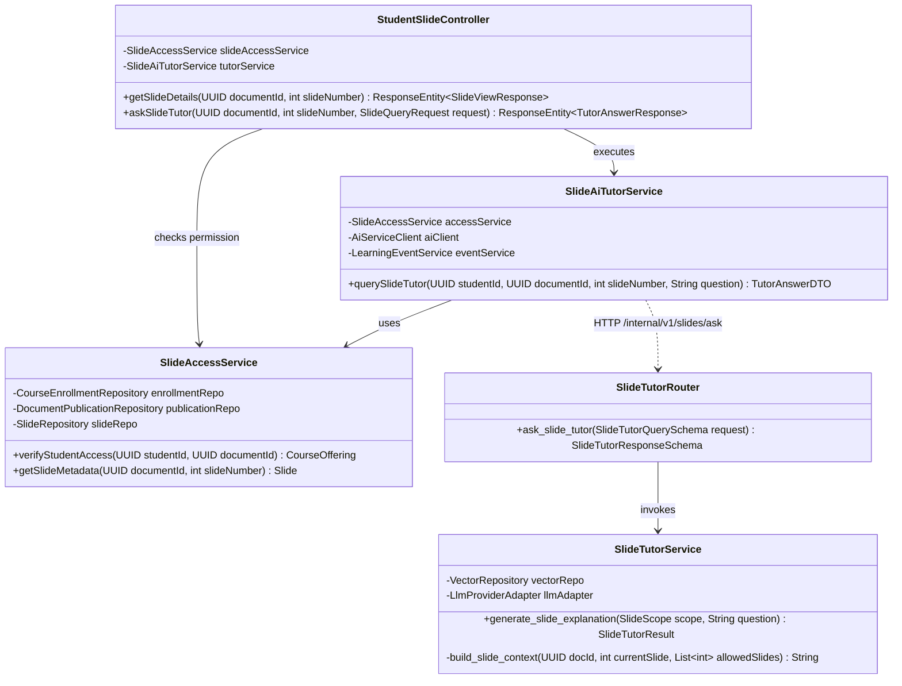
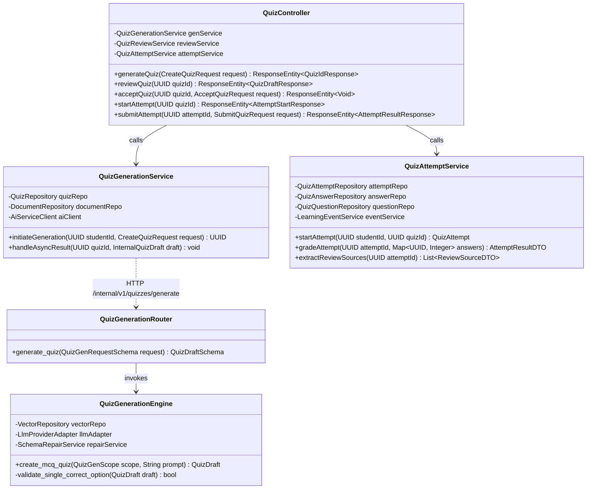
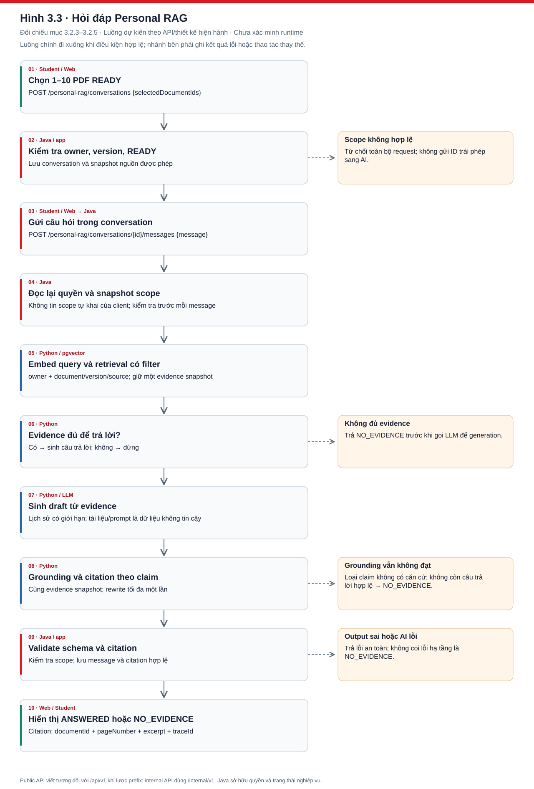
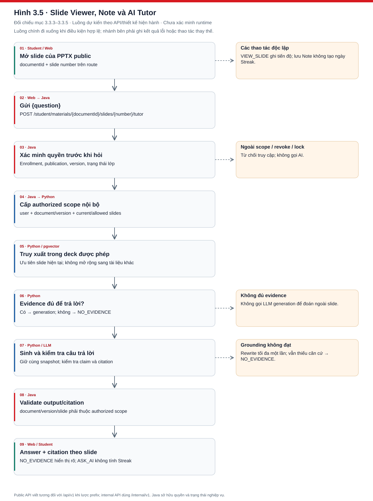

# CHƯƠNG 3. PHA THIẾT KẾ HỆ THỐNG

Tiếp nối kết quả phân tích yêu cầu và ca sử dụng ở Chương 2, chương này trình bày chi tiết toàn bộ nội dung của **Pha thiết kế hệ thống (System Design Phase)** theo đúng quy trình chuẩn của kỹ thuật phần mềm:
1. **Thiết kế kiến trúc chung cho toàn hệ thống theo dạng sơ đồ khối**
2. **Thiết kế lớp thực thể chung cho toàn hệ thống (Domain/Entity Class Diagram)**
3. **Thiết kế cơ sở dữ liệu chung cho toàn hệ thống (Database Design & ERD)**
4. **Thiết kế biểu đồ lớp chi tiết cho các chức năng đã chọn (Detailed Class Diagram)**
5. **Thiết kế biểu đồ hoạt động và biểu đồ tuần tự cho các chức năng (Dynamic Modeling: Activity & Sequence Diagrams)**

---

## 3.1. Thiết kế kiến trúc chung cho cả hệ thống theo dạng sơ đồ khối

### 3.1.1. Sơ đồ khối kiến trúc tổng thể toàn hệ thống

Hệ thống StudyFlow được thiết kế theo mô hình kiến trúc phân tán hiện đại, tách biệt rõ ràng giữa tầng giao diện người dùng (Frontend), tầng xử lý nghiệp vụ ứng dụng (Business Backend), tầng dịch vụ Trí tuệ Nhân tạo chuyên biệt (AI Microservice) và tầng lưu trữ phân vùng. 

Hình 3.1 biểu diễn sơ đồ khối kiến trúc tổng thể và các ranh giới giao tiếp dữ liệu của hệ thống.

*Hình 3.1. Sơ đồ khối kiến trúc logic và ranh giới dữ liệu của StudyFlow.*

**Thuyết minh sơ đồ khối kiến trúc Hình 3.1:**
1. **Tầng ứng dụng web (Next.js Web Frontend):** Cung cấp giao diện trực quan cho cả ba đối tượng người dùng: Sinh viên (Student UI), Giảng viên (Teacher UI) và Quản trị viên (Admin UI). Frontend giao tiếp duy nhất với Java Backend thông qua giao thức an toàn HTTPS và RESTful API chuẩn hóa tại tiền tố `/api/v1`. Frontend tuyệt đối không gọi trực tiếp sang Python AI Service, không truy cập trực tiếp cơ sở dữ liệu và không nắm giữ API key của các nhà cung cấp LLM.
2. **Tầng nghiệp vụ trung tâm (Java Spring Boot Backend):** Đóng vai trò là hệ thống cốt lõi (System of Record) và nắm giữ toàn bộ luật nghiệp vụ của hệ thống:
   - Quản trị xác thực và phân quyền truy cập (Authentication, Authorization RBAC).
   - Quản trị danh mục môn học, học kỳ, lớp học phần và xét duyệt sinh viên.
   - Quản trị kho tài liệu, quyền công bố học liệu và cấp phát Signed URL truy cập Object Storage.
   - Sở hữu độc quyền vòng đời Quiz (Lifecycle: `GENERATING` → `REVIEW_REQUIRED` → `READY`), thuật toán chấm điểm tự động và tính toán chuỗi ngày học (Study Streak), mục tiêu ngày (Daily Goal).
   - Quản trị và sở hữu cơ sở dữ liệu quan hệ trong `schema app` của PostgreSQL.
3. **Tầng dịch vụ Trí tuệ Nhân tạo (Python FastAPI AI Service):** Đóng vai trò là công cụ tính toán và xử lý tài liệu thông minh (Intelligent Processing Engine):
   - Xử lý bất đồng bộ các tệp tài liệu: bóc tách văn bản, trích xuất hình ảnh slide, chia phân đoạn (chunking) theo trang/slide.
   - Tính toán vector nhúng (Embedding) và quản lý lưu trữ vector trong `schema ai` tích hợp tiện ích mở rộng pgvector.
   - Thực thi pipeline RAG: tìm kiếm ngữ nghĩa (Cosine Similarity), áp dụng bộ lọc căn cứ (Evidence Gate), xây dựng prompt an toàn và trích xuất dẫn chứng (Grounded Citations).
   - Sinh câu hỏi trắc nghiệm `MCQ_SINGLE` theo định dạng JSON có cấu trúc nghiêm ngặt.
   - Dịch vụ AI chỉ giao tiếp nội bộ với Java Backend thông qua mạng riêng (Internal Network) tại tiền tố `/internal/v1`, không công khai ra Internet.
4. **Tầng lưu trữ dữ liệu (Data Storage Layer):**
   - **PostgreSQL Database Cluster:** Sử dụng chung một cụm máy chủ cơ sở dữ liệu nhưng phân tách nghiêm ngặt thành hai schema độc lập: `schema app` (do Java sở hữu toàn quyền quản lý bảng nghiệp vụ) và `schema ai` (do Python sở hữu, lưu trữ vector và các job xử lý tài liệu). Java không đọc/ghi trực tiếp vào bảng vector, Python không truy cập trực tiếp vào bảng người dùng hay lớp học phần.
   - **Object Storage (S3-Compatible):** Lưu trữ an toàn các tệp tin nhị phân gốc (.pdf, .pptx) và các hình ảnh slide kết xuất. Truy cập tệp được bảo vệ qua cơ chế URL ký trước (Signed URL) có thời hạn ngắn do Java Backend kiểm duyệt và cấp phát.
5. **Tầng dịch vụ mô hình AI ngoài (LLM & Embedding Provider):** Cung cấp năng lực tính toán ngôn ngữ lớn thông qua API chuẩn hóa, được bao bọc bởi adapter nội bộ trong Python AI Service.

---

### 3.1.2. Phân chia trách nhiệm các khối và nguyên tắc ranh giới dữ liệu

Để bảo đảm tính an toàn, bảo mật và khả năng mở rộng, hệ thống thiết lập các nguyên tắc ranh giới nghiêm ngặt giữa các khối kiến trúc:
- **Nguyên tắc "System of Record":** Java Backend là nguồn dữ liệu chân lý duy nhất. Toàn bộ thông tin định danh người dùng, trạng thái đăng ký lớp học phần (`APPROVED`), trạng thái công bố bài giảng (`PUBLISHED`), kết quả chấm điểm và tiến độ học tập đều do Java Backend quản lý. AI Service không có quyền tự quyết định trạng thái nghiệp vụ.
- **Nguyên tắc "Authorized Scope":** Mọi yêu cầu gọi từ Java sang Python AI Service bắt buộc phải gửi kèm phạm vi cấp quyền tối thiểu (Authorized Scope), bao gồm: `userId`, `documentId`, `documentVersion`, `allowedSlideNumbers`. Python AI Service chỉ được phép truy vấn và tìm kiếm vector trong đúng phạm vi được Java cấp phép.
- **Xác thực giữa các dịch vụ (Service-to-Service Security):** Giao tiếp giữa Java Backend và Python AI Service sử dụng Service Credential nội bộ được truyền trong HTTP Header `X-Service-Token`, kết hợp mã định danh truy vết `X-Request-Id` và phiên bản hợp đồng `X-Schema-Version: 3`.
- **Nguyên tắc kiểm duyệt đa tầng (Defense in Depth):** Mọi kết quả do AI sinh ra (câu trả lời RAG, trích dẫn citation, câu hỏi trắc nghiệm) đều được xem là dữ liệu chưa tin cậy (untrusted data). Python AI Service thực hiện kiểm duyệt vòng 1 (Schema Validation, Evidence Gate), sau đó Java Backend thực hiện kiểm duyệt vòng 2 trước khi lưu vào cơ sở dữ liệu nghiệp vụ.

---

### 3.1.3. Mô hình phân tầng và tổ chức dịch vụ

- **Tổ chức nội bộ Java Backend:** Được xây dựng theo mô hình phân tầng chuẩn mực (Layered Architecture): Tầng Controller tiếp nhận HTTP requests và xác thực DTO; Tầng Application/Domain Service nắm giữ toàn bộ luật nghiệp vụ và kiểm tra quyền hạn; Tầng Persistence/Repository thao tác với `schema app` qua Spring Data JPA; Tầng Integration Adapters bao bọc các lời gọi sang AI Service và Object Storage.
- **Tổ chức nội bộ Python AI Service:** Kết hợp xử lý đồng bộ (Synchronous Routes) cho các yêu cầu truy vấn hỏi đáp tức thì (`/personal-rag/ask`, `/slides/ask`) và xử lý bất đồng bộ (Asynchronous Background Workers) cho quy trình tiếp nhận, bóc tách tệp và tạo chỉ mục vector (`/documents/index`) thông qua hàng đợi công việc `ai.index_jobs`.

---

## 3.2. Thiết kế lớp thực thể chung cho toàn hệ thống (Entity Class Diagram)

### 3.2.1. Biểu đồ lớp thực thể mức miền nghiệp vụ (Domain Entity Class Diagram)

Biểu đồ lớp thực thể định nghĩa cấu trúc dữ liệu cốt lõi, các thuộc tính nghiệp vụ và mối quan hệ giữa các thực thể đại diện cho toàn bộ hệ thống StudyFlow.

```mermaid
classDiagram
    %% Tác nhân và Tài khoản
    class User {
        +UUID id
        +String email
        +String passwordHash
        +String fullName
        +Role role
        +UserStatus status
        +Instant createdAt
        +Instant updatedAt
        +isTeacher() bool
        +isStudent() bool
        +isActive() bool
    }

    class RefreshToken {
        +UUID id
        +UUID userId
        +String tokenHash
        +Instant expiresAt
        +UUID replacedById
        +bool isRevoked
        +isValid() bool
    }

    %% Đào tạo và Lớp học phần
    class Subject {
        +UUID id
        +String code
        +String name
        +int credits
        +bool isActive
    }

    class Semester {
        +UUID id
        +String code
        +String name
        +LocalDate startDate
        +LocalDate endDate
        +bool isRegistrationOpen
    }

    class CourseOffering {
        +UUID id
        +UUID subjectId
        +UUID semesterId
        +UUID teacherId
        +String code
        +String name
        +String joinCode
        +bool isJoinCodeActive
        +CourseStatus status
        +generateNewJoinCode() String
        +archive() void
    }

    class CourseEnrollment {
        +UUID id
        +UUID courseOfferingId
        +UUID studentId
        +EnrollmentStatus status
        +UUID decidedBy
        +Instant decidedAt
        +approve(UUID teacherId) void
        +reject(UUID teacherId) void
    }

    %% Tài liệu và Học liệu
    class Document {
        +UUID id
        +UUID ownerId
        +String title
        +DocumentType type
        +String fileStorageKey
        +long fileSize
        +int documentVersion
        +DocumentStatus status
        +bool isPersonal() bool
    }

    class DocumentPublication {
        +UUID id
        +UUID documentId
        +UUID courseOfferingId
        +UUID publishedBy
        +Instant publishedAt
        +bool isRevoked
    }

    class Slide {
        +UUID id
        +UUID documentId
        +int slideNumber
        +String imageStorageKey
        +String extractedText
    }

    class SlideNote {
        +UUID id
        +UUID studentId
        +UUID documentId
        +int slideNumber
        +String content
        +Instant updatedAt
    }

    %% Hội thoại và Hỏi đáp RAG
    class ChatConversation {
        +UUID id
        +UUID studentId
        +String title
        +Instant createdAt
        +Instant lastMessageAt
    }

    class ConversationDocument {
        +UUID conversationId
        +UUID documentId
    }

    class ChatMessage {
        +UUID id
        +UUID conversationId
        +MessageSender sender
        +String content
        +List~Citation~ citations
        +Instant createdAt
    }

    %% Quiz và Ôn tập
    class Quiz {
        +UUID id
        +UUID studentId
        +UUID courseOfferingId
        +String title
        +String userPrompt
        +QuizStatus status
        +UUID regeneratedFromQuizId
        +Instant createdAt
        +accept(UUID destinationOfferingId) void
        +reject() void
    }

    class QuizSource {
        +UUID quizId
        +UUID documentId
    }

    class QuizQuestion {
        +UUID id
        +UUID quizId
        +String questionText
        +List~String~ options
        +int correctOptionIndex
        +String explanation
    }

    class QuizQuestionSource {
        +UUID questionId
        +UUID documentId
        +int pageNumber
        +String excerpt
    }

    class QuizAttempt {
        +UUID id
        +UUID quizId
        +UUID studentId
        +int totalQuestions
        +int correctAnswers
        +double score
        +Instant startedAt
        +Instant completedAt
        +calculateScore() void
    }

    class QuizAnswer {
        +UUID id
        +UUID attemptId
        +UUID questionId
        +int selectedOptionIndex
        +bool isCorrect
    }

    %% Tiến độ học tập và Kế hoạch
    class LearningEvent {
        +UUID id
        +UUID studentId
        +EventType eventType
        +UUID targetId
        +LocalDate activityDate
        +String idempotencyKey
        +Instant createdAt
    }

    class DailyGoal {
        +UUID studentId
        +int slideTarget
        +int quizQuestionTarget
        +int taskTarget
        +Instant updatedAt
        +isConfigured() bool
    }

    class StudyPlan {
        +UUID id
        +UUID studentId
        +String title
        +LocalDate weekStartDate
    }

    class StudyPlanItem {
        +UUID id
        +UUID planId
        +UUID courseOfferingId
        +String title
        +LocalDate scheduledDate
        +LocalTime scheduledTime
        +Priority priority
        +TaskStatus status
        +complete() void
    }

    %% Quan hệ giữa các lớp
    User "1" --> "*" RefreshToken : has
    User "1" --> "*" CourseOffering : teaches
    User "1" --> "*" CourseEnrollment : attends
    User "1" --> "*" Document : owns
    User "1" --> "*" ChatConversation : creates
    User "1" --> "*" Quiz : creates
    User "1" --> "*" QuizAttempt : takes
    User "1" --> "1" DailyGoal : configures
    User "1" --> "*" StudyPlan : plans

    Subject "1" --> "*" CourseOffering : categorized by
    Semester "1" --> "*" CourseOffering : conducted in

    CourseOffering "1" --> "*" CourseEnrollment : includes
    CourseOffering "1" --> "*" DocumentPublication : publishes
    CourseOffering "1" --> "*" Quiz : assigned to

    Document "1" --> "*" DocumentPublication : published through
    Document "1" --> "*" Slide : broken into
    Document "1" --> "*" SlideNote : commented on
    Document "1" --> "*" ConversationDocument : included in
    Document "1" --> "*" QuizSource : sourced by
    Document "1" --> "*" QuizQuestionSource : cited by

    ChatConversation "1" --> "*" ConversationDocument : references
    ChatConversation "1" --> "*" ChatMessage : contains

    Quiz "1" --> "*" QuizSource : sources
    Quiz "1" --> "*" QuizQuestion : consists of
    Quiz "1" --> "*" QuizAttempt : evaluated through

    QuizQuestion "1" --> "*" QuizQuestionSource : backed by
    QuizQuestion "1" --> "*" QuizAnswer : answered in

    QuizAttempt "1" --> "*" QuizAnswer : records

    StudyPlan "1" --> "*" StudyPlanItem : contains
```

---

### 3.2.2. Chi tiết thuộc tính và quan hệ giữa các thực thể

1. **Nhóm Xác thực & Người dùng:**
   - `User`: Lưu thông tin định danh duy nhất của người dùng. Có quan hệ 1-N với `RefreshToken`. Phân quyền được thể hiện qua trường `Role` (`STUDENT`, `TEACHER`, `ADMIN`).
   - `RefreshToken`: Quản lý phiên đăng nhập với cơ chế xoay vòng. Khi một token được làm mới, trường `replacedById` sẽ liên kết tới token mới, ngăn chặn việc sử dụng lại token cũ bị đánh cắp.
2. **Nhóm Đào tạo & Lớp học phần:**
   - `Subject` và `Semester`: Đại diện cho danh mục môn học và kỳ học. Một môn học và một học kỳ có thể mở nhiều lớp học phần (`CourseOffering`).
   - `CourseOffering`: Lớp học phần do một Giảng viên phụ trách (`teacherId`). Có quan hệ 1-N với `CourseEnrollment` (danh sách sinh viên xin vào lớp) và `DocumentPublication` (học liệu bài giảng được công bố cho lớp).
   - `CourseEnrollment`: Bảng liên kết thể hiện mối quan hệ nhiều-nhiều giữa `User` (Student) và `CourseOffering`. Trạng thái tham gia được xác định bởi `status` (`PENDING`, `APPROVED`, `REJECTED`).
3. **Nhóm Học liệu & Slide:**
   - `Document`: Thực thể tài liệu thống nhất cho cả tài liệu cá nhân của sinh viên và học liệu của giảng viên. Được phân biệt qua trường `type` (`PERSONAL_PDF`, `TEACHER_PPTX`, `TEACHER_PDF`) và `ownerId`.
   - `Slide`: Thực thể thành phần của tài liệu PPTX (`document_id + slide_number`), lưu trữ đường dẫn ảnh kết xuất và nội dung văn bản bóc tách từ từng slide.
   - `SlideNote`: Ghi chú riêng tư của sinh viên gắn với từng slide cụ thể (`student_id + document_id + slide_number`).
4. **Nhóm Hội thoại & RAG:**
   - `ChatConversation`: Phiên hội thoại hỏi đáp của sinh viên. Liên kết nhiều-nhiều với `Document` thông qua `ConversationDocument` (danh sách từ 1 đến 10 tài liệu làm việc).
   - `ChatMessage`: Từng tin nhắn trong cuộc hội thoại. Khi tin nhắn là câu trả lời của AI, thuộc tính `citations` sẽ lưu trữ mảng trích dẫn gồm: `documentId`, `pageNumber`, `excerpt`.
5. **Nhóm Quiz & Đánh giá:**
   - `Quiz`: Bộ câu hỏi ôn tập. Có thể là Quiz cá nhân hoặc được gắn vào một lớp học phần cụ thể sau khi sinh viên duyệt. Trạng thái vòng đời được quản lý chặt chẽ: `GENERATING` → `REVIEW_REQUIRED` → `READY` hoặc `REJECTED`/`GENERATION_FAILED`.
   - `QuizQuestion`: Câu hỏi trắc nghiệm một đáp án đúng (`MCQ_SINGLE`). Thuộc tính `options` lưu 4 phương án, `correctOptionIndex` lưu chỉ số phương án đúng (0 đến 3).
   - `QuizQuestionSource`: Bảng liên kết xác thực căn cứ của câu hỏi, lưu chính xác `documentId`, `pageNumber` và đoạn trích dẫn nguồn `excerpt`.
   - `QuizAttempt` & `QuizAnswer`: Lưu trữ chi tiết từng lượt làm bài của sinh viên, phương án sinh viên chọn, kết quả đúng/sai và điểm số tự động do Java tính toán.
6. **Nhóm Tiến độ & Kế hoạch:**
   - `LearningEvent`: Lưu vết các hành vi học tập hợp lệ (`VIEW_SLIDE`, `STUDY_TASK_COMPLETED`, `QUIZ_COMPLETED`) với cơ chế chống trùng lặp `idempotencyKey` để phục vụ tính toán chuỗi ngày học Streak.
   - `DailyGoal`: Cấu hình mục tiêu học tập hàng ngày do sinh viên thiết lập.
   - `StudyPlan` & `StudyPlanItem`: Kế hoạch và danh sách công việc học tập theo tuần.

---

## 3.3. Thiết kế cơ sở dữ liệu chung cho toàn hệ thống (Database Design)

### 3.3.1. Mô hình quan hệ thực thể tổng quan (ERD)

Cơ sở dữ liệu của StudyFlow bao gồm 30 bảng, được thiết kế chuẩn hóa mức 3 (3NF) nhằm đảm bảo toàn vẹn dữ liệu, loại bỏ dư thừa và tối ưu hóa hiệu năng truy vấn. 

Hình 3.2 mô tả sơ đồ quan hệ thực thể (ERD) tổng quan của hệ thống.

*Hình 3.2. Mô hình quan hệ thực thể (ERD) tổng quan của hệ thống StudyFlow.*

---

### 3.3.2. Phân vùng schema cơ sở dữ liệu

Hệ thống triển khai cơ chế phân vùng hai schema độc lập trên cùng một cụm PostgreSQL:
- **Schema `app` (Ứng dụng nghiệp vụ):** Do người dùng database của Java Backend sở hữu độc quyền. Chứa 27 bảng dữ liệu nghiệp vụ: người dùng, xác thực, danh mục, lớp học, học liệu, ghi chú, hội thoại chat, câu hỏi Quiz, lượt làm bài, sự kiện học tập và kế hoạch học tập.
- **Schema `ai` (Dịch vụ Trí tuệ Nhân tạo):** Do người dùng database của Python AI Service sở hữu độc quyền. Kích hoạt extension `vector` của pgvector. Chứa 3 bảng chuyên biệt cho việc lập chỉ mục và tìm kiếm ngữ nghĩa:
  + `ai.index_jobs`: Quản lý tiến trình xử lý tài liệu bất đồng bộ.
  + `ai.document_indexes`: Quản lý phiên bản chỉ mục vector của từng tài liệu.
  + `ai.document_chunks`: Lưu trữ các đoạn văn bản bóc tách kèm vector nhúng 1024 chiều và chỉ mục tìm kiếm HNSW.
- **Nguyên tắc cô lập:** Không tạo khóa ngoại (Foreign Key) vật lý xuyên suốt giữa `schema ai` và `schema app`. Mọi liên kết giữa hai schema được ánh xạ thông qua các trường định danh logic `document_id` và `document_version`.

---

### 3.3.3. Từ điển dữ liệu chi tiết các bảng trong hệ thống (Data Dictionary)

#### 1. Nhóm bảng Xác thực và Quản trị người dùng

##### Bảng `app.users`
Lưu trữ thông tin tài khoản người dùng của toàn hệ thống.

| Tên cột | Kiểu dữ liệu | Ràng buộc | Mô tả ý nghĩa nghiệp vụ |
|---|---|---|---|
| `id` | UUID | PK, DEFAULT gen_random_uuid() | Khóa chính định danh người dùng |
| `email` | VARCHAR(255) | NOT NULL, UNIQUE | Địa chỉ email đăng nhập duy nhất |
| `password_hash` | VARCHAR(255) | NOT NULL | Mật khẩu băm bằng thuật toán BCrypt |
| `full_name` | VARCHAR(100) | NOT NULL | Họ và tên đầy đủ |
| `role` | VARCHAR(20) | NOT NULL | Vai trò: `STUDENT`, `TEACHER`, `ADMIN` |
| `status` | VARCHAR(20) | NOT NULL, DEFAULT 'ACTIVE' | Trạng thái: `ACTIVE`, `LOCKED`, `SUSPENDED` |
| `avatar_url` | VARCHAR(500) | NULL | Đường dẫn ảnh đại diện |
| `created_at` | TIMESTAMPTZ | NOT NULL, DEFAULT NOW() | Thời điểm tạo tài khoản |
| `updated_at` | TIMESTAMPTZ | NOT NULL, DEFAULT NOW() | Thời điểm cập nhật thông tin |

##### Bảng `app.refresh_tokens`
Quản lý các mã làm mới phiên đăng nhập hỗ trợ cơ chế Token Rotation.

| Tên cột | Kiểu dữ liệu | Ràng buộc | Mô tả ý nghĩa nghiệp vụ |
|---|---|---|---|
| `id` | UUID | PK | Khóa chính định danh bản ghi token |
| `user_id` | UUID | NOT NULL, FK -> users(id) | Tham chiếu đến tài khoản người dùng |
| `token_hash` | VARCHAR(255) | NOT NULL, UNIQUE | Chuỗi băm SHA-256 của Refresh Token |
| `expires_at` | TIMESTAMPTZ | NOT NULL | Thời điểm token hết hạn |
| `replaced_by_id` | UUID | NULL, FK -> refresh_tokens(id) | Token mới thay thế khi xoay vòng |
| `is_revoked` | BOOLEAN | NOT NULL, DEFAULT FALSE | Đánh dấu token đã bị thu hồi/vô hiệu |
| `created_at` | TIMESTAMPTZ | NOT NULL, DEFAULT NOW() | Thời điểm cấp token |

---

#### 2. Nhóm bảng Danh mục và Lớp học phần

##### Bảng `app.subjects`
Danh mục môn học trong chương trình đào tạo.

| Tên cột | Kiểu dữ liệu | Ràng buộc | Mô tả ý nghĩa nghiệp vụ |
|---|---|---|---|
| `id` | UUID | PK | Khóa chính định danh môn học |
| `code` | VARCHAR(50) | NOT NULL, UNIQUE | Mã môn học (ví dụ: `INT1408`) |
| `name` | VARCHAR(255) | NOT NULL | Tên môn học |
| `credits` | INTEGER | NOT NULL, CHECK (credits > 0) | Số tín chỉ môn học |
| `is_active` | BOOLEAN | NOT NULL, DEFAULT TRUE | Trạng thái hoạt động của môn học |

##### Bảng `app.semesters`
Danh mục các học kỳ trong năm học.

| Tên cột | Kiểu dữ liệu | Ràng buộc | Mô tả ý nghĩa nghiệp vụ |
|---|---|---|---|
| `id` | UUID | PK | Khóa chính định danh học kỳ |
| `code` | VARCHAR(50) | NOT NULL, UNIQUE | Mã học kỳ (ví dụ: `2025_1`) |
| `name` | VARCHAR(100) | NOT NULL | Tên học kỳ (ví dụ: Học kỳ 1 Năm 2025-2026) |
| `start_date` | DATE | NOT NULL | Ngày bắt đầu học kỳ |
| `end_date` | DATE | NOT NULL | Ngày kết thúc học kỳ |
| `is_registration_open` | BOOLEAN | NOT NULL, DEFAULT TRUE | Cho phép mở tạo lớp học phần mới |

##### Bảng `app.course_offerings`
Thông tin các lớp học phần do Giảng viên trực tiếp tạo và phụ trách.

| Tên cột | Kiểu dữ liệu | Ràng buộc | Mô tả ý nghĩa nghiệp vụ |
|---|---|---|---|
| `id` | UUID | PK | Khóa chính định danh lớp học phần |
| `subject_id` | UUID | NOT NULL, FK -> subjects(id) | Tham chiếu môn học |
| `semester_id` | UUID | NOT NULL, FK -> semesters(id) | Tham chiếu học kỳ |
| `teacher_id` | UUID | NOT NULL, FK -> users(id) | Giảng viên phụ trách lớp |
| `code` | VARCHAR(50) | NOT NULL | Mã lớp (Duy nhất trong một học kỳ) |
| `name` | VARCHAR(255) | NOT NULL | Tên lớp học phần |
| `join_code` | VARCHAR(20) | NOT NULL | Mã mời tham gia lớp học phần |
| `is_join_code_active` | BOOLEAN | NOT NULL, DEFAULT TRUE | Trạng thái bật/tắt mã mời |
| `status` | VARCHAR(20) | NOT NULL, DEFAULT 'ACTIVE' | Trạng thái lớp: `ACTIVE`, `ARCHIVED` |

##### Bảng `app.course_enrollments`
Quản lý yêu cầu tham gia lớp và trạng thái thành viên của sinh viên.

| Tên cột | Kiểu dữ liệu | Ràng buộc | Mô tả ý nghĩa nghiệp vụ |
|---|---|---|---|
| `id` | UUID | PK | Khóa chính định danh bản ghi đăng ký |
| `course_offering_id` | UUID | NOT NULL, FK -> course_offerings(id) | Tham chiếu lớp học phần |
| `student_id` | UUID | NOT NULL, FK -> users(id) | Sinh viên đăng ký |
| `status` | VARCHAR(20) | NOT NULL, DEFAULT 'PENDING' | Trạng thái: `PENDING`, `APPROVED`, `REJECTED` |
| `decided_by` | UUID | NULL, FK -> users(id) | Giảng viên thực hiện duyệt |
| `decided_at` | TIMESTAMPTZ | NULL | Thời điểm xét duyệt |

---

#### 3. Nhóm bảng Học liệu và Bài giảng

##### Bảng `app.documents`
Quản lý toàn bộ tài liệu trong hệ thống (cả bài giảng và tài liệu cá nhân).

| Tên cột | Kiểu dữ liệu | Ràng buộc | Mô tả ý nghĩa nghiệp vụ |
|---|---|---|---|
| `id` | UUID | PK | Khóa chính định danh tài liệu |
| `owner_id` | UUID | NOT NULL, FK -> users(id) | Người sở hữu (Student hoặc Teacher) |
| `title` | VARCHAR(255) | NOT NULL | Tiêu đề hiển thị của tài liệu |
| `type` | VARCHAR(30) | NOT NULL | Phân loại: `PERSONAL_PDF`, `TEACHER_PPTX`, `TEACHER_PDF` |
| `file_storage_key` | VARCHAR(500) | NOT NULL | Khóa định danh tệp tin trong Object Storage |
| `file_size` | BIGINT | NOT NULL | Dung lượng tệp tính theo Byte |
| `document_version` | INTEGER | NOT NULL, DEFAULT 1 | Phiên bản tài liệu |
| `status` | VARCHAR(20) | NOT NULL, DEFAULT 'PROCESSING' | Trạng thái: `PROCESSING`, `READY`, `FAILED`, `DELETED` |

##### Bảng `app.document_publications`
Liên kết công bố bài giảng vào các lớp học phần cụ thể.

| Tên cột | Kiểu dữ liệu | Ràng buộc | Mô tả ý nghĩa nghiệp vụ |
|---|---|---|---|
| `id` | UUID | PK | Khóa chính bản ghi công bố |
| `document_id` | UUID | NOT NULL, FK -> documents(id) | Bài giảng được công bố |
| `course_offering_id` | UUID | NOT NULL, FK -> course_offerings(id) | Lớp học phần nhận bài giảng |
| `published_by` | UUID | NOT NULL, FK -> users(id) | Giảng viên thực hiện công bố |
| `published_at` | TIMESTAMPTZ | NOT NULL, DEFAULT NOW() | Thời điểm công bố |
| `is_revoked` | BOOLEAN | NOT NULL, DEFAULT FALSE | Trạng thái thu hồi quyền truy cập |

##### Bảng `app.slides`
Lưu trữ thông tin chi tiết từng slide bài giảng PPTX.

| Tên cột | Kiểu dữ liệu | Ràng buộc | Mô tả ý nghĩa nghiệp vụ |
|---|---|---|---|
| `id` | UUID | PK | Khóa chính định danh slide |
| `document_id` | UUID | NOT NULL, FK -> documents(id) | Bài giảng chứa slide |
| `slide_number` | INTEGER | NOT NULL | Số thứ tự slide trong bài giảng (từ 1..N) |
| `image_storage_key`| VARCHAR(500) | NOT NULL | Khóa ảnh slide kết xuất trên Object Storage |
| `extracted_text` | TEXT | NULL | Văn bản bóc tách phục vụ tìm kiếm nhanh |

##### Bảng `app.slide_notes`
Ghi chú cá nhân của sinh viên trên từng slide bài giảng.

| Tên cột | Kiểu dữ liệu | Ràng buộc | Mô tả ý nghĩa nghiệp vụ |
|---|---|---|---|
| `id` | UUID | PK | Khóa chính bản ghi ghi chú |
| `student_id` | UUID | NOT NULL, FK -> users(id) | Sinh viên tạo ghi chú |
| `document_id` | UUID | NOT NULL, FK -> documents(id) | Bài giảng |
| `slide_number` | INTEGER | NOT NULL | Số thứ tự slide được ghi chú |
| `content` | TEXT | NOT NULL | Nội dung ghi chú của sinh viên |
| `updated_at` | TIMESTAMPTZ | NOT NULL, DEFAULT NOW() | Thời điểm cập nhật gần nhất |

---

#### 4. Nhóm bảng Dịch vụ Trí tuệ Nhân tạo (`schema ai`)

##### Bảng `ai.index_jobs`
Theo dõi các công việc lập chỉ mục tài liệu xử lý bất đồng bộ.

| Tên cột | Kiểu dữ liệu | Ràng buộc | Mô tả ý nghĩa nghiệp vụ |
|---|---|---|---|
| `job_id` | UUID | PK | Khóa chính định danh công việc |
| `document_id` | UUID | NOT NULL | Định danh logic của tài liệu |
| `document_version`| INTEGER | NOT NULL | Phiên bản xử lý của tài liệu |
| `status` | VARCHAR(20) | NOT NULL | Trạng thái: `QUEUED`, `PROCESSING`, `COMPLETED`, `FAILED` |
| `error_code` | VARCHAR(50) | NULL | Mã lỗi chi tiết nếu xử lý thất bại |
| `created_at` | TIMESTAMPTZ | NOT NULL, DEFAULT NOW() | Thời điểm tạo job |
| `completed_at` | TIMESTAMPTZ | NULL | Thời điểm hoàn tất job |

##### Bảng `ai.document_chunks`
Lưu trữ các đoạn văn bản bóc tách và vector nhúng phục vụ tìm kiếm ngữ nghĩa.

| Tên cột | Kiểu dữ liệu | Ràng buộc | Mô tả ý nghĩa nghiệp vụ |
|---|---|---|---|
| `id` | UUID | PK | Khóa chính định danh đoạn văn bản (chunk) |
| `document_id` | UUID | NOT NULL | Định danh logic của tài liệu |
| `document_version`| INTEGER | NOT NULL | Phiên bản của tài liệu |
| `source_type` | VARCHAR(30) | NOT NULL | Loại nguồn: `PERSONAL_PDF_PAGE`, `TEACHER_SLIDE` |
| `page_number` | INTEGER | NULL | Số trang (đối với tệp PDF) |
| `slide_number` | INTEGER | NULL | Số slide (đối với bài giảng PPTX) |
| `chunk_index` | INTEGER | NOT NULL | Thứ tự của chunk trong trang/slide |
| `content` | TEXT | NOT NULL | Nội dung văn bản của đoạn trích |
| `embedding` | VECTOR(1024) | NOT NULL | Vector nhúng ngữ nghĩa chiều dài 1024 |

---

#### 5. Nhóm bảng Quiz, Lượt làm bài và Đánh giá

##### Bảng `app.quizzes`
Quản lý bộ câu hỏi ôn tập và vòng đời Quiz.

| Tên cột | Kiểu dữ liệu | Ràng buộc | Mô tả ý nghĩa nghiệp vụ |
|---|---|---|---|
| `id` | UUID | PK | Khóa chính định danh bộ Quiz |
| `student_id` | UUID | NOT NULL, FK -> users(id) | Sinh viên tạo Quiz |
| `course_offering_id`| UUID | NULL, FK -> course_offerings(id) | Lớp học phần được gắn vào sau khi Accept |
| `title` | VARCHAR(255) | NOT NULL | Tiêu đề bộ câu hỏi |
| `user_prompt` | TEXT | NOT NULL | Prompt hướng dẫn sinh câu hỏi do sinh viên nhập |
| `status` | VARCHAR(30) | NOT NULL | Vòng đời: `GENERATING`, `REVIEW_REQUIRED`, `READY`, `REJECTED`, `GENERATION_FAILED` |
| `regenerated_from_quiz_id`| UUID | NULL, FK -> quizzes(id) | Tham chiếu bộ Quiz cũ nếu tạo lại |
| `created_at` | TIMESTAMPTZ | NOT NULL, DEFAULT NOW() | Thời điểm khởi tạo |

##### Bảng `app.quiz_questions`
Danh sách câu hỏi trắc nghiệm một đáp án đúng (`MCQ_SINGLE`).

| Tên cột | Kiểu dữ liệu | Ràng buộc | Mô tả ý nghĩa nghiệp vụ |
|---|---|---|---|
| `id` | UUID | PK | Khóa chính định danh câu hỏi |
| `quiz_id` | UUID | NOT NULL, FK -> quizzes(id) | Thuộc bộ Quiz nào |
| `question_text` | TEXT | NOT NULL | Nội dung câu hỏi |
| `options` | JSONB | NOT NULL | Mảng JSON chứa đúng 4 chuỗi phương án [A, B, C, D] |
| `correct_option_index`| INTEGER | NOT NULL, CHECK (0..3) | Chỉ số của đáp án chính xác |
| `explanation` | TEXT | NOT NULL | Lời giải thích căn cứ đáp án |

##### Bảng `app.quiz_question_sources`
Liên kết trích dẫn căn cứ tài liệu nguồn cho từng câu hỏi Quiz.

| Tên cột | Kiểu dữ liệu | Ràng buộc | Mô tả ý nghĩa nghiệp vụ |
|---|---|---|---|
| `question_id` | UUID | NOT NULL, FK -> quiz_questions(id) | Câu hỏi được chứng minh |
| `document_id` | UUID | NOT NULL, FK -> documents(id) | Tài liệu nguồn chứa kiến thức |
| `page_number` | INTEGER | NOT NULL | Số trang tài liệu nguồn chứa đoạn trích |
| `excerpt` | TEXT | NOT NULL | Đoạn văn bản bằng chứng làm căn cứ |

##### Bảng `app.quiz_attempts`
Lưu trữ thông tin chi tiết từng lượt làm bài của sinh viên.

| Tên cột | Kiểu dữ liệu | Ràng buộc | Mô tả ý nghĩa nghiệp vụ |
|---|---|---|---|
| `id` | UUID | PK | Khóa chính định danh lượt làm bài |
| `quiz_id` | UUID | NOT NULL, FK -> quizzes(id) | Làm bộ Quiz nào |
| `student_id` | UUID | NOT NULL, FK -> users(id) | Sinh viên thực hiện làm bài |
| `total_questions` | INTEGER | NOT NULL | Tổng số câu hỏi trong bài |
| `correct_answers` | INTEGER | NOT NULL, DEFAULT 0 | Số lượng câu trả lời đúng |
| `score` | NUMERIC(5,2) | NOT NULL, DEFAULT 0.00 | Điểm số tính theo thang điểm 10 hoặc 100 |
| `started_at` | TIMESTAMPTZ | NOT NULL, DEFAULT NOW() | Thời điểm bắt đầu làm bài |
| `completed_at` | TIMESTAMPTZ | NULL | Thời điểm nộp bài |

##### Bảng `app.quiz_answers`
Chi tiết câu trả lời của sinh viên cho từng câu hỏi trong lượt làm bài.

| Tên cột | Kiểu dữ liệu | Ràng buộc | Mô tả ý nghĩa nghiệp vụ |
|---|---|---|---|
| `id` | UUID | PK | Khóa chính bản ghi câu trả lời |
| `attempt_id` | UUID | NOT NULL, FK -> quiz_attempts(id) | Thuộc lượt làm bài nào |
| `question_id` | UUID | NOT NULL, FK -> quiz_questions(id) | Câu hỏi được trả lời |
| `selected_option_index`| INTEGER | NOT NULL | Phương án sinh viên đã chọn (0..3) |
| `is_correct` | BOOLEAN | NOT NULL | Kết quả đánh giá đúng/sai do Java chấm |

---

#### 6. Nhóm bảng Tiến độ học tập và Kế hoạch

##### Bảng `app.learning_events`
Ghi nhận các sự kiện học tập thực tế làm cơ sở tính toán Streak và Daily Goal.

| Tên cột | Kiểu dữ liệu | Ràng buộc | Mô tả ý nghĩa nghiệp vụ |
|---|---|---|---|
| `id` | UUID | PK | Khóa chính định danh sự kiện |
| `student_id` | UUID | NOT NULL, FK -> users(id) | Sinh viên thực hiện hành vi |
| `event_type` | VARCHAR(30) | NOT NULL | Loại: `VIEW_SLIDE`, `STUDY_TASK_COMPLETED`, `QUIZ_COMPLETED` |
| `target_id` | UUID | NOT NULL | Định danh đối tượng tương tác (slide_id, task_id, quiz_id) |
| `activity_date` | DATE | NOT NULL | Ngày phát sinh sự kiện theo múi giờ sinh viên |
| `idempotency_key`| VARCHAR(100) | NOT NULL, UNIQUE | Khóa chặn trùng lặp sự kiện |
| `created_at` | TIMESTAMPTZ | NOT NULL, DEFAULT NOW() | Thời điểm ghi nhận sự kiện |

##### Bảng `app.daily_goals`
Cấu hình chỉ tiêu phấn đấu học tập hàng ngày của sinh viên.

| Tên cột | Kiểu dữ liệu | Ràng buộc | Mô tả ý nghĩa nghiệp vụ |
|---|---|---|---|
| `student_id` | UUID | PK, FK -> users(id) | Khóa chính tham chiếu sinh viên (Quan hệ 1-1) |
| `slide_target` | INTEGER | NOT NULL, DEFAULT 0 | Chỉ tiêu số slide cần đọc mỗi ngày |
| `quiz_question_target`| INTEGER | NOT NULL, DEFAULT 0 | Chỉ tiêu số câu trắc nghiệm cần làm |
| `task_target` | INTEGER | NOT NULL, DEFAULT 0 | Chỉ tiêu số công việc cần hoàn thành |
| `updated_at` | TIMESTAMPTZ | NOT NULL, DEFAULT NOW() | Thời điểm cấu hình gần nhất |

---

## 3.4. Thiết kế biểu đồ lớp chi tiết cho các chức năng đã chọn (Detailed Class Diagram)

Nhằm thể hiện chi tiết kiến trúc hướng đối tượng của phần mềm, phần này xây dựng biểu đồ lớp chi tiết mức thiết kế (Detailed Class Diagram) bao gồm đầy đủ thuộc tính, phương thức, các tầng Controller, Service, Repository, DTO và Adapter cho các chức năng đã chốt của hệ thống.

> **Lưu ý về phạm vi thiết kế lớp chi tiết:**
> Hiện tại, nhóm đồ án **đã chốt chính thức 3 chức năng trọng tâm của Thành viên 1 (Phụ trách AI)**. Danh mục chức năng của **Thành viên 2** và **Thành viên 3** đang trong quá trình thảo luận và chưa chốt chính thức. Do đó, phần thiết kế biểu đồ lớp chi tiết dưới đây tập trung hiện thực hóa kiến trúc phần mềm cho 3 chức năng AI đã chọn (`AI-F01`, `AI-F02`, `AI-F03`) cùng các service liên quan mật thiết. Biểu đồ lớp chi tiết cho các chức năng của hai thành viên còn lại sẽ được bổ sung đồng bộ ngay sau khi hai thành viên chốt danh mục chức năng.

### 3.4.1. Biểu đồ lớp chi tiết Chức năng Hỏi đáp tài liệu cá nhân bằng RAG (AI-F01)

Chức năng AI-F01 đòi hỏi sự phối hợp chặt chẽ giữa các lớp tiếp nhận API tại Java Backend, kiểm tra quyền sở hữu tài liệu, và các dịch vụ truy xuất vector ngữ nghĩa tại Python AI Service.

---

### 3.4.2. Biểu đồ lớp chi tiết Chức năng Hỏi đáp bài giảng với Slide AI Tutor (AI-F02)

Chức năng AI-F02 yêu cầu xác thực nghiêm ngặt tư cách thành viên lớp học phần trước khi cấp quyền truy xuất nội dung slide cho mô hình ngôn ngữ.

---

### 3.4.3. Biểu đồ lớp chi tiết Chức năng Sinh Quiz AI và Chấm điểm tự động (AI-F03 & BE2-F02)

Chức năng kết hợp giữa thuật toán sinh cấu trúc của Python AI Service và logic quản lý vòng đời, lưu trữ, chấm điểm bài thi của Java Backend.

---

### 3.4.4. Khung thiết kế lớp cho các chức năng của Thành viên 2 và Thành viên 3

*(Các biểu đồ lớp chi tiết cho 6 chức năng thuộc phân hệ của Thành viên 2 và Thành viên 3 đang được để khung chờ cập nhật và sẽ được bổ sung đồng bộ ngay sau khi hai thành viên chốt danh mục chức năng chi tiết).*

---

## 3.5. Thiết kế biểu đồ hoạt động cho các chức năng đã chọn (Activity Diagrams)

Theo quy định của pha thiết kế, mô hình hóa động tập trung xây dựng Biểu đồ hoạt động (Activity Diagram) để làm rõ quy trình xử lý công việc và ranh giới kiểm soát logic cho **3 chức năng trọng tâm của Thành viên 1 (Phụ trách AI)** đã được chốt chính thức. *(Biểu đồ hoạt động cho các chức năng của Thành viên 2 và Thành viên 3 sẽ được bổ sung sau khi hai thành viên chốt danh mục chức năng chi tiết)*.

### 3.5.1. Biểu đồ hoạt động Chức năng Hỏi đáp tài liệu cá nhân bằng RAG (AI-F01)

Quy trình tiếp nhận câu hỏi, tìm kiếm ngữ nghĩa và kiểm soát căn cứ trích dẫn nguồn được thể hiện tại Hình 3.3.

*Hình 3.3. Biểu đồ hoạt động quy trình hỏi đáp Personal RAG và kiểm duyệt Evidence Gate.*

**Thuyết minh Hình 3.3:**
- **Kiểm soát ranh giới dữ liệu:** Java Backend xác thực quyền sở hữu tài liệu (`owner_id`) và chỉ cấp phép truy vấn trên tập tài liệu đã chọn đang ở trạng thái `READY`.
- **Cơ chế Evidence Gate cốt lõi:** Sau khi tìm kiếm vector tương đồng trên `ai.document_chunks`, nếu độ tương đồng của các đoạn trích không vượt qua ngưỡng tin cậy hoặc tài liệu không chứa thông tin, hệ thống rẽ nhánh kết thúc và trả về trực tiếp trạng thái `NO_EVIDENCE`. Hệ thống tuyệt đối không gửi prompt tới LLM nhằm loại bỏ triệt để nguy cơ câu trả lời suy diễn sai lệch (hallucination).
- **Trích dẫn có căn cứ:** Khi đủ bằng chứng, LLM sinh câu trả lời kèm trích dẫn số trang chính xác (`documentId + pageNumber + excerpt`) để sinh viên đối chiếu trực tiếp trên văn bản gốc.

---

### 3.5.2. Biểu đồ hoạt động Chức năng Hỏi đáp bài giảng với Slide AI Tutor (AI-F02)

Quy trình hỗ trợ sinh viên đặt câu hỏi giải thích kiến thức ngay tại slide bài giảng đang xem được mô tả tại Hình 3.4.

*Hình 3.4. Biểu đồ hoạt động quy trình hỏi đáp Slide AI Tutor theo ngữ cảnh bài giảng.*

**Thuyết minh Hình 3.4:**
- **Phân quyền học phần:** Java Backend kiểm tra điều kiện sinh viên có trạng thái tham gia lớp học phần là `APPROVED` và bài giảng PPTX đã được Giảng viên công bố (`PUBLISHED`).
- **Ưu tiên ngữ cảnh slide hiện tại:** Python AI Service xây dựng ngữ cảnh truy vấn tập trung vào nội dung của slide hiện tại (`currentSlide`) kết hợp các slide lân cận trong cùng bài giảng, bảo đảm câu trả lời bám sát đúng nội dung giảng dạy của Giảng viên và trích dẫn rõ số slide bài giảng.
- **Xử lý ngoài phạm vi:** Nếu câu hỏi không nằm trong nội dung bài giảng, hệ thống từ chối trả lời và phản hồi trạng thái `NO_EVIDENCE`.

---

### 3.5.3. Biểu đồ hoạt động Chức năng Sinh bộ câu hỏi ôn tập AI (AI-F03)

Quy trình tự động sinh câu hỏi trắc nghiệm một đáp án đúng (`MCQ_SINGLE`), kiểm tra tính toàn vẹn cấu trúc và bước sinh viên chủ động duyệt bản nháp được mô tả tại Hình 3.5.

*Hình 3.5. Biểu đồ hoạt động quy trình sinh nháp, kiểm tra cấu trúc và duyệt Quiz AI.*

**Thuyết minh Hình 3.5:**
- **Sinh cấu trúc nghiêm ngặt:** Python AI Service trích xuất kiến thức từ tài liệu cá nhân đã chọn, yêu cầu LLM sinh câu hỏi tuân thủ chặt chẽ định dạng `MCQ_SINGLE`: mỗi câu có đúng 4 phương án, đúng 1 đáp án chính xác, có giải thích và trích dẫn số trang nguồn.
- **Cơ chế tự sửa lỗi (Self-Repair):** Dữ liệu JSON sinh ra được kiểm duyệt qua Schema Validator; nếu có sai sót nhỏ về định dạng, hệ thống tự động sửa chữa tối đa 1 lần trước khi trả về.
- **Tính tự chủ của người học:** Bản nháp Quiz được lưu ở trạng thái `REVIEW_REQUIRED`. Sinh viên phải trực tiếp xem xét, duyệt (Accept) thì Quiz mới chuyển sang trạng thái `READY` để làm bài, hoặc chọn tạo lại (Regenerate) nếu chưa hài lòng.

---

## 3.6. Thiết kế kiến trúc bảo mật và kiểm soát truy cập tài nguyên

### 3.6.1. Kiến trúc phân quyền và kiểm soát phiên làm việc

- **Mô hình Token không lưu trạng thái (Stateless JWT Authentication):**
  + **Access Token:** Ký bằng thuật toán HMAC-SHA256, có thời hạn sống ngắn (15 phút), chứa thông tin người dùng (`userId`, `role`, `email`). Truyền qua HTTP Authorization Header theo chuẩn `Bearer <token>`.
  + **Refresh Token:** Lưu dưới dạng chuỗi băm ngẫu nhiên trong cơ sở dữ liệu và truyền về Client thông qua Cookie bảo mật cao: cờ `HttpOnly` (chống tấn công XSS đánh cắp mã), cờ `Secure` (chỉ truyền qua HTTPS) và cấu hình `SameSite=Strict` (chống tấn công CSRF).
- **Phân quyền truy cập tài nguyên (Resource-Based Authorization):**
  + Áp dụng nguyên tắc đặc quyền tối thiểu (Least Privilege).
  + Toàn bộ các thao tác trên tài liệu cá nhân bắt buộc phải kiểm tra điều kiện `document.owner_id == authenticated_user_id`.
  + Toàn bộ các thao tác trên lớp học phần và học liệu bài giảng bắt buộc phải kiểm tra sự tồn tại của bản ghi `course_enrollments` ở trạng thái `APPROVED`.

### 3.6.2. Kiểm soát truy cập tài nguyên lưu trữ (Object Storage Security)

Hệ thống tuyệt đối không công khai địa chỉ lưu trữ tệp tin (Bucket Storage URL) ra ngoài Internet. Toàn bộ hoạt động đọc và ghi tệp tin nhị phân đều phải thông qua cơ chế kiểm duyệt quyền của Java Backend để cấp phát đường dẫn ký trước (Signed URL) có thời hạn sống rất ngắn (ví dụ: 60 giây). Khi hết hạn, Signed URL tự động vô hiệu hóa, ngăn chặn việc chia sẻ liên kết trái phép ra bên ngoài.

---

## 3.7. Tổng kết chương

Chương 3 đã hoàn thiện đầy đủ toàn bộ nội dung của **Pha thiết kế hệ thống (System Design Phase)** theo đúng 5 bước kỹ thuật chuẩn mực được Giảng viên hướng dẫn:
1. **Thiết kế kiến trúc sơ đồ khối:** Xác lập rõ ranh giới phân tầng giữa Next.js Web Frontend, Java Spring Boot Backend, Python FastAPI AI Service, cơ sở dữ liệu PostgreSQL phân vùng hai schema độc lập (`app` và `ai`), Object Storage và LLM Provider ngoài (Hình 3.1).
2. **Thiết kế lớp thực thể chung:** Xây dựng biểu đồ lớp thực thể toàn diện cho toàn bộ miền nghiệp vụ của hệ thống (User, Course, Document, Chat, Quiz, Learning Event, Study Plan).
3. **Thiết kế cơ sở dữ liệu chung:** Hoàn thiện mô hình quan hệ thực thể ERD tổng quan 30 bảng (Hình 3.2), chuẩn hóa từ điển dữ liệu chi tiết cho từng bảng và phân vùng schema nghiêm ngặt.
4. **Thiết kế biểu đồ lớp chi tiết:** Xây dựng biểu đồ lớp chi tiết mức thiết kế phần mềm cho 3 chức năng AI đã chốt của Thành viên 1 (`AI-F01`, `AI-F02`, `AI-F03`) cùng các service liên quan, đồng thời chuẩn bị khung mở rộng cho hai thành viên còn lại.
5. **Thiết kế biểu đồ hoạt động:** Xây dựng hệ thống Biểu đồ hoạt động (Activity Diagrams) chuẩn xác cho 3 chức năng AI đã chốt (Hình 3.3, 3.4, 3.5), làm rõ quy trình xử lý, điều kiện rẽ nhánh và cơ chế kiểm soát chất lượng dữ liệu AI.
6. **Thiết kế an toàn thông tin:** Định nghĩa rõ kiến trúc xác thực Stateless JWT với Refresh Token Rotation và cơ chế kiểm soát truy cập tài nguyên tệp tin thông qua Signed URL có thời hạn.
