# CHƯƠNG 3. PHA THIẾT KẾ HỆ THỐNG

Từ các yêu cầu đã phân tích ở Chương 2, chương này trình bày cách StudyFlow được chia thành các phần, cách dữ liệu được tổ chức và cách các phần phối hợp với nhau. Nội dung chuyên sâu tập trung vào ba chức năng AI: hỏi đáp và tóm tắt tài liệu cá nhân, hỏi đáp tài liệu bài giảng và sinh bộ câu hỏi trắc nghiệm cho Sinh viên hoặc Giảng viên.

Các sơ đồ trong chương thể hiện phương án thiết kế dự kiến. Chúng giúp nhóm thống nhất cách xây dựng hệ thống nhưng không được xem là bằng chứng tính năng đã hoàn thành. Tài liệu chi tiết dùng để đối chiếu gồm [đặc tả hệ thống](../specification.md), [kiến trúc](../architecture.md), [quy định trao đổi dữ liệu](../api-plan.md), [kế hoạch cơ sở dữ liệu](../database-plan.md), [kế hoạch AI](../ai-implementation-plan.md) và [hướng dẫn sử dụng bộ sơ đồ](../diagrams/README.md).

## 3.1. Thiết kế kiến trúc chung

### 3.1.1. Sơ đồ khối hệ thống

Hình 3.1 cho biết hệ thống gồm những phần nào, mỗi phần chịu trách nhiệm về việc gì và dữ liệu được chuyển theo hướng nào. Các mũi tên chỉ hướng trao đổi thông tin, không phải thứ tự thao tác của người dùng.

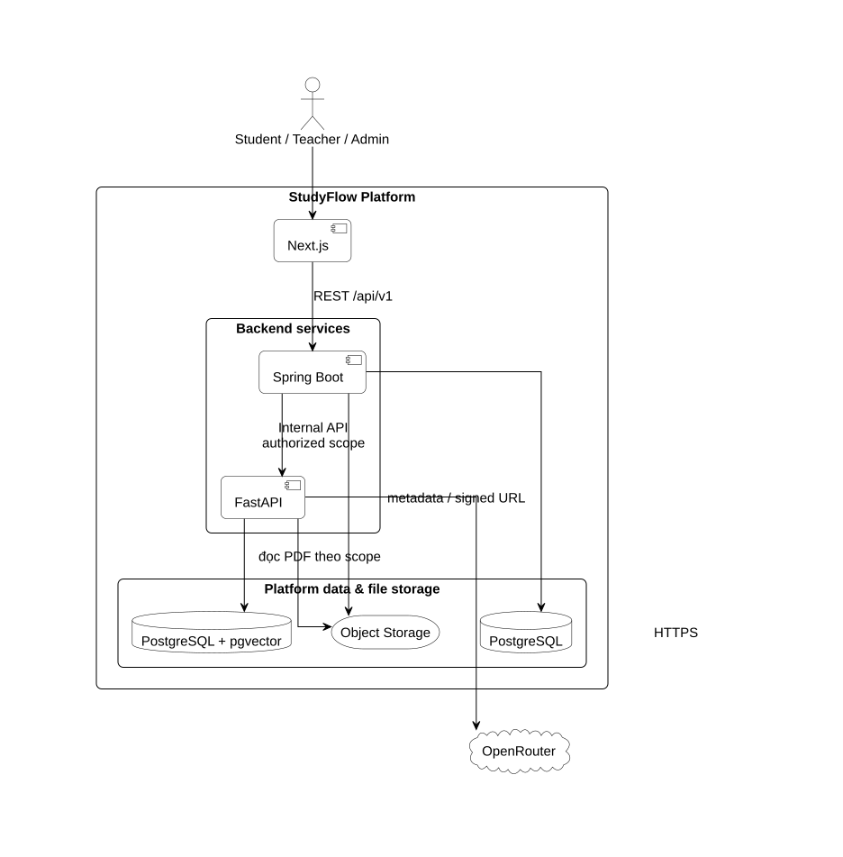

*Hình 3.1. Kiến trúc tổng thể và ranh giới trách nhiệm của StudyFlow.*

Trang web là nơi người dùng thực hiện các thao tác. Mọi yêu cầu từ trang web đều được gửi đến hệ thống chính để kiểm tra tài khoản, quyền sử dụng tài liệu và các quy tắc học tập. Hệ thống chính cũng chịu trách nhiệm quản lý bộ câu hỏi từ lúc tạo đến lúc sử dụng, chấm điểm, ghi nhận tiến độ và quản lý kế hoạch học tập.

Phần AI chỉ nhận đúng tài liệu và phạm vi trang mà hệ thống chính đã cho phép. Phần này đọc nội dung PDF, tìm đoạn liên quan, trả lời câu hỏi, giải thích bài học, chỉ rõ trang nguồn và tạo bản nháp bộ câu hỏi. Phần AI không được tự xem thông tin cá nhân, kết quả học tập hoặc dữ liệu quản lý của Sinh viên.

Dữ liệu được lưu trong cùng một hệ thống nhưng chia thành hai khu vực tách biệt: một khu vực chứa thông tin người dùng và hoạt động học tập, khu vực còn lại phục vụ việc xử lý tài liệu bằng AI. Mỗi phần chỉ được sử dụng khu vực dữ liệu thuộc trách nhiệm của mình. Tệp PDF gốc và các hình ảnh dùng để xem tài liệu được lưu trong một kho tệp riêng; cơ sở dữ liệu chỉ lưu thông tin mô tả và vị trí của tệp. Khóa dùng để kết nối với dịch vụ AI chỉ được giữ tại phần xử lý AI và không bao giờ được gửi xuống trình duyệt của người dùng.

### 3.1.2. Trách nhiệm của từng phần

| Phần của hệ thống | Nhiệm vụ chính | Không được thực hiện |
|---|---|---|
| Trang web, xây dựng bằng Next.js | Hiển thị màn hình cho Sinh viên, Giảng viên và Quản trị viên; gửi yêu cầu; hiển thị trạng thái và kết quả | Không gọi thẳng phần AI, không tự chấm điểm và không tự thay đổi tiến độ |
| Hệ thống chính, xây dựng bằng Java | Đăng nhập, kiểm tra quyền, quản lý lớp học phần, tài liệu, bộ câu hỏi, điểm số, tiến độ và kế hoạch học tập | Không tin các thông tin về quyền do trình duyệt tự gửi lên nếu chưa kiểm tra |
| Phần kết nối dữ liệu của hệ thống chính | Đọc và lưu dữ liệu học tập; gửi yêu cầu đã được kiểm tra sang phần AI; quản lý kho tệp | Không tự đọc hoặc sửa dữ liệu tìm kiếm chuyên dụng của phần AI |
| Phần xử lý AI, xây dựng bằng Python | Đọc PDF, chuẩn bị nội dung, tìm đoạn phù hợp, tạo câu trả lời, bản tóm tắt và bản nháp câu hỏi | Không duyệt bộ câu hỏi, không chấm điểm, không thay đổi thành viên lớp hoặc kế hoạch học tập |
| Dịch vụ AI bên ngoài | Hỗ trợ hiểu yêu cầu và tạo nội dung từ phần tài liệu được cung cấp | Không nhận khóa truy cập của người dùng và không quyết định người nào được xem tài liệu |

Mỗi yêu cầu trao đổi giữa hệ thống chính và phần AI phải có khóa xác nhận nội bộ, mã theo dõi và số phiên bản của cách trao đổi dữ liệu. Với yêu cầu có thể tạo hoặc thay đổi dữ liệu, hệ thống còn dùng một mã chống lặp để cùng một yêu cầu không bị thực hiện hai lần. Thông tin đăng nhập của người dùng không được dùng thay cho khóa xác nhận nội bộ.

Các công việc mất nhiều thời gian, như chuẩn bị một PDF hoặc sinh bộ câu hỏi, được tiếp nhận trước rồi xử lý ở phía sau. Trang web chỉ hỏi hệ thống chính về tình trạng công việc; trang web không hỏi trực tiếp phần AI. Nếu có lỗi hoặc hết thời gian chờ, hệ thống phải thông báo rõ và không tự tạo thêm một công việc trùng lặp.

### 3.1.3. Lý do lựa chọn cách chia hệ thống

Việc tách hệ thống chính và phần AI giúp nhóm có thể thay đổi cách xử lý AI mà không làm thay đổi các quy tắc về tài khoản, lớp học, điểm số và tiến độ. Đổi lại, kết quả đi qua hai phần nên phải được kiểm tra cả trước khi gửi và sau khi nhận. Hệ thống chính chỉ công nhận kết quả khi quyền sử dụng vẫn còn hiệu lực và dữ liệu trả về đầy đủ.

Để tìm đúng đoạn trong tài liệu, mỗi đoạn văn được chuyển thành một dãy 1.024 con số thể hiện ý nghĩa của đoạn đó. Câu hỏi của người dùng cũng được chuyển theo cùng cách để so sánh mức độ gần nhau. Nếu thay đổi cách chuyển đổi hoặc độ dài của dãy số, toàn bộ tài liệu cũ phải được xử lý lại; không được dùng lẫn kết quả của hai cách xử lý khác nhau.

## 3.2. Thiết kế thực thể và quan hệ nghiệp vụ

### 3.2.1. Sơ đồ thực thể tổng quan

Hình 3.2 trình bày những nhóm thông tin quan trọng của hệ thống dưới dạng các bảng và đường liên kết. Biểu tượng chiếc khóa cho biết trường dùng để nhận diện một bản ghi. Đường nối và ký hiệu ở hai đầu cho biết một bản ghi có thể liên quan đến một hay nhiều bản ghi khác.

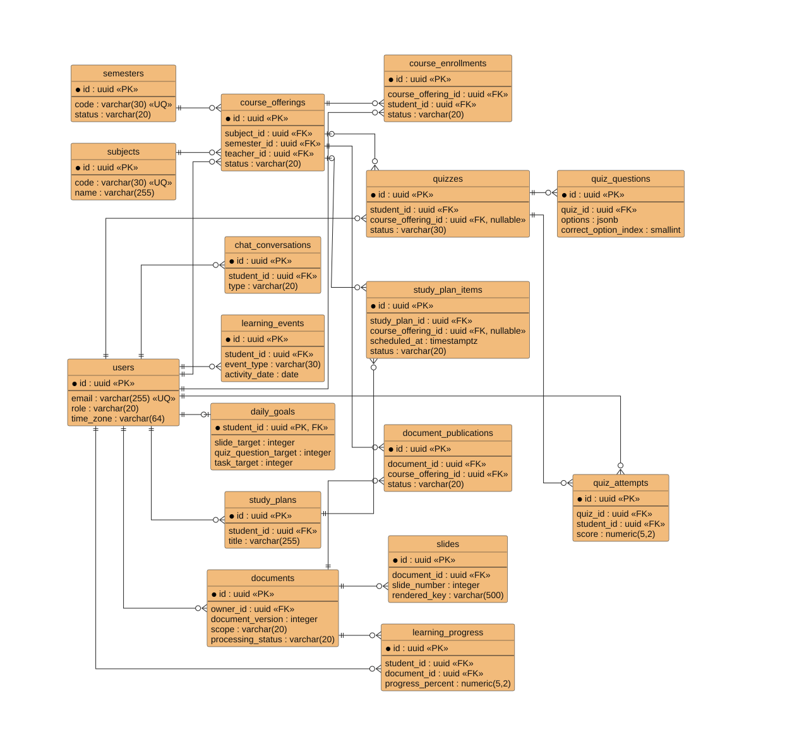

*Hình 3.2. Các nhóm thông tin chính và quan hệ giữa chúng.*

Một lớp học phần gắn với một môn học, một học kỳ và một Giảng viên. Sinh viên tham gia lớp thông qua yêu cầu tham gia và chỉ được sử dụng học liệu khi đã được chấp nhận. Tài liệu luôn có chủ sở hữu; việc Giảng viên công bố tài liệu cho lớp không làm thay đổi chủ sở hữu của tài liệu đó. PDF cá nhân của Sinh viên cũng không tự trở thành học liệu chung khi được dùng để hỏi đáp hoặc tạo câu hỏi.

Bộ câu hỏi cá nhân có thể không gắn với lớp học phần. Một Sinh viên có thể chưa đặt mục tiêu hằng ngày mà vẫn sử dụng các chức năng học tập khác. Bộ câu hỏi đang được tạo có thể chưa có câu hỏi; chỉ bộ đã được kiểm tra đầy đủ mới được chuyển sang bước ôn tập hoặc công bố. Việc xóa một thông tin không được tự động xóa toàn bộ lịch sử liên quan nếu chưa có quy tắc rõ ràng.

### 3.2.2. Các quy tắc bảo đảm dữ liệu đúng

- Hội thoại và bộ câu hỏi phải ghi lại đúng phiên bản tài liệu đã sử dụng. Khi tài liệu được thay mới, nguồn của kết quả cũ vẫn phải được xác định.
- Ghi chú theo trang thuộc riêng Sinh viên đã tạo ghi chú, không trở thành ghi chú chung của Giảng viên hoặc cả lớp.
- Mỗi câu trắc nghiệm có đúng bốn phương án, một đáp án đúng và nguồn theo trang. Mỗi lần làm bài được lưu thành một lượt riêng để không ghi đè lịch sử.
- Tiến độ đọc tài liệu được tính theo các trang đã xem và không được dùng như điểm kiểm tra. Ngày học được xác định theo múi giờ của Sinh viên.
- Nhiệm vụ và lịch tuần cùng lấy dữ liệu từ kế hoạch do Sinh viên tạo. Chuỗi ngày học liên tiếp và nội dung cần ôn lại được tính từ lịch sử hoạt động, không cần tạo thêm một bản dữ liệu độc lập.

## 3.3. Thiết kế cơ sở dữ liệu chung

### 3.3.1. Sơ đồ cơ sở dữ liệu tổng quan

Hình 3.3 trình bày 31 bảng dự kiến: 27 bảng lưu thông tin người dùng và hoạt động học tập, cùng 4 bảng phục vụ việc xử lý AI. Trong hình, PK là trường nhận diện duy nhất của một bản ghi; FK là trường dùng để liên kết sang bảng khác; trường cho phép để trống được đánh dấu riêng.

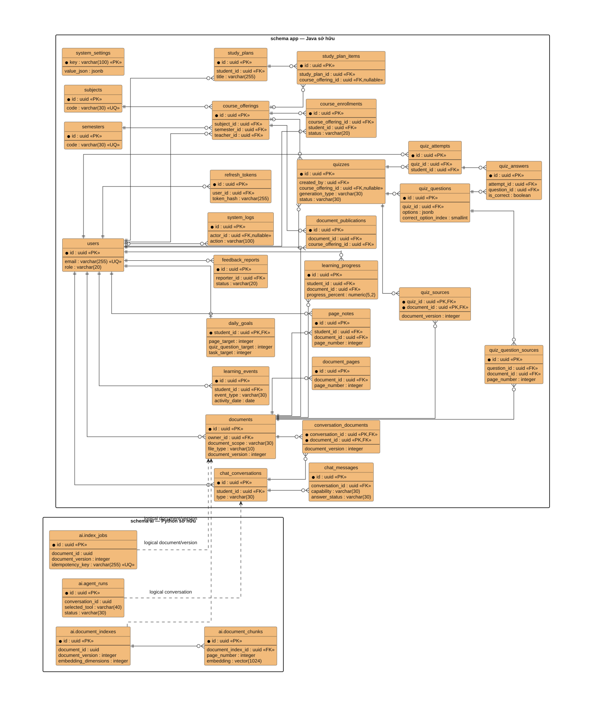

*Hình 3.3. Sơ đồ tổng quan gồm 27 bảng dữ liệu học tập và 4 bảng dữ liệu AI.*

Hai khu vực dữ liệu dùng các mã tài liệu và phiên bản để đối chiếu nhưng không liên kết cứng vào nhau. Cách này giúp phần AI không thể tự đi sang khu vực dữ liệu học tập để đọc thông tin người dùng. Do sơ đồ có nhiều bảng, hình nên được đặt ở trang ngang hoặc phụ lục khổ lớn và ưu tiên dùng bản SVG để chữ không bị mờ khi phóng to.

Đây là thiết kế dự kiến, chưa phải ảnh chụp từ cơ sở dữ liệu đã vận hành. Độ dài văn bản, trường bắt buộc và một số nhóm trường kết hợp sẽ được chốt khi tạo cơ sở dữ liệu thực tế.

### 3.3.2. Danh mục bảng và ý nghĩa

Cột “Thông tin chính” dưới đây diễn đạt nội dung bằng tiếng Việt. Tên bảng được giữ nguyên để nhóm triển khai có thể đối chiếu với sơ đồ.

| Bảng | Thông tin chính | Ý nghĩa và quy tắc |
|---|---|---|
| app.users | Mã người dùng, email, tên đăng nhập, mật khẩu đã mã hóa, vai trò, trạng thái, múi giờ | Email và tên đăng nhập không được trùng; không lưu mật khẩu nguyên bản |
| app.refresh_tokens | Phiên đăng nhập còn hiệu lực, thời điểm hết hạn và thu hồi | Chỉ lưu dạng đã mã hóa; hỗ trợ đăng xuất và thu hồi phiên |
| app.subjects | Mã môn, tên môn và trạng thái | Quản trị viên quản lý danh mục môn; mã môn không trùng |
| app.semesters | Mã học kỳ, ngày bắt đầu, ngày kết thúc và trạng thái | Ngày kết thúc không được trước ngày bắt đầu |
| app.course_offerings | Môn học, học kỳ, Giảng viên, mã tham gia và trạng thái lớp | Giảng viên sở hữu lớp; mã tham gia được bảo vệ và không ghi vào nhật ký |
| app.course_enrollments | Lớp, Sinh viên, trạng thái yêu cầu và người xét duyệt | Một Sinh viên chỉ có một yêu cầu hiện hành cho mỗi lớp |
| app.documents | Chủ sở hữu, loại tài liệu, vị trí tệp, phiên bản, trạng thái xử lý và số trang | Chỉ nhận PDF có thể đọc được chữ; không gửi vị trí tệp nội bộ xuống trình duyệt |
| app.document_publications | Tài liệu, lớp học phần, người công bố và trạng thái | Một tài liệu chỉ có một trạng thái công bố trong cùng lớp |
| app.document_pages | Tài liệu, số trang và vị trí ảnh xem trước | Mỗi số trang chỉ xuất hiện một lần trong một tài liệu |
| app.page_notes | Sinh viên, tài liệu, số trang và nội dung ghi chú | Ghi chú thuộc riêng Sinh viên và phải kiểm tra quyền mỗi lần đọc hoặc sửa |
| app.chat_conversations | Sinh viên, tiêu đề, loại và trạng thái cuộc trò chuyện | Cuộc trò chuyện thuộc riêng người tạo |
| app.conversation_documents | Cuộc trò chuyện, tài liệu và phiên bản tài liệu | Ghi lại đúng nguồn đã dùng cho cuộc trò chuyện |
| app.chat_messages | Người gửi, nội dung, trạng thái trả lời, nguồn và mã theo dõi | Không sao chép nội dung trò chuyện vào nhật ký hệ thống |
| app.learning_progress | Sinh viên, tài liệu, lớp, trang gần nhất, số trang đã xem và phần trăm | Chỉ phản ánh tiến độ đọc, không suy đoán mức độ thành thạo |
| app.learning_events | Sinh viên, loại hoạt động, ngày và số lượng | Ngăn một hoạt động bị ghi nhận nhiều lần |
| app.daily_goals | Mục tiêu số trang, số câu và số nhiệm vụ trong ngày | Chỉ lưu mục tiêu; kết quả thực tế được tính từ hoạt động học |
| app.study_plans | Sinh viên và thông tin kế hoạch | Sinh viên tự quản lý; AI không tự lập kế hoạch |
| app.study_plan_items | Kế hoạch, lớp học phần nếu có, thời gian và trạng thái | Là nguồn để hiển thị nhiệm vụ và lịch tuần |
| app.quizzes | Người tạo, vai trò người tạo, lớp nếu có, trạng thái và bộ được tạo lại từ đâu | Hệ thống chính quản lý toàn bộ quá trình của bộ câu hỏi |
| app.quiz_sources | Bộ câu hỏi, tài liệu và phiên bản | Nguồn tạo câu hỏi độc lập với nơi bộ câu hỏi được sử dụng |
| app.quiz_questions | Nội dung câu, bốn phương án, đáp án đúng và lời giải thích | Mỗi câu phải có đúng bốn phương án và một đáp án đúng |
| app.quiz_question_sources | Câu hỏi, tài liệu, số trang và đoạn nguồn | Cho phép kiểm tra nguồn và mở lại nội dung cần ôn |
| app.quiz_attempts | Bộ câu hỏi, Sinh viên, thời gian bắt đầu, kết thúc và điểm | Mỗi lần làm bài là một bản ghi riêng |
| app.quiz_answers | Lượt làm, câu hỏi, lựa chọn của Sinh viên và kết quả đúng hoặc sai | Mỗi câu chỉ có một câu trả lời trong một lượt làm |
| app.feedback_reports | Người gửi, nội dung và trạng thái phản hồi | Dùng để xử lý phản hồi, không cấp thêm quyền xem dữ liệu cá nhân |
| app.system_logs | Người thực hiện, hành động, đối tượng và kết quả | Chỉ lưu thông tin cần thiết; không lưu câu hỏi riêng tư, nội dung PDF hoặc khóa truy cập |
| app.system_settings | Tên cấu hình và giá trị | Không dùng để lưu khóa kết nối dịch vụ AI |
| ai.index_jobs | Yêu cầu xử lý tài liệu, trạng thái, số lần thử và lỗi an toàn | Một yêu cầu lặp lại không tạo dữ liệu trùng; liên kết tải tệp tạm thời được xóa sau khi hoàn tất |
| ai.document_indexes | Tài liệu, phiên bản, cách xử lý và trạng thái | Theo dõi tài liệu đã được chuẩn bị bằng cách nào |
| ai.document_chunks | Đoạn nội dung, tài liệu, chủ sở hữu, số trang và dãy số phục vụ tìm kiếm | Chỉ tìm trong phạm vi được phép; một đoạn không bị lưu trùng |
| ai.agent_runs | Lần xử lý, yêu cầu tương ứng, loại việc được chọn, trạng thái và thời gian | Chỉ lưu thông tin phục vụ theo dõi; không lưu toàn bộ PDF hoặc khóa bí mật |

### 3.3.3. Tìm kiếm nhanh và ghi dữ liệu an toàn

Hệ thống tạo các dấu tra cứu để tìm nhanh người dùng, lớp, trạng thái và tài liệu. Riêng phần AI có thêm cách tìm các đoạn văn gần nghĩa với câu hỏi. Điều kiện về chủ sở hữu, tài liệu, phiên bản và loại nguồn phải được kiểm tra ngay trong lúc tìm; không được tìm trên toàn bộ dữ liệu rồi mới loại bỏ phần không có quyền.

Khi chấm bài, hệ thống lưu lượt làm và các câu trả lời như một công việc hoàn chỉnh. Nếu một phần bị lỗi, toàn bộ lần lưu đó phải được hủy để tránh dữ liệu dở dang. Hoạt động hoàn tất nhiệm vụ và xem trang cũng phải có cách ngăn ghi trùng.

Mục tiêu mỗi ngày cho phép đặt từ 0 đến 100 trang, 0 đến 200 câu hỏi và 0 đến 50 nhiệm vụ, nhưng tổng mục tiêu phải lớn hơn 0. Chuỗi ngày học liên tiếp chỉ tính ngày có ít nhất một hoạt động hợp lệ: xem trang tài liệu, hoàn tất nhiệm vụ hoặc hoàn thành bài trắc nghiệm. Đăng nhập, ghi chú và hỏi AI không được tính.

## 3.4. Thiết kế chi tiết ba chức năng AI

Các sơ đồ lớp trong mục này cho biết những nhóm xử lý cần có và trách nhiệm của từng nhóm. Tên trong sơ đồ là tên dự kiến để hỗ trợ lập trình, không có nghĩa toàn bộ các phần đó đã được xây dựng.

### 3.4.1. Hỏi đáp và tóm tắt tài liệu cá nhân — AI-F01

Hình 3.4 cho thấy cách hệ thống kiểm tra chủ sở hữu tài liệu, lấy nội dung cuộc trò chuyện và chuyển phần được phép sang AI.

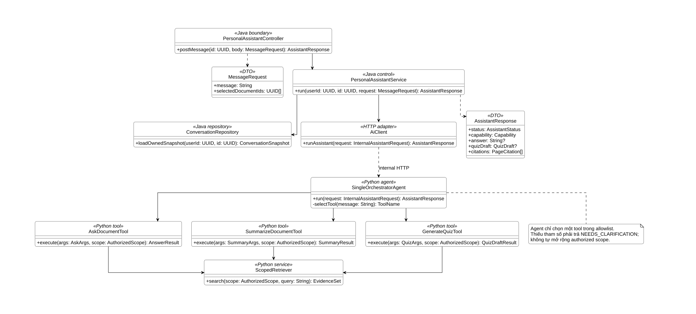

*Hình 3.4. Các nhóm xử lý chức năng hỏi đáp và tóm tắt tài liệu cá nhân.*

Sinh viên gửi yêu cầu cùng danh sách PDF đã chọn. Hệ thống chính kiểm tra tài liệu có thuộc Sinh viên hay không và lấy phần trò chuyện cần thiết. Phần AI xác định người dùng muốn hỏi đáp, tóm tắt hay tạo bộ câu hỏi, sau đó chỉ thực hiện đúng một việc. Kết quả phải nêu rõ trạng thái, nội dung và trang nguồn; hệ thống chính kiểm tra lại trước khi hiển thị hoặc lưu.

### 3.4.2. Hỏi đáp tài liệu bài giảng — AI-F02

Hình 3.5 làm rõ việc Sinh viên chỉ được hỏi trên tài liệu đã công bố cho lớp học phần mà mình được tham gia.

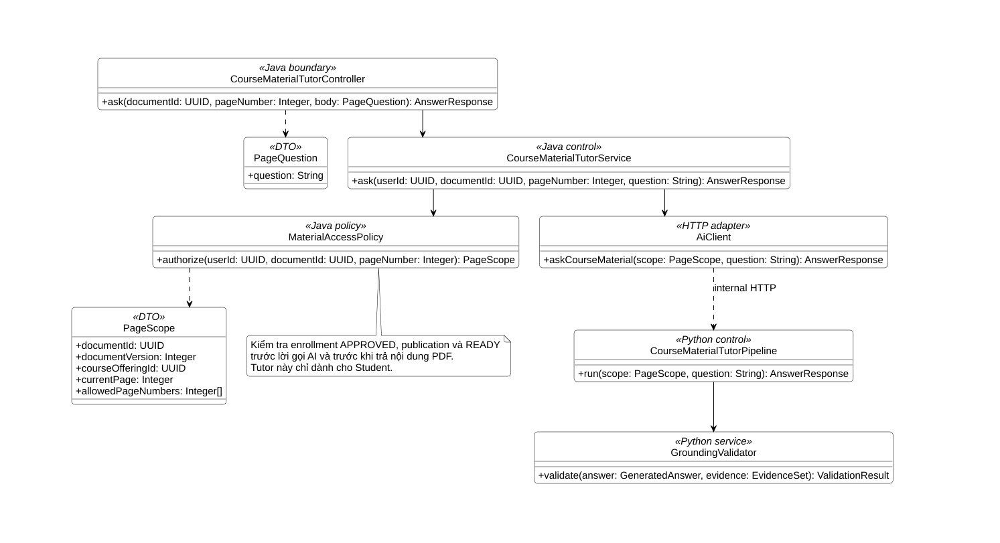

*Hình 3.5. Các nhóm xử lý chức năng hỏi đáp tài liệu bài giảng.*

Hệ thống chính xác định đúng phiên bản tài liệu, trang đang xem và những trang Sinh viên được phép sử dụng. Trình duyệt không thể tự mở rộng sang tài liệu hoặc trang khác. Sau khi AI trả kết quả, quyền sử dụng được kiểm tra lại để xử lý trường hợp tài liệu vừa bị thu hồi trong thời gian chờ.

### 3.4.3. Sinh bộ câu hỏi trắc nghiệm — AI-F03

Hình 3.6 tách rõ việc AI tạo bản nháp với việc người dùng xem lại và hệ thống chấm điểm.

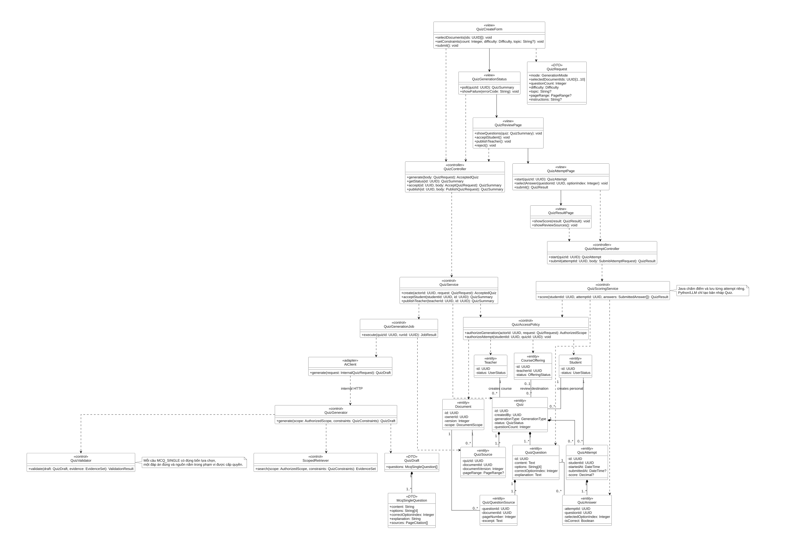

*Hình 3.6. Các nhóm xử lý việc sinh và tiếp nhận bản nháp bộ câu hỏi.*

Hệ thống chính tiếp nhận yêu cầu và theo dõi quá trình tạo. Phần AI trả về một bản nháp trong đó mỗi câu có bốn phương án, một đáp án đúng, lời giải thích và trang nguồn. Hệ thống chính kiểm tra toàn bộ bộ câu hỏi rồi mới chuyển sang trạng thái chờ người dùng xem lại. Việc chấp nhận, công bố, làm bài và chấm điểm không thuộc trách nhiệm của AI.

### 3.4.4. Quy định dữ liệu vào và kết quả trả về

| Trường hợp | Thông tin cần cung cấp | Kết quả hợp lệ | Khi không thể tiếp tục |
|---|---|---|---|
| Hỏi hoặc tóm tắt PDF cá nhân | Nội dung yêu cầu và từ một đến mười PDF thuộc Sinh viên | Câu trả lời, bản tóm tắt, bản nháp câu hỏi, yêu cầu bổ sung thông tin hoặc thông báo không tìm thấy căn cứ | Dừng khi tài liệu không thuộc người dùng, sai phiên bản hoặc chưa sẵn sàng |
| Hỏi tài liệu bài giảng | Câu hỏi, tài liệu và trang đang xem | Câu trả lời có trang nguồn; không tự tăng tiến độ từ hành động hỏi AI | Từ chối khi Sinh viên không còn quyền, tài liệu chưa công bố hoặc trang không hợp lệ |
| Sinh bộ câu hỏi | Người tạo, tài liệu, số câu, mức độ, chủ đề và phạm vi trang | Tiếp nhận yêu cầu và tạo bản nháp chờ xem lại | Không tạo khi nguồn không hợp lệ; ghi nhận thất bại nếu AI không thể tạo bộ đúng quy tắc |
| Trao đổi giữa hệ thống chính và phần AI | Khóa xác nhận nội bộ, mã theo dõi và phạm vi tài liệu được phép | Kết quả có cấu trúc rõ ràng để hệ thống chính kiểm tra | Từ chối khi thiếu khóa, sai phiên bản hoặc phạm vi không hợp lệ |
| Công việc xử lý phía sau | Mã bộ câu hỏi và mã lần chạy | Lưu trọn vẹn bản nháp hợp lệ hoặc ghi trạng thái thất bại | Chạy lại không tạo câu trùng; kết quả cũ không ghi đè kết quả mới |

Tên trường, địa chỉ gửi yêu cầu và mã lỗi dành cho người triển khai được quy định tại [kế hoạch API](../api-plan.md). Chương này tập trung giải thích ý nghĩa và trách nhiệm, không lặp lại toàn bộ thông số kỹ thuật.

### 3.4.5. Phần của các thành viên còn lại

Sáu chức năng do hai thành viên phụ trách phần hệ thống chính vẫn cần được chốt trong Chương 2 trước khi bổ sung sơ đồ chi tiết. Khi đã lựa chọn, mỗi chức năng phải có mô tả trách nhiệm, dữ liệu vào và ra, các bước xử lý, trường hợp thay thế, ngoại lệ và tiêu chí kiểm thử theo cùng một mẫu.

## 3.5. Thiết kế các luồng hoạt động

Ba loại sơ đồ được sử dụng với ba mục đích khác nhau. Activity Diagram mô tả các bước và nhánh lựa chọn. Sequence Diagram cho biết các thành phần trao đổi theo thứ tự nào. State Machine Diagram cho biết một đối tượng có thể chuyển qua những trạng thái nào. Mỗi hình đều có đoạn giải thích ngay sau hình để người đọc biết điểm cần quan sát.

### 3.5.1. Các bước hỏi đáp tài liệu cá nhân

Hình 3.7 mô tả quá trình từ lúc Sinh viên gửi yêu cầu đến lúc nhận câu trả lời, bản tóm tắt hoặc bản nháp bộ câu hỏi.

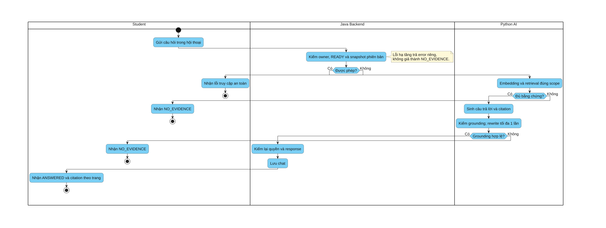

*Hình 3.7. Các bước lựa chọn hỏi đáp, tóm tắt hoặc tạo bộ câu hỏi.*

Quyền sử dụng tài liệu được kiểm tra trước khi tìm nội dung. Nếu tài liệu không có căn cứ phù hợp, hệ thống dừng và thông báo không tìm thấy căn cứ. Nếu có căn cứ, AI tạo kết quả và hệ thống kiểm tra lại nguồn. Khi kết quả chưa đạt, AI chỉ được sửa lại một lần và không được đổi sang tài liệu khác.

### 3.5.2. Các bước hỏi đáp tài liệu bài giảng

Hình 3.8 thể hiện việc hỏi đáp trong phạm vi PDF đã được Giảng viên công bố cho lớp học phần.

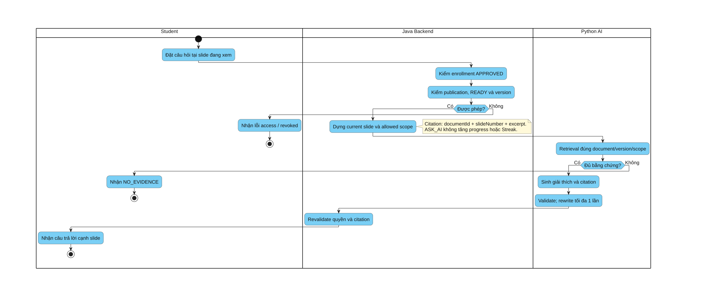

*Hình 3.8. Các bước hỏi đáp tài liệu bài giảng theo trang.*

Hệ thống kiểm tra Sinh viên đã được chấp nhận vào lớp và tài liệu vẫn đang được công bố. Trang hiện tại được ưu tiên, nhưng AI chỉ được dùng những trang đã được cho phép trong cùng tài liệu. Kết quả luôn kèm trang nguồn. Hành động hỏi AI không được tính là một ngày học trong chuỗi ngày học liên tiếp.

### 3.5.3. Các bước sinh bộ câu hỏi

Hình 3.9 mô tả quá trình tạo bản nháp, kiểm tra và chuyển quyền quyết định cho Sinh viên hoặc Giảng viên.

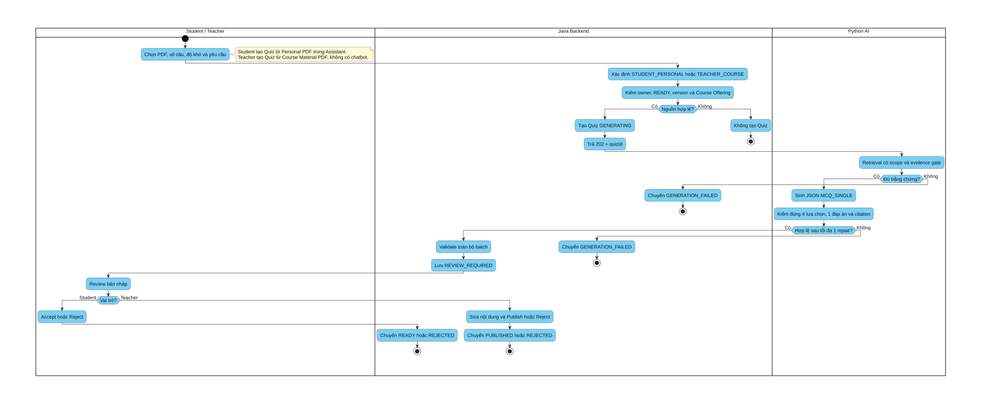

*Hình 3.9. Các bước sinh và xem lại bộ câu hỏi bằng AI.*

Hệ thống chính ghi nhận bộ câu hỏi ở trạng thái đang tạo để trang web không phải chờ liên tục. AI tạo nội dung và kiểm tra nguồn; hệ thống chính tiếp tục kiểm tra mỗi câu có đủ bốn phương án và một đáp án đúng. Sinh viên phải chấp nhận trước khi ôn. Giảng viên có thể sửa rồi mới công bố cho lớp. Kết quả do AI tạo không được chuyển thẳng sang bước làm bài.

### 3.5.4. Thứ tự xử lý yêu cầu tài liệu cá nhân

Hình 3.10 cho biết thứ tự trao đổi giữa Sinh viên, trang web, hệ thống chính, phần AI, nơi lưu dữ liệu tìm kiếm và dịch vụ AI bên ngoài.

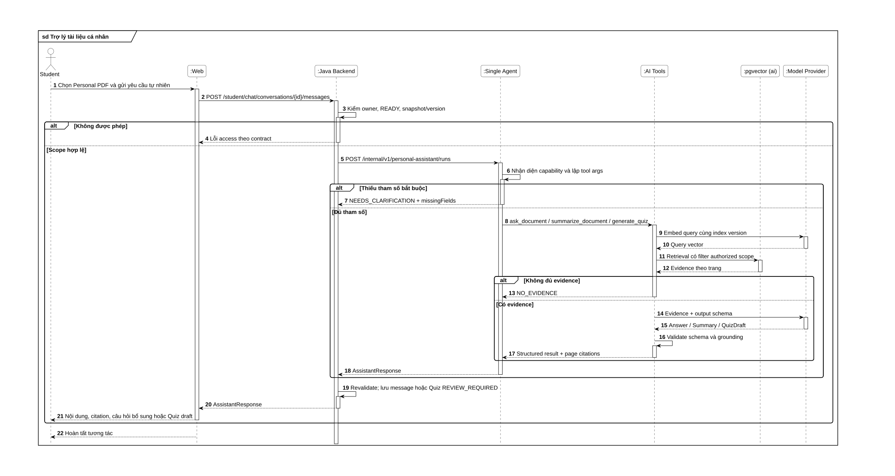

*Hình 3.10. Thứ tự xử lý yêu cầu hỏi đáp tài liệu cá nhân.*

Hệ thống phân biệt rõ bốn trường hợp: người dùng không có quyền, yêu cầu còn thiếu thông tin, tài liệu không đủ căn cứ và tài liệu có đủ căn cứ. AI có thể nhận biết người dùng muốn hỏi, tóm tắt hay tạo câu hỏi, nhưng hệ thống chính vẫn quyết định tài liệu nào được dùng và kiểm tra lại kết quả. Không đủ căn cứ thì không tạo nội dung.

### 3.5.5. Thứ tự xử lý câu hỏi về tài liệu bài giảng

Hình 3.11 cho biết một câu hỏi đi từ trang đọc PDF đến hệ thống chính, phần AI và quay trở lại Sinh viên như thế nào.

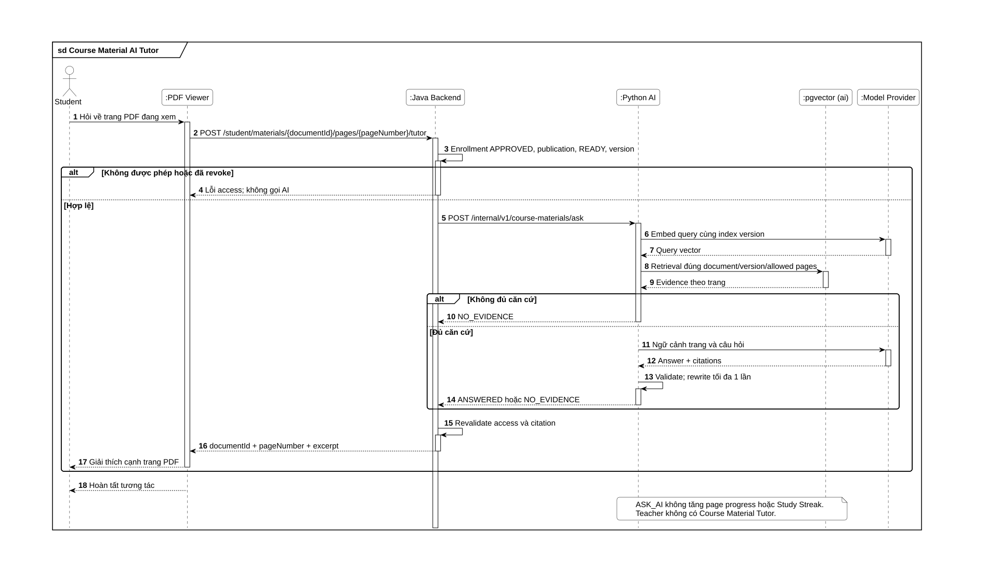

*Hình 3.11. Thứ tự xử lý câu hỏi về tài liệu bài giảng.*

Mỗi lần hỏi đều phải kiểm tra quyền hiện tại, kể cả khi Sinh viên đã hỏi trước đó trong cùng cuộc trò chuyện. Nếu Giảng viên thu hồi tài liệu trong lúc chờ, kết quả không được trả về. Nguồn của câu trả lời phải xác định đúng tài liệu và số trang.

### 3.5.6. Thứ tự tạo và duyệt bộ câu hỏi

Hình 3.12 phân biệt thời điểm hệ thống tiếp nhận yêu cầu, thời gian AI tạo nội dung và thao tác xem lại của người dùng.

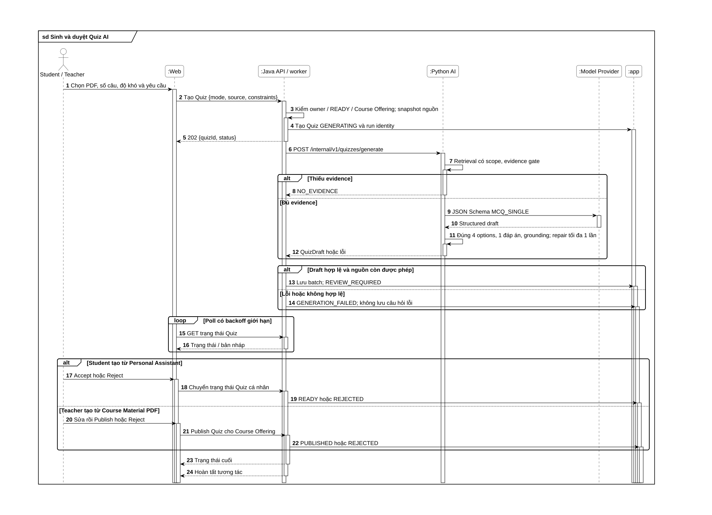

*Hình 3.12. Thứ tự tạo bản nháp và duyệt bộ câu hỏi cho Sinh viên hoặc Giảng viên.*

Trang web chỉ hỏi tình trạng từ hệ thống chính. Mỗi yêu cầu có mã riêng để lỗi mạng hoặc việc thử lại không tạo ra nhiều bộ giống nhau. Sinh viên chấp nhận bộ cá nhân trước khi ôn; Giảng viên xem lại, chỉnh sửa và công bố bộ câu hỏi của lớp. PDF cá nhân dùng làm nguồn không vì vậy mà trở thành học liệu chung.

### 3.5.7. Luồng tham gia lớp học phần

Hình 3.13 thể hiện quá trình từ lúc Sinh viên nhập mã tham gia đến lúc Giảng viên chấp nhận hoặc từ chối.

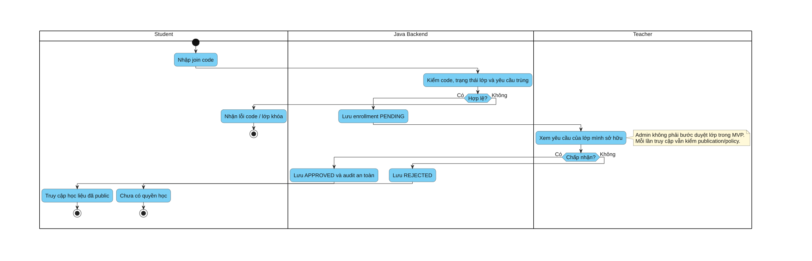

*Hình 3.13. Các bước tham gia và xét duyệt lớp học phần.*

Sinh viên không thể tự chuyển yêu cầu của mình sang trạng thái đã duyệt. Giảng viên sở hữu lớp là người quyết định. Sau khi được chấp nhận, mỗi lần mở học liệu vẫn phải kiểm tra lớp và tài liệu còn hoạt động; quyền không được cấp vĩnh viễn chỉ vì Sinh viên từng tham gia lớp.

### 3.5.8. Luồng chuẩn bị tài liệu

Hình 3.14 áp dụng cho cả PDF cá nhân và PDF bài giảng. Tài liệu được đọc theo từng trang để giữ nguồn chính xác.

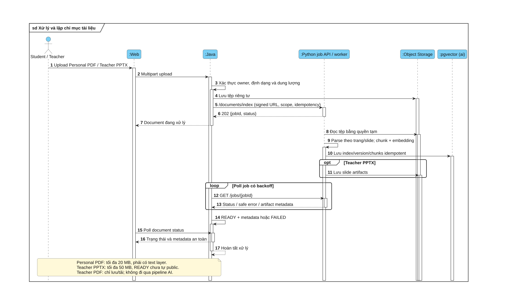

*Hình 3.14. Tiếp nhận, chuẩn bị và đồng bộ trạng thái tài liệu.*

Phần AI xác nhận đã nhận công việc trước, sau đó mới xử lý phía sau. Hệ thống chính định kỳ hỏi tình trạng và cập nhật cho người dùng. Chỉ PDF có thể đọc được chữ mới được chấp nhận. PDF bị khóa hoặc chỉ gồm hình ảnh phải được báo lỗi rõ ràng. Tài liệu xử lý xong vẫn cần Giảng viên chủ động công bố trước khi Sinh viên sử dụng.

### 3.5.9. Các trạng thái của bộ câu hỏi

Hình 3.15 thể hiện những trạng thái mà một bộ câu hỏi có thể đi qua, tách biệt với các lần Sinh viên làm bài.

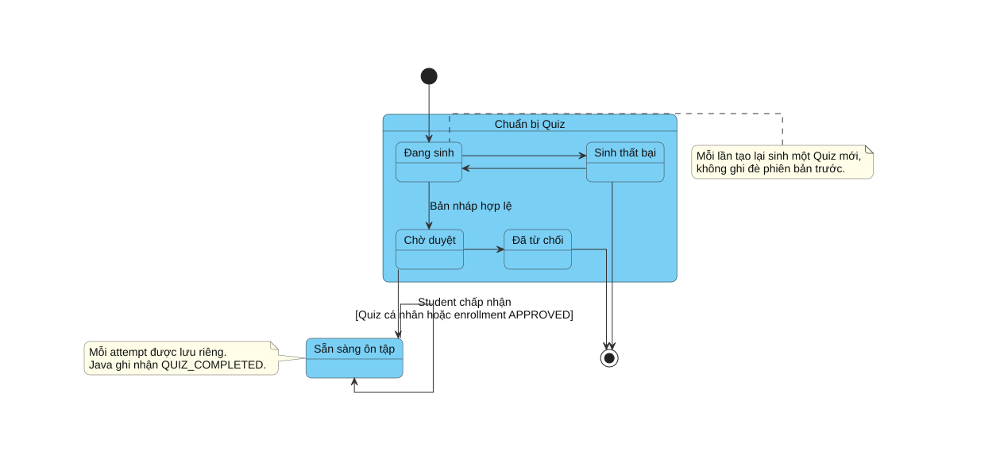

*Hình 3.15. Trạng thái của bộ câu hỏi và điều kiện chuyển trạng thái.*

Bộ câu hỏi chỉ chuyển từ đang tạo sang chờ duyệt khi toàn bộ câu hỏi hợp lệ. Sinh viên chấp nhận bộ cá nhân để bắt đầu ôn; Giảng viên công bố bộ của lớp sau khi xem lại. Mỗi lần làm bài tạo một lịch sử riêng và không đưa bộ câu hỏi quay lại trạng thái đang tạo. Yêu cầu tạo lại sinh một bộ mới, không ghi đè bộ cũ. Hệ thống chính chấm điểm, AI không chấm.

### 3.5.10. Luồng Kế hoạch và Lịch

Hình 3.16 mô tả việc Sinh viên tự tạo nhiệm vụ, đặt lịch và đánh dấu hoàn thành.

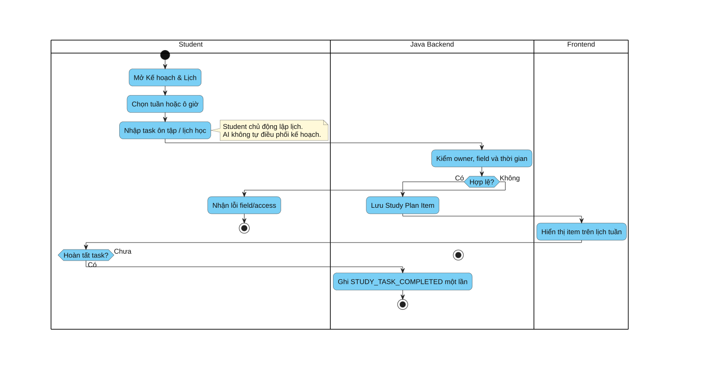

*Hình 3.16. Các bước quản lý nhiệm vụ và lịch tuần.*

Hệ thống kiểm tra nhiệm vụ có thuộc Sinh viên hay không trước khi lưu. Lịch tuần chỉ hiển thị các nhiệm vụ và lịch học đã được tạo, không tự ghi thêm hoạt động học. Chỉ thao tác hoàn tất nhiệm vụ hợp lệ mới được ghi nhận và một lần hoàn tất không được tính nhiều lần. AI không tự sắp xếp lịch.

### 3.5.11. Luồng Dashboard và ghi nhận hoạt động học

Hình 3.17 mô tả cách các hoạt động hợp lệ được tổng hợp thành tiến độ, mục tiêu trong ngày và chuỗi ngày học liên tiếp.

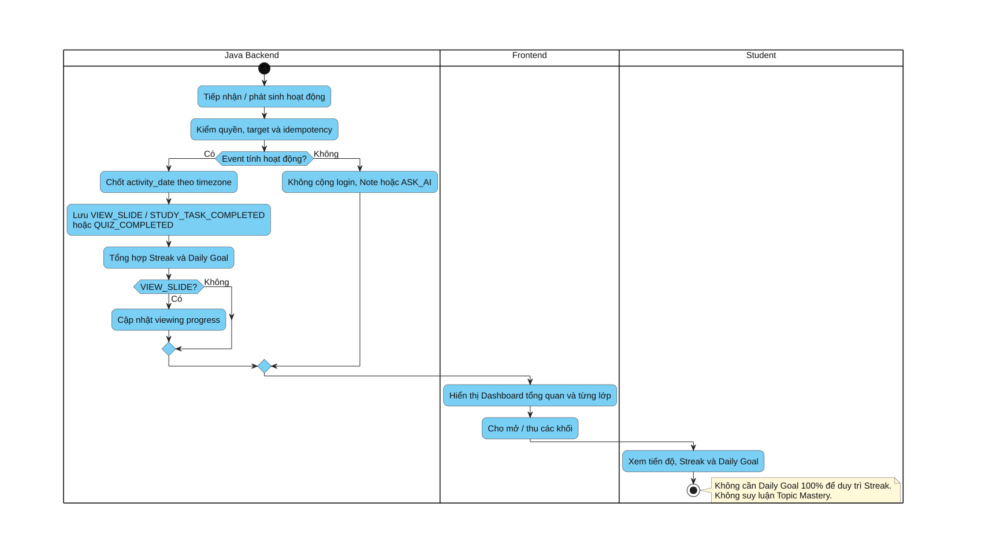

*Hình 3.17. Tổng hợp hoạt động học tập cho Dashboard.*

Ngày học được xác định theo múi giờ của Sinh viên và mỗi hoạt động chỉ được tính một lần. Chỉ xem trang, hoàn tất nhiệm vụ và hoàn thành bài trắc nghiệm được dùng để duy trì chuỗi ngày học. Đăng nhập, ghi chú và hỏi AI không được tính. Dashboard hiển thị toàn bộ tiến độ chung và tiến độ của từng lớp học phần, có thể mở hoặc thu gọn các phần; hệ thống không có trang tiến độ riêng.

### 3.5.12. Sequence Đăng ký Lớp học phần bằng Join Code — BE1-F01

Hình 3.18 mô tả tương tác tuần tự giữa Student, Teacher, Web, Java Backend và Database trong luồng ghi danh lớp học phần.

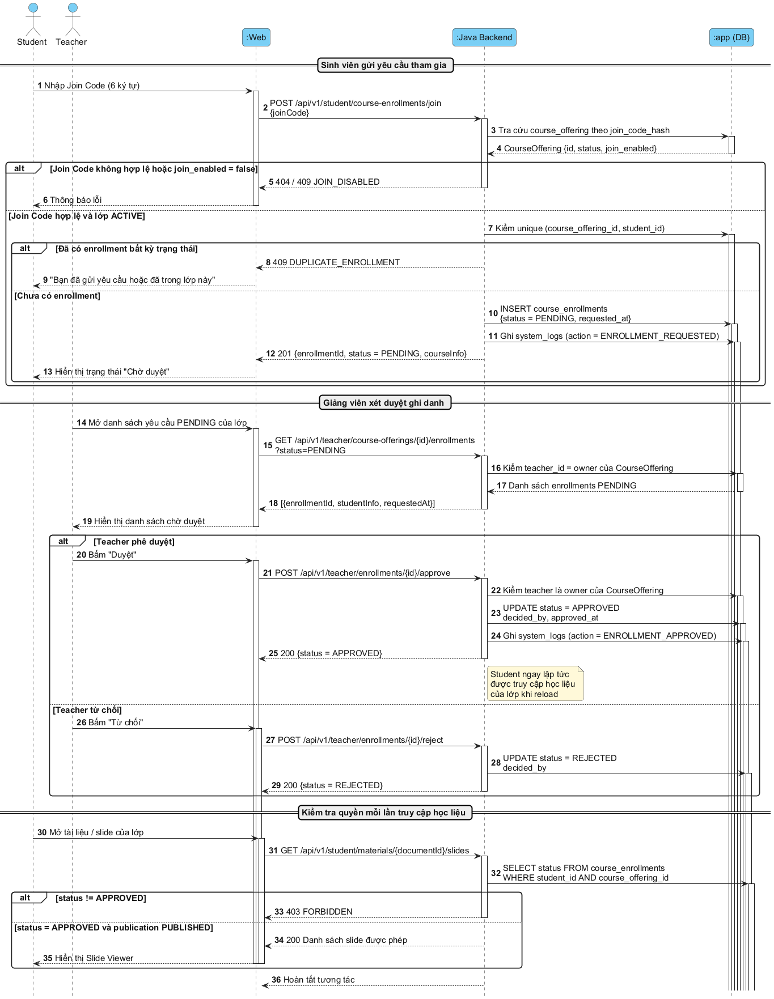

*Hình 3.18. Biểu đồ tuần tự luồng đăng ký lớp học phần và xét duyệt ghi danh (BE1-F01).*

Biểu đồ thể hiện ba giai đoạn chính: **(1)** Student nhập Join Code — Java tra cứu theo `join_code_hash`, kiểm tra `join_enabled` và trạng thái lớp `ACTIVE`, sau đó kiểm tra ràng buộc unique `(course_offering_id, student_id)` để tạo `CourseEnrollment` với trạng thái `PENDING`. **(2)** Teacher xem danh sách `PENDING`, Java xác minh `teacher_id` là owner của Course Offering, sau đó chuyển trạng thái sang `APPROVED` hoặc `REJECTED` và ghi `system_logs`. **(3)** Mỗi lần Student truy cập học liệu, Java kiểm tra lại trạng thái Enrollment hiện tại — không tin vào session cũ, chỉ APPROVED mới được phép.

### 3.5.13. Sequence Engine tính toán Study Streak và Daily Goal — BE1-F02

Hình 3.19 thể hiện hai luồng song song: cấu hình Daily Goal của Student và tổng hợp Streak khi truy vấn Dashboard.

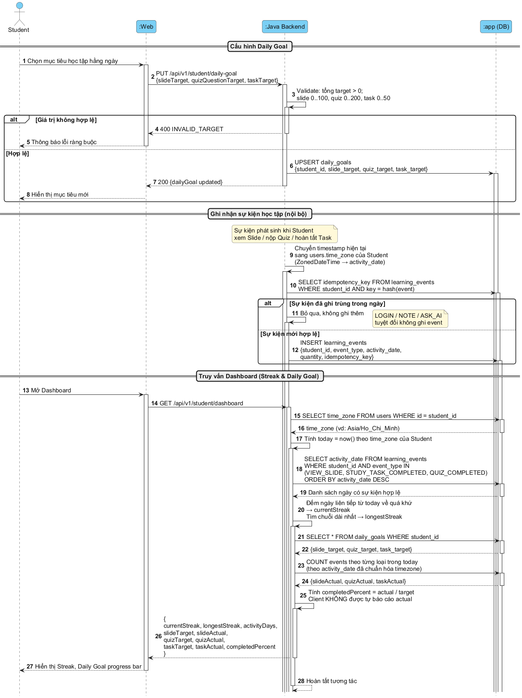

*Hình 3.19. Biểu đồ tuần tự tính toán Study Streak và Daily Goal theo múi giờ người dùng (BE1-F02).*

Điểm kỹ thuật trọng tâm: Java chuyển timestamp ghi sự kiện sang múi giờ `users.time_zone` của Student bằng `ZonedDateTime` trước khi lưu `activity_date` — đảm bảo Student ở UTC+7 tạo sự kiện lúc 23:59 giờ địa phương được ghi đúng ngày. Cơ chế `idempotency_key` ngăn ghi trùng sự kiện khi retry. Các sự kiện `LOGIN`, `NOTE`, `ASK_AI` không được tính vào Streak hoặc Daily Goal theo quy tắc nghiệp vụ. Khi tổng hợp Dashboard, Java đọc `activity_date` đã chuẩn hóa để đếm chuỗi ngày liên tiếp và tính `actual` từ DB — client không được tự cung cấp giá trị này.

### 3.5.14. Sequence Engine Làm bài Quiz, Chấm điểm và Tổng hợp Nguồn ôn tập — BE1-F03

Hình 3.20 mô tả toàn bộ vòng đời một lần làm Quiz: từ khi Student bắt đầu đến khi nhận kết quả và danh sách nguồn cần ôn lại.

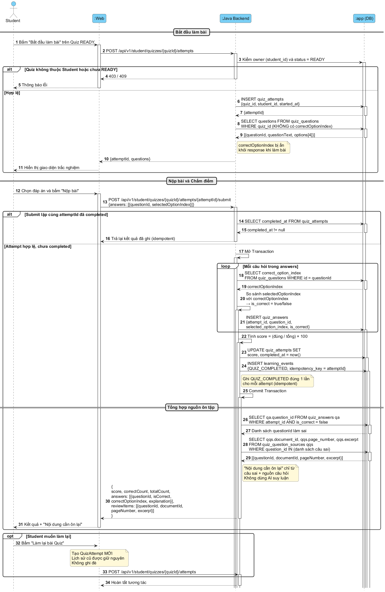

*Hình 3.20. Biểu đồ tuần tự luồng làm bài, chấm điểm tự động và trích dẫn nguồn ôn tập (BE1-F03).*

Java tạo `QuizAttempt` và trả danh sách câu hỏi **không kèm** `correctOptionIndex` để tránh lộ đáp án. Khi Student nộp bài, Java mở một Transaction: so sánh từng `selectedOptionIndex` với `correctOptionIndex` lưu trong DB, ghi `QuizAnswer` kèm `is_correct`, tính tổng điểm và ghi sự kiện `QUIZ_COMPLETED` **đúng một lần** theo `idempotency_key = attemptId`. Khung `loop` thể hiện chấm từng câu hỏi trong vòng lặp; khung `alt` xử lý submit lặp idempotent. Sau chấm điểm, Java truy vấn ngược `quiz_question_sources` để lấy `documentId` và `pageNumber` cho các câu trả lời sai, tổng hợp thành danh sách `reviewItems` — hoàn toàn dựa trên dữ liệu nguồn đã lưu, không dùng AI suy luận. Mỗi lần "Làm lại" tạo `QuizAttempt` mới, lịch sử cũ được bảo toàn.

## 3.6. Thiết kế bảo mật và phân quyền

### 3.6.1. Quyền của từng vai trò

| Nhóm dữ liệu hoặc chức năng | Sinh viên | Giảng viên | Quản trị viên | Phần AI |
|---|---|---|---|---|
| Lớp học phần và thành viên | Gửi yêu cầu và xem lớp đã được phép tham gia | Tạo, quản lý lớp của mình và duyệt Sinh viên | Quản lý danh mục, giám sát và khóa khi cần | Không đọc dữ liệu thành viên lớp |
| PDF bài giảng | Xem, ghi chú và hỏi đáp khi đã được duyệt | Tải lên, công bố, thu hồi và dùng làm nguồn tạo câu hỏi | Chỉ giám sát thông tin cần thiết | Chỉ xử lý đúng tài liệu và trang được hệ thống chính cho phép |
| PDF cá nhân và cuộc trò chuyện | Chỉ chủ sở hữu được sử dụng | Không được đọc | Không mặc định được đọc | Chỉ xử lý trong từng yêu cầu đã được cho phép |
| Bộ câu hỏi, lượt làm và kết quả | Tạo, xem lại và làm bộ cá nhân hoặc bộ của lớp | Tạo, xem lại và công bố bộ của lớp | Không quản lý bộ câu hỏi cá nhân | Chỉ tạo bản nháp có nguồn, không chấm điểm |
| Dashboard, ghi chú và kế hoạch | Chủ sở hữu được xem và thay đổi trong phạm vi cho phép | Không quản lý dữ liệu học riêng của Sinh viên | Không sửa tiến độ cá nhân | Không tính điểm, tiến độ hoặc kế hoạch |

### 3.6.2. Bảo vệ dữ liệu và kiểm tra quyền

Kiểm tra vai trò chỉ là bước đầu. Mỗi thao tác còn phải kiểm tra người dùng có sở hữu tài liệu hay không, có còn thuộc lớp hay không, tài liệu có đang được công bố không và có đúng phiên bản không. Việc ẩn một nút trên trang web không thay thế việc kiểm tra tại hệ thống chính.

Liên kết dùng để xem PDF chỉ có hiệu lực trong thời gian ngắn và chỉ được cấp sau khi kiểm tra quyền. Khi Giảng viên thu hồi tài liệu, yêu cầu tiếp theo phải bị từ chối. Nội dung PDF và câu hỏi của người dùng chỉ được xem là dữ liệu tham khảo, không được coi là lệnh có thể thay đổi quy tắc hệ thống.

Thông báo lỗi không được để lộ vị trí tệp nội bộ, khóa truy cập hoặc thông tin của dịch vụ AI. Mật khẩu cơ sở dữ liệu và khóa kết nối không được ghi vào mã nguồn hoặc báo cáo. Nhật ký chỉ lưu ai đã làm gì, với đối tượng nào và kết quả ra sao; không lưu toàn bộ câu hỏi, câu trả lời hoặc nội dung PDF.

### 3.6.3. Kế hoạch kiểm tra thiết kế

| Nhóm kiểm tra | Nội dung cần kiểm tra | Minh chứng cần lưu |
|---|---|---|
| Trao đổi dữ liệu | Dữ liệu đúng và sai; trường bắt buộc; phiên bản trao đổi | Kết quả kiểm tra ở cả hệ thống chính và phần AI |
| Tách biệt người dùng | Chủ sở hữu, tài liệu, phiên bản, trang được phép và việc thu hồi trong lúc chờ | Dữ liệu mẫu và mã theo dõi không chứa thông tin riêng tư |
| Hỏi đáp tài liệu | Tìm đúng nội dung, trả lời đúng nguồn, từ chối khi thiếu căn cứ và không làm theo lệnh ẩn trong PDF | Phiên bản bộ dữ liệu, nguồn tham chiếu, cách chấm và kết quả theo từng nhóm câu hỏi |
| Sinh bộ câu hỏi | Đúng bốn phương án, một đáp án, nguồn đúng và quy trình duyệt | Kết quả kiểm tra quy tắc cùng các mẫu lỗi đã kiểm soát |
| Công việc xử lý phía sau | Trạng thái, hết thời gian chờ, thử lại và không tạo dữ liệu trùng | Lịch sử trạng thái và số lượng bản ghi, không lưu nội dung riêng tư vào nhật ký |
| Giao diện và luồng đầy đủ | Ba vai trò, quy định tải PDF, nguồn theo trang, xem lại bộ câu hỏi, Dashboard và lịch tuần | Kết quả chạy luồng và ảnh chụp dữ liệu minh họa có nhãn |
| Chất lượng sử dụng | Hiển thị trên màn hình nhỏ, dùng bàn phím, thời gian phản hồi và nhiều người dùng cùng lúc | Cấu hình môi trường, số trường hợp thử, cách đo và kết quả |

Không ghi các con số về độ chính xác hoặc thời gian phản hồi như kết quả thực tế nếu chưa có lần đo hợp lệ. Việc đánh giá hỏi đáp phải tách hai vấn đề: hệ thống có tìm đúng đoạn nguồn hay không và câu trả lời có bám đúng đoạn đó hay không. Với câu hỏi không có câu trả lời trong tài liệu, khả năng từ chối đúng cũng là một tiêu chí đánh giá.

## 3.7. Tổng kết chương

Chương 3 đã chuyển các yêu cầu thành thiết kế có thể triển khai và kiểm tra. Phần chung gồm kiến trúc, các nhóm dữ liệu, lớp học phần, xử lý tài liệu, trạng thái bộ câu hỏi, kế hoạch học tập, Dashboard và phân quyền. Ba chức năng AI được mô tả bằng sơ đồ lớp, sơ đồ hoạt động và sơ đồ trình tự để làm rõ phần nào kiểm tra quyền, phần nào xử lý nội dung và phần nào quyết định kết quả cuối cùng.

Mỗi hình đều có câu dẫn, chú thích và đoạn giải thích. Màu sắc được lựa chọn theo loại sơ đồ tham khảo từ Visual Paradigm, không bắt buộc tất cả dùng màu xám. Thiết kế không đồng nghĩa tính năng đã hoàn tất hoặc chất lượng AI đã đạt yêu cầu; các kết luận đó chỉ được đưa ra sau khi có mã nguồn và kết quả kiểm thử thực tế.
