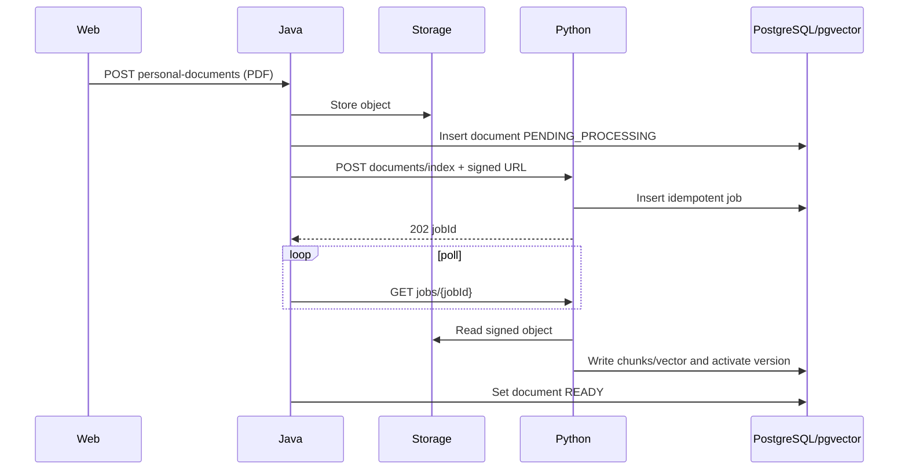

# StudyFlow — Low-level design

## 1. Module boundary

### Web

```text
app/
├── (auth)/
├── (student)/
│   ├── dashboard/
│   ├── classes/[classId]/subjects/[classSubjectId]/
│   ├── materials/[documentId]/slides/
│   ├── personal-documents/
│   ├── progress/
│   ├── plan/
│   └── review/
├── teacher/
│   ├── dashboard/
│   ├── assignments/
│   ├── documents/
│   └── publications/
└── admin/
    ├── dashboard/
    ├── users/
    ├── academics/
    ├── feedback/
    ├── logs/
    └── settings/
```

Route guard đọc session/role từ Java. Mọi server state đi qua API client; UI không gọi Python, PostgreSQL, pgvector, storage hoặc model provider.

### Java

Mỗi feature có controller, DTO, application service, domain rule và repository adapter:

- `classroom`: Class và membership.
- `subject`: Subject, ClassSubject và Teacher assignment.
- `document`: Teacher Library/Personal metadata, upload/status/delete.
- `publication`: public/revoke theo assignment.
- `slide`: artifact access và view event.
- `note`: Note theo Student + Slide.
- `progress`: Learning Progress và Statistics projection.
- `study`: Plan, item và calendar.
- `review`: Quiz review, acceptance, attempt, answer và Java scoring.
- `admin`: feedback, audit, settings.
- `integration.ai`, `integration.storage`: outbound adapter.

### Python

```text
api/routes/
├── documents.py
├── personal_rag.py
├── quizzes.py
├── slides.py
└── health.py
pipelines/
├── personal_pdf.py
└── teacher_pptx.py
services/
├── indexing.py
├── retrieval.py
├── rag.py
├── quiz_generation.py
└── citation.py
workers/
└── index_worker.py
```

## 2. Authorization policy

### Student material access

```text
student_id
  → active class_students
  → active class_subjects
  → PUBLISHED document_publications
  → document
```

- PPTX: list slides, view artifact, Note, view event, Slide AI Tutor.
- PDF: download only; không có Viewer, Note, Tutor hoặc page progress.

### Teacher publication

```text
document.owner_id == teacher_id
AND class_subject.teacher_id == teacher_id
AND class_subject.status == ACTIVE
AND document.status phù hợp
```

Teacher không public tài liệu của Teacher khác hoặc tới ClassSubject không được phân công.

### Personal RAG

Tất cả selected document phải:

```text
scope == PERSONAL
AND owner_id == current_student
AND file_type = PDF
AND processing_status == READY
```

Java gửi danh sách đã xác minh. Python vẫn filter `owner_id`, `source_type=PERSONAL`, document IDs và active version.

Cùng authorized scope này được dùng khi Student bấm **Tạo Quiz** trong chatbot. Java không cho client tự gửi thêm document ID ngoài conversation scope.

## 3. State machine

### Document processing

```text
UPLOADING
  → PENDING_PROCESSING
  → PROCESSING
  → READY
  ↘ FAILED → PENDING_PROCESSING (retry)
READY|FAILED → DELETING → DELETED
```

- Personal PDF luôn qua AI indexing.
- Teacher PPTX qua render/extract/index.
- Teacher PDF có thể READY sau lưu/scan metadata; Teacher PDF không AI index.

### Publication

```text
PUBLISHED ↔ REVOKED
```

Re-public cùng document/ClassSubject cập nhật quan hệ cũ, không tạo duplicate.

### Quiz lifecycle và attempt

```text
GENERATING → REVIEW_REQUIRED → READY → ARCHIVED
          ↘ GENERATION_FAILED  ↘ REJECTED
```

Chỉ owner được accept/reject. Chỉ Quiz `READY` được bắt đầu.

```text
IN_PROGRESS → SUBMITTED → SCORED
           ↘ ABANDONED
```

Submit idempotent. Java khóa answer sau submit và tính score trong transaction.

## 4. Sequence

### Personal upload/index



### Personal RAG

1. Java load selected documents bằng owner scope.
2. Nếu một document không READY/không thuộc owner, từ chối toàn request.
3. Python retrieval filter exact authorized IDs.
4. Nếu score/evidence không đủ, trả `NO_EVIDENCE`.
5. Citation builder chỉ dùng chunk đã retrieval.
6. Java revalidate citation ID trước khi trả.

### Personal RAG → Quiz draft → Ôn tập

1. Web yêu cầu tạo Quiz từ conversation đang có selected documents.
2. Java load lại conversation và xác minh owner/document `READY`.
3. Python retrieval đúng authorized IDs và sinh questions/options/correct answer/explanation/sources.
4. Java validate cấu trúc, đáp án và source; dữ liệu sai bị từ chối toàn bộ.
5. Java lưu Quiz `REVIEW_REQUIRED` và phát event `QUIZ_GENERATED`.
6. Trang Ôn tập hiển thị Quiz trong mục **Chờ duyệt**.
7. Student xem câu hỏi rồi accept; Java chuyển `READY`.
8. Student làm Quiz; Java chấm và lưu attempt/answers/result.

### Slide Viewer/Tutor

1. Java kiểm membership + publication.
2. Java trả danh sách artifact slide, không trả PPTX gốc.
3. `VIEW_SLIDE` upsert progress và append event có chống spam.
4. Note upsert theo unique key.
5. Tutor request chỉ chứa document ID, current slide/allowed slides và question.

## 5. Progress và statistics

Progress được tính tại Java:

- Document slide progress = số slide distinct đã xem / tổng slide.
- ClassSubject progress = aggregation có trọng số theo số slide.
- Plan completion = item completed / tổng item.
- Quiz statistics = số Quiz đã duyệt, attempt hoàn thành và điểm trung bình; không dùng để suy ra Topic Mastery.

PDF download có thể ghi event nhưng không tạo page progress. Không có Topic Mastery hay suy luận mức hiểu trong MVP.

Statistics là read model/projection, có thể cache ngắn hạn. Event consumer phải idempotent theo event ID.

## 6. Calendar

`study_plan_items.scheduled_start`, `scheduled_end` và `deadline` là nguồn cho calendar. API calendar truy vấn theo tuần và trả item đã normalize để Web vẽ bảng: cột Thứ 2–Chủ nhật, hàng là khung giờ.

- Bấm ô trống tạo item với ngày/khung giờ đã chọn sẵn.
- Form **Thêm lịch** chọn ngày, giờ bắt đầu, thời lượng, tiêu đề và liên kết ClassSubject tùy chọn.
- Java kiểm `scheduled_end > scheduled_start` và cảnh báo xung đột lịch của cùng Student.
- Không tạo bản ghi calendar trùng với task; timetable chỉ là projection của plan items.

## 7. Quiz validation và scoring

- Java validate `MCQ_SINGLE`: tối thiểu hai option không trùng, đúng một `correctOptionIndex` nằm trong options và source thuộc authorized documents trước khi lưu bản nháp.
- Student phải duyệt toàn bộ bản nháp; MVP không chỉnh từng đáp án sau khi accept.
- Multiple choice: Answer API nhận một `selectedOptionId`; Java so sánh với answer key đã lưu. Câu bỏ trống/sai nhận 0 điểm.
- Transaction submit: khóa attempt, validate ownership/status, ghi answers, tính score, cập nhật attempt.
- Kết quả chỉ Student owner xem; Admin không mặc định đọc kết quả cá nhân.

## 8. Job và retry

- Worker claim job bằng row lock/`SKIP LOCKED` hoặc queue tương đương.
- Idempotency key: `documentId:version:pipeline:INDEX|DEINDEX`.
- Retry có max attempts, backoff và error code chuẩn hóa.
- Reindex ghi version mới, activate trong transaction rồi dọn version cũ.
- Signed URL hết hạn là lỗi retryable; Java cấp URL mới nhưng giữ cùng logical job.

## 9. Error và audit

Error public: validation, forbidden/not-found không làm lộ metadata, conflict, not-ready, processing-failed và internal error có trace ID.

Audit:

- Login/logout và khóa/mở tài khoản.
- Role, membership, ClassSubject assignment.
- Publication/revoke.
- Settings change.
- Document lifecycle ở mức metadata.

Không audit nội dung Note/chat/document dưới dạng plain text.

## 10. Test trọng yếu

- Student A không thấy Class/Personal Document của Student B.
- Teacher không public ngoài assignment.
- Publication bị revoke lập tức mất quyền.
- PPTX không download; PDF lớp không mở viewer/Tutor/Note.
- Personal upload từ chối PPTX/DOCX.
- Personal RAG không nhận Teacher Document và không rò dữ liệu owner khác.
- Slide citation sai document/slide bị Java từ chối.
- Retry không tạo chunk/publication trùng.
- Quiz generation với source sai scope hoặc malformed answer bị Java từ chối.
- Quiz `REVIEW_REQUIRED` không tạo được attempt; accept của user khác bị từ chối.
- Submit attempt idempotent và frontend không tự chấm.
- Progress slide độc lập với Quiz score; không có Topic Mastery.
- Admin không đọc Personal chat/plan/Quiz result bằng API mặc định.
